# Informe de práctica de bases de datos: consultas SQL en cuatro motores
## Caso de estudio: VíaMaestra — Formación de conductores

| | |
|---|---|
| **Universidad** | Universidad de La Guajira |
| **Programa** | Ingeniería de Sistemas |
| **Asignatura** | Base de datos II |
| **Estudiante** | Einer Molina Brito |
| **Docente** | Jaider Quintero Mendoza |
| **Motores utilizados** | MySQL 8.0 · PostgreSQL · Microsoft SQL Server · Oracle Database |
| **Herramienta cliente** | DBeaver |
| **Fecha** | Octubre de 2026 |

---

## Tabla de contenido

1. [Introducción](#1-introducción)
2. [Objetivos](#2-objetivos)
3. [Descripción del caso VíaMaestra](#3-descripción-del-caso-víamaestra)
4. [Entorno de trabajo](#4-entorno-de-trabajo)
5. [Modelo de datos](#5-modelo-de-datos)
6. [Datos de prueba](#6-datos-de-prueba)
7. [Procedimiento para obtener la evidencia fotográfica](#7-procedimiento-para-obtener-la-evidencia-fotográfica)
8. [Diferencias de sintaxis entre los motores](#8-diferencias-de-sintaxis-entre-los-motores)
9. [Desarrollo: consultas por tema](#9-desarrollo-consultas-por-tema)
    - [0. Verificación de la carga de datos](#0-verificación-de-la-carga-de-datos)
    - [1. LIKE — búsqueda por patrones](#1-like--búsqueda-por-patrones)
    - [2. Subconsultas](#2-subconsultas)
    - [3. GROUP BY — agrupación y agregación](#3-group-by--agrupación-y-agregación)
    - [4. HAVING — filtro sobre grupos](#4-having--filtro-sobre-grupos)
    - [5. ORDER BY — ordenamiento](#5-order-by--ordenamiento)
    - [6. JOIN — combinación de tablas](#6-join--combinación-de-tablas)
    - [7. WHERE — filtros por fila](#7-where--filtros-por-fila)
10. [Matriz de verificación de evidencias](#10-matriz-de-verificación-de-evidencias)
11. [Análisis comparativo entre motores](#11-análisis-comparativo-entre-motores)
12. [Conclusiones](#12-conclusiones)
13. [Anexos](#13-anexos)

---

## 1. Introducción

El presente informe documenta la ejecución de un conjunto de consultas SQL sobre la base de datos de **VíaMaestra**, una academia ficticia de formación de conductores. La base de datos gestiona alumnos, cursos, matrículas, sesiones de clase con instructores y vehículos, asistencia, evaluaciones por competencia, certificados y pagos, además de un modelo transversal de autenticación y autorización basado en roles (RBAC).

Cada consulta se formula a partir de una **situación empresarial concreta**: un área de la academia (cartera, mercadeo, coordinación académica, logística, tesorería, entre otras) plantea una necesidad de información y la consulta constituye su respuesta técnica. De este modo se evidencia no solo la escritura de la sentencia SQL, sino el propósito y la utilidad de cada cláusula.

El mismo conjunto de consultas se ejecuta en **cuatro sistemas gestores de bases de datos** (MySQL, PostgreSQL, SQL Server y Oracle) con el fin de comparar las diferencias de sintaxis y comprobar que, con las adaptaciones necesarias, los resultados son equivalentes. La evidencia de cada ejecución se registra mediante capturas de pantalla tomadas en DBeaver.

## 2. Objetivos

### 2.1 Objetivo general

Aplicar consultas SQL de selección sobre una base de datos con más de 200 registros ficticios, justificando cada una mediante una situación del negocio y verificando su ejecución en cuatro motores de bases de datos distintos.

### 2.2 Objetivos específicos

- Construir consultas con los operadores `LIKE`, subconsultas, `GROUP BY`, `HAVING`, `ORDER BY`, `JOIN` y `WHERE`.
- Relacionar cada consulta con una necesidad real de un área de la organización.
- Ejecutar el mismo conjunto de consultas en MySQL, PostgreSQL, SQL Server y Oracle, adaptando la sintaxis cuando el motor lo exija.
- Documentar con evidencia fotográfica el resultado de cada ejecución.
- Identificar y explicar las diferencias de dialecto entre los motores (limitación de filas, concatenación, funciones de fecha y sensibilidad a mayúsculas).

## 3. Descripción del caso VíaMaestra

VíaMaestra organiza cursos teóricos y prácticas de conducción con instructores y vehículos limitados. El sistema debe programar sesiones sin solapamientos, controlar la asistencia, registrar resultados por competencia y verificar requisitos antes de certificar. Los pagos y el estado documental del alumno condicionan la habilitación de nuevas etapas.

### 3.1 Áreas de la organización que formulan las solicitudes

| Área | Qué necesita saber | Tablas que consulta con más frecuencia |
|---|---|---|
| Mercadeo | Segmentar alumnos por correo, ciudad o curso para campañas | `alumno`, `matricula`, `curso` |
| Admisiones / Secretaría | Quién está matriculado, quién no, documentación pendiente | `alumno`, `matricula` |
| Cartera y Tesorería | Recaudo, pagos pendientes, saldos, métodos de pago | `pago`, `matricula`, `curso` |
| Coordinación académica | Agenda de sesiones, asistencia, evaluaciones, certificación | `sesion`, `asistencia`, `resultado` |
| Logística y Operaciones | Disponibilidad y documentos de los vehículos, cruces de horario | `vehiculo`, `sesion` |
| Talento humano | Carga y desempeño de los instructores | `instructor`, `sesion` |
| Gerencia | Demanda por curso, ingresos mensuales, indicadores generales | todas |
| Seguridad / Auditoría | Qué rol puede ejecutar qué operación (RBAC) | `users`, `roles`, `resources` |

### 3.2 Reglas de negocio relevantes

- Un instructor no puede dictar dos sesiones que se crucen en el tiempo.
- Un vehículo no puede estar asignado a dos prácticas simultáneas.
- Las clases teóricas se dictan en aula y no utilizan vehículo (`vehiculo_id` es nulo).
- Una matrícula solo puede certificarse si el curso está pagado, los documentos están completos y no existen competencias reprobadas.
- Las cancelaciones se conservan como trazabilidad: no se elimina información, se modifica su estado.

## 4. Entorno de trabajo

La práctica se desarrolló sobre cuatro sistemas gestores de bases de datos: **MySQL 8.0**, **PostgreSQL**, **Microsoft SQL Server** y **Oracle Database**. Las consultas se ejecutaron desde **DBeaver**, un cliente universal que permite administrar las cuatro conexiones desde una misma interfaz.

En cada motor se creó una base de datos independiente con el mismo esquema y el mismo conjunto de datos de prueba, de manera que los resultados fueran comparables. Para MySQL, PostgreSQL y SQL Server se emplearon instancias locales o contenedores; para Oracle se utilizó el esquema propio del usuario, evitando el usuario `SYS`.

| Motor | Versión | Cliente | Observación |
|---|---|---|---|
| MySQL | 8.0 | DBeaver | Juego de caracteres `utf8mb4` |
| PostgreSQL | | DBeaver | Ejecución de `CREATE DATABASE` de forma independiente |
| SQL Server | | DBeaver | Carga con `SET IDENTITY_INSERT` |
| Oracle | | DBeaver | Esquema propio del usuario |

## 5. Modelo de datos

El modelo se divide en dos grupos: las tablas del **negocio** (VíaMaestra) y las tablas del **subsistema de seguridad RBAC**, que permanecen separadas deliberadamente, dado que un alumno o instructor del negocio no equivale automáticamente a una cuenta de acceso.

### 5.1 Diagrama entidad-relación del negocio

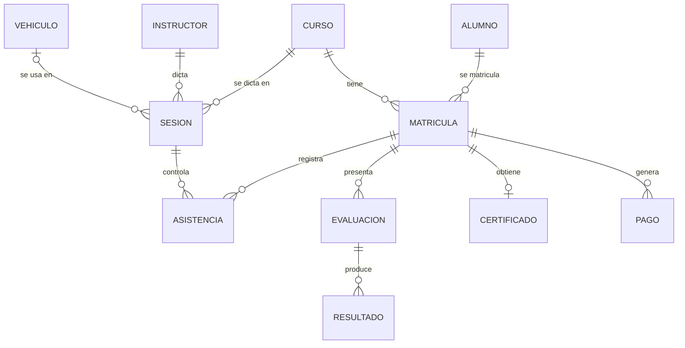
```mermaid
erDiagram
    ALUMNO ||--o{ MATRICULA : "se matricula"
    CURSO ||--o{ MATRICULA : "tiene"
    CURSO ||--o{ SESION : "se dicta en"
    INSTRUCTOR ||--o{ SESION : "dicta"
    VEHICULO |o--o{ SESION : "se usa en"
    MATRICULA ||--o{ ASISTENCIA : "registra"
    SESION ||--o{ ASISTENCIA : "controla"
    MATRICULA ||--o{ EVALUACION : "presenta"
    EVALUACION ||--o{ RESULTADO : "produce"
    MATRICULA ||--o| CERTIFICADO : "obtiene"
    MATRICULA ||--o{ PAGO : "genera"
```

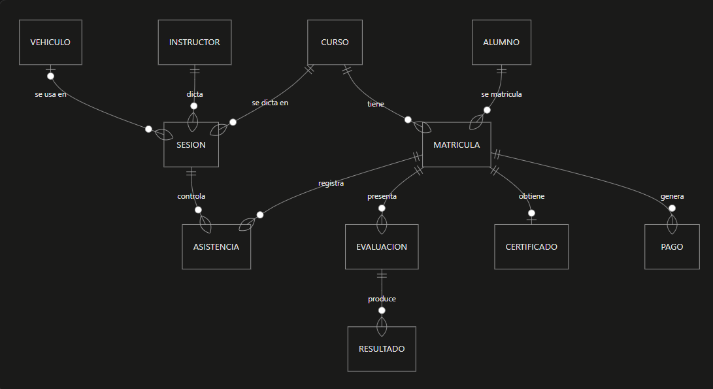

*Figura 1. Diagrama entidad-relación del negocio.*

### 5.2 Relaciones del negocio

- **Alumno N:M Curso**, resuelta mediante la tabla asociativa `matricula` (`estudiante_id` y `oferta_id`).
- **Curso 1:N Sesión**, **Instructor 1:N Sesión** y **Vehículo 0..1:N Sesión** (las clases teóricas no usan vehículo).
- **Matrícula 1:N Asistencia** y **Sesión 1:N Asistencia**.
- **Matrícula 1:N Evaluación** y **Evaluación 1:N Resultado**.
- **Matrícula 0..1:1 Certificado** y **Matrícula 1:N Pago**.

### 5.3 Estructura de las tablas

| Tabla | Columnas principales | Relaciones (FK) |
|---|---|---|
| `alumno` | `id`, `nombre`, `apellidos`, `documento`, `correo`, `direccion`, `estado_documental`, `is_active`, `created_at` | — |
| `curso` | `id`, `nombre`, `descripcion`, `is_active`, `created_at`, `updated_at` | — |
| `instructor` | `id`, `user_id`, `nombre`, `descripcion`, `is_active`, `created_at`, `updated_at` | — |
| `vehiculo` | `id`, `nombre`, `descripcion`, `is_active`, `created_at`, `updated_at` | — |
| `matricula` | `id`, `estudiante_id`, `oferta_id`, `fecha`, `periodo`, `estado` | `estudiante_id` → `alumno`, `oferta_id` → `curso` |
| `sesion` | `id`, `curso_id`, `instructor_id`, `vehiculo_id`, `fecha_inicio`, `fecha_fin`, `total`, `estado`, `observaciones` | `curso_id` → `curso`, `instructor_id` → `instructor`, `vehiculo_id` → `vehiculo` |
| `asistencia` | `id`, `matricula_id`, `sesion_id`, `nombre`, `descripcion`, `is_active`, `created_at`, `updated_at` | `matricula_id` → `matricula`, `sesion_id` → `sesion` |
| `evaluacion` | `id`, `matricula_id`, `nombre`, `descripcion`, `is_active`, `created_at`, `updated_at` | `matricula_id` → `matricula` |
| `resultado` | `id`, `evaluacion_id`, `nombre`, `descripcion`, `is_active`, `created_at`, `updated_at` | `evaluacion_id` → `evaluacion` |
| `certificado` | `id`, `matricula_id`, `nombre`, `descripcion`, `is_active`, `created_at`, `updated_at` | `matricula_id` → `matricula` |
| `pago` | `id`, `matricula_id`, `referencia_tipo`, `referencia_id`, `metodo`, `monto`, `fecha`, `estado` | `matricula_id` → `matricula` |

### 5.4 Modelo RBAC

El control de acceso se resuelve con seis tablas: `users`, `roles`, `role_users` (usuarios N:M roles), `resources` (cada recurso se identifica por la pareja `path` y `method`), `resource_roles` (roles N:M recursos) y `refresh_tokens` (sesiones por dispositivo). Una asignación con estado `INACTIVE` no concede privilegios. Los roles iniciales son ADMIN, COORDINADOR, INSTRUCTOR, CARTERA y AUDITOR.

## 6. Datos de prueba

Los datos son **100 % ficticios**: nombres, documentos y correos fueron generados de forma pseudoaleatoria y no corresponden a personas reales. Se cargan con el archivo `datos_<motor>.sql`, que contiene únicamente sentencias `INSERT` en el orden que respeta las llaves foráneas.

| Tabla | Registros |
|---|---:|
| alumno | 220 |
| curso | 6 |
| instructor | 12 |
| vehiculo | 15 |
| matricula | 256 |
| sesion | 90 |
| asistencia | 132 |
| evaluacion | 172 |
| resultado | 412 |
| certificado | 57 |
| pago | 389 |
| **Total (tablas del negocio)** | **1.761** |

Con 220 alumnos y 1.761 registros en las tablas del negocio se cumple ampliamente el requisito de más de 200 datos. La consulta **Q00** lo demuestra con evidencia.

### 6.1 Distribución de los datos

- Los alumnos se distribuyen entre Riohacha, Maicao, Uribia, Manaure y San Juan del Cesar; predominan las cuentas de Gmail, Outlook y Yahoo, con presencia de Hotmail y del dominio institucional.
- Los pagos se encuentran en estado `PAGADO` o `PENDIENTE`, y se registran por efectivo, tarjeta o transferencia.
- Las sesiones se encuentran en estado `PROGRAMADA`, `REALIZADA` o `CANCELADA`; las canceladas incluyen una observación.
- Las matrículas se registran en los períodos 2025-1, 2025-2, 2026-1 y 2026-2, con estados `ACTIVA`, `COMPLETADA` y `CANCELADA`.
- Las sesiones teóricas no tienen vehículo asignado (`vehiculo_id` nulo).

## 7. Procedimiento para obtener la evidencia fotográfica

La evidencia de cada ejecución consiste en una captura de pantalla tomada en DBeaver. Para cada consulta y para cada motor se siguió el procedimiento descrito a continuación:

1. Abrir un editor SQL asociado a la conexión del motor correspondiente (MySQL, PostgreSQL, SQL Server u Oracle).
2. Pegar la sentencia del informe y ejecutarla con `Ctrl + Enter`.
3. Verificar que la grilla de resultados sea visible junto con el código ejecutado, el nombre de la conexión activa, el número de filas devueltas y el tiempo de ejecución.
4. Tomar la captura de pantalla y guardarla con el nombre `<CÓDIGO>_<motor>.png` (por ejemplo, `L01_mysql.png`) en la carpeta `evidencias/`.
5. Insertar la imagen en el informe bajo la sentencia respectiva, con su pie de figura numerado.
6. Registrar en la tabla de ejecución el número de filas obtenidas, el tiempo y las observaciones.

En total se requieren **188 capturas** (47 consultas × 4 motores), además del diagrama entidad-relación del modelo.

## 8. Diferencias de sintaxis entre los motores

Las consultas son equivalentes en los cuatro motores, aunque algunas debieron reescribirse. El siguiente cuadro resume las diferencias que aparecen en el informe:

| Aspecto | MySQL | PostgreSQL | SQL Server | Oracle |
|---|---|---|---|---|
| Limitar filas | `LIMIT n` | `LIMIT n` | `SELECT TOP n` | `FETCH FIRST n ROWS ONLY` (12c+) |
| Concatenar texto | `CONCAT(a, ' ', b)` | `a \|\| ' ' \|\| b` | `a + ' ' + b` | `a \|\| ' ' \|\| b` |
| Año-mes de una fecha | `DATE_FORMAT(f, '%Y-%m')` | `TO_CHAR(f, 'YYYY-MM')` | `CONVERT(CHAR(7), f, 120)` | `TO_CHAR(f, 'YYYY-MM')` |
| Literal de fecha | `DATE '2026-05-01'` | `DATE '2026-05-01'` | `'2026-05-01'` | `DATE '2026-05-01'` |
| `LIKE` y mayúsculas | No distingue (collation por defecto) | **Distingue** | No distingue (collation por defecto) | **Distingue** |
| Alias de tabla con `AS` | Permitido | Permitido | Permitido | **No permitido** (se omite `AS`) |
| Alias de columna en `HAVING` | Permitido | No | No | No |
| Columnas en `GROUP BY` | Flexible si hay clave primaria | Todas las no agregadas | Todas las no agregadas | Todas las no agregadas |
| Columna autoincremental | `AUTO_INCREMENT` | `GENERATED ... AS IDENTITY` | `IDENTITY(1,1)` | `GENERATED ... AS IDENTITY` |
| Texto | `VARCHAR` | `VARCHAR` | `VARCHAR` | `VARCHAR2` |
| Fecha y hora | `DATETIME` | `TIMESTAMP` | `DATETIME2` | `TIMESTAMP` |
| Consulta sin tabla | `SELECT 1` | `SELECT 1` | `SELECT 1` | `SELECT 1 FROM dual` |

---

## 9. Desarrollo: consultas por tema

Cada consulta se presenta con la siguiente estructura:

1. **Situación de negocio:** área que solicita la información y motivo de la solicitud.
2. **Concepto de SQL:** cláusula o técnica que se demuestra.
3. **Resultado esperado:** cómo interpretar la grilla de resultados.
4. **Ejecución en los cuatro motores:** código, evidencia fotográfica, registro de resultados y nota de sintaxis.

---

### 0. Verificación de la carga de datos

Antes de ejecutar cualquier consulta se comprueba que la base contiene los datos ficticios. Esta única consulta sirve como evidencia de que el volumen supera los 200 registros pedidos.

#### Q00 — Conteo de registros por tabla

**Situación de negocio.** Antes de empezar a responder las solicitudes de las distintas áreas de VíaMaestra, la coordinación de sistemas solicitó una prueba de que la base de datos quedó cargada con volumen suficiente (más de 200 registros) y de que el esquema completo —negocio y seguridad RBAC— tiene información. Sin esa verificación, cualquier consulta posterior podría devolver resultados vacíos por una carga incompleta y no por un error de la consulta.

**Concepto de SQL.** Se usa `COUNT(*)` sobre cada tabla y se unen los resultados con `UNION ALL`, de modo que toda la verificación aparece en una sola grilla (una fila por tabla más una fila de total con subconsultas escalares). `UNION ALL` conserva todas las filas sin eliminar duplicados, que es lo que se necesita aquí.

**Resultado esperado.** La grilla muestra una fila por cada tabla del negocio y una fila final `TOTAL alumno+matricula+pago` (865 con los datos cargados). `alumno` debe aparecer con 220, `matricula` con 256 y `pago` con 389; las tablas RBAC no se incluyen en esta consulta.

##### Q00 · MySQL

```sql
SELECT 'alumno' AS tabla, COUNT(*) AS registros FROM alumno
UNION ALL
SELECT 'curso' AS tabla, COUNT(*) AS registros FROM curso
UNION ALL
SELECT 'instructor' AS tabla, COUNT(*) AS registros FROM instructor
UNION ALL
SELECT 'vehiculo' AS tabla, COUNT(*) AS registros FROM vehiculo
UNION ALL
SELECT 'matricula' AS tabla, COUNT(*) AS registros FROM matricula
UNION ALL
SELECT 'sesion' AS tabla, COUNT(*) AS registros FROM sesion
UNION ALL
SELECT 'asistencia' AS tabla, COUNT(*) AS registros FROM asistencia
UNION ALL
SELECT 'evaluacion' AS tabla, COUNT(*) AS registros FROM evaluacion
UNION ALL
SELECT 'resultado' AS tabla, COUNT(*) AS registros FROM resultado
UNION ALL
SELECT 'certificado' AS tabla, COUNT(*) AS registros FROM certificado
UNION ALL
SELECT 'pago' AS tabla, COUNT(*) AS registros FROM pago
UNION ALL
SELECT 'TOTAL alumno+matricula+pago', (SELECT COUNT(*) FROM alumno) + (SELECT COUNT(*) FROM matricula) + (SELECT COUNT(*) FROM pago);
```

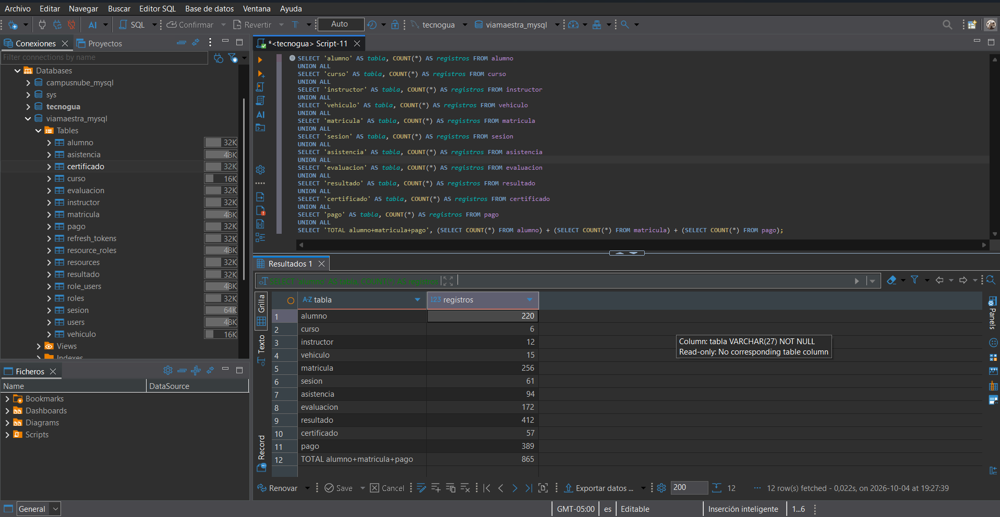

*Figura 2. Resultado de la consulta Q00 en MySQL.*

| Registro de ejecución | |
|---|---|
| Filas obtenidas | |
| Tiempo de ejecución (ms) | |
| Observaciones | |

*Nota de sintaxis (MySQL):* La sentencia es idéntica en los cuatro motores y no requirió adaptaciones de sintaxis.

##### Q00 · PostgreSQL

```sql
SELECT 'alumno' AS tabla, COUNT(*) AS registros FROM alumno
UNION ALL
SELECT 'curso' AS tabla, COUNT(*) AS registros FROM curso
UNION ALL
SELECT 'instructor' AS tabla, COUNT(*) AS registros FROM instructor
UNION ALL
SELECT 'vehiculo' AS tabla, COUNT(*) AS registros FROM vehiculo
UNION ALL
SELECT 'matricula' AS tabla, COUNT(*) AS registros FROM matricula
UNION ALL
SELECT 'sesion' AS tabla, COUNT(*) AS registros FROM sesion
UNION ALL
SELECT 'asistencia' AS tabla, COUNT(*) AS registros FROM asistencia
UNION ALL
SELECT 'evaluacion' AS tabla, COUNT(*) AS registros FROM evaluacion
UNION ALL
SELECT 'resultado' AS tabla, COUNT(*) AS registros FROM resultado
UNION ALL
SELECT 'certificado' AS tabla, COUNT(*) AS registros FROM certificado
UNION ALL
SELECT 'pago' AS tabla, COUNT(*) AS registros FROM pago
UNION ALL
SELECT 'TOTAL alumno+matricula+pago', (SELECT COUNT(*) FROM alumno) + (SELECT COUNT(*) FROM matricula) + (SELECT COUNT(*) FROM pago);
```

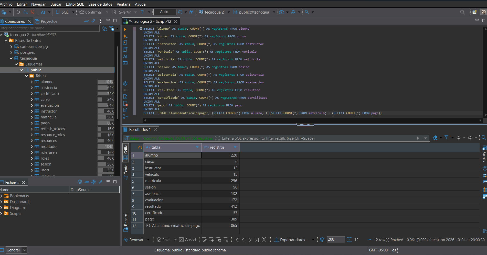

*Figura 3. Resultado de la consulta Q00 en PostgreSQL.*

| Registro de ejecución | |
|---|---|
| Filas obtenidas | |
| Tiempo de ejecución (ms) | |
| Observaciones | |

*Nota de sintaxis (PostgreSQL):* La sentencia es idéntica en los cuatro motores y no requirió adaptaciones de sintaxis.

##### Q00 · SQL Server

```sql
SELECT 'alumno' AS tabla, COUNT(*) AS registros FROM alumno
UNION ALL
SELECT 'curso' AS tabla, COUNT(*) AS registros FROM curso
UNION ALL
SELECT 'instructor' AS tabla, COUNT(*) AS registros FROM instructor
UNION ALL
SELECT 'vehiculo' AS tabla, COUNT(*) AS registros FROM vehiculo
UNION ALL
SELECT 'matricula' AS tabla, COUNT(*) AS registros FROM matricula
UNION ALL
SELECT 'sesion' AS tabla, COUNT(*) AS registros FROM sesion
UNION ALL
SELECT 'asistencia' AS tabla, COUNT(*) AS registros FROM asistencia
UNION ALL
SELECT 'evaluacion' AS tabla, COUNT(*) AS registros FROM evaluacion
UNION ALL
SELECT 'resultado' AS tabla, COUNT(*) AS registros FROM resultado
UNION ALL
SELECT 'certificado' AS tabla, COUNT(*) AS registros FROM certificado
UNION ALL
SELECT 'pago' AS tabla, COUNT(*) AS registros FROM pago
UNION ALL
SELECT 'TOTAL alumno+matricula+pago', (SELECT COUNT(*) FROM alumno) + (SELECT COUNT(*) FROM matricula) + (SELECT COUNT(*) FROM pago);
```

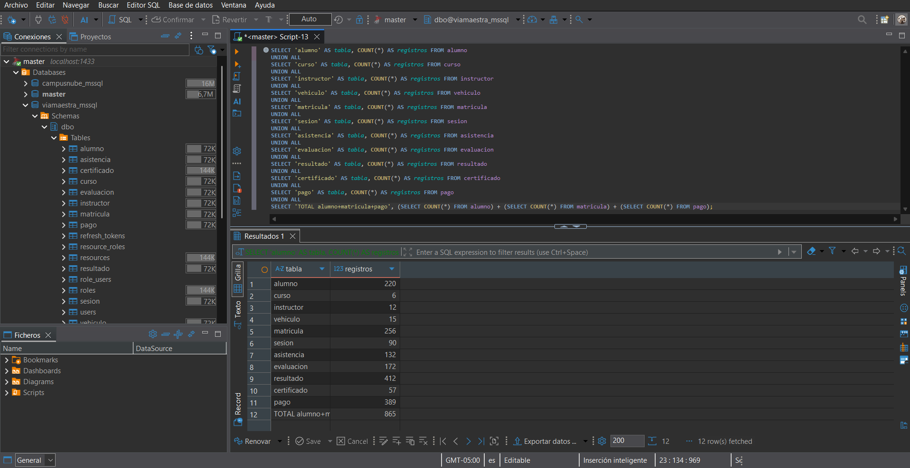

*Figura 4. Resultado de la consulta Q00 en SQL Server.*

| Registro de ejecución | |
|---|---|
| Filas obtenidas | |
| Tiempo de ejecución (ms) | |
| Observaciones | |

*Nota de sintaxis (SQL Server):* La sentencia es idéntica en los cuatro motores y no requirió adaptaciones de sintaxis.

##### Q00 · Oracle

```sql
SELECT 'alumno' AS tabla, COUNT(*) AS registros FROM alumno
UNION ALL
SELECT 'curso' AS tabla, COUNT(*) AS registros FROM curso
UNION ALL
SELECT 'instructor' AS tabla, COUNT(*) AS registros FROM instructor
UNION ALL
SELECT 'vehiculo' AS tabla, COUNT(*) AS registros FROM vehiculo
UNION ALL
SELECT 'matricula' AS tabla, COUNT(*) AS registros FROM matricula
UNION ALL
SELECT 'sesion' AS tabla, COUNT(*) AS registros FROM sesion
UNION ALL
SELECT 'asistencia' AS tabla, COUNT(*) AS registros FROM asistencia
UNION ALL
SELECT 'evaluacion' AS tabla, COUNT(*) AS registros FROM evaluacion
UNION ALL
SELECT 'resultado' AS tabla, COUNT(*) AS registros FROM resultado
UNION ALL
SELECT 'certificado' AS tabla, COUNT(*) AS registros FROM certificado
UNION ALL
SELECT 'pago' AS tabla, COUNT(*) AS registros FROM pago
UNION ALL
SELECT 'TOTAL alumno+matricula+pago', (SELECT COUNT(*) FROM alumno) + (SELECT COUNT(*) FROM matricula) + (SELECT COUNT(*) FROM pago) FROM dual;
```

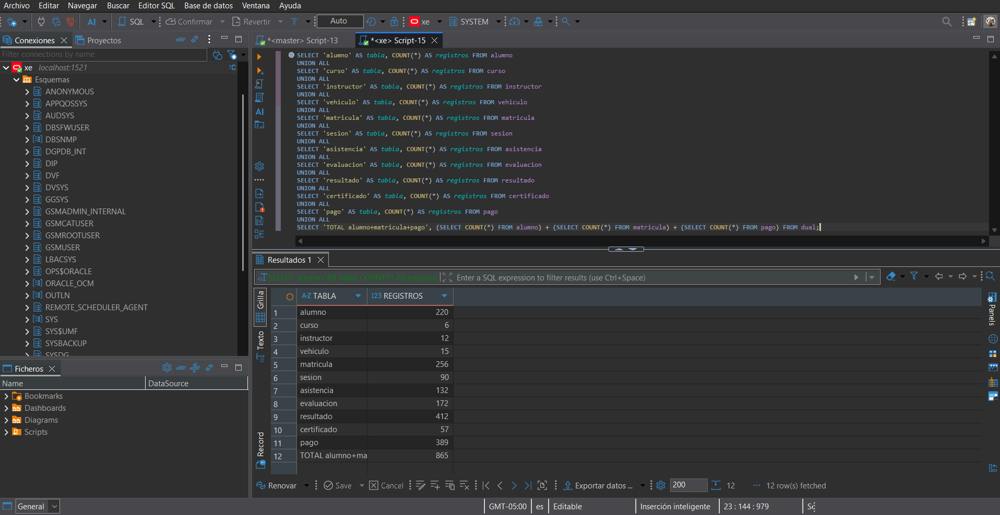

*Figura 5. Resultado de la consulta Q00 en Oracle.*

| Registro de ejecución | |
|---|---|
| Filas obtenidas | |
| Tiempo de ejecución (ms) | |
| Observaciones | |

*Nota de sintaxis (Oracle):* La sentencia es idéntica en los cuatro motores y no requirió adaptaciones de sintaxis.

---

### 1. LIKE — búsqueda por patrones

El operador `LIKE` compara texto contra un patrón. Dos comodines: `%` (cualquier cantidad de caracteres) y `_` (exactamente un carácter). En esta sección se muestran patrones de prefijo, sufijo, contenido, un solo carácter y negación con `NOT LIKE`.

#### L01 — Correos que empiezan por la letra m

**Situación de negocio.** Mercadeo planea una campaña de contacto y necesita depurar la lista de correos de los alumnos. Como primer paso se solicitó aislar a quienes tienen un correo que empieza por la letra m, para revisar si hay errores de digitación o direcciones repetidas en ese grupo.

**Concepto de SQL.** `LIKE 'm%'` filtra por **prefijo**: el símbolo `%` representa cualquier cantidad de caracteres (incluso ninguno). En MySQL y SQL Server la comparación no distingue mayúsculas de minúsculas con la configuración por defecto; en PostgreSQL y Oracle sí. Por eso la consulta aplica `LOWER()` al correo, de modo que el resultado sea idéntico en los cuatro motores.

**Resultado esperado.** Todas las filas devueltas deben tener un correo cuya primera letra sea m. Si aparece alguna con otra inicial, el filtro está mal escrito.

##### L01 · MySQL

```sql
SELECT a.id, a.nombre, a.apellidos, a.correo
FROM alumno a
WHERE LOWER(a.correo) LIKE 'm%'
ORDER BY a.correo
LIMIT 20;
```

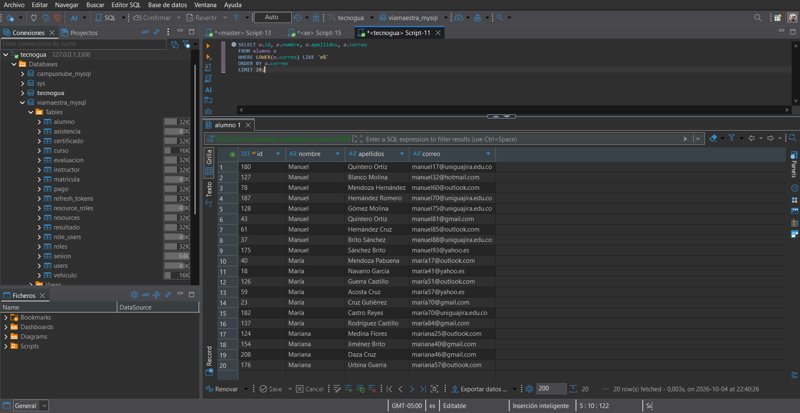

*Figura 6. Resultado de la consulta L01 en MySQL.*

| Registro de ejecución | |
|---|---|
| Filas obtenidas | |
| Tiempo de ejecución (ms) | |
| Observaciones | |

*Nota de sintaxis (MySQL):* Particularidades de sintaxis de este motor en esta consulta: `LIMIT n` para limitar filas.

##### L01 · PostgreSQL

```sql
SELECT a.id, a.nombre, a.apellidos, a.correo
FROM alumno a
WHERE LOWER(a.correo) LIKE 'm%'
ORDER BY a.correo
LIMIT 20;
```

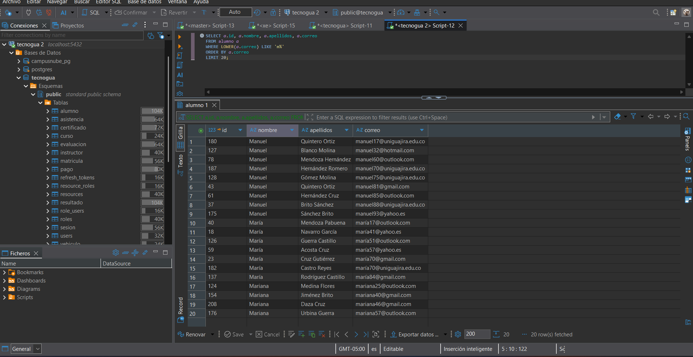

*Figura 7. Resultado de la consulta L01 en PostgreSQL.*

| Registro de ejecución | |
|---|---|
| Filas obtenidas | |
| Tiempo de ejecución (ms) | |
| Observaciones | |

*Nota de sintaxis (PostgreSQL):* Particularidades de sintaxis de este motor en esta consulta: `LIMIT n` para limitar filas.

##### L01 · SQL Server

```sql
SELECT TOP 20 a.id, a.nombre, a.apellidos, a.correo
FROM alumno a
WHERE LOWER(a.correo) LIKE 'm%'
ORDER BY a.correo;
```

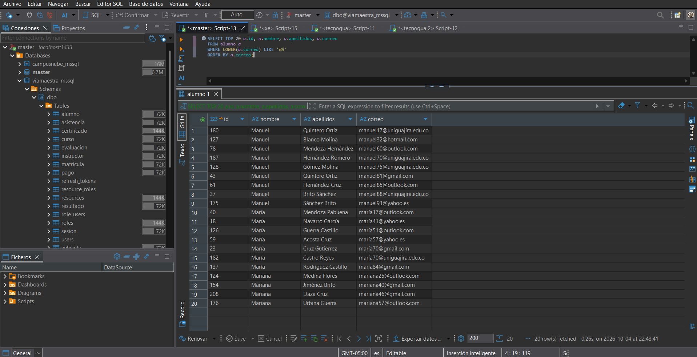

*Figura 8. Resultado de la consulta L01 en SQL Server.*

| Registro de ejecución | |
|---|---|
| Filas obtenidas | |
| Tiempo de ejecución (ms) | |
| Observaciones | |

*Nota de sintaxis (SQL Server):* Particularidades de sintaxis de este motor en esta consulta: `SELECT TOP n` para limitar filas.

##### L01 · Oracle

```sql
SELECT a.id, a.nombre, a.apellidos, a.correo
FROM alumno a
WHERE LOWER(a.correo) LIKE 'm%'
ORDER BY a.correo
FETCH FIRST 20 ROWS ONLY;
```

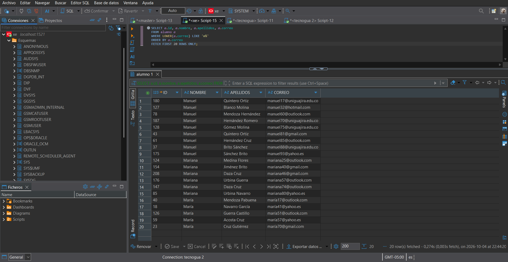

*Figura 9. Resultado de la consulta L01 en Oracle.*

| Registro de ejecución | |
|---|---|
| Filas obtenidas | |
| Tiempo de ejecución (ms) | |
| Observaciones | |

*Nota de sintaxis (Oracle):* Particularidades de sintaxis de este motor en esta consulta: `FETCH FIRST n ROWS ONLY` para limitar filas.

#### L02 — Alumnos con correo institucional de la universidad

**Situación de negocio.** Admisiones firmó un posible convenio con la universidad y quiere ofrecer descuentos a los alumnos que se registraron con su correo institucional. La solicitud llegó como: «¿cuántos y cuáles alumnos usan el dominio @uniguajira.edu.co?».

**Concepto de SQL.** `LIKE '%uniguajira.edu.co'` filtra por **sufijo** (el patrón empieza con `%`). Es un caso típico de búsqueda por dominio de correo.

**Resultado esperado.** Todas las filas devueltas deben terminar en el dominio institucional. Es normal que sean pocas filas frente a las cuentas Gmail.

##### L02 · MySQL

```sql
SELECT a.id, a.nombre, a.apellidos, a.correo
FROM alumno a
WHERE a.correo LIKE '%@uniguajira.edu.co'
ORDER BY a.apellidos;
```

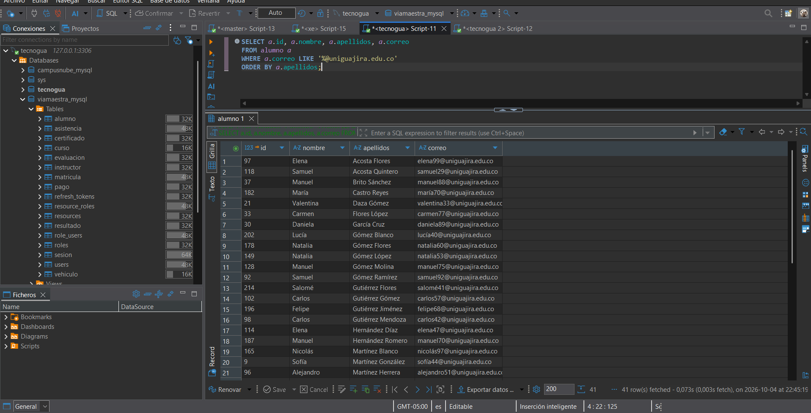

*Figura 10. Resultado de la consulta L02 en MySQL.*

| Registro de ejecución | |
|---|---|
| Filas obtenidas | |
| Tiempo de ejecución (ms) | |
| Observaciones | |

*Nota de sintaxis (MySQL):* La sentencia es idéntica en los cuatro motores y no requirió adaptaciones de sintaxis.

##### L02 · PostgreSQL

```sql
SELECT a.id, a.nombre, a.apellidos, a.correo
FROM alumno a
WHERE a.correo LIKE '%@uniguajira.edu.co'
ORDER BY a.apellidos;
```

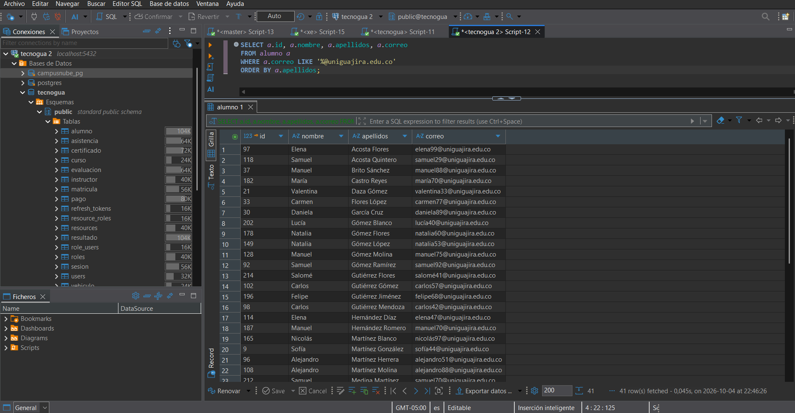

*Figura 11. Resultado de la consulta L02 en PostgreSQL.*

| Registro de ejecución | |
|---|---|
| Filas obtenidas | |
| Tiempo de ejecución (ms) | |
| Observaciones | |

*Nota de sintaxis (PostgreSQL):* La sentencia es idéntica en los cuatro motores y no requirió adaptaciones de sintaxis.

##### L02 · SQL Server

```sql
SELECT a.id, a.nombre, a.apellidos, a.correo
FROM alumno a
WHERE a.correo LIKE '%@uniguajira.edu.co'
ORDER BY a.apellidos;
```

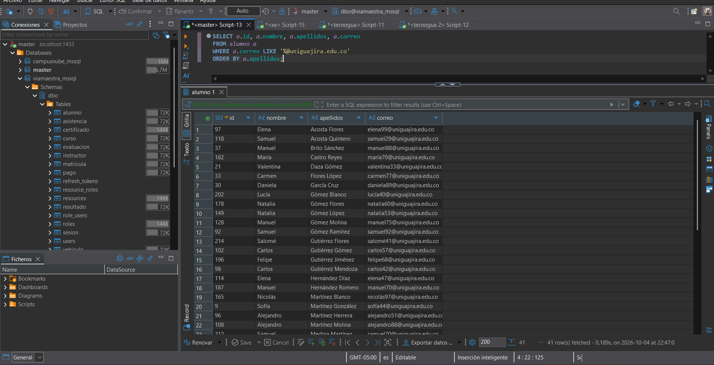

*Figura 12. Resultado de la consulta L02 en SQL Server.*

| Registro de ejecución | |
|---|---|
| Filas obtenidas | |
| Tiempo de ejecución (ms) | |
| Observaciones | |

*Nota de sintaxis (SQL Server):* La sentencia es idéntica en los cuatro motores y no requirió adaptaciones de sintaxis.

##### L02 · Oracle

```sql
SELECT a.id, a.nombre, a.apellidos, a.correo
FROM alumno a
WHERE a.correo LIKE '%@uniguajira.edu.co'
ORDER BY a.apellidos;
```

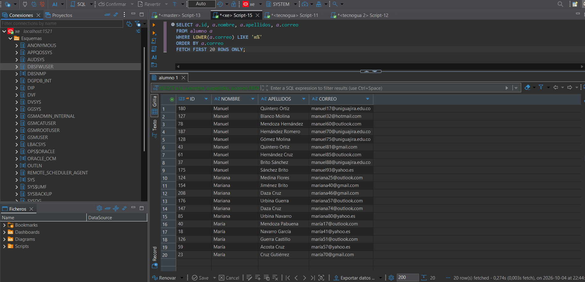

*Figura 13. Resultado de la consulta L02 en Oracle.*

| Registro de ejecución | |
|---|---|
| Filas obtenidas | |
| Tiempo de ejecución (ms) | |
| Observaciones | |

*Nota de sintaxis (Oracle):* La sentencia es idéntica en los cuatro motores y no requirió adaptaciones de sintaxis.

#### L03 — Apellidos que terminan en 'ez'

**Situación de negocio.** El área de archivo quiere organizar las carpetas físicas de los alumnos por terminación de apellido, empezando por los apellidos muy comunes que terminan en «ez» (Gómez, Pérez, Martínez, Rodríguez...). Necesitaban ver quiénes forman ese grupo para preparar las carpetas.

**Concepto de SQL.** `LIKE '%ez'` filtra por **terminación** (el patrón empieza con `%`). Un `%` al inicio impide usar un índice de forma eficiente, algo que conviene mencionar como limitación de rendimiento en tablas muy grandes. Se aplica `LOWER()` para igualar el comportamiento entre motores.

**Resultado esperado.** Los apellidos de la columna deben terminar en «ez». El campo `apellidos` guarda dos apellidos, por lo que el patrón se evalúa sobre el texto completo: coincide cuando el segundo apellido termina en «ez».

##### L03 · MySQL

```sql
SELECT a.id, a.nombre, a.apellidos
FROM alumno a
WHERE LOWER(a.apellidos) LIKE '%ez'
ORDER BY a.apellidos, a.nombre
LIMIT 20;
```

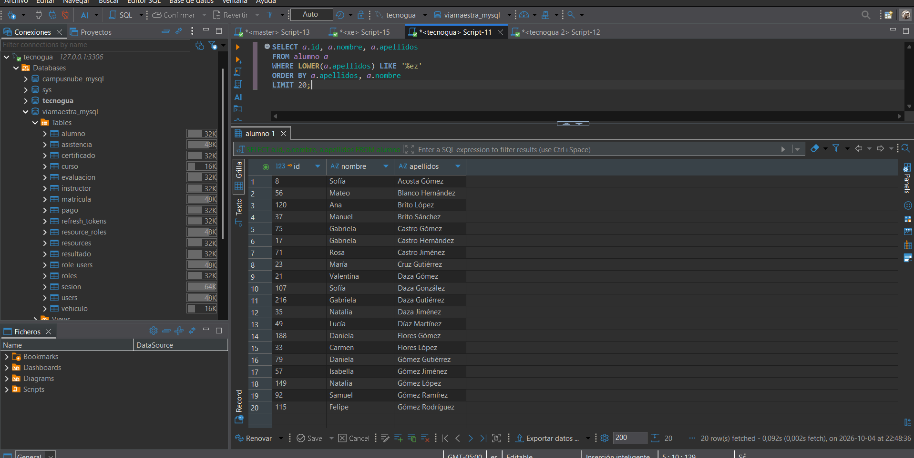

*Figura 14. Resultado de la consulta L03 en MySQL.*

| Registro de ejecución | |
|---|---|
| Filas obtenidas | |
| Tiempo de ejecución (ms) | |
| Observaciones | |

*Nota de sintaxis (MySQL):* Particularidades de sintaxis de este motor en esta consulta: `LIMIT n` para limitar filas.

##### L03 · PostgreSQL

```sql
SELECT a.id, a.nombre, a.apellidos
FROM alumno a
WHERE LOWER(a.apellidos) LIKE '%ez'
ORDER BY a.apellidos, a.nombre
LIMIT 20;
```

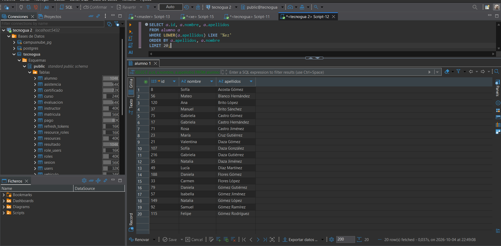

*Figura 15. Resultado de la consulta L03 en PostgreSQL.*

| Registro de ejecución | |
|---|---|
| Filas obtenidas | |
| Tiempo de ejecución (ms) | |
| Observaciones | |

*Nota de sintaxis (PostgreSQL):* Particularidades de sintaxis de este motor en esta consulta: `LIMIT n` para limitar filas.

##### L03 · SQL Server

```sql
SELECT TOP 20 a.id, a.nombre, a.apellidos
FROM alumno a
WHERE LOWER(a.apellidos) LIKE '%ez'
ORDER BY a.apellidos, a.nombre;
```

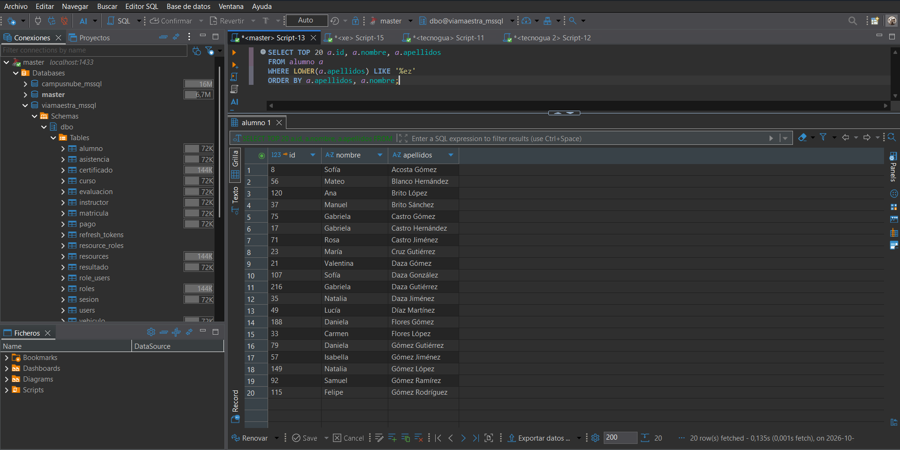

*Figura 16. Resultado de la consulta L03 en SQL Server.*

| Registro de ejecución | |
|---|---|
| Filas obtenidas | |
| Tiempo de ejecución (ms) | |
| Observaciones | |

*Nota de sintaxis (SQL Server):* Particularidades de sintaxis de este motor en esta consulta: `SELECT TOP n` para limitar filas.

##### L03 · Oracle

```sql
SELECT a.id, a.nombre, a.apellidos
FROM alumno a
WHERE LOWER(a.apellidos) LIKE '%ez'
ORDER BY a.apellidos, a.nombre
FETCH FIRST 20 ROWS ONLY;
```

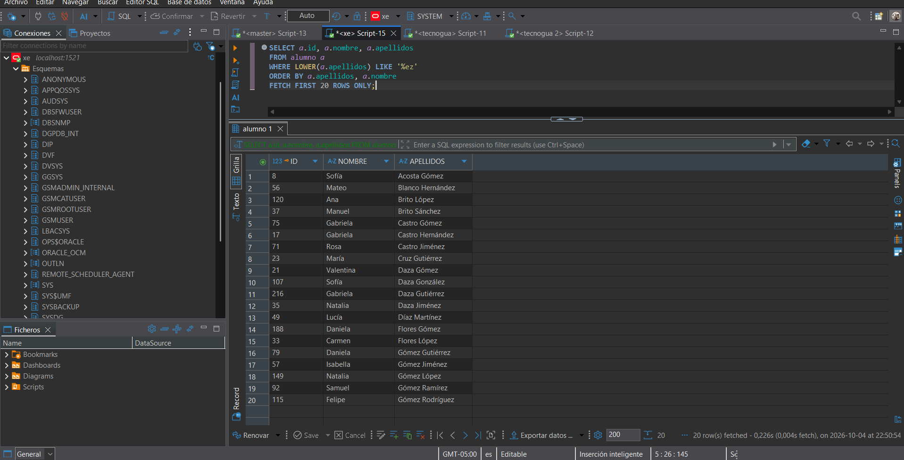

*Figura 17. Resultado de la consulta L03 en Oracle.*

| Registro de ejecución | |
|---|---|
| Filas obtenidas | |
| Tiempo de ejecución (ms) | |
| Observaciones | |

*Nota de sintaxis (Oracle):* Particularidades de sintaxis de este motor en esta consulta: `FETCH FIRST n ROWS ONLY` para limitar filas.

#### L04 — Comodín _ (un solo carácter): nombres cuya segunda letra es 'a'

**Situación de negocio.** Durante la revisión de la calidad de datos se solicitó una demostración del comodín de un solo carácter: encontrar los nombres cuya segunda letra es «a» (Camila, Mateo, Daniela, Laura, Mariana...). Es un requisito del informe para evidenciar que se domina la diferencia entre `%` y `_`.

**Concepto de SQL.** `_` reemplaza **exactamente un carácter**, a diferencia de `%`. El patrón `'_a%'` significa «un carácter cualquiera, luego una a, luego lo que sea». Se usa `LOWER()` para que el resultado sea igual en los cuatro motores sin importar mayúsculas.

**Resultado esperado.** La segunda letra de cada nombre devuelto debe ser «a». Nombres como «Juan» o «Samuel» no deben aparecer si su segunda letra es distinta.

##### L04 · MySQL

```sql
SELECT a.id, a.nombre, a.apellidos
FROM alumno a
WHERE LOWER(a.nombre) LIKE '_a%'
ORDER BY a.nombre
LIMIT 20;
```

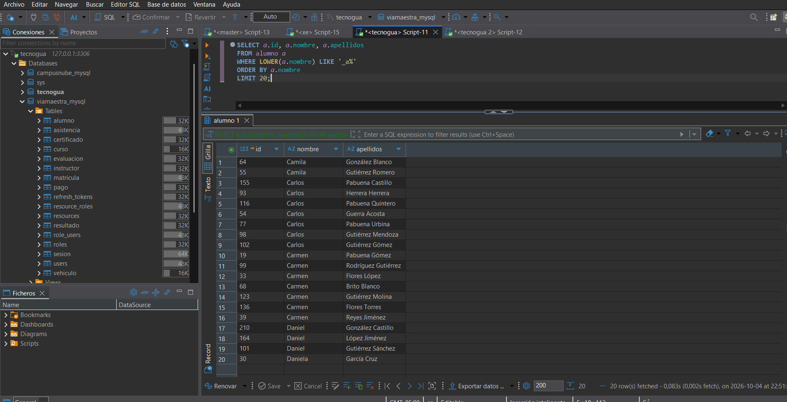

*Figura 18. Resultado de la consulta L04 en MySQL.*

| Registro de ejecución | |
|---|---|
| Filas obtenidas | |
| Tiempo de ejecución (ms) | |
| Observaciones | |

*Nota de sintaxis (MySQL):* Particularidades de sintaxis de este motor en esta consulta: `LIMIT n` para limitar filas.

##### L04 · PostgreSQL

```sql
SELECT a.id, a.nombre, a.apellidos
FROM alumno a
WHERE LOWER(a.nombre) LIKE '_a%'
ORDER BY a.nombre
LIMIT 20;
```

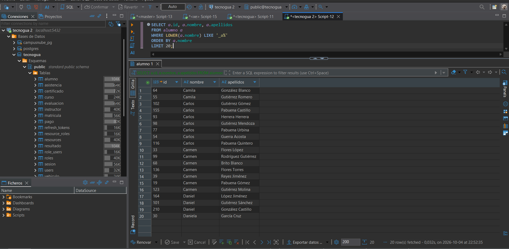

*Figura 19. Resultado de la consulta L04 en PostgreSQL.*

| Registro de ejecución | |
|---|---|
| Filas obtenidas | |
| Tiempo de ejecución (ms) | |
| Observaciones | |

*Nota de sintaxis (PostgreSQL):* Particularidades de sintaxis de este motor en esta consulta: `LIMIT n` para limitar filas.

##### L04 · SQL Server

```sql
SELECT TOP 20 a.id, a.nombre, a.apellidos
FROM alumno a
WHERE LOWER(a.nombre) LIKE '_a%'
ORDER BY a.nombre;
```

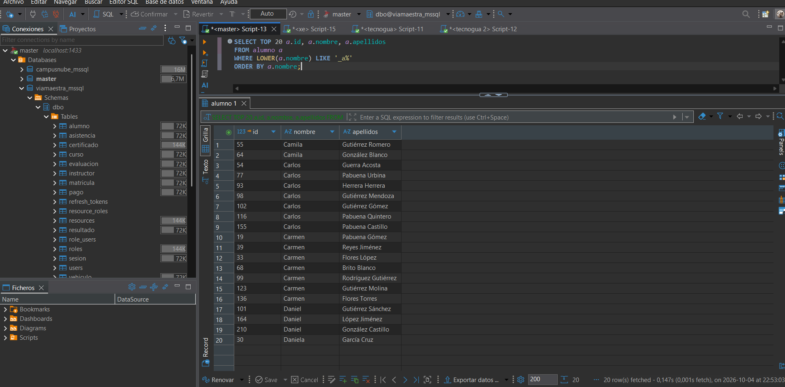

*Figura 20. Resultado de la consulta L04 en SQL Server.*

| Registro de ejecución | |
|---|---|
| Filas obtenidas | |
| Tiempo de ejecución (ms) | |
| Observaciones | |

*Nota de sintaxis (SQL Server):* Particularidades de sintaxis de este motor en esta consulta: `SELECT TOP n` para limitar filas.

##### L04 · Oracle

```sql
SELECT a.id, a.nombre, a.apellidos
FROM alumno a
WHERE LOWER(a.nombre) LIKE '_a%'
ORDER BY a.nombre
FETCH FIRST 20 ROWS ONLY;
```

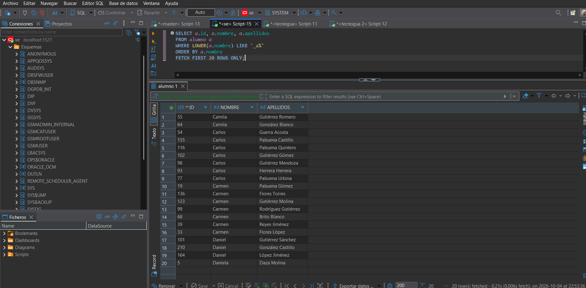

*Figura 21. Resultado de la consulta L04 en Oracle.*

| Registro de ejecución | |
|---|---|
| Filas obtenidas | |
| Tiempo de ejecución (ms) | |
| Observaciones | |

*Nota de sintaxis (Oracle):* Particularidades de sintaxis de este motor en esta consulta: `FETCH FIRST n ROWS ONLY` para limitar filas.

#### L05 — NOT LIKE: alumnos que no usan Gmail ni Hotmail

**Situación de negocio.** Mercadeo quiere abrir una línea de comunicación alternativa para los alumnos que **no** usan Gmail ni Hotmail, es decir, quienes utilizan Outlook, Yahoo o correo institucional. La pregunta exacta fue: «¿a quiénes no podemos llegar por la campaña masiva de Gmail?».

**Concepto de SQL.** `NOT LIKE` invierte la condición del patrón. Se combinan dos condiciones con `AND`, porque un alumno debe cumplir ambas negaciones a la vez (no ser Gmail **y** no ser Hotmail).

**Resultado esperado.** En la columna `correo` no debe aparecer ninguna dirección que contenga gmail ni hotmail.

##### L05 · MySQL

```sql
SELECT a.id, a.nombre, a.correo
FROM alumno a
WHERE a.correo NOT LIKE '%gmail.com' AND a.correo NOT LIKE '%hotmail.com'
ORDER BY a.correo
LIMIT 20;
```

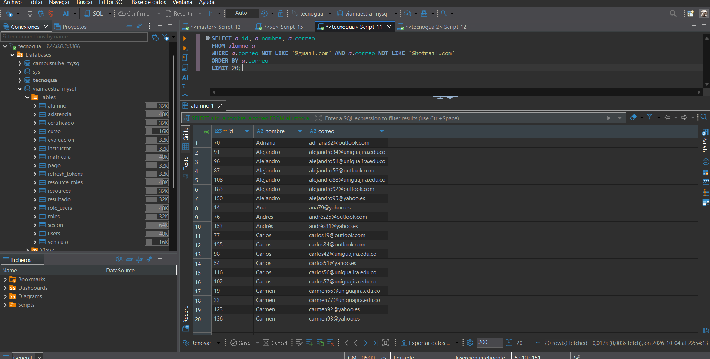

*Figura 22. Resultado de la consulta L05 en MySQL.*

| Registro de ejecución | |
|---|---|
| Filas obtenidas | |
| Tiempo de ejecución (ms) | |
| Observaciones | |

*Nota de sintaxis (MySQL):* Particularidades de sintaxis de este motor en esta consulta: `LIMIT n` para limitar filas.

##### L05 · PostgreSQL

```sql
SELECT a.id, a.nombre, a.correo
FROM alumno a
WHERE a.correo NOT LIKE '%gmail.com' AND a.correo NOT LIKE '%hotmail.com'
ORDER BY a.correo
LIMIT 20;
```

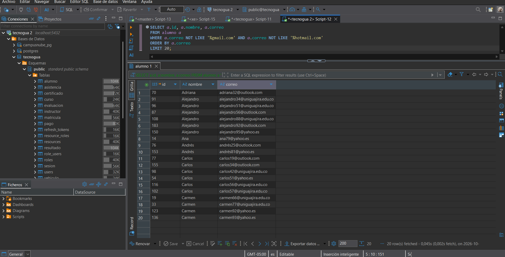

*Figura 23. Resultado de la consulta L05 en PostgreSQL.*

| Registro de ejecución | |
|---|---|
| Filas obtenidas | |
| Tiempo de ejecución (ms) | |
| Observaciones | |

*Nota de sintaxis (PostgreSQL):* Particularidades de sintaxis de este motor en esta consulta: `LIMIT n` para limitar filas.

##### L05 · SQL Server

```sql
SELECT TOP 20 a.id, a.nombre, a.correo
FROM alumno a
WHERE a.correo NOT LIKE '%gmail.com' AND a.correo NOT LIKE '%hotmail.com'
ORDER BY a.correo;
```

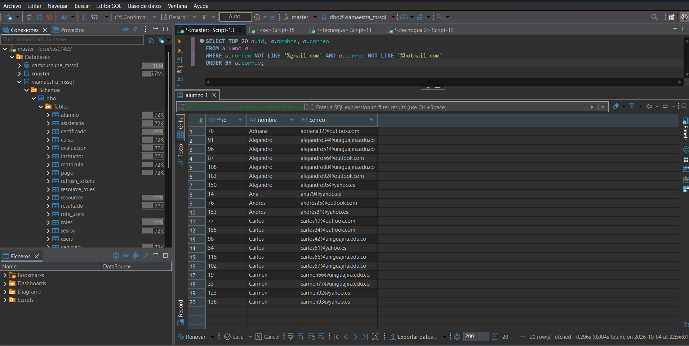

*Figura 24. Resultado de la consulta L05 en SQL Server.*

| Registro de ejecución | |
|---|---|
| Filas obtenidas | |
| Tiempo de ejecución (ms) | |
| Observaciones | |

*Nota de sintaxis (SQL Server):* Particularidades de sintaxis de este motor en esta consulta: `SELECT TOP n` para limitar filas.

##### L05 · Oracle

```sql
SELECT a.id, a.nombre, a.correo
FROM alumno a
WHERE a.correo NOT LIKE '%gmail.com' AND a.correo NOT LIKE '%hotmail.com'
ORDER BY a.correo
FETCH FIRST 20 ROWS ONLY;
```

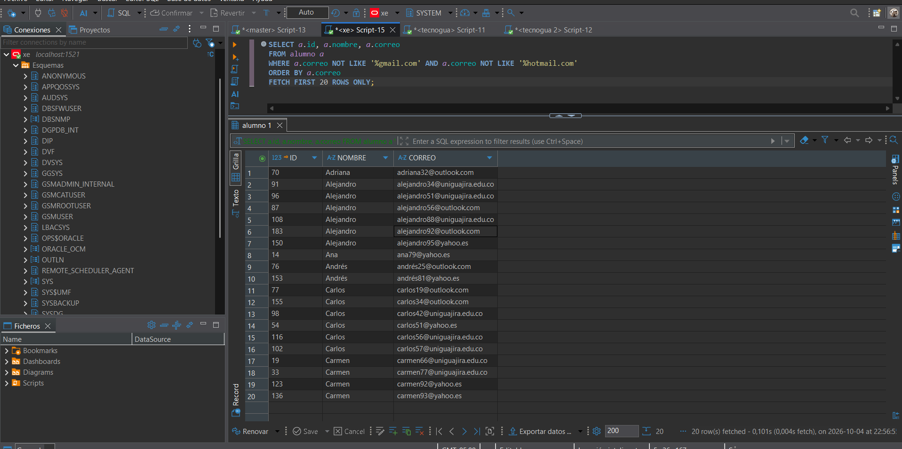

*Figura 25. Resultado de la consulta L05 en Oracle.*

| Registro de ejecución | |
|---|---|
| Filas obtenidas | |
| Tiempo de ejecución (ms) | |
| Observaciones | |

*Nota de sintaxis (Oracle):* Particularidades de sintaxis de este motor en esta consulta: `FETCH FIRST n ROWS ONLY` para limitar filas.

#### L06 — Alumnos que viven fuera de Riohacha (LIKE + OR)

**Situación de negocio.** Logística evalúa abrir una sede satélite fuera de Riohacha y necesita saber cuántos alumnos viven en Maicao o Uribia, tomando la ciudad que aparece al final de la dirección registrada.

**Concepto de SQL.** Se combina `LIKE` con `OR` dentro de paréntesis para aceptar cualquiera de las dos ciudades. Los paréntesis son necesarios si después se agrega otro filtro con `AND`, para no alterar la precedencia lógica.

**Resultado esperado.** Cada fila debe mostrar una dirección que termina en Maicao o en Uribia.

##### L06 · MySQL

```sql
SELECT a.id, a.nombre, a.apellidos, a.direccion
FROM alumno a
WHERE a.direccion LIKE '%Maicao%' OR a.direccion LIKE '%Uribia%'
ORDER BY a.direccion
LIMIT 20;
```

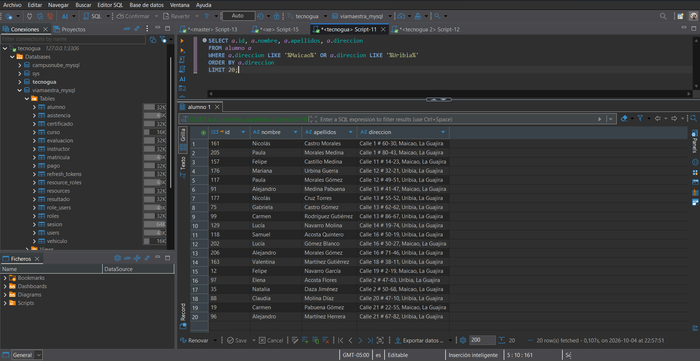

*Figura 26. Resultado de la consulta L06 en MySQL.*

| Registro de ejecución | |
|---|---|
| Filas obtenidas | |
| Tiempo de ejecución (ms) | |
| Observaciones | |

*Nota de sintaxis (MySQL):* Particularidades de sintaxis de este motor en esta consulta: `LIMIT n` para limitar filas.

##### L06 · PostgreSQL

```sql
SELECT a.id, a.nombre, a.apellidos, a.direccion
FROM alumno a
WHERE a.direccion LIKE '%Maicao%' OR a.direccion LIKE '%Uribia%'
ORDER BY a.direccion
LIMIT 20;
```

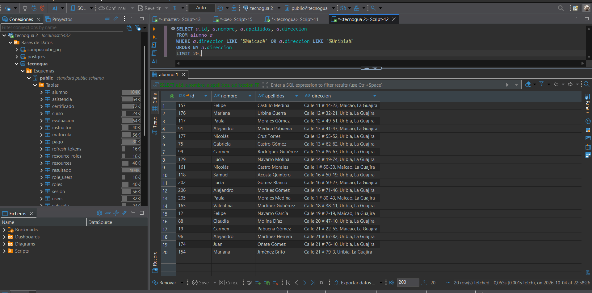

*Figura 27. Resultado de la consulta L06 en PostgreSQL.*

| Registro de ejecución | |
|---|---|
| Filas obtenidas | |
| Tiempo de ejecución (ms) | |
| Observaciones | |

*Nota de sintaxis (PostgreSQL):* Particularidades de sintaxis de este motor en esta consulta: `LIMIT n` para limitar filas.

##### L06 · SQL Server

```sql
SELECT TOP 20 a.id, a.nombre, a.apellidos, a.direccion
FROM alumno a
WHERE a.direccion LIKE '%Maicao%' OR a.direccion LIKE '%Uribia%'
ORDER BY a.direccion;
```

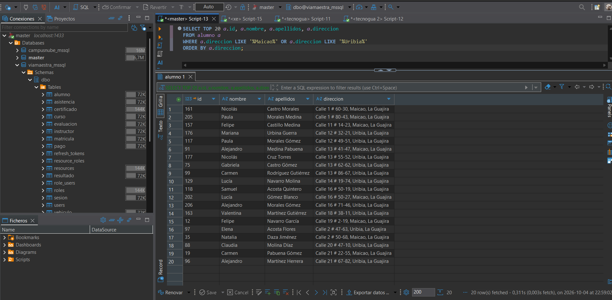

*Figura 28. Resultado de la consulta L06 en SQL Server.*

| Registro de ejecución | |
|---|---|
| Filas obtenidas | |
| Tiempo de ejecución (ms) | |
| Observaciones | |

*Nota de sintaxis (SQL Server):* Particularidades de sintaxis de este motor en esta consulta: `SELECT TOP n` para limitar filas.

##### L06 · Oracle

```sql
SELECT a.id, a.nombre, a.apellidos, a.direccion
FROM alumno a
WHERE a.direccion LIKE '%Maicao%' OR a.direccion LIKE '%Uribia%'
ORDER BY a.direccion
FETCH FIRST 20 ROWS ONLY;
```

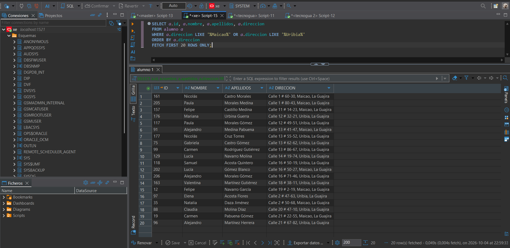

*Figura 29. Resultado de la consulta L06 en Oracle.*

| Registro de ejecución | |
|---|---|
| Filas obtenidas | |
| Tiempo de ejecución (ms) | |
| Observaciones | |

*Nota de sintaxis (Oracle):* Particularidades de sintaxis de este motor en esta consulta: `FETCH FIRST n ROWS ONLY` para limitar filas.

#### L07 — Cursos prácticos por patrón de nombre

**Situación de negocio.** El área académica quiere listar todos los cursos cuyo nombre contenga la palabra «práctico». El problema es que la palabra lleva tilde y no se sabe si los datos se digitaron con o sin ella; por eso se pidió un patrón que funcione en ambos casos.

**Concepto de SQL.** Se mezclan los comodines en un mismo patrón: `'%pr_ctico%'` tolera cualquier carácter en la posición de la «á». Con `LOWER()` se evita depender de la capitalización.

**Resultado esperado.** Se esperan únicamente cursos prácticos, ordenados alfabéticamente.

##### L07 · MySQL

```sql
SELECT c.id, c.nombre, c.descripcion
FROM curso c
WHERE LOWER(c.nombre) LIKE '%pr_ctico%'
ORDER BY c.nombre;
```

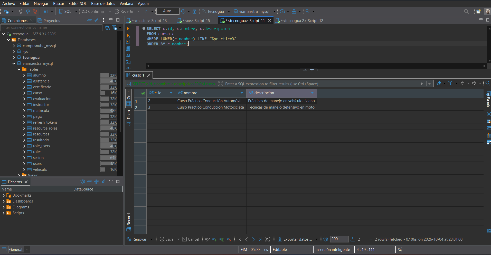

*Figura 30. Resultado de la consulta L07 en MySQL.*

| Registro de ejecución | |
|---|---|
| Filas obtenidas | |
| Tiempo de ejecución (ms) | |
| Observaciones | |

*Nota de sintaxis (MySQL):* La sentencia es idéntica en los cuatro motores y no requirió adaptaciones de sintaxis.

##### L07 · PostgreSQL

```sql
SELECT c.id, c.nombre, c.descripcion
FROM curso c
WHERE LOWER(c.nombre) LIKE '%pr_ctico%'
ORDER BY c.nombre;
```

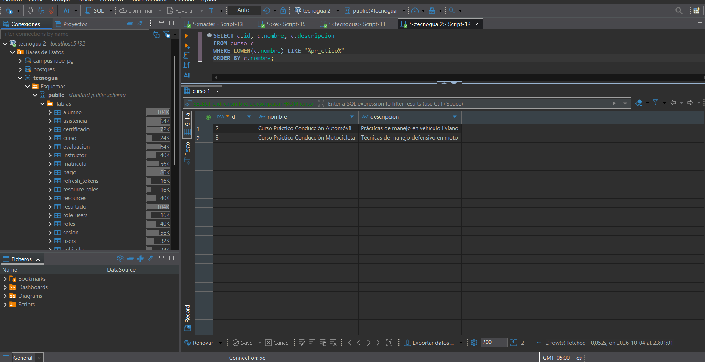

*Figura 31. Resultado de la consulta L07 en PostgreSQL.*

| Registro de ejecución | |
|---|---|
| Filas obtenidas | |
| Tiempo de ejecución (ms) | |
| Observaciones | |

*Nota de sintaxis (PostgreSQL):* La sentencia es idéntica en los cuatro motores y no requirió adaptaciones de sintaxis.

##### L07 · SQL Server

```sql
SELECT c.id, c.nombre, c.descripcion
FROM curso c
WHERE LOWER(c.nombre) LIKE '%pr_ctico%'
ORDER BY c.nombre;
```

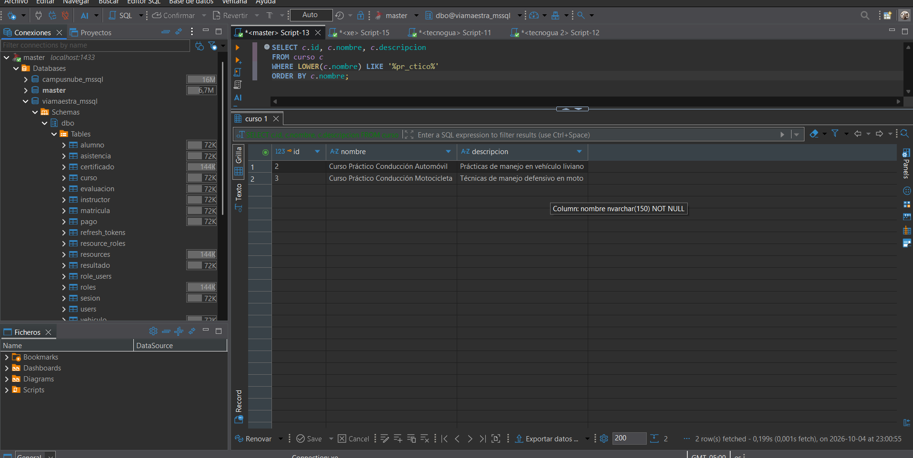

*Figura 32. Resultado de la consulta L07 en SQL Server.*

| Registro de ejecución | |
|---|---|
| Filas obtenidas | |
| Tiempo de ejecución (ms) | |
| Observaciones | |

*Nota de sintaxis (SQL Server):* La sentencia es idéntica en los cuatro motores y no requirió adaptaciones de sintaxis.

##### L07 · Oracle

```sql
SELECT c.id, c.nombre, c.descripcion
FROM curso c
WHERE LOWER(c.nombre) LIKE '%pr_ctico%'
ORDER BY c.nombre;
```

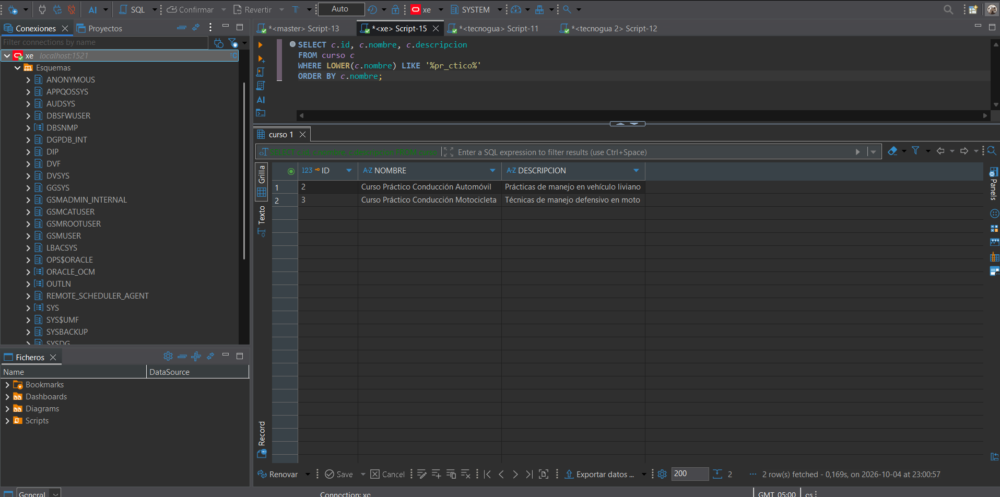

*Figura 33. Resultado de la consulta L07 en Oracle.*

| Registro de ejecución | |
|---|---|
| Filas obtenidas | |
| Tiempo de ejecución (ms) | |
| Observaciones | |

*Nota de sintaxis (Oracle):* La sentencia es idéntica en los cuatro motores y no requirió adaptaciones de sintaxis.

---

### 2. Subconsultas

Una subconsulta es una consulta dentro de otra. Se presentan seis variantes: escalar, con `IN`, con `NOT IN`, con `EXISTS`, en la cláusula `FROM` (tabla derivada) y correlacionada.

#### S01 — Subconsulta escalar: pagos superiores al promedio

**Situación de negocio.** Cartera quiere identificar los **pagos de alto valor**, entendidos como aquellos que superan el promedio de todos los pagos efectivamente recibidos. No se puede escribir el promedio a mano porque cambia cada vez que se registran nuevos pagos.

**Concepto de SQL.** Una **subconsulta escalar** (devuelve un solo valor) dentro del `WHERE` calcula el promedio de los pagos en estado `PAGADO`; la consulta externa compara cada pago contra ese valor.

**Resultado esperado.** Todos los montos mostrados deben ser mayores que el promedio. Una forma de comprobarlo es ejecutar aparte `SELECT AVG(monto) FROM pago WHERE estado = 'PAGADO'`.

##### S01 · MySQL

```sql
SELECT p.id, p.matricula_id, p.metodo, p.monto, p.fecha
FROM pago p
WHERE p.estado = 'PAGADO'
  AND p.monto > (SELECT AVG(p2.monto) FROM pago p2 WHERE p2.estado = 'PAGADO')
ORDER BY p.monto DESC, p.fecha DESC
LIMIT 15;
```

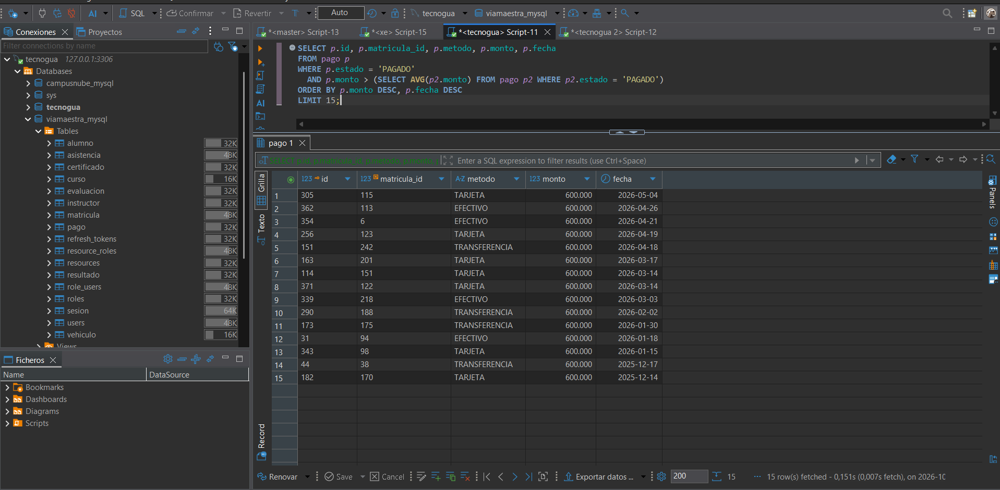

*Figura 34. Resultado de la consulta S01 en MySQL.*

| Registro de ejecución | |
|---|---|
| Filas obtenidas | |
| Tiempo de ejecución (ms) | |
| Observaciones | |

*Nota de sintaxis (MySQL):* Particularidades de sintaxis de este motor en esta consulta: `LIMIT n` para limitar filas.

##### S01 · PostgreSQL

```sql
SELECT p.id, p.matricula_id, p.metodo, p.monto, p.fecha
FROM pago p
WHERE p.estado = 'PAGADO'
  AND p.monto > (SELECT AVG(p2.monto) FROM pago p2 WHERE p2.estado = 'PAGADO')
ORDER BY p.monto DESC, p.fecha DESC
LIMIT 15;
```

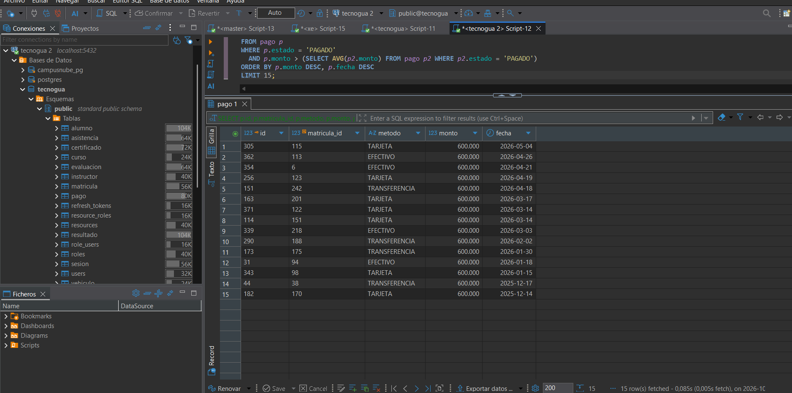

*Figura 35. Resultado de la consulta S01 en PostgreSQL.*

| Registro de ejecución | |
|---|---|
| Filas obtenidas | |
| Tiempo de ejecución (ms) | |
| Observaciones | |

*Nota de sintaxis (PostgreSQL):* Particularidades de sintaxis de este motor en esta consulta: `LIMIT n` para limitar filas.

##### S01 · SQL Server

```sql
SELECT TOP 15 p.id, p.matricula_id, p.metodo, p.monto, p.fecha
FROM pago p
WHERE p.estado = 'PAGADO'
  AND p.monto > (SELECT AVG(p2.monto) FROM pago p2 WHERE p2.estado = 'PAGADO')
ORDER BY p.monto DESC, p.fecha DESC;
```

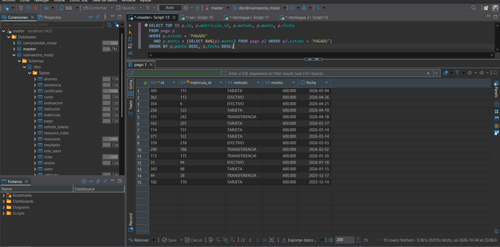

*Figura 36. Resultado de la consulta S01 en SQL Server.*

| Registro de ejecución | |
|---|---|
| Filas obtenidas | |
| Tiempo de ejecución (ms) | |
| Observaciones | |

*Nota de sintaxis (SQL Server):* Particularidades de sintaxis de este motor en esta consulta: `SELECT TOP n` para limitar filas.

##### S01 · Oracle

```sql
SELECT p.id, p.matricula_id, p.metodo, p.monto, p.fecha
FROM pago p
WHERE p.estado = 'PAGADO'
  AND p.monto > (SELECT AVG(p2.monto) FROM pago p2 WHERE p2.estado = 'PAGADO')
ORDER BY p.monto DESC, p.fecha DESC
FETCH FIRST 15 ROWS ONLY;
```

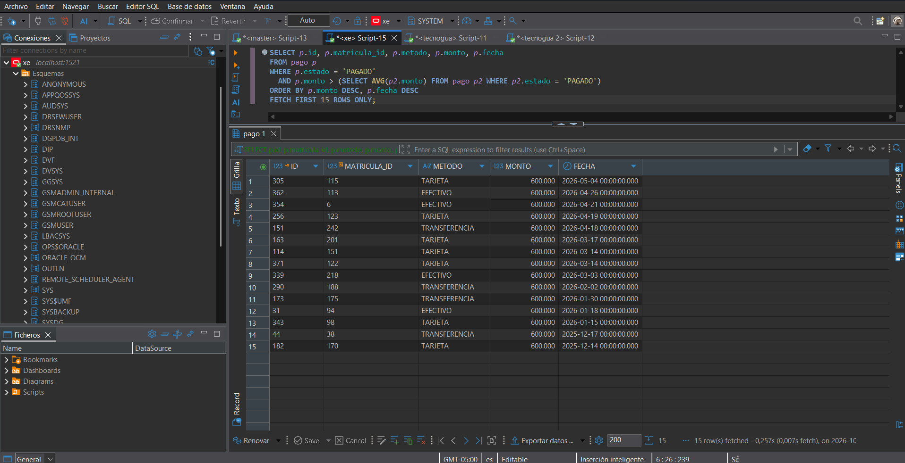

*Figura 37. Resultado de la consulta S01 en Oracle.*

| Registro de ejecución | |
|---|---|
| Filas obtenidas | |
| Tiempo de ejecución (ms) | |
| Observaciones | |

*Nota de sintaxis (Oracle):* Particularidades de sintaxis de este motor en esta consulta: `FETCH FIRST n ROWS ONLY` para limitar filas.

#### S02 — Subconsulta con IN: alumnos con matrícula activa en cursos prácticos

**Situación de negocio.** Operaciones necesita saber qué alumnos cursan un curso práctico, porque a ellos hay que asignarles instructor y vehículo. La información está repartida en tres tablas: alumnos, matrículas y cursos.

**Concepto de SQL.** `IN` con subconsulta: la consulta interna devuelve la lista de ids de alumnos con matrícula activa en cursos prácticos y la externa trae los datos de esos alumnos. Equivale a un `JOIN`, pero deja claro el razonamiento «pertenece a este conjunto».

**Resultado esperado.** Cada alumno devuelto debe tener al menos una matrícula activa en un curso práctico.

##### S02 · MySQL

```sql
SELECT a.id, CONCAT(a.nombre, ' ', a.apellidos) AS alumno, a.correo
FROM alumno a
WHERE a.id IN (SELECT m.estudiante_id FROM matricula m
               WHERE m.estado = 'ACTIVA'
                 AND m.oferta_id IN (SELECT c.id FROM curso c WHERE LOWER(c.nombre) LIKE '%pr_ctico%'))
ORDER BY a.apellidos, a.nombre
LIMIT 20;
```

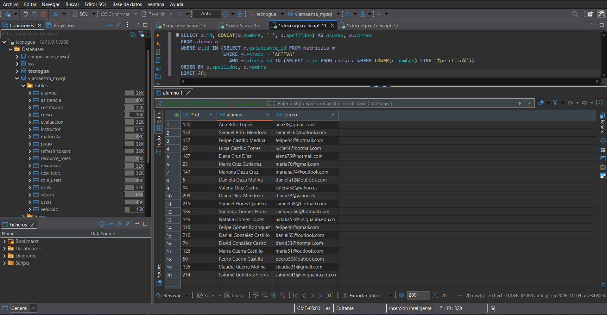

*Figura 38. Resultado de la consulta S02 en MySQL.*

| Registro de ejecución | |
|---|---|
| Filas obtenidas | |
| Tiempo de ejecución (ms) | |
| Observaciones | |

*Nota de sintaxis (MySQL):* Particularidades de sintaxis de este motor en esta consulta: `LIMIT n` para limitar filas; concatenación con `CONCAT()`.

##### S02 · PostgreSQL

```sql
SELECT a.id, a.nombre || ' ' || a.apellidos AS alumno, a.correo
FROM alumno a
WHERE a.id IN (SELECT m.estudiante_id FROM matricula m
               WHERE m.estado = 'ACTIVA'
                 AND m.oferta_id IN (SELECT c.id FROM curso c WHERE LOWER(c.nombre) LIKE '%pr_ctico%'))
ORDER BY a.apellidos, a.nombre
LIMIT 20;
```

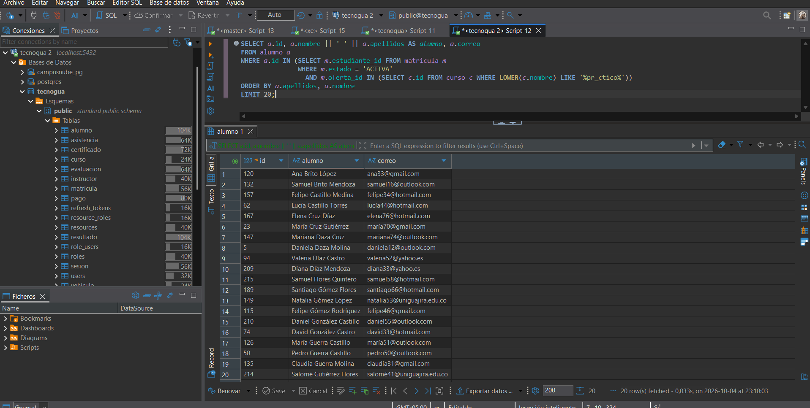

*Figura 39. Resultado de la consulta S02 en PostgreSQL.*

| Registro de ejecución | |
|---|---|
| Filas obtenidas | |
| Tiempo de ejecución (ms) | |
| Observaciones | |

*Nota de sintaxis (PostgreSQL):* Particularidades de sintaxis de este motor en esta consulta: `LIMIT n` para limitar filas; concatenación con `||`.

##### S02 · SQL Server

```sql
SELECT TOP 20 a.id, a.nombre + ' ' + a.apellidos AS alumno, a.correo
FROM alumno a
WHERE a.id IN (SELECT m.estudiante_id FROM matricula m
               WHERE m.estado = 'ACTIVA'
                 AND m.oferta_id IN (SELECT c.id FROM curso c WHERE LOWER(c.nombre) LIKE '%pr_ctico%'))
ORDER BY a.apellidos, a.nombre;
```

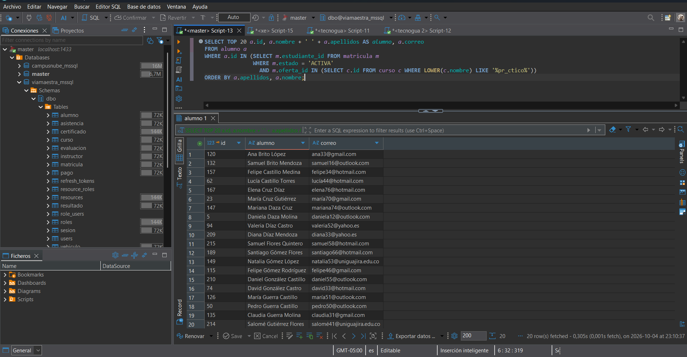

*Figura 40. Resultado de la consulta S02 en SQL Server.*

| Registro de ejecución | |
|---|---|
| Filas obtenidas | |
| Tiempo de ejecución (ms) | |
| Observaciones | |

*Nota de sintaxis (SQL Server):* Particularidades de sintaxis de este motor en esta consulta: `SELECT TOP n` para limitar filas; concatenación con `+`.

##### S02 · Oracle

```sql
SELECT a.id, a.nombre || ' ' || a.apellidos AS alumno, a.correo
FROM alumno a
WHERE a.id IN (SELECT m.estudiante_id FROM matricula m
               WHERE m.estado = 'ACTIVA'
                 AND m.oferta_id IN (SELECT c.id FROM curso c WHERE LOWER(c.nombre) LIKE '%pr_ctico%'))
ORDER BY a.apellidos, a.nombre
FETCH FIRST 20 ROWS ONLY;
```

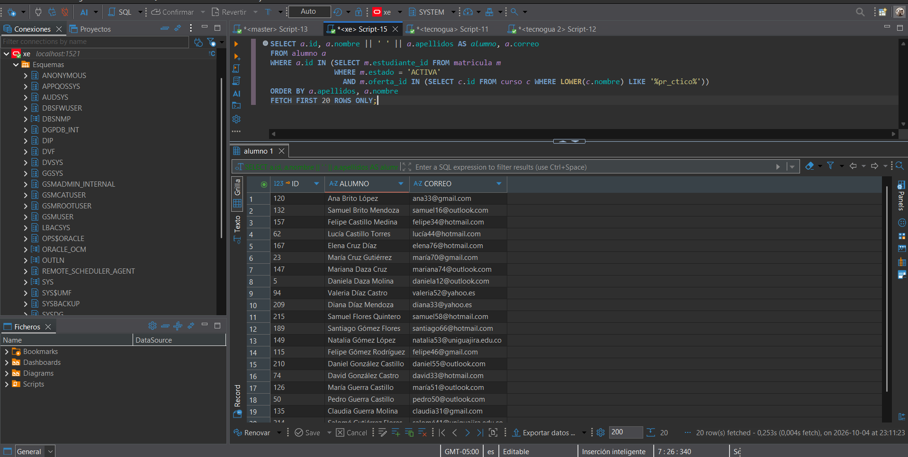

*Figura 41. Resultado de la consulta S02 en Oracle.*

| Registro de ejecución | |
|---|---|
| Filas obtenidas | |
| Tiempo de ejecución (ms) | |
| Observaciones | |

*Nota de sintaxis (Oracle):* Particularidades de sintaxis de este motor en esta consulta: `FETCH FIRST n ROWS ONLY` para limitar filas; concatenación con `||`.

#### S03 — Subconsulta con NOT IN: alumnos sin matrícula en el período 2026-2

**Situación de negocio.** Admisiones quiere contactar a quienes aún no se han matriculado en el período vigente 2026-2 para recordarles que las inscripciones siguen abiertas.

**Concepto de SQL.** `NOT IN` con subconsulta devuelve los alumnos cuyo id **no** aparece entre las matrículas del período 2026-2. Es importante que la columna de la subconsulta no contenga `NULL`; si los tuviera, `NOT IN` no devolvería filas y habría que usar `NOT EXISTS`.

**Resultado esperado.** Ninguno de los alumnos listados debe tener matrícula 2026-2; se puede verificar con una consulta inversa.

##### S03 · MySQL

```sql
SELECT a.id, CONCAT(a.nombre, ' ', a.apellidos) AS alumno, a.correo
FROM alumno a
WHERE a.id NOT IN (SELECT m.estudiante_id FROM matricula m WHERE m.periodo = '2026-2')
ORDER BY a.apellidos, a.nombre
LIMIT 20;
```

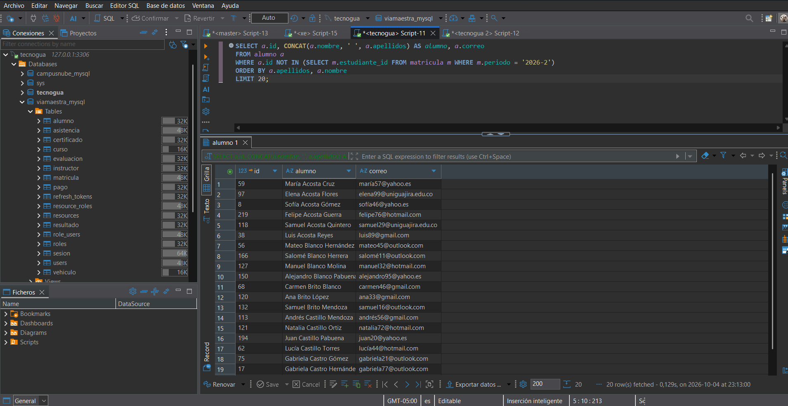

*Figura 42. Resultado de la consulta S03 en MySQL.*

| Registro de ejecución | |
|---|---|
| Filas obtenidas | |
| Tiempo de ejecución (ms) | |
| Observaciones | |

*Nota de sintaxis (MySQL):* Particularidades de sintaxis de este motor en esta consulta: `LIMIT n` para limitar filas; concatenación con `CONCAT()`.

##### S03 · PostgreSQL

```sql
SELECT a.id, a.nombre || ' ' || a.apellidos AS alumno, a.correo
FROM alumno a
WHERE a.id NOT IN (SELECT m.estudiante_id FROM matricula m WHERE m.periodo = '2026-2')
ORDER BY a.apellidos, a.nombre
LIMIT 20;
```

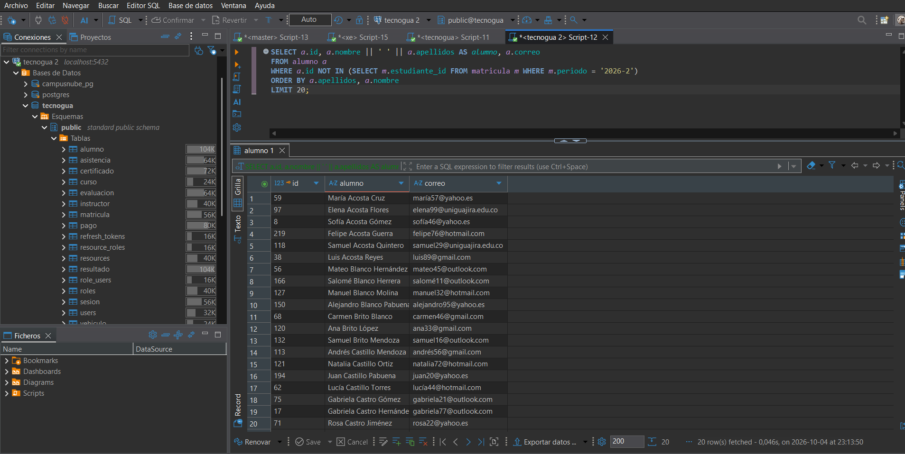

*Figura 43. Resultado de la consulta S03 en PostgreSQL.*

| Registro de ejecución | |
|---|---|
| Filas obtenidas | |
| Tiempo de ejecución (ms) | |
| Observaciones | |

*Nota de sintaxis (PostgreSQL):* Particularidades de sintaxis de este motor en esta consulta: `LIMIT n` para limitar filas; concatenación con `||`.

##### S03 · SQL Server

```sql
SELECT TOP 20 a.id, a.nombre + ' ' + a.apellidos AS alumno, a.correo
FROM alumno a
WHERE a.id NOT IN (SELECT m.estudiante_id FROM matricula m WHERE m.periodo = '2026-2')
ORDER BY a.apellidos, a.nombre;
```

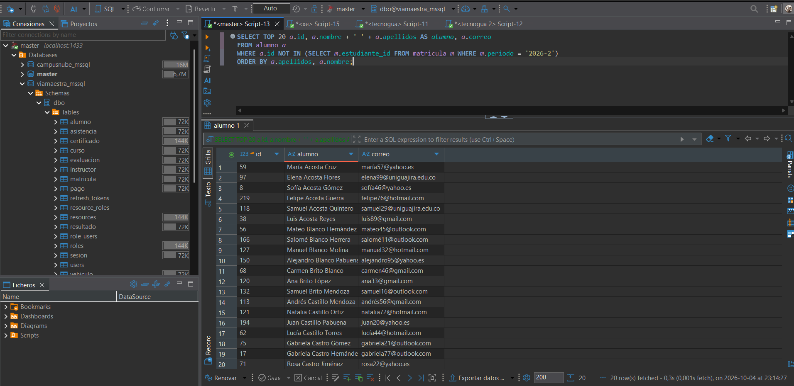

*Figura 44. Resultado de la consulta S03 en SQL Server.*

| Registro de ejecución | |
|---|---|
| Filas obtenidas | |
| Tiempo de ejecución (ms) | |
| Observaciones | |

*Nota de sintaxis (SQL Server):* Particularidades de sintaxis de este motor en esta consulta: `SELECT TOP n` para limitar filas; concatenación con `+`.

##### S03 · Oracle

```sql
SELECT a.id, a.nombre || ' ' || a.apellidos AS alumno, a.correo
FROM alumno a
WHERE a.id NOT IN (SELECT m.estudiante_id FROM matricula m WHERE m.periodo = '2026-2')
ORDER BY a.apellidos, a.nombre
FETCH FIRST 20 ROWS ONLY;
```

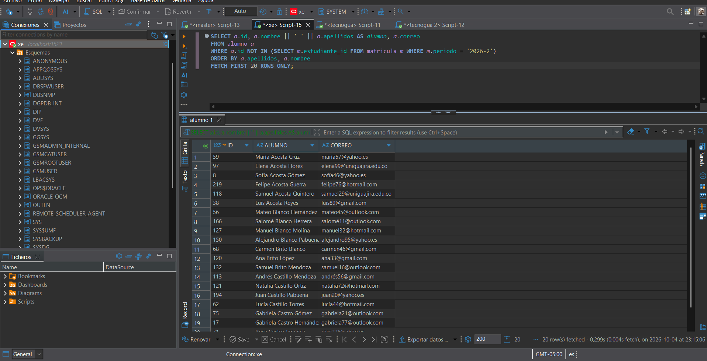

*Figura 45. Resultado de la consulta S03 en Oracle.*

| Registro de ejecución | |
|---|---|
| Filas obtenidas | |
| Tiempo de ejecución (ms) | |
| Observaciones | |

*Nota de sintaxis (Oracle):* Particularidades de sintaxis de este motor en esta consulta: `FETCH FIRST n ROWS ONLY` para limitar filas; concatenación con `||`.

#### S04 — Subconsulta con EXISTS: matrículas con alguna competencia reprobada

**Situación de negocio.** Coordinación académica necesita saber qué matrículas tienen al menos una competencia reprobada, porque esas matrículas no pueden recibir certificado hasta repetir la evaluación.

**Concepto de SQL.** `EXISTS` con subconsulta correlacionada: para cada matrícula se pregunta si existe al menos un resultado reprobado ligado a sus evaluaciones. Se detiene en cuanto encuentra el primero, lo que lo hace eficiente.

**Resultado esperado.** Cada matrícula listada debe tener al menos un resultado cuya descripción indica `Estado: REPROBADO`.

##### S04 · MySQL

```sql
SELECT m.id AS matricula, CONCAT(a.nombre, ' ', a.apellidos) AS alumno, m.periodo, m.estado
FROM matricula m
JOIN alumno a ON a.id = m.estudiante_id
WHERE EXISTS (SELECT 1 FROM evaluacion ev
              JOIN resultado r ON r.evaluacion_id = ev.id
              WHERE ev.matricula_id = m.id AND r.descripcion LIKE '%REPROBADO%')
ORDER BY m.id
LIMIT 20;
```

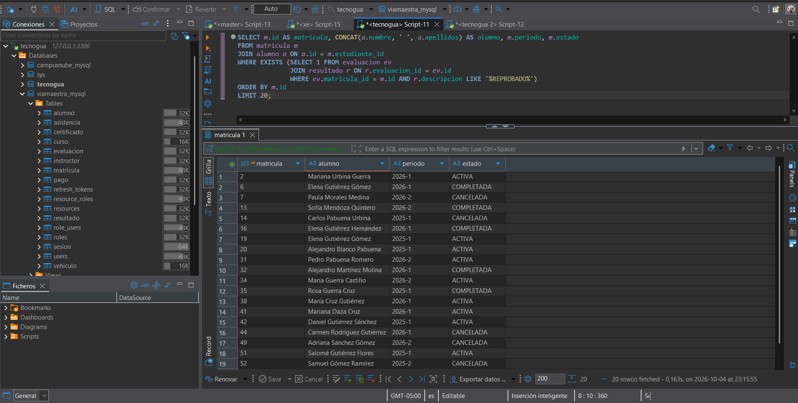

*Figura 46. Resultado de la consulta S04 en MySQL.*

| Registro de ejecución | |
|---|---|
| Filas obtenidas | |
| Tiempo de ejecución (ms) | |
| Observaciones | |

*Nota de sintaxis (MySQL):* Particularidades de sintaxis de este motor en esta consulta: `LIMIT n` para limitar filas; concatenación con `CONCAT()`.

##### S04 · PostgreSQL

```sql
SELECT m.id AS matricula, a.nombre || ' ' || a.apellidos AS alumno, m.periodo, m.estado
FROM matricula m
JOIN alumno a ON a.id = m.estudiante_id
WHERE EXISTS (SELECT 1 FROM evaluacion ev
              JOIN resultado r ON r.evaluacion_id = ev.id
              WHERE ev.matricula_id = m.id AND r.descripcion LIKE '%REPROBADO%')
ORDER BY m.id
LIMIT 20;
```

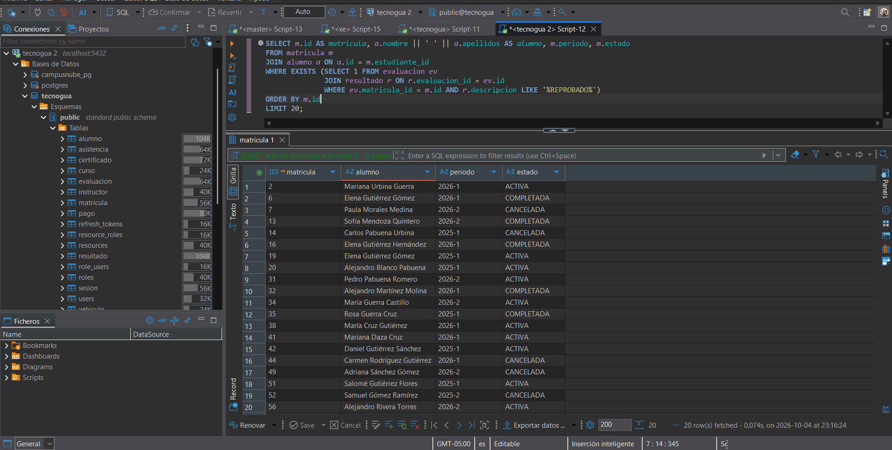

*Figura 47. Resultado de la consulta S04 en PostgreSQL.*

| Registro de ejecución | |
|---|---|
| Filas obtenidas | |
| Tiempo de ejecución (ms) | |
| Observaciones | |

*Nota de sintaxis (PostgreSQL):* Particularidades de sintaxis de este motor en esta consulta: `LIMIT n` para limitar filas; concatenación con `||`.

##### S04 · SQL Server

```sql
SELECT TOP 20 m.id AS matricula, a.nombre + ' ' + a.apellidos AS alumno, m.periodo, m.estado
FROM matricula m
JOIN alumno a ON a.id = m.estudiante_id
WHERE EXISTS (SELECT 1 FROM evaluacion ev
              JOIN resultado r ON r.evaluacion_id = ev.id
              WHERE ev.matricula_id = m.id AND r.descripcion LIKE '%REPROBADO%')
ORDER BY m.id;
```

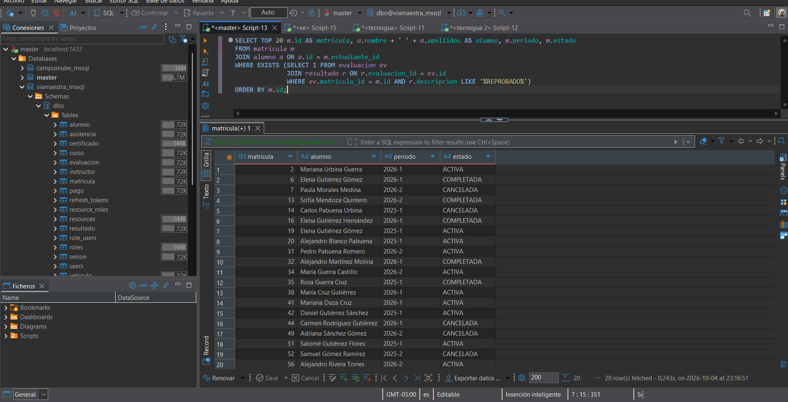

*Figura 48. Resultado de la consulta S04 en SQL Server.*

| Registro de ejecución | |
|---|---|
| Filas obtenidas | |
| Tiempo de ejecución (ms) | |
| Observaciones | |

*Nota de sintaxis (SQL Server):* Particularidades de sintaxis de este motor en esta consulta: `SELECT TOP n` para limitar filas; concatenación con `+`.

##### S04 · Oracle

```sql
SELECT m.id AS matricula, a.nombre || ' ' || a.apellidos AS alumno, m.periodo, m.estado
FROM matricula m
JOIN alumno a ON a.id = m.estudiante_id
WHERE EXISTS (SELECT 1 FROM evaluacion ev
              JOIN resultado r ON r.evaluacion_id = ev.id
              WHERE ev.matricula_id = m.id AND r.descripcion LIKE '%REPROBADO%')
ORDER BY m.id
FETCH FIRST 20 ROWS ONLY;
```

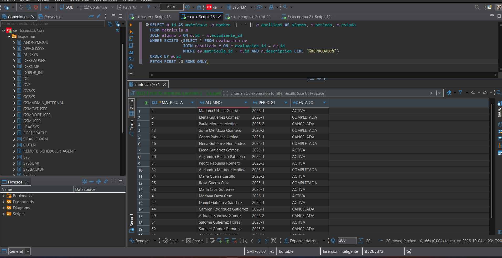

*Figura 49. Resultado de la consulta S04 en Oracle.*

| Registro de ejecución | |
|---|---|
| Filas obtenidas | |
| Tiempo de ejecución (ms) | |
| Observaciones | |

*Nota de sintaxis (Oracle):* Particularidades de sintaxis de este motor en esta consulta: `FETCH FIRST n ROWS ONLY` para limitar filas; concatenación con `||`.

#### S05 — Subconsulta en FROM (tabla derivada): instructores sobre el promedio de sesiones

**Situación de negocio.** Talento humano quiere reconocer a los instructores que dictan más sesiones que el promedio del equipo. El promedio no es un dato fijo: depende de cuántas sesiones se han dictado en total y de cuántos instructores hay activos.

**Concepto de SQL.** Combina una **tabla derivada** en el `FROM` (sesiones por instructor) con una subconsulta escalar que calcula el promedio de esos conteos. Ilustra que una subconsulta puede vivir en `FROM` y en `WHERE` dentro de la misma sentencia.

**Resultado esperado.** Solo aparecen instructores con un número de sesiones estrictamente mayor al promedio; ninguno debe estar en el promedio exacto.

##### S05 · MySQL

```sql
SELECT t.instructor, t.sesiones
FROM (SELECT i.id, i.nombre AS instructor, COUNT(s.id) AS sesiones
      FROM instructor i
      JOIN sesion s ON s.instructor_id = i.id
      WHERE s.estado <> 'CANCELADA'
      GROUP BY i.id, i.nombre) t
WHERE t.sesiones > (SELECT AVG(x.n * 1.0)
                    FROM (SELECT COUNT(*) AS n FROM sesion s2
                          WHERE s2.estado <> 'CANCELADA' GROUP BY s2.instructor_id) x)
ORDER BY t.sesiones DESC;
```

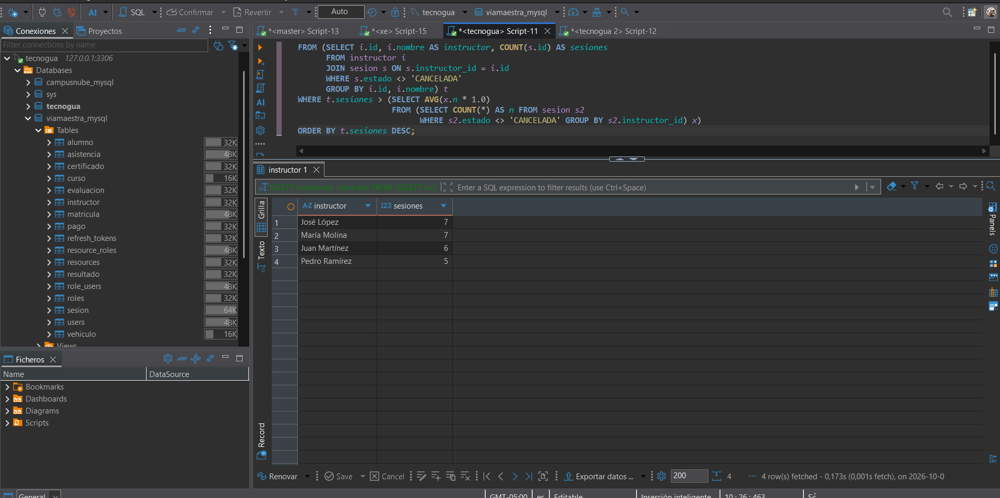

*Figura 50. Resultado de la consulta S05 en MySQL.*

| Registro de ejecución | |
|---|---|
| Filas obtenidas | |
| Tiempo de ejecución (ms) | |
| Observaciones | |

*Nota de sintaxis (MySQL):* La sentencia es idéntica en los cuatro motores y no requirió adaptaciones de sintaxis.

##### S05 · PostgreSQL

```sql
SELECT t.instructor, t.sesiones
FROM (SELECT i.id, i.nombre AS instructor, COUNT(s.id) AS sesiones
      FROM instructor i
      JOIN sesion s ON s.instructor_id = i.id
      WHERE s.estado <> 'CANCELADA'
      GROUP BY i.id, i.nombre) t
WHERE t.sesiones > (SELECT AVG(x.n * 1.0)
                    FROM (SELECT COUNT(*) AS n FROM sesion s2
                          WHERE s2.estado <> 'CANCELADA' GROUP BY s2.instructor_id) x)
ORDER BY t.sesiones DESC;
```

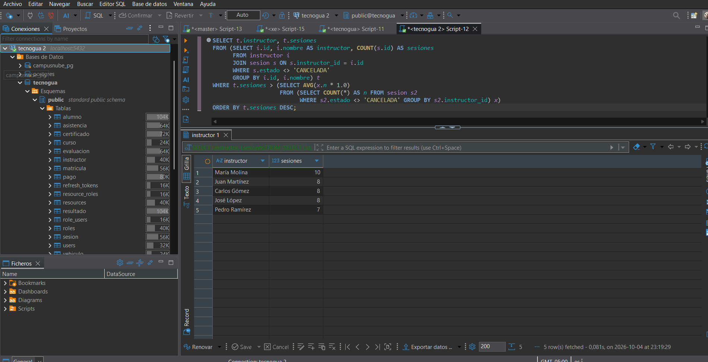

*Figura 51. Resultado de la consulta S05 en PostgreSQL.*

| Registro de ejecución | |
|---|---|
| Filas obtenidas | |
| Tiempo de ejecución (ms) | |
| Observaciones | |

*Nota de sintaxis (PostgreSQL):* La sentencia es idéntica en los cuatro motores y no requirió adaptaciones de sintaxis.

##### S05 · SQL Server

```sql
SELECT t.instructor, t.sesiones
FROM (SELECT i.id, i.nombre AS instructor, COUNT(s.id) AS sesiones
      FROM instructor i
      JOIN sesion s ON s.instructor_id = i.id
      WHERE s.estado <> 'CANCELADA'
      GROUP BY i.id, i.nombre) t
WHERE t.sesiones > (SELECT AVG(x.n * 1.0)
                    FROM (SELECT COUNT(*) AS n FROM sesion s2
                          WHERE s2.estado <> 'CANCELADA' GROUP BY s2.instructor_id) x)
ORDER BY t.sesiones DESC;
```

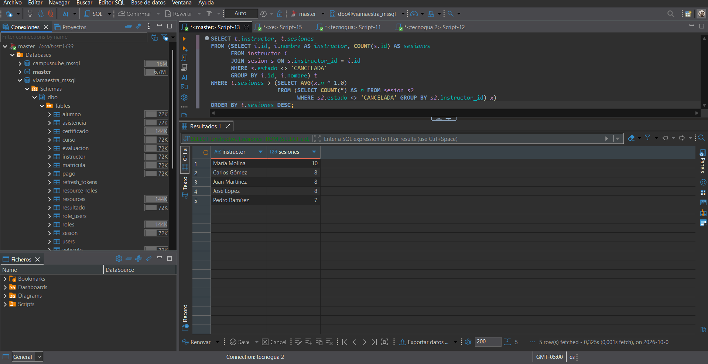

*Figura 52. Resultado de la consulta S05 en SQL Server.*

| Registro de ejecución | |
|---|---|
| Filas obtenidas | |
| Tiempo de ejecución (ms) | |
| Observaciones | |

*Nota de sintaxis (SQL Server):* La sentencia es idéntica en los cuatro motores y no requirió adaptaciones de sintaxis.

##### S05 · Oracle

```sql
SELECT t.instructor, t.sesiones
FROM (SELECT i.id, i.nombre AS instructor, COUNT(s.id) AS sesiones
      FROM instructor i
      JOIN sesion s ON s.instructor_id = i.id
      WHERE s.estado <> 'CANCELADA'
      GROUP BY i.id, i.nombre) t
WHERE t.sesiones > (SELECT AVG(x.n * 1.0)
                    FROM (SELECT COUNT(*) AS n FROM sesion s2
                          WHERE s2.estado <> 'CANCELADA' GROUP BY s2.instructor_id) x)
ORDER BY t.sesiones DESC;
```

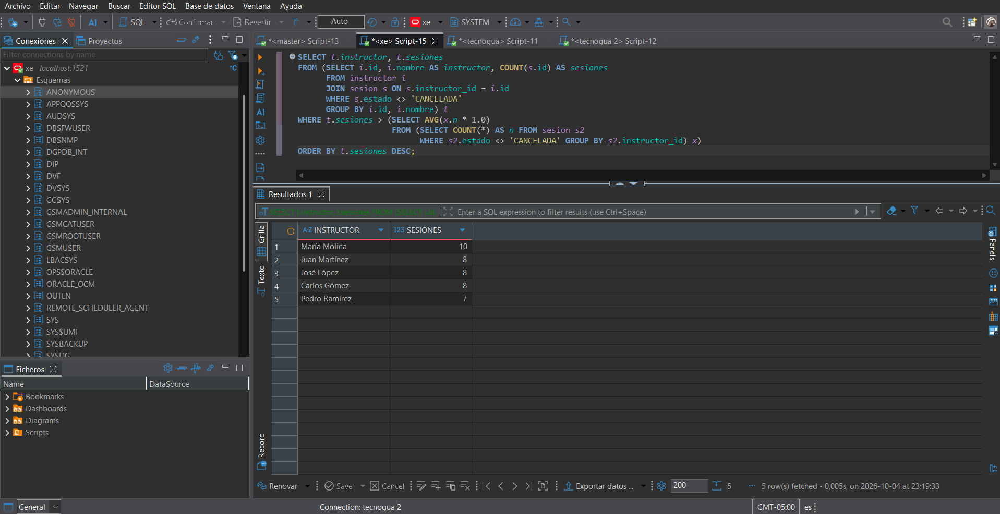

*Figura 53. Resultado de la consulta S05 en Oracle.*

| Registro de ejecución | |
|---|---|
| Filas obtenidas | |
| Tiempo de ejecución (ms) | |
| Observaciones | |

*Nota de sintaxis (Oracle):* La sentencia es idéntica en los cuatro motores y no requirió adaptaciones de sintaxis.

#### S06 — Subconsulta correlacionada: último pago registrado de cada matrícula

**Situación de negocio.** Cartera quiere hacer seguimiento de cobro: para cada matrícula necesita ver únicamente su pago más reciente, no todo el historial, y con eso decidir a quién llamar primero.

**Concepto de SQL.** **Subconsulta correlacionada**: por cada fila del `pago` externo se evalúa `MAX(fecha)` de los pagos de esa misma matrícula. La referencia `p.matricula_id` conecta la consulta interna con la externa.

**Resultado esperado.** Cada `matricula_id` aparece con el pago de su fecha más reciente. Si una matrícula tuvo dos pagos el mismo día, podrían salir ambos.

##### S06 · MySQL

```sql
SELECT p.matricula_id, p.id AS pago, p.fecha, p.monto, p.estado
FROM pago p
WHERE p.fecha = (SELECT MAX(p2.fecha) FROM pago p2 WHERE p2.matricula_id = p.matricula_id)
ORDER BY p.fecha DESC, p.matricula_id
LIMIT 15;
```

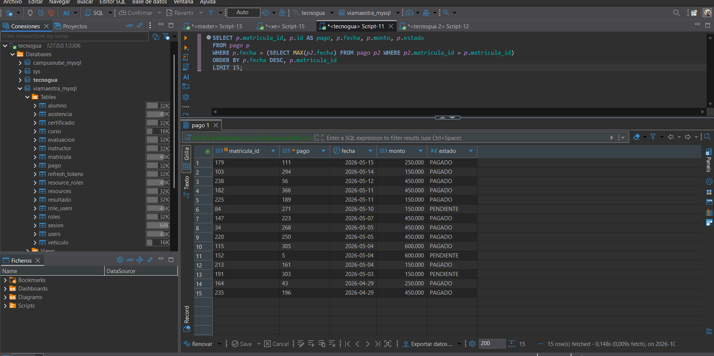

*Figura 54. Resultado de la consulta S06 en MySQL.*

| Registro de ejecución | |
|---|---|
| Filas obtenidas | |
| Tiempo de ejecución (ms) | |
| Observaciones | |

*Nota de sintaxis (MySQL):* Particularidades de sintaxis de este motor en esta consulta: `LIMIT n` para limitar filas.

##### S06 · PostgreSQL

```sql
SELECT p.matricula_id, p.id AS pago, p.fecha, p.monto, p.estado
FROM pago p
WHERE p.fecha = (SELECT MAX(p2.fecha) FROM pago p2 WHERE p2.matricula_id = p.matricula_id)
ORDER BY p.fecha DESC, p.matricula_id
LIMIT 15;
```

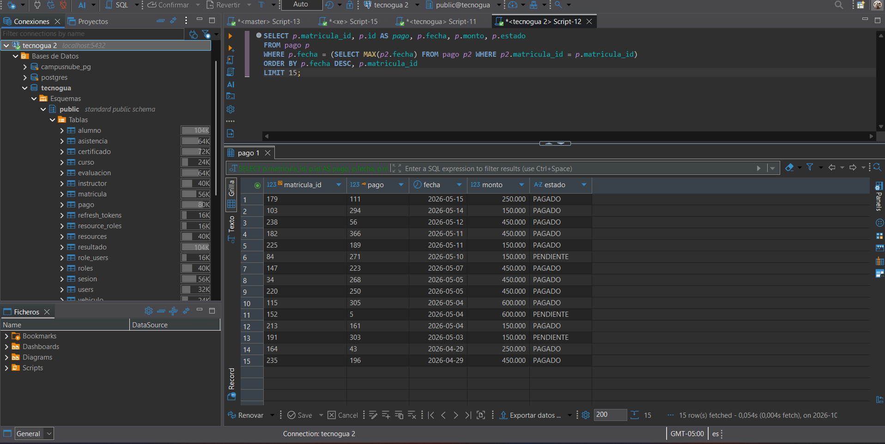

*Figura 55. Resultado de la consulta S06 en PostgreSQL.*

| Registro de ejecución | |
|---|---|
| Filas obtenidas | |
| Tiempo de ejecución (ms) | |
| Observaciones | |

*Nota de sintaxis (PostgreSQL):* Particularidades de sintaxis de este motor en esta consulta: `LIMIT n` para limitar filas.

##### S06 · SQL Server

```sql
SELECT TOP 15 p.matricula_id, p.id AS pago, p.fecha, p.monto, p.estado
FROM pago p
WHERE p.fecha = (SELECT MAX(p2.fecha) FROM pago p2 WHERE p2.matricula_id = p.matricula_id)
ORDER BY p.fecha DESC, p.matricula_id;
```

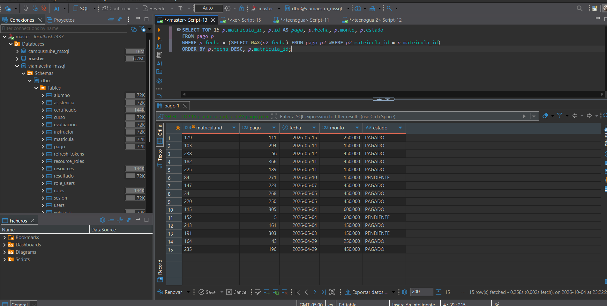

*Figura 56. Resultado de la consulta S06 en SQL Server.*

| Registro de ejecución | |
|---|---|
| Filas obtenidas | |
| Tiempo de ejecución (ms) | |
| Observaciones | |

*Nota de sintaxis (SQL Server):* Particularidades de sintaxis de este motor en esta consulta: `SELECT TOP n` para limitar filas.

##### S06 · Oracle

```sql
SELECT p.matricula_id, p.id AS pago, p.fecha, p.monto, p.estado
FROM pago p
WHERE p.fecha = (SELECT MAX(p2.fecha) FROM pago p2 WHERE p2.matricula_id = p.matricula_id)
ORDER BY p.fecha DESC, p.matricula_id
FETCH FIRST 15 ROWS ONLY;
```

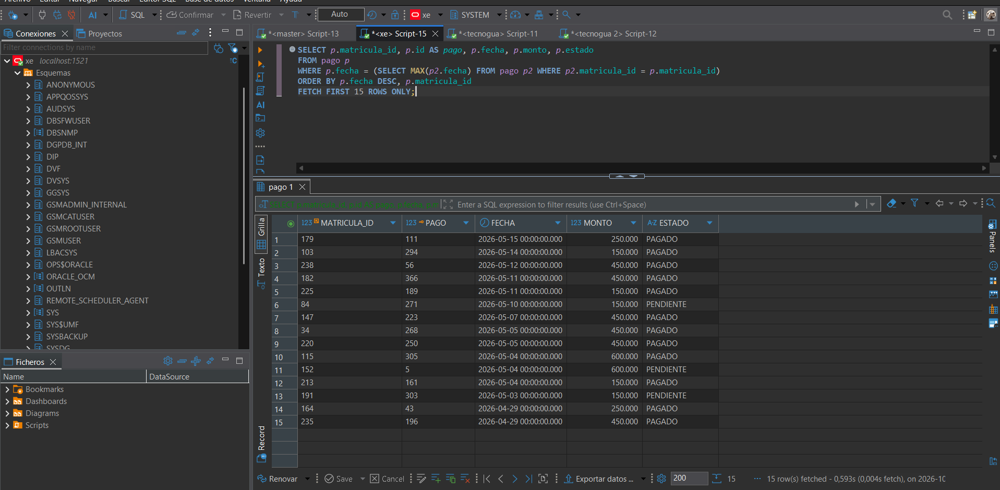

*Figura 57. Resultado de la consulta S06 en Oracle.*

| Registro de ejecución | |
|---|---|
| Filas obtenidas | |
| Tiempo de ejecución (ms) | |
| Observaciones | |

*Nota de sintaxis (Oracle):* Particularidades de sintaxis de este motor en esta consulta: `FETCH FIRST n ROWS ONLY` para limitar filas.

---

### 3. GROUP BY — agrupación y agregación

`GROUP BY` agrupa las filas que comparten valores y permite calcular totales con `COUNT`, `SUM`, `AVG`, `MIN` y `MAX`. Cada fila del resultado representa un grupo.

#### G01 — Matrículas por curso y estado

**Situación de negocio.** Dirección académica quiere saber cuántas matrículas tiene cada curso según su estado (activa, completada o cancelada) para decidir qué cursos reforzar y cuáles revisar por cancelaciones.

**Concepto de SQL.** `GROUP BY` con dos columnas (curso y estado) y `COUNT()` como función de agregación. Cada combinación única de curso y estado genera una fila.

**Resultado esperado.** La suma de la columna de conteo debe ser 256, el total de matrículas cargadas.

##### G01 · MySQL

```sql
SELECT c.nombre AS curso, m.estado, COUNT(m.id) AS total
FROM matricula m
JOIN curso c ON c.id = m.oferta_id
GROUP BY c.id, c.nombre, m.estado
ORDER BY c.nombre, m.estado;
```

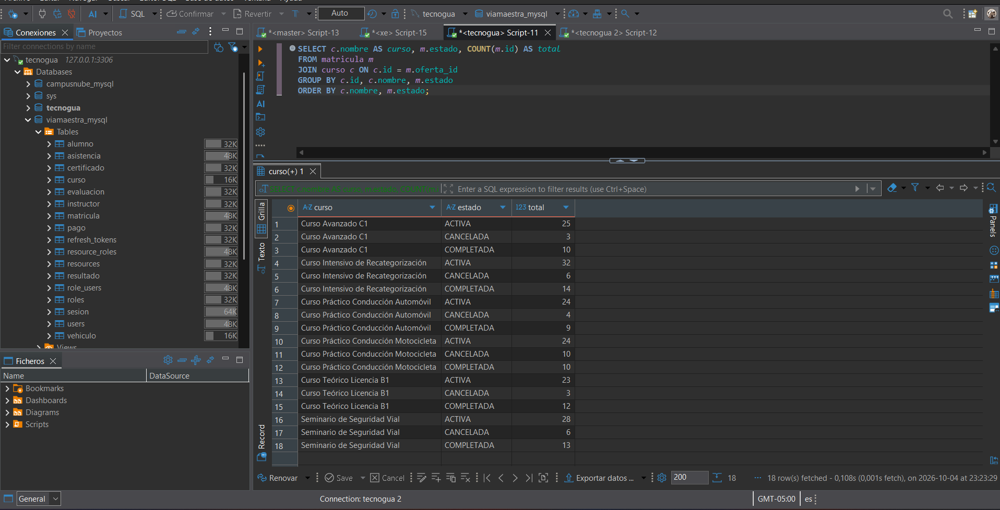

*Figura 58. Resultado de la consulta G01 en MySQL.*

| Registro de ejecución | |
|---|---|
| Filas obtenidas | |
| Tiempo de ejecución (ms) | |
| Observaciones | |

*Nota de sintaxis (MySQL):* La sentencia es idéntica en los cuatro motores y no requirió adaptaciones de sintaxis.

##### G01 · PostgreSQL

```sql
SELECT c.nombre AS curso, m.estado, COUNT(m.id) AS total
FROM matricula m
JOIN curso c ON c.id = m.oferta_id
GROUP BY c.id, c.nombre, m.estado
ORDER BY c.nombre, m.estado;
```

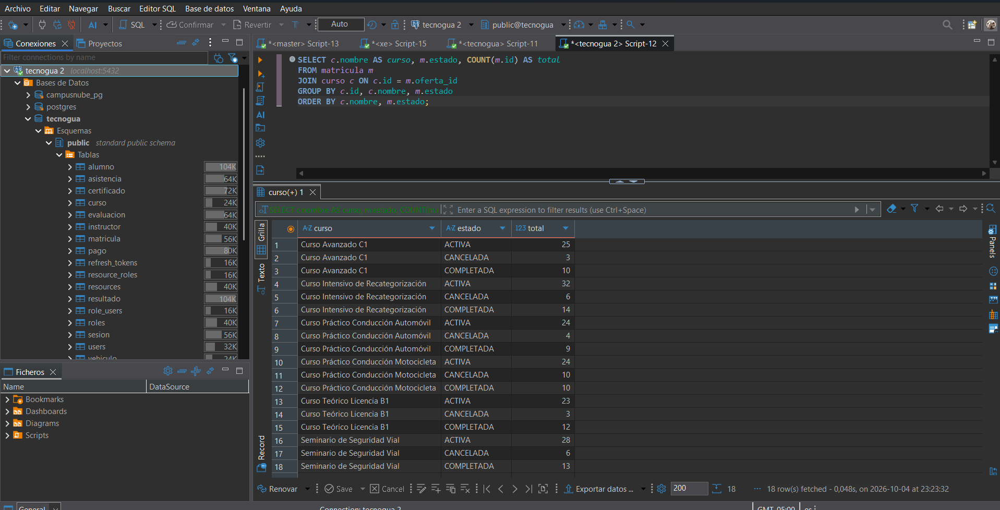

*Figura 59. Resultado de la consulta G01 en PostgreSQL.*

| Registro de ejecución | |
|---|---|
| Filas obtenidas | |
| Tiempo de ejecución (ms) | |
| Observaciones | |

*Nota de sintaxis (PostgreSQL):* La sentencia es idéntica en los cuatro motores y no requirió adaptaciones de sintaxis.

##### G01 · SQL Server

```sql
SELECT c.nombre AS curso, m.estado, COUNT(m.id) AS total
FROM matricula m
JOIN curso c ON c.id = m.oferta_id
GROUP BY c.id, c.nombre, m.estado
ORDER BY c.nombre, m.estado;
```

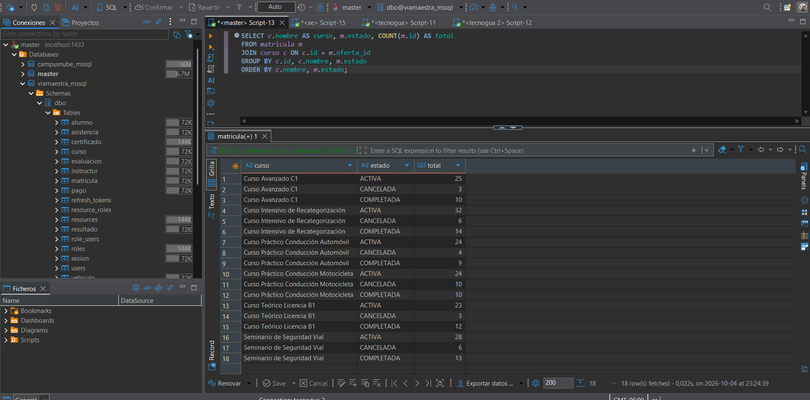

*Figura 60. Resultado de la consulta G01 en SQL Server.*

| Registro de ejecución | |
|---|---|
| Filas obtenidas | |
| Tiempo de ejecución (ms) | |
| Observaciones | |

*Nota de sintaxis (SQL Server):* La sentencia es idéntica en los cuatro motores y no requirió adaptaciones de sintaxis.

##### G01 · Oracle

```sql
SELECT c.nombre AS curso, m.estado, COUNT(m.id) AS total
FROM matricula m
JOIN curso c ON c.id = m.oferta_id
GROUP BY c.id, c.nombre, m.estado
ORDER BY c.nombre, m.estado;
```

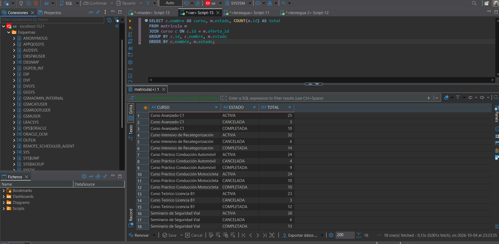

*Figura 61. Resultado de la consulta G01 en Oracle.*

| Registro de ejecución | |
|---|---|
| Filas obtenidas | |
| Tiempo de ejecución (ms) | |
| Observaciones | |

*Nota de sintaxis (Oracle):* La sentencia es idéntica en los cuatro motores y no requirió adaptaciones de sintaxis.

#### G02 — Recaudo por método de pago

**Situación de negocio.** Tesorería necesita conocer cuánto dinero ingresa por cada medio de pago (efectivo, tarjeta y transferencia) para negociar comisiones con el banco y decidir si conviene incentivar alguno.

**Concepto de SQL.** Varias funciones de agregación en una sola consulta: `SUM`, `COUNT`, `AVG`, `MIN` y `MAX` agrupadas por método. Solo se consideran los pagos en estado `PAGADO`.

**Resultado esperado.** Debe aparecer una fila por método de pago. El mínimo nunca puede ser mayor que el promedio ni el promedio mayor que el máximo.

##### G02 · MySQL

```sql
SELECT p.metodo, SUM(p.monto) AS total, COUNT(p.id) AS pagos, AVG(p.monto) AS promedio,
       MIN(p.monto) AS minimo, MAX(p.monto) AS maximo
FROM pago p
WHERE p.estado = 'PAGADO'
GROUP BY p.metodo
ORDER BY total DESC;
```

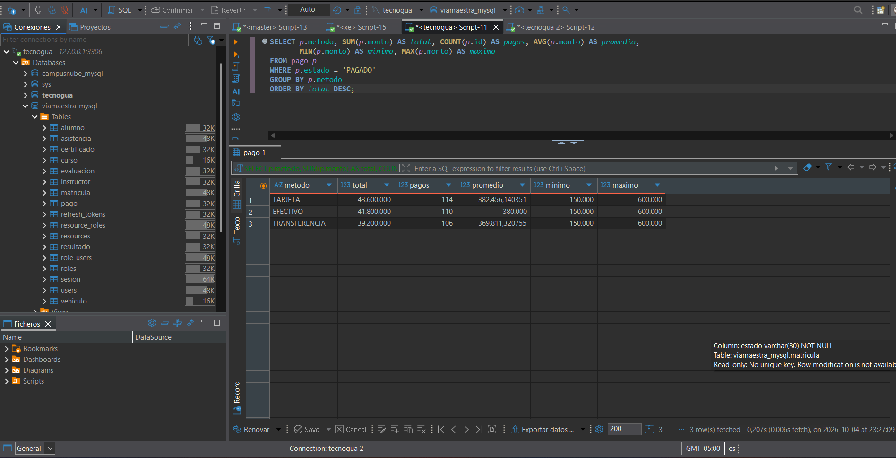

*Figura 62. Resultado de la consulta G02 en MySQL.*

| Registro de ejecución | |
|---|---|
| Filas obtenidas | |
| Tiempo de ejecución (ms) | |
| Observaciones | |

*Nota de sintaxis (MySQL):* La sentencia es idéntica en los cuatro motores y no requirió adaptaciones de sintaxis.

##### G02 · PostgreSQL

```sql
SELECT p.metodo, SUM(p.monto) AS total, COUNT(p.id) AS pagos, AVG(p.monto) AS promedio,
       MIN(p.monto) AS minimo, MAX(p.monto) AS maximo
FROM pago p
WHERE p.estado = 'PAGADO'
GROUP BY p.metodo
ORDER BY total DESC;
```

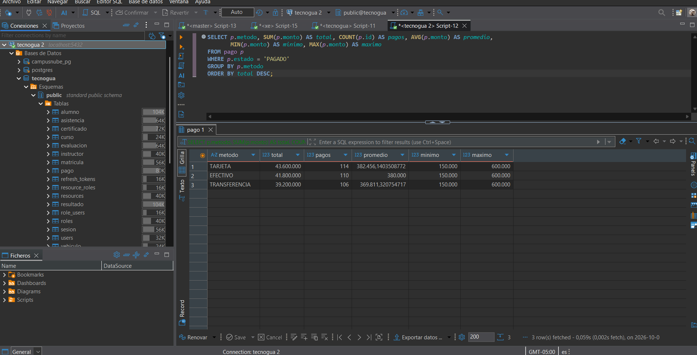

*Figura 63. Resultado de la consulta G02 en PostgreSQL.*

| Registro de ejecución | |
|---|---|
| Filas obtenidas | |
| Tiempo de ejecución (ms) | |
| Observaciones | |

*Nota de sintaxis (PostgreSQL):* La sentencia es idéntica en los cuatro motores y no requirió adaptaciones de sintaxis.

##### G02 · SQL Server

```sql
SELECT p.metodo, SUM(p.monto) AS total, COUNT(p.id) AS pagos, AVG(p.monto) AS promedio,
       MIN(p.monto) AS minimo, MAX(p.monto) AS maximo
FROM pago p
WHERE p.estado = 'PAGADO'
GROUP BY p.metodo
ORDER BY total DESC;
```

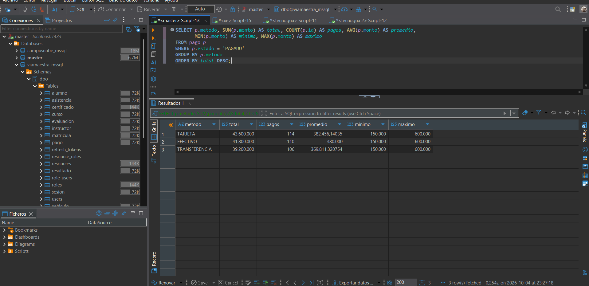

*Figura 64. Resultado de la consulta G02 en SQL Server.*

| Registro de ejecución | |
|---|---|
| Filas obtenidas | |
| Tiempo de ejecución (ms) | |
| Observaciones | |

*Nota de sintaxis (SQL Server):* La sentencia es idéntica en los cuatro motores y no requirió adaptaciones de sintaxis.

##### G02 · Oracle

```sql
SELECT p.metodo, SUM(p.monto) AS total, COUNT(p.id) AS pagos, AVG(p.monto) AS promedio,
       MIN(p.monto) AS minimo, MAX(p.monto) AS maximo
FROM pago p
WHERE p.estado = 'PAGADO'
GROUP BY p.metodo
ORDER BY total DESC;
```

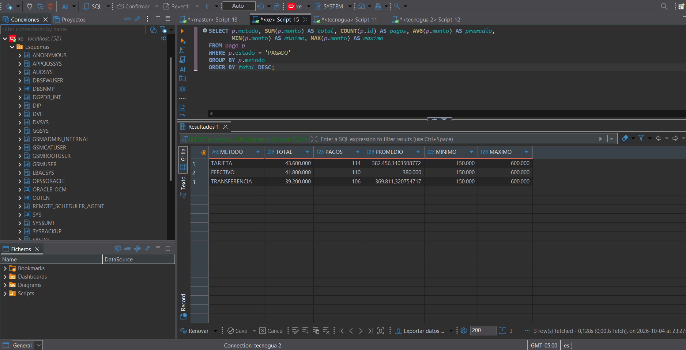

*Figura 65. Resultado de la consulta G02 en Oracle.*

| Registro de ejecución | |
|---|---|
| Filas obtenidas | |
| Tiempo de ejecución (ms) | |
| Observaciones | |

*Nota de sintaxis (Oracle):* La sentencia es idéntica en los cuatro motores y no requirió adaptaciones de sintaxis.

#### G03 — Recaudo mensual

**Situación de negocio.** Gerencia financiera quiere proyectar el flujo de caja y para eso necesita los ingresos mes a mes. El informe se presenta ante un comité que revisa si hay meses de baja recaudación.

**Concepto de SQL.** Se agrupa por el **año y mes** de la fecha (formato `AAAA-MM`). La función para darle ese formato cambia entre motores (`DATE_FORMAT` en MySQL, `TO_CHAR` en PostgreSQL y Oracle, `CONVERT(CHAR(7), fecha, 120)` en SQL Server), lo que hace de esta consulta un buen ejemplo de diferencias de dialecto.

**Resultado esperado.** Una fila por mes con pagos, ordenada cronológicamente.

##### G03 · MySQL

```sql
SELECT DATE_FORMAT(p.fecha, '%Y-%m') AS mes, COUNT(p.id) AS pagos, SUM(p.monto) AS recaudo
FROM pago p
WHERE p.estado = 'PAGADO'
GROUP BY DATE_FORMAT(p.fecha, '%Y-%m')
ORDER BY mes;
```

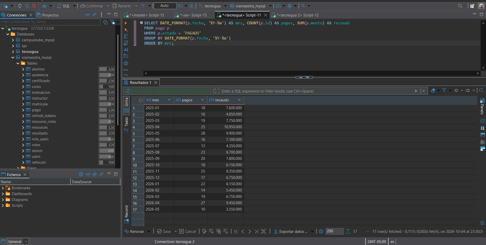

*Figura 66. Resultado de la consulta G03 en MySQL.*

| Registro de ejecución | |
|---|---|
| Filas obtenidas | |
| Tiempo de ejecución (ms) | |
| Observaciones | |

*Nota de sintaxis (MySQL):* Particularidades de sintaxis de este motor en esta consulta: `DATE_FORMAT()` para dar formato a fechas.

##### G03 · PostgreSQL

```sql
SELECT TO_CHAR(p.fecha, 'YYYY-MM') AS mes, COUNT(p.id) AS pagos, SUM(p.monto) AS recaudo
FROM pago p
WHERE p.estado = 'PAGADO'
GROUP BY TO_CHAR(p.fecha, 'YYYY-MM')
ORDER BY mes;
```

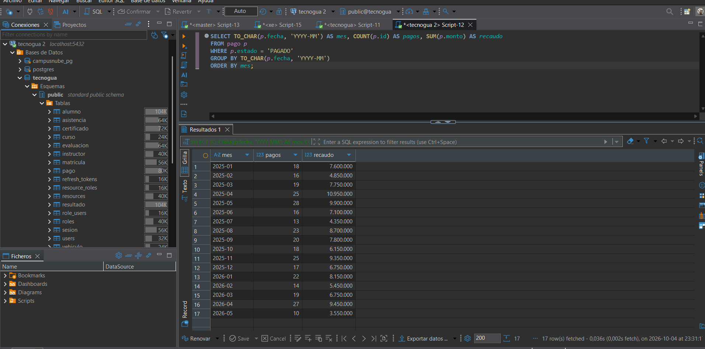

*Figura 67. Resultado de la consulta G03 en PostgreSQL.*

| Registro de ejecución | |
|---|---|
| Filas obtenidas | |
| Tiempo de ejecución (ms) | |
| Observaciones | |

*Nota de sintaxis (PostgreSQL):* Particularidades de sintaxis de este motor en esta consulta: `TO_CHAR()` para dar formato a fechas.

##### G03 · SQL Server

```sql
SELECT CONVERT(CHAR(7), p.fecha, 120) AS mes, COUNT(p.id) AS pagos, SUM(p.monto) AS recaudo
FROM pago p
WHERE p.estado = 'PAGADO'
GROUP BY CONVERT(CHAR(7), p.fecha, 120)
ORDER BY mes;
```

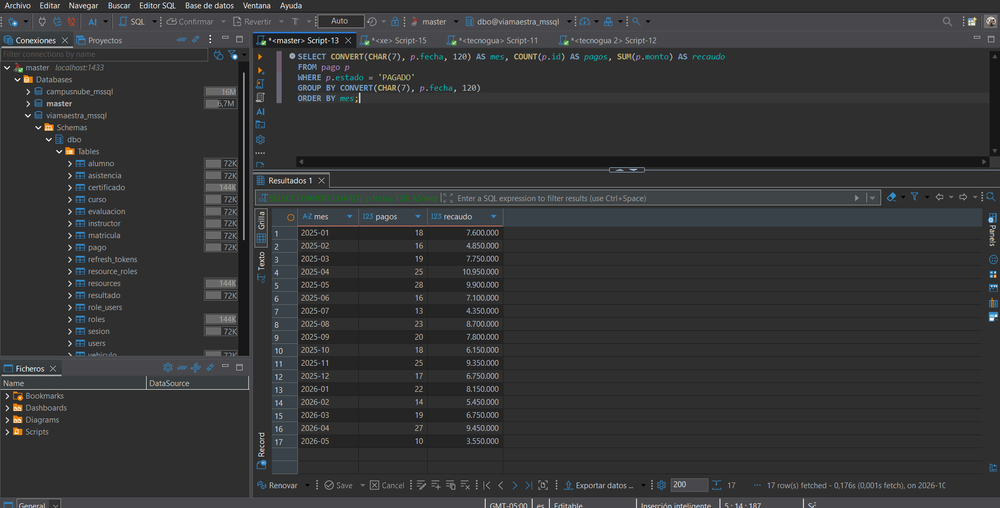

*Figura 68. Resultado de la consulta G03 en SQL Server.*

| Registro de ejecución | |
|---|---|
| Filas obtenidas | |
| Tiempo de ejecución (ms) | |
| Observaciones | |

*Nota de sintaxis (SQL Server):* Particularidades de sintaxis de este motor en esta consulta: `CONVERT()` para dar formato a fechas.

##### G03 · Oracle

```sql
SELECT TO_CHAR(p.fecha, 'YYYY-MM') AS mes, COUNT(p.id) AS pagos, SUM(p.monto) AS recaudo
FROM pago p
WHERE p.estado = 'PAGADO'
GROUP BY TO_CHAR(p.fecha, 'YYYY-MM')
ORDER BY mes;
```

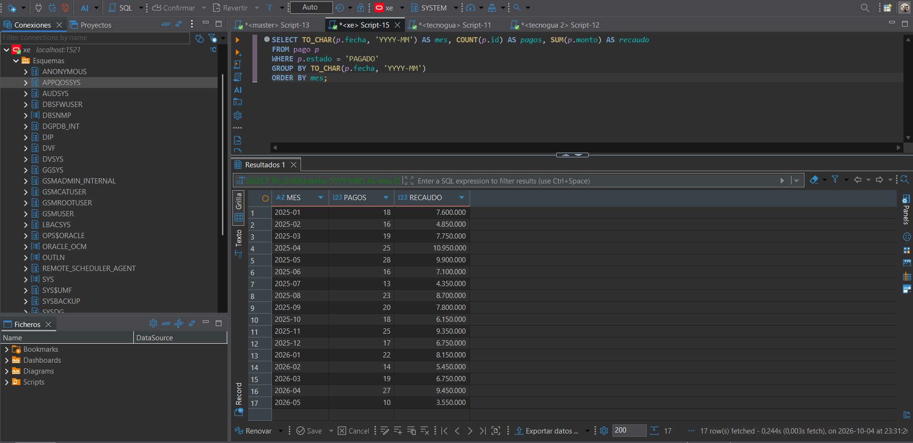

*Figura 69. Resultado de la consulta G03 en Oracle.*

| Registro de ejecución | |
|---|---|
| Filas obtenidas | |
| Tiempo de ejecución (ms) | |
| Observaciones | |

*Nota de sintaxis (Oracle):* Particularidades de sintaxis de este motor en esta consulta: `TO_CHAR()` para dar formato a fechas.

#### G04 — Sesiones por instructor y estado

**Situación de negocio.** Coordinación necesita ver la carga de trabajo de cada instructor: cuántas sesiones realizó, cuántas tiene programadas y cuántas se cancelaron, para repartir mejor la agenda.

**Concepto de SQL.** `GROUP BY` sobre instructor y estado de la sesión con `COUNT()`. Se necesita un `JOIN` entre instructores y sesiones para mostrar el nombre en lugar del id.

**Resultado esperado.** Un mismo instructor puede aparecer en varias filas (una por estado). La suma por instructor debe coincidir con sus sesiones totales.

##### G04 · MySQL

```sql
SELECT i.nombre AS instructor, s.estado, COUNT(s.id) AS sesiones
FROM sesion s
JOIN instructor i ON i.id = s.instructor_id
GROUP BY i.id, i.nombre, s.estado
ORDER BY instructor, s.estado;
```

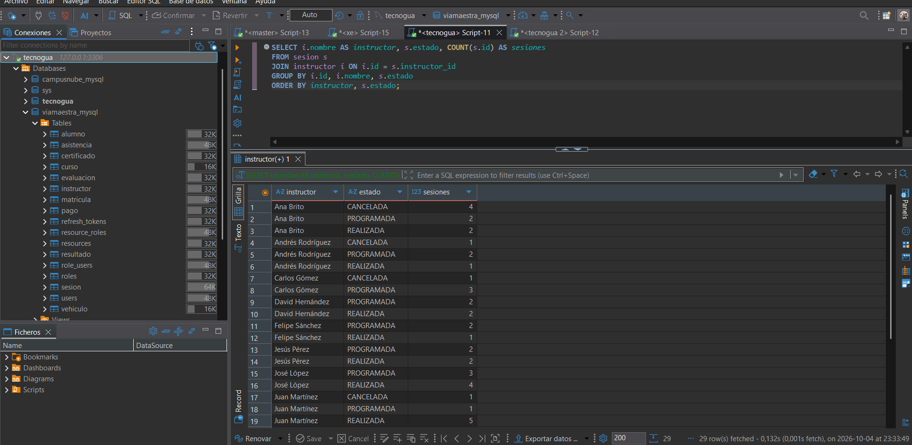

*Figura 70. Resultado de la consulta G04 en MySQL.*

| Registro de ejecución | |
|---|---|
| Filas obtenidas | |
| Tiempo de ejecución (ms) | |
| Observaciones | |

*Nota de sintaxis (MySQL):* La sentencia es idéntica en los cuatro motores y no requirió adaptaciones de sintaxis.

##### G04 · PostgreSQL

```sql
SELECT i.nombre AS instructor, s.estado, COUNT(s.id) AS sesiones
FROM sesion s
JOIN instructor i ON i.id = s.instructor_id
GROUP BY i.id, i.nombre, s.estado
ORDER BY instructor, s.estado;
```

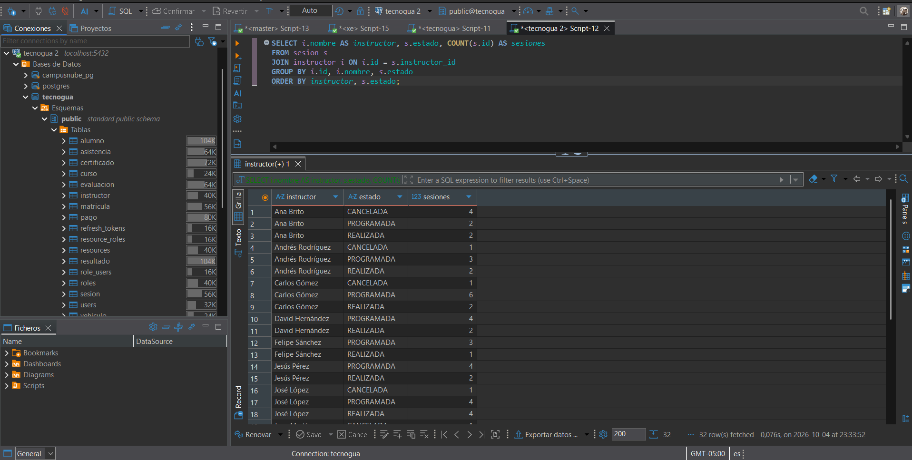

*Figura 71. Resultado de la consulta G04 en PostgreSQL.*

| Registro de ejecución | |
|---|---|
| Filas obtenidas | |
| Tiempo de ejecución (ms) | |
| Observaciones | |

*Nota de sintaxis (PostgreSQL):* La sentencia es idéntica en los cuatro motores y no requirió adaptaciones de sintaxis.

##### G04 · SQL Server

```sql
SELECT i.nombre AS instructor, s.estado, COUNT(s.id) AS sesiones
FROM sesion s
JOIN instructor i ON i.id = s.instructor_id
GROUP BY i.id, i.nombre, s.estado
ORDER BY instructor, s.estado;
```

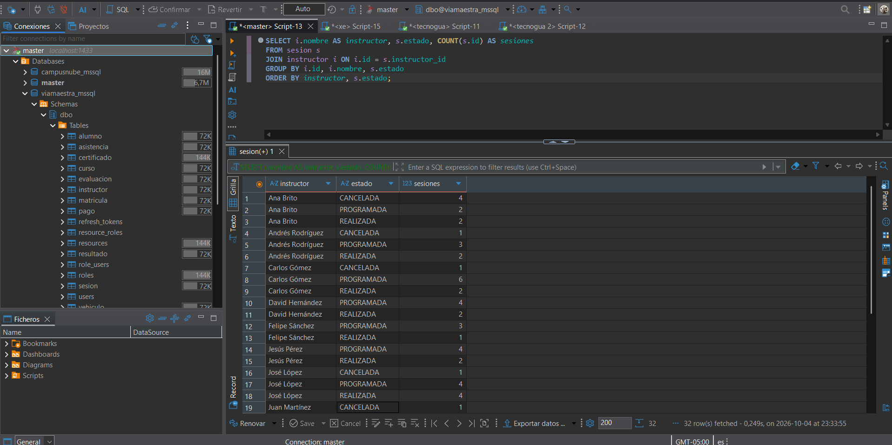

*Figura 72. Resultado de la consulta G04 en SQL Server.*

| Registro de ejecución | |
|---|---|
| Filas obtenidas | |
| Tiempo de ejecución (ms) | |
| Observaciones | |

*Nota de sintaxis (SQL Server):* La sentencia es idéntica en los cuatro motores y no requirió adaptaciones de sintaxis.

##### G04 · Oracle

```sql
SELECT i.nombre AS instructor, s.estado, COUNT(s.id) AS sesiones
FROM sesion s
JOIN instructor i ON i.id = s.instructor_id
GROUP BY i.id, i.nombre, s.estado
ORDER BY instructor, s.estado;
```

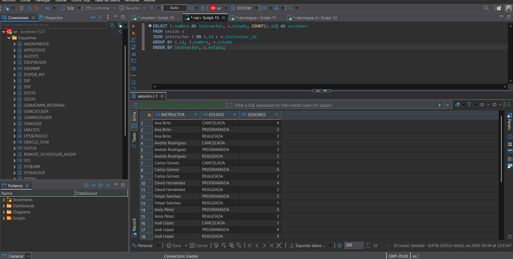

*Figura 73. Resultado de la consulta G04 en Oracle.*

| Registro de ejecución | |
|---|---|
| Filas obtenidas | |
| Tiempo de ejecución (ms) | |
| Observaciones | |

*Nota de sintaxis (Oracle):* La sentencia es idéntica en los cuatro motores y no requirió adaptaciones de sintaxis.

#### G05 — Alumnos por estado documental y actividad

**Situación de negocio.** Secretaría quiere medir cuántos alumnos tienen la documentación completa o pendiente, separando los activos de los inactivos, porque los inactivos con documentos pendientes pueden depurarse del sistema.

**Concepto de SQL.** `GROUP BY` con dos columnas de estado sobre una sola tabla, sin `JOIN`. Sirve como tabla de contingencia sencilla.

**Resultado esperado.** La suma de la columna de conteo debe ser 220, el total de alumnos.

##### G05 · MySQL

```sql
SELECT a.estado_documental, a.is_active, COUNT(*) AS alumnos
FROM alumno a
GROUP BY a.estado_documental, a.is_active
ORDER BY a.estado_documental, a.is_active;
```

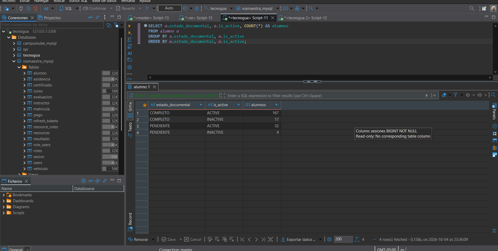

*Figura 74. Resultado de la consulta G05 en MySQL.*

| Registro de ejecución | |
|---|---|
| Filas obtenidas | |
| Tiempo de ejecución (ms) | |
| Observaciones | |

*Nota de sintaxis (MySQL):* La sentencia es idéntica en los cuatro motores y no requirió adaptaciones de sintaxis.

##### G05 · PostgreSQL

```sql
SELECT a.estado_documental, a.is_active, COUNT(*) AS alumnos
FROM alumno a
GROUP BY a.estado_documental, a.is_active
ORDER BY a.estado_documental, a.is_active;
```

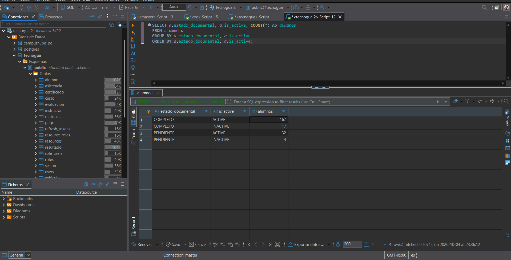

*Figura 75. Resultado de la consulta G05 en PostgreSQL.*

| Registro de ejecución | |
|---|---|
| Filas obtenidas | |
| Tiempo de ejecución (ms) | |
| Observaciones | |

*Nota de sintaxis (PostgreSQL):* La sentencia es idéntica en los cuatro motores y no requirió adaptaciones de sintaxis.

##### G05 · SQL Server

```sql
SELECT a.estado_documental, a.is_active, COUNT(*) AS alumnos
FROM alumno a
GROUP BY a.estado_documental, a.is_active
ORDER BY a.estado_documental, a.is_active;
```

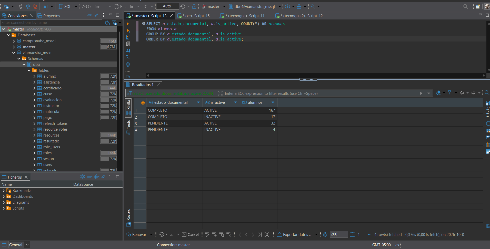

*Figura 76. Resultado de la consulta G05 en SQL Server.*

| Registro de ejecución | |
|---|---|
| Filas obtenidas | |
| Tiempo de ejecución (ms) | |
| Observaciones | |

*Nota de sintaxis (SQL Server):* La sentencia es idéntica en los cuatro motores y no requirió adaptaciones de sintaxis.

##### G05 · Oracle

```sql
SELECT a.estado_documental, a.is_active, COUNT(*) AS alumnos
FROM alumno a
GROUP BY a.estado_documental, a.is_active
ORDER BY a.estado_documental, a.is_active;
```

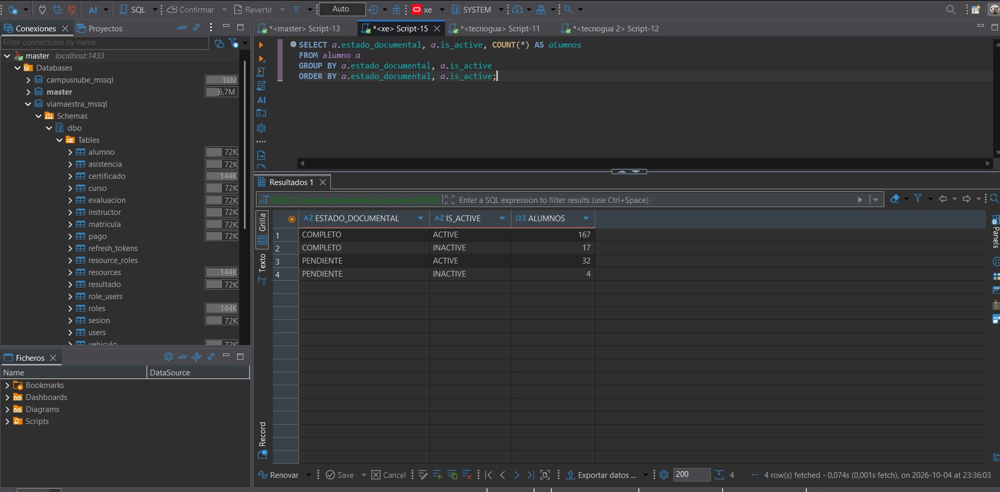

*Figura 77. Resultado de la consulta G05 en Oracle.*

| Registro de ejecución | |
|---|---|
| Filas obtenidas | |
| Tiempo de ejecución (ms) | |
| Observaciones | |

*Nota de sintaxis (Oracle):* La sentencia es idéntica en los cuatro motores y no requirió adaptaciones de sintaxis.

#### G06 — Registros de asistencia por curso

**Situación de negocio.** La coordinación académica desea conocer cuántos registros de control de asistencia tiene cada curso, para verificar que todos se encuentren supervisados.

**Concepto de SQL.** `GROUP BY` sobre el curso con la función `COUNT()`, uniendo las tablas de asistencias, matrículas y cursos.

**Resultado esperado.** Se obtiene una fila por curso con el total de registros de asistencia, ordenadas de mayor a menor.

##### G06 · MySQL

```sql
SELECT c.nombre AS curso, COUNT(x.id) AS registros
FROM asistencia x
JOIN matricula m ON m.id = x.matricula_id
JOIN curso c ON c.id = m.oferta_id
GROUP BY c.id, c.nombre
ORDER BY registros DESC, c.nombre;
```

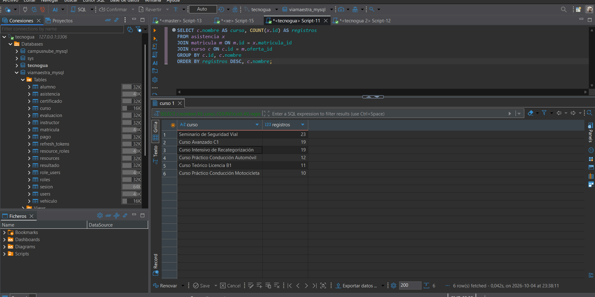

*Figura 78. Resultado de la consulta G06 en MySQL.*

| Registro de ejecución | |
|---|---|
| Filas obtenidas | |
| Tiempo de ejecución (ms) | |
| Observaciones | |

*Nota de sintaxis (MySQL):* La sentencia es idéntica en los cuatro motores y no requirió adaptaciones de sintaxis.

##### G06 · PostgreSQL

```sql
SELECT c.nombre AS curso, COUNT(x.id) AS registros
FROM asistencia x
JOIN matricula m ON m.id = x.matricula_id
JOIN curso c ON c.id = m.oferta_id
GROUP BY c.id, c.nombre
ORDER BY registros DESC, c.nombre;
```

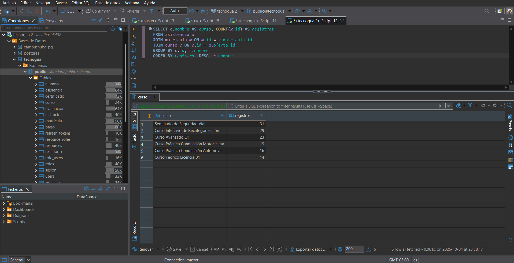

*Figura 79. Resultado de la consulta G06 en PostgreSQL.*

| Registro de ejecución | |
|---|---|
| Filas obtenidas | |
| Tiempo de ejecución (ms) | |
| Observaciones | |

*Nota de sintaxis (PostgreSQL):* La sentencia es idéntica en los cuatro motores y no requirió adaptaciones de sintaxis.

##### G06 · SQL Server

```sql
SELECT c.nombre AS curso, COUNT(x.id) AS registros
FROM asistencia x
JOIN matricula m ON m.id = x.matricula_id
JOIN curso c ON c.id = m.oferta_id
GROUP BY c.id, c.nombre
ORDER BY registros DESC, c.nombre;
```

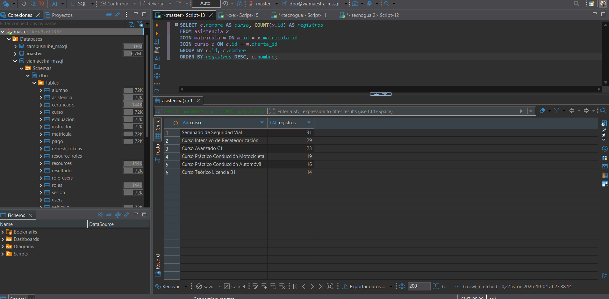

*Figura 80. Resultado de la consulta G06 en SQL Server.*

| Registro de ejecución | |
|---|---|
| Filas obtenidas | |
| Tiempo de ejecución (ms) | |
| Observaciones | |

*Nota de sintaxis (SQL Server):* La sentencia es idéntica en los cuatro motores y no requirió adaptaciones de sintaxis.

##### G06 · Oracle

```sql
SELECT c.nombre AS curso, COUNT(x.id) AS registros
FROM asistencia x
JOIN matricula m ON m.id = x.matricula_id
JOIN curso c ON c.id = m.oferta_id
GROUP BY c.id, c.nombre
ORDER BY registros DESC, c.nombre;
```

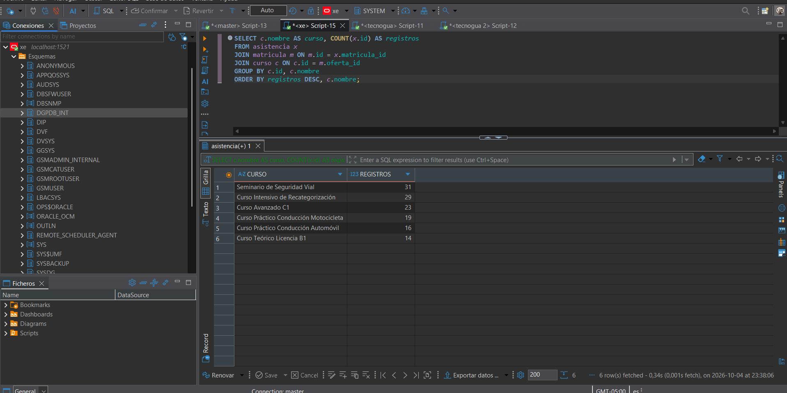

*Figura 81. Resultado de la consulta G06 en Oracle.*

| Registro de ejecución | |
|---|---|
| Filas obtenidas | |
| Tiempo de ejecución (ms) | |
| Observaciones | |

*Nota de sintaxis (Oracle):* La sentencia es idéntica en los cuatro motores y no requirió adaptaciones de sintaxis.

---

### 4. HAVING — filtro sobre grupos

`HAVING` es el `WHERE` de los grupos: filtra después de agrupar, y por eso puede usar funciones de agregación.

#### H01 — Cursos con más de 40 matrículas

**Situación de negocio.** Dirección quiere identificar los cursos más demandados para ampliar cupos o abrir nuevos grupos, pero solo le interesan los que superan un umbral de matrículas, no todo el catálogo.

**Concepto de SQL.** `HAVING` filtra **después** de agrupar, a diferencia de `WHERE`, que filtra antes. Aquí se conservan solo los grupos cuyo `COUNT(*)` supera 40; un `WHERE` no puede usar funciones de agregación.

**Resultado esperado.** Todos los cursos mostrados deben tener un conteo mayor a 40. Si se quita el `HAVING`, aparecen también los cursos con menos matrículas.

##### H01 · MySQL

```sql
SELECT c.nombre AS curso, COUNT(m.id) AS matriculas
FROM curso c
JOIN matricula m ON m.oferta_id = c.id
GROUP BY c.id, c.nombre
HAVING COUNT(m.id) > 40
ORDER BY matriculas DESC;
```

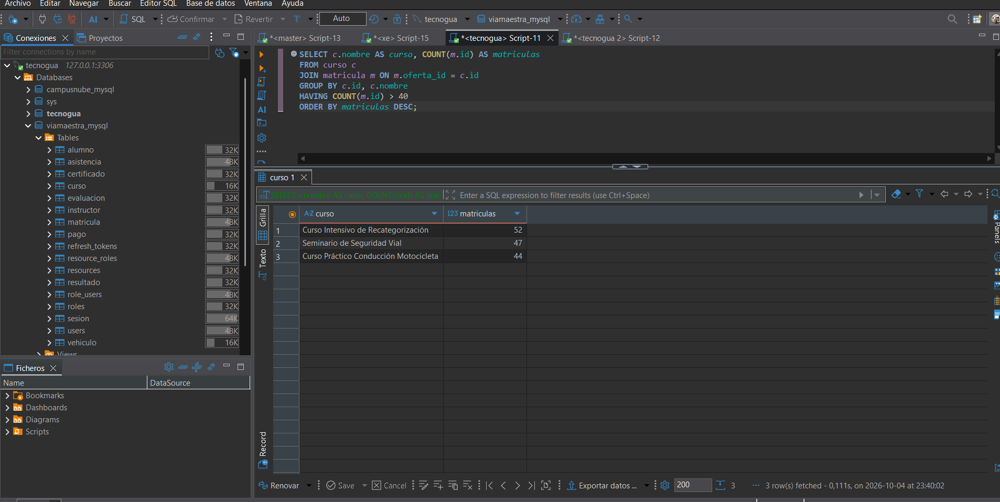

*Figura 82. Resultado de la consulta H01 en MySQL.*

| Registro de ejecución | |
|---|---|
| Filas obtenidas | |
| Tiempo de ejecución (ms) | |
| Observaciones | |

*Nota de sintaxis (MySQL):* La sentencia es idéntica en los cuatro motores y no requirió adaptaciones de sintaxis.

##### H01 · PostgreSQL

```sql
SELECT c.nombre AS curso, COUNT(m.id) AS matriculas
FROM curso c
JOIN matricula m ON m.oferta_id = c.id
GROUP BY c.id, c.nombre
HAVING COUNT(m.id) > 40
ORDER BY matriculas DESC;
```

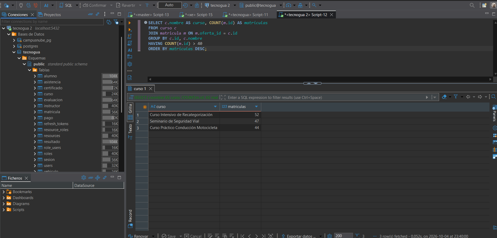

*Figura 83. Resultado de la consulta H01 en PostgreSQL.*

| Registro de ejecución | |
|---|---|
| Filas obtenidas | |
| Tiempo de ejecución (ms) | |
| Observaciones | |

*Nota de sintaxis (PostgreSQL):* La sentencia es idéntica en los cuatro motores y no requirió adaptaciones de sintaxis.

##### H01 · SQL Server

```sql
SELECT c.nombre AS curso, COUNT(m.id) AS matriculas
FROM curso c
JOIN matricula m ON m.oferta_id = c.id
GROUP BY c.id, c.nombre
HAVING COUNT(m.id) > 40
ORDER BY matriculas DESC;
```

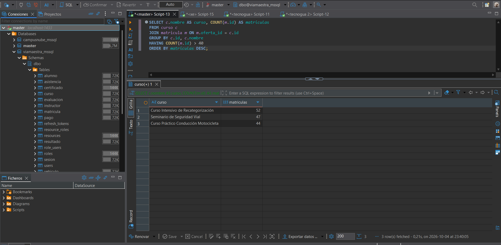

*Figura 84. Resultado de la consulta H01 en SQL Server.*

| Registro de ejecución | |
|---|---|
| Filas obtenidas | |
| Tiempo de ejecución (ms) | |
| Observaciones | |

*Nota de sintaxis (SQL Server):* La sentencia es idéntica en los cuatro motores y no requirió adaptaciones de sintaxis.

##### H01 · Oracle

```sql
SELECT c.nombre AS curso, COUNT(m.id) AS matriculas
FROM curso c
JOIN matricula m ON m.oferta_id = c.id
GROUP BY c.id, c.nombre
HAVING COUNT(m.id) > 40
ORDER BY matriculas DESC;
```

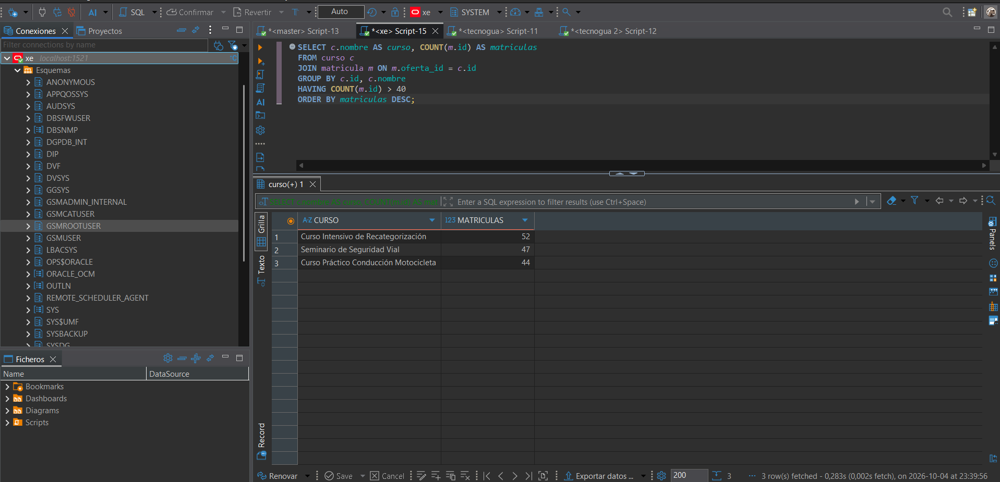

*Figura 85. Resultado de la consulta H01 en Oracle.*

| Registro de ejecución | |
|---|---|
| Filas obtenidas | |
| Tiempo de ejecución (ms) | |
| Observaciones | |

*Nota de sintaxis (Oracle):* La sentencia es idéntica en los cuatro motores y no requirió adaptaciones de sintaxis.

#### H02 — Alumnos con 2 o más matrículas

**Situación de negocio.** Fidelización quiere premiar con un descuento a los alumnos que se han matriculado en varios cursos, y necesita la lista de quienes tienen dos o más matrículas.

**Concepto de SQL.** `GROUP BY` por alumno y `HAVING COUNT(*) >= 2`. Es la forma estándar de encontrar «repetidos» o «recurrentes» en una tabla relacionada.

**Resultado esperado.** Cada alumno mostrado debe tener un conteo de 2 o más. Ordenar por conteo descendente facilita ver primero a los más fieles.

##### H02 · MySQL

```sql
SELECT CONCAT(a.nombre, ' ', a.apellidos) AS alumno, COUNT(m.id) AS matriculas
FROM alumno a
JOIN matricula m ON m.estudiante_id = a.id
GROUP BY a.id, a.nombre, a.apellidos
HAVING COUNT(m.id) >= 2
ORDER BY matriculas DESC, alumno
LIMIT 20;
```

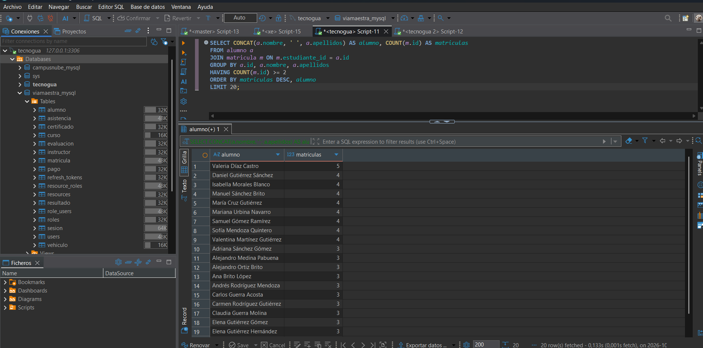

*Figura 86. Resultado de la consulta H02 en MySQL.*

| Registro de ejecución | |
|---|---|
| Filas obtenidas | |
| Tiempo de ejecución (ms) | |
| Observaciones | |

*Nota de sintaxis (MySQL):* Particularidades de sintaxis de este motor en esta consulta: `LIMIT n` para limitar filas; concatenación con `CONCAT()`.

##### H02 · PostgreSQL

```sql
SELECT a.nombre || ' ' || a.apellidos AS alumno, COUNT(m.id) AS matriculas
FROM alumno a
JOIN matricula m ON m.estudiante_id = a.id
GROUP BY a.id, a.nombre, a.apellidos
HAVING COUNT(m.id) >= 2
ORDER BY matriculas DESC, alumno
LIMIT 20;
```

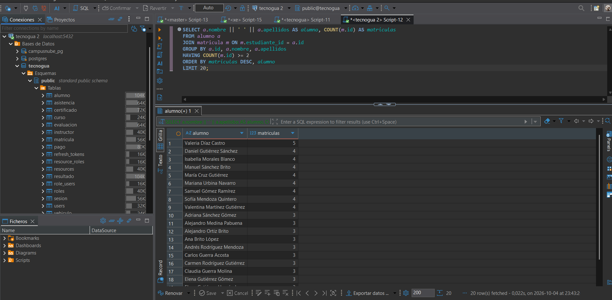

*Figura 87. Resultado de la consulta H02 en PostgreSQL.*

| Registro de ejecución | |
|---|---|
| Filas obtenidas | |
| Tiempo de ejecución (ms) | |
| Observaciones | |

*Nota de sintaxis (PostgreSQL):* Particularidades de sintaxis de este motor en esta consulta: `LIMIT n` para limitar filas; concatenación con `||`.

##### H02 · SQL Server

```sql
SELECT TOP 20 a.nombre + ' ' + a.apellidos AS alumno, COUNT(m.id) AS matriculas
FROM alumno a
JOIN matricula m ON m.estudiante_id = a.id
GROUP BY a.id, a.nombre, a.apellidos
HAVING COUNT(m.id) >= 2
ORDER BY matriculas DESC, alumno;
```

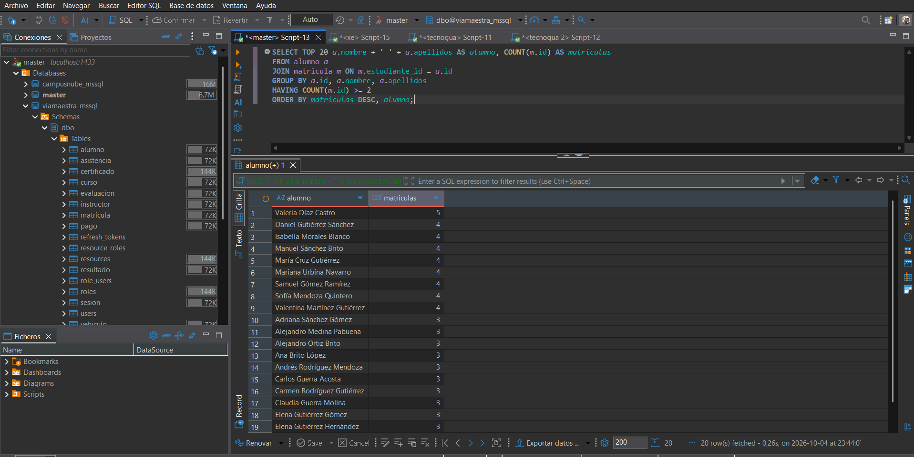

*Figura 88. Resultado de la consulta H02 en SQL Server.*

| Registro de ejecución | |
|---|---|
| Filas obtenidas | |
| Tiempo de ejecución (ms) | |
| Observaciones | |

*Nota de sintaxis (SQL Server):* Particularidades de sintaxis de este motor en esta consulta: `SELECT TOP n` para limitar filas; concatenación con `+`.

##### H02 · Oracle

```sql
SELECT a.nombre || ' ' || a.apellidos AS alumno, COUNT(m.id) AS matriculas
FROM alumno a
JOIN matricula m ON m.estudiante_id = a.id
GROUP BY a.id, a.nombre, a.apellidos
HAVING COUNT(m.id) >= 2
ORDER BY matriculas DESC, alumno
FETCH FIRST 20 ROWS ONLY;
```

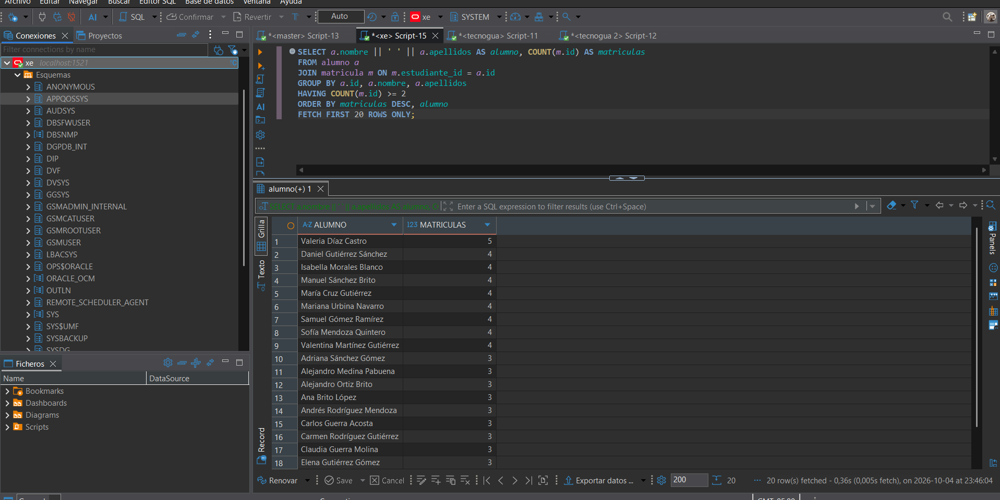

*Figura 89. Resultado de la consulta H02 en Oracle.*

| Registro de ejecución | |
|---|---|
| Filas obtenidas | |
| Tiempo de ejecución (ms) | |
| Observaciones | |

*Nota de sintaxis (Oracle):* Particularidades de sintaxis de este motor en esta consulta: `FETCH FIRST n ROWS ONLY` para limitar filas; concatenación con `||`.

#### H03 — Instructores con al menos 4 sesiones realizadas

**Situación de negocio.** Talento humano quiere un cuadro de honor con los instructores que ya han dictado más sesiones, para reconocerlos en la reunión de fin de período.

**Concepto de SQL.** `WHERE` y `HAVING` conviven: `WHERE` deja solo las sesiones realizadas (filtro por fila) y `HAVING` conserva los instructores con al menos 4 (filtro por grupo).

**Resultado esperado.** Los conteos mostrados corresponden solo a sesiones `REALIZADA`; las canceladas y programadas no suman.

##### H03 · MySQL

```sql
SELECT i.nombre AS instructor, COUNT(s.id) AS realizadas
FROM instructor i
JOIN sesion s ON s.instructor_id = i.id
WHERE s.estado = 'REALIZADA'
GROUP BY i.id, i.nombre
HAVING COUNT(s.id) >= 4
ORDER BY realizadas DESC, instructor;
```

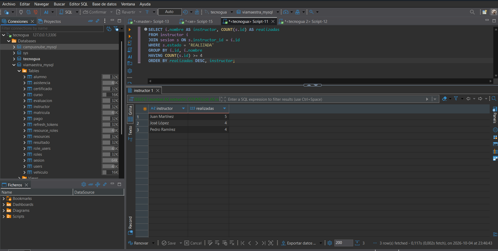

*Figura 90. Resultado de la consulta H03 en MySQL.*

| Registro de ejecución | |
|---|---|
| Filas obtenidas | |
| Tiempo de ejecución (ms) | |
| Observaciones | |

*Nota de sintaxis (MySQL):* La sentencia es idéntica en los cuatro motores y no requirió adaptaciones de sintaxis.

##### H03 · PostgreSQL

```sql
SELECT i.nombre AS instructor, COUNT(s.id) AS realizadas
FROM instructor i
JOIN sesion s ON s.instructor_id = i.id
WHERE s.estado = 'REALIZADA'
GROUP BY i.id, i.nombre
HAVING COUNT(s.id) >= 4
ORDER BY realizadas DESC, instructor;
```

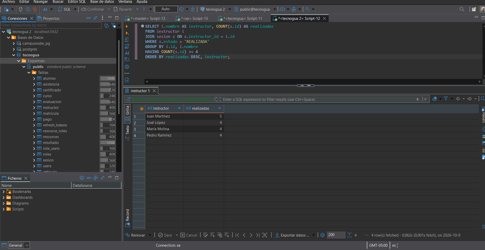

*Figura 91. Resultado de la consulta H03 en PostgreSQL.*

| Registro de ejecución | |
|---|---|
| Filas obtenidas | |
| Tiempo de ejecución (ms) | |
| Observaciones | |

*Nota de sintaxis (PostgreSQL):* La sentencia es idéntica en los cuatro motores y no requirió adaptaciones de sintaxis.

##### H03 · SQL Server

```sql
SELECT i.nombre AS instructor, COUNT(s.id) AS realizadas
FROM instructor i
JOIN sesion s ON s.instructor_id = i.id
WHERE s.estado = 'REALIZADA'
GROUP BY i.id, i.nombre
HAVING COUNT(s.id) >= 4
ORDER BY realizadas DESC, instructor;
```

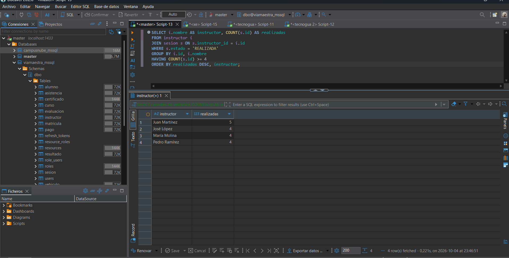

*Figura 92. Resultado de la consulta H03 en SQL Server.*

| Registro de ejecución | |
|---|---|
| Filas obtenidas | |
| Tiempo de ejecución (ms) | |
| Observaciones | |

*Nota de sintaxis (SQL Server):* La sentencia es idéntica en los cuatro motores y no requirió adaptaciones de sintaxis.

##### H03 · Oracle

```sql
SELECT i.nombre AS instructor, COUNT(s.id) AS realizadas
FROM instructor i
JOIN sesion s ON s.instructor_id = i.id
WHERE s.estado = 'REALIZADA'
GROUP BY i.id, i.nombre
HAVING COUNT(s.id) >= 4
ORDER BY realizadas DESC, instructor;
```

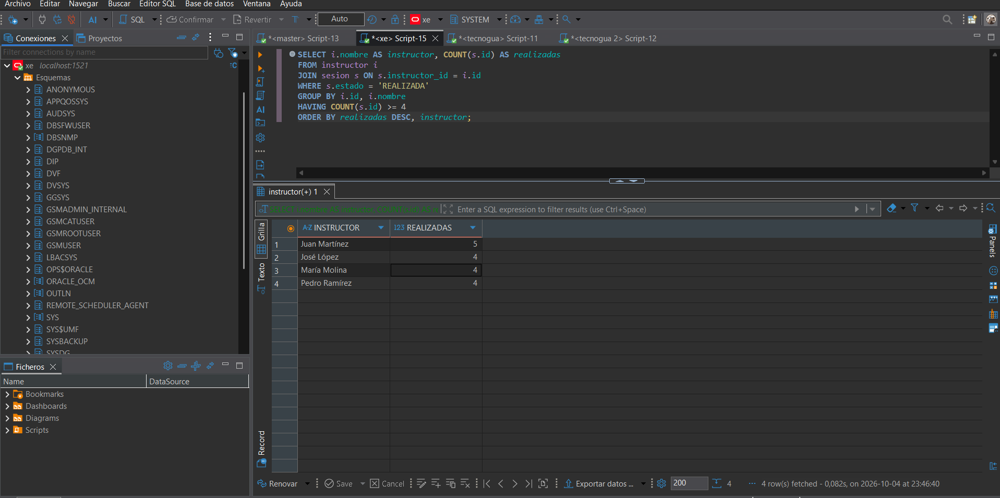

*Figura 93. Resultado de la consulta H03 en Oracle.*

| Registro de ejecución | |
|---|---|
| Filas obtenidas | |
| Tiempo de ejecución (ms) | |
| Observaciones | |

*Nota de sintaxis (Oracle):* La sentencia es idéntica en los cuatro motores y no requirió adaptaciones de sintaxis.

#### H04 — Matrículas con pagos pendientes

**Situación de negocio.** Cartera necesita identificar las matrículas que presentan pagos en estado pendiente y el monto adeudado, con el fin de priorizar las gestiones de cobro.

**Concepto de SQL.** `HAVING` aplicado sobre una función de agregación (`SUM(p.monto)`) tras un `JOIN` de tres tablas. El `WHERE` filtra primero los pagos pendientes (filas) y el `HAVING` filtra después los grupos cuyo monto supera el umbral.

**Resultado esperado.** Cada fila corresponde a una matrícula cuyo monto pendiente acumulado es superior a $300.000, ordenadas de mayor a menor deuda.

##### H04 · MySQL

```sql
SELECT m.id AS matricula, CONCAT(a.nombre, ' ', a.apellidos) AS alumno,
       COUNT(p.id) AS pagos_pendientes, SUM(p.monto) AS monto_pendiente
FROM matricula m
JOIN alumno a ON a.id = m.estudiante_id
JOIN pago p ON p.matricula_id = m.id
WHERE p.estado = 'PENDIENTE'
GROUP BY m.id, a.nombre, a.apellidos
HAVING SUM(p.monto) > 300000
ORDER BY monto_pendiente DESC, m.id
LIMIT 20;
```

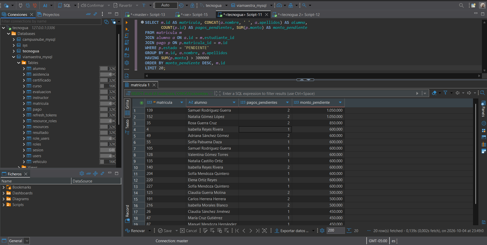

*Figura 94. Resultado de la consulta H04 en MySQL.*

| Registro de ejecución | |
|---|---|
| Filas obtenidas | |
| Tiempo de ejecución (ms) | |
| Observaciones | |

*Nota de sintaxis (MySQL):* Particularidades de sintaxis de este motor en esta consulta: `LIMIT n` para limitar filas; concatenación con `CONCAT()`.

##### H04 · PostgreSQL

```sql
SELECT m.id AS matricula, a.nombre || ' ' || a.apellidos AS alumno,
       COUNT(p.id) AS pagos_pendientes, SUM(p.monto) AS monto_pendiente
FROM matricula m
JOIN alumno a ON a.id = m.estudiante_id
JOIN pago p ON p.matricula_id = m.id
WHERE p.estado = 'PENDIENTE'
GROUP BY m.id, a.nombre, a.apellidos
HAVING SUM(p.monto) > 300000
ORDER BY monto_pendiente DESC, m.id
LIMIT 20;
```

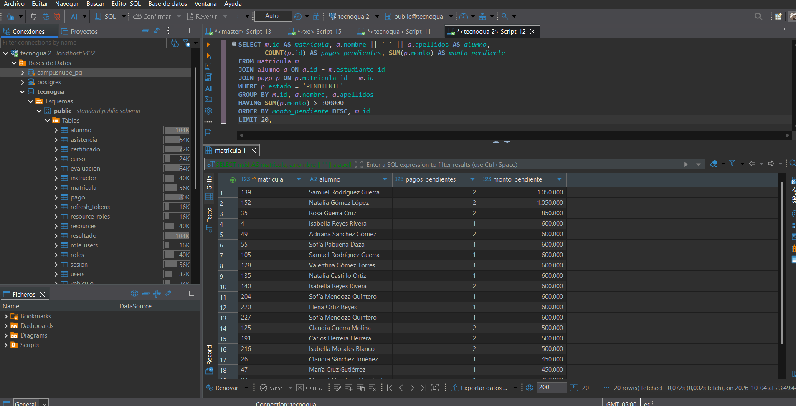

*Figura 95. Resultado de la consulta H04 en PostgreSQL.*

| Registro de ejecución | |
|---|---|
| Filas obtenidas | |
| Tiempo de ejecución (ms) | |
| Observaciones | |

*Nota de sintaxis (PostgreSQL):* Particularidades de sintaxis de este motor en esta consulta: `LIMIT n` para limitar filas; concatenación con `||`.

##### H04 · SQL Server

```sql
SELECT TOP 20 m.id AS matricula, a.nombre + ' ' + a.apellidos AS alumno,
       COUNT(p.id) AS pagos_pendientes, SUM(p.monto) AS monto_pendiente
FROM matricula m
JOIN alumno a ON a.id = m.estudiante_id
JOIN pago p ON p.matricula_id = m.id
WHERE p.estado = 'PENDIENTE'
GROUP BY m.id, a.nombre, a.apellidos
HAVING SUM(p.monto) > 300000
ORDER BY monto_pendiente DESC, m.id;
```

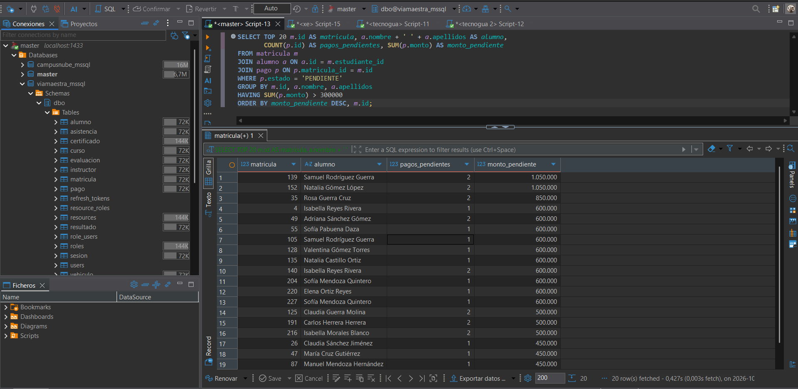

*Figura 96. Resultado de la consulta H04 en SQL Server.*

| Registro de ejecución | |
|---|---|
| Filas obtenidas | |
| Tiempo de ejecución (ms) | |
| Observaciones | |

*Nota de sintaxis (SQL Server):* Particularidades de sintaxis de este motor en esta consulta: `SELECT TOP n` para limitar filas; concatenación con `+`.

##### H04 · Oracle

```sql
SELECT m.id AS matricula, a.nombre || ' ' || a.apellidos AS alumno,
       COUNT(p.id) AS pagos_pendientes, SUM(p.monto) AS monto_pendiente
FROM matricula m
JOIN alumno a ON a.id = m.estudiante_id
JOIN pago p ON p.matricula_id = m.id
WHERE p.estado = 'PENDIENTE'
GROUP BY m.id, a.nombre, a.apellidos
HAVING SUM(p.monto) > 300000
ORDER BY monto_pendiente DESC, m.id
FETCH FIRST 20 ROWS ONLY;
```

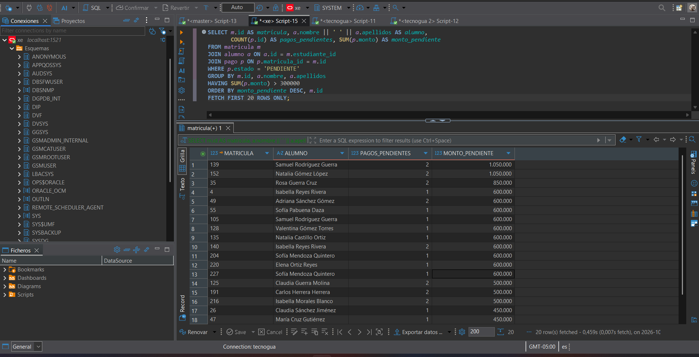

*Figura 97. Resultado de la consulta H04 en Oracle.*

| Registro de ejecución | |
|---|---|
| Filas obtenidas | |
| Tiempo de ejecución (ms) | |
| Observaciones | |

*Nota de sintaxis (Oracle):* Particularidades de sintaxis de este motor en esta consulta: `FETCH FIRST n ROWS ONLY` para limitar filas; concatenación con `||`.

#### H05 — Sesiones con 2 o más registros de asistencia

**Situación de negocio.** La coordinación académica desea identificar las sesiones con mayor volumen de control de asistencia, es decir, aquellas con dos o más registros, para dimensionar el seguimiento de cada clase.

**Concepto de SQL.** `HAVING COUNT(...) >= 2` filtra los grupos (sesiones) después de agrupar; un `WHERE` no podría usar la función de agregación.

**Resultado esperado.** Todas las sesiones listadas tienen dos o más registros de asistencia, ordenadas de mayor a menor número de registros.

##### H05 · MySQL

```sql
SELECT s.id AS sesion, s.fecha_inicio, COUNT(x.id) AS registros
FROM sesion s
JOIN asistencia x ON x.sesion_id = s.id
GROUP BY s.id, s.fecha_inicio
HAVING COUNT(x.id) >= 2
ORDER BY registros DESC, s.fecha_inicio;
```

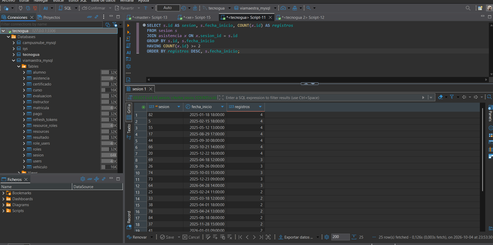

*Figura 98. Resultado de la consulta H05 en MySQL.*

| Registro de ejecución | |
|---|---|
| Filas obtenidas | |
| Tiempo de ejecución (ms) | |
| Observaciones | |

*Nota de sintaxis (MySQL):* La sentencia es idéntica en los cuatro motores y no requirió adaptaciones de sintaxis.

##### H05 · PostgreSQL

```sql
SELECT s.id AS sesion, s.fecha_inicio, COUNT(x.id) AS registros
FROM sesion s
JOIN asistencia x ON x.sesion_id = s.id
GROUP BY s.id, s.fecha_inicio
HAVING COUNT(x.id) >= 2
ORDER BY registros DESC, s.fecha_inicio;
```

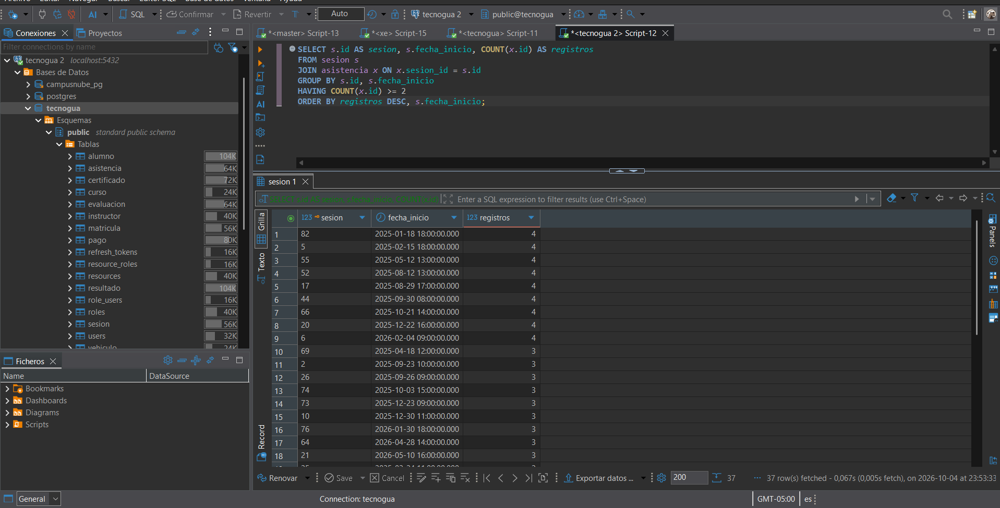

*Figura 99. Resultado de la consulta H05 en PostgreSQL.*

| Registro de ejecución | |
|---|---|
| Filas obtenidas | |
| Tiempo de ejecución (ms) | |
| Observaciones | |

*Nota de sintaxis (PostgreSQL):* La sentencia es idéntica en los cuatro motores y no requirió adaptaciones de sintaxis.

##### H05 · SQL Server

```sql
SELECT s.id AS sesion, s.fecha_inicio, COUNT(x.id) AS registros
FROM sesion s
JOIN asistencia x ON x.sesion_id = s.id
GROUP BY s.id, s.fecha_inicio
HAVING COUNT(x.id) >= 2
ORDER BY registros DESC, s.fecha_inicio;
```

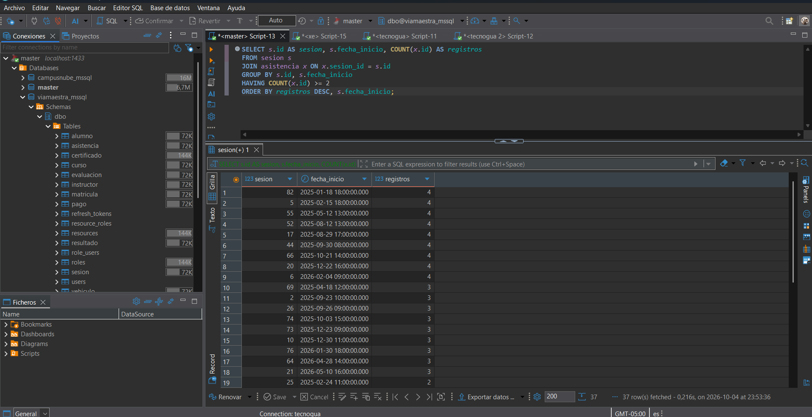

*Figura 100. Resultado de la consulta H05 en SQL Server.*

| Registro de ejecución | |
|---|---|
| Filas obtenidas | |
| Tiempo de ejecución (ms) | |
| Observaciones | |

*Nota de sintaxis (SQL Server):* La sentencia es idéntica en los cuatro motores y no requirió adaptaciones de sintaxis.

##### H05 · Oracle

```sql
SELECT s.id AS sesion, s.fecha_inicio, COUNT(x.id) AS registros
FROM sesion s
JOIN asistencia x ON x.sesion_id = s.id
GROUP BY s.id, s.fecha_inicio
HAVING COUNT(x.id) >= 2
ORDER BY registros DESC, s.fecha_inicio;
```

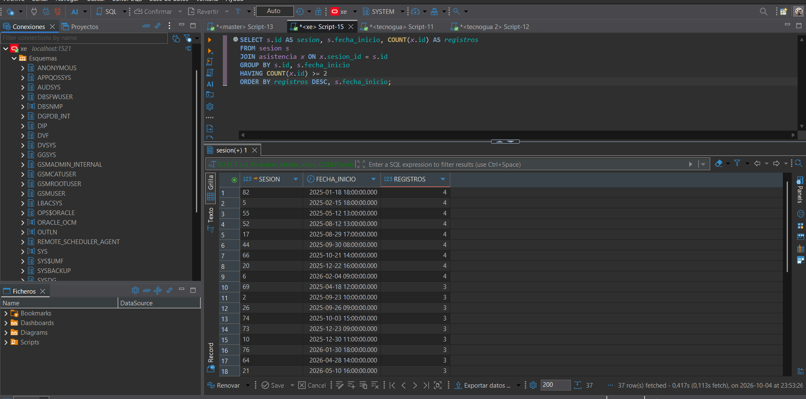

*Figura 101. Resultado de la consulta H05 en Oracle.*

| Registro de ejecución | |
|---|---|
| Filas obtenidas | |
| Tiempo de ejecución (ms) | |
| Observaciones | |

*Nota de sintaxis (Oracle):* La sentencia es idéntica en los cuatro motores y no requirió adaptaciones de sintaxis.

#### H06 — Meses con recaudo superior a 7.000.000

**Situación de negocio.** Gerencia financiera quiere resaltar los meses de mayor ingreso, es decir, aquellos en los que el recaudo superó los $7.000.000, para cruzarlos con las campañas de mercadeo realizadas en esas fechas.

**Concepto de SQL.** Se agrupa por año-mes y se filtra con `HAVING SUM(monto) > 15000000`. Es la versión mensual del filtro por umbral de la consulta H01.

**Resultado esperado.** Solo aparecen los meses con recaudo superior al umbral, ordenados del mayor al menor.

##### H06 · MySQL

```sql
SELECT DATE_FORMAT(p.fecha, '%Y-%m') AS mes, SUM(p.monto) AS recaudo
FROM pago p
WHERE p.estado = 'PAGADO'
GROUP BY DATE_FORMAT(p.fecha, '%Y-%m')
HAVING SUM(p.monto) > 7000000
ORDER BY recaudo DESC;
```

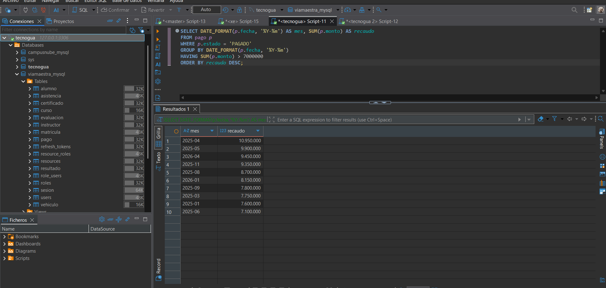

*Figura 102. Resultado de la consulta H06 en MySQL.*

| Registro de ejecución | |
|---|---|
| Filas obtenidas | |
| Tiempo de ejecución (ms) | |
| Observaciones | |

*Nota de sintaxis (MySQL):* Particularidades de sintaxis de este motor en esta consulta: `DATE_FORMAT()` para dar formato a fechas.

##### H06 · PostgreSQL

```sql
SELECT TO_CHAR(p.fecha, 'YYYY-MM') AS mes, SUM(p.monto) AS recaudo
FROM pago p
WHERE p.estado = 'PAGADO'
GROUP BY TO_CHAR(p.fecha, 'YYYY-MM')
HAVING SUM(p.monto) > 7000000
ORDER BY recaudo DESC;
```

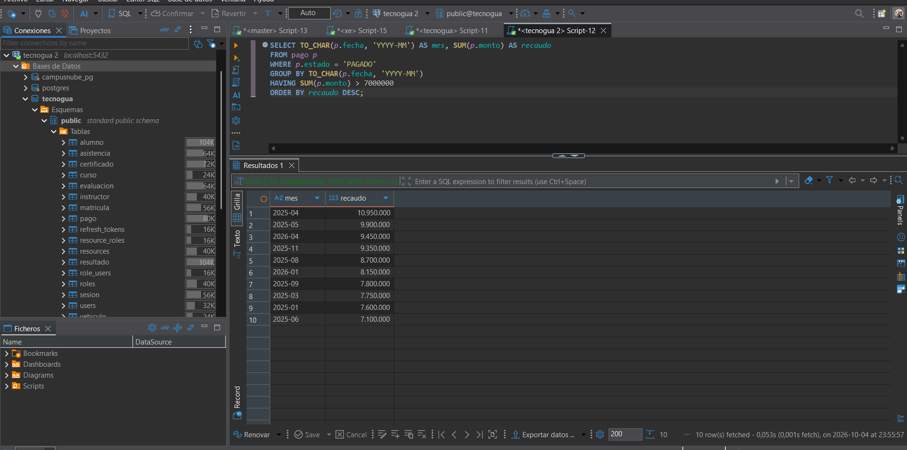

*Figura 103. Resultado de la consulta H06 en PostgreSQL.*

| Registro de ejecución | |
|---|---|
| Filas obtenidas | |
| Tiempo de ejecución (ms) | |
| Observaciones | |

*Nota de sintaxis (PostgreSQL):* Particularidades de sintaxis de este motor en esta consulta: `TO_CHAR()` para dar formato a fechas.

##### H06 · SQL Server

```sql
SELECT CONVERT(CHAR(7), p.fecha, 120) AS mes, SUM(p.monto) AS recaudo
FROM pago p
WHERE p.estado = 'PAGADO'
GROUP BY CONVERT(CHAR(7), p.fecha, 120)
HAVING SUM(p.monto) > 7000000
ORDER BY recaudo DESC;
```

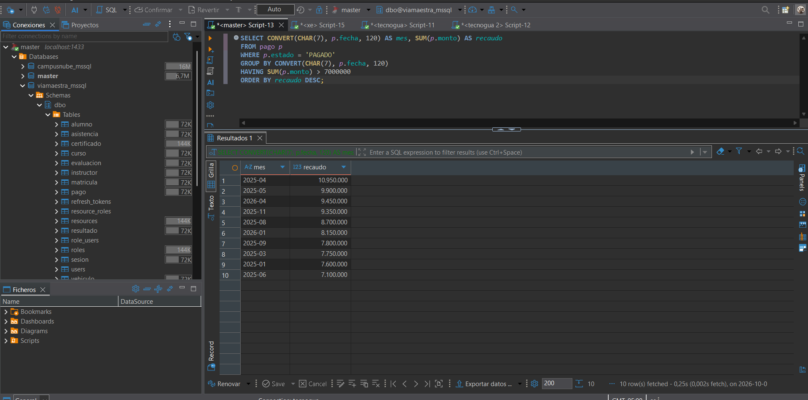

*Figura 104. Resultado de la consulta H06 en SQL Server.*

| Registro de ejecución | |
|---|---|
| Filas obtenidas | |
| Tiempo de ejecución (ms) | |
| Observaciones | |

*Nota de sintaxis (SQL Server):* Particularidades de sintaxis de este motor en esta consulta: `CONVERT()` para dar formato a fechas.

##### H06 · Oracle

```sql
SELECT TO_CHAR(p.fecha, 'YYYY-MM') AS mes, SUM(p.monto) AS recaudo
FROM pago p
WHERE p.estado = 'PAGADO'
GROUP BY TO_CHAR(p.fecha, 'YYYY-MM')
HAVING SUM(p.monto) > 7000000
ORDER BY recaudo DESC;
```

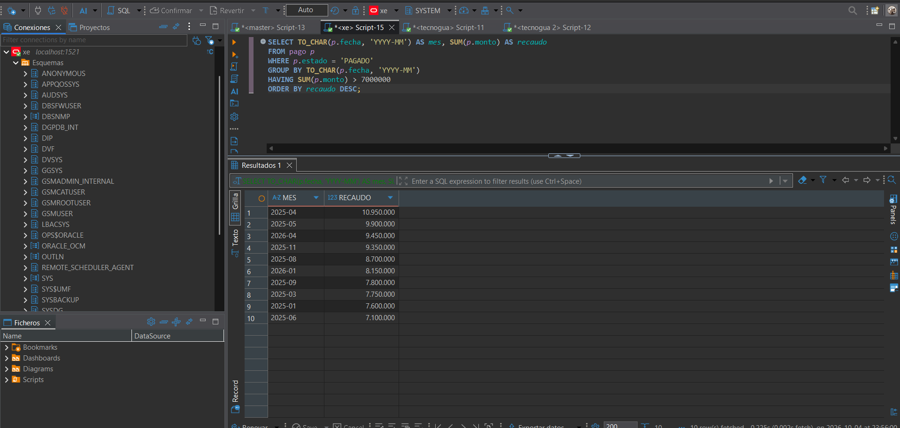

*Figura 105. Resultado de la consulta H06 en Oracle.*

| Registro de ejecución | |
|---|---|
| Filas obtenidas | |
| Tiempo de ejecución (ms) | |
| Observaciones | |

*Nota de sintaxis (Oracle):* Particularidades de sintaxis de este motor en esta consulta: `TO_CHAR()` para dar formato a fechas.

---

### 5. ORDER BY — ordenamiento

`ORDER BY` define el orden de las filas. Admite varios criterios, orden ascendente y descendente, posición de columna y expresiones `CASE`. Aquí también aparece la mayor diferencia entre motores: cómo limitar el número de filas.

#### O01 — Alumnos ordenados por apellido y nombre (ASC)

**Situación de negocio.** Secretaría necesita entregar al área académica el listado oficial de alumnos en orden alfabético, primero por apellido y, si dos alumnos comparten apellido, por nombre.

**Concepto de SQL.** `ORDER BY` con dos criterios; el segundo solo actúa como desempate del primero. `ASC` es el orden por defecto y se escribe de forma explícita por claridad.

**Resultado esperado.** Los apellidos deben aparecer de la A a la Z. Los alumnos con igual apellido se ordenan entre sí por nombre.

##### O01 · MySQL

```sql
SELECT a.id, a.apellidos, a.nombre, a.correo
FROM alumno a
ORDER BY a.apellidos ASC, a.nombre ASC
LIMIT 20;
```

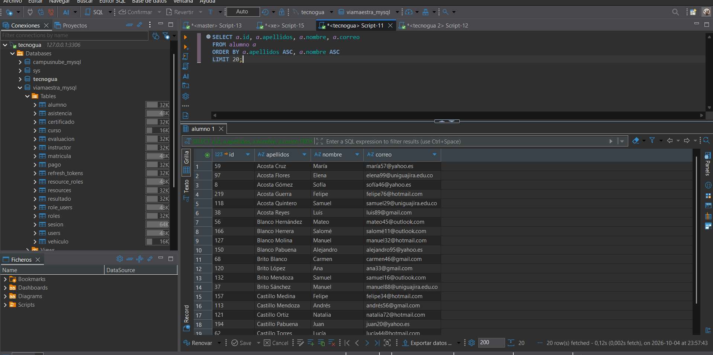

*Figura 106. Resultado de la consulta O01 en MySQL.*

| Registro de ejecución | |
|---|---|
| Filas obtenidas | |
| Tiempo de ejecución (ms) | |
| Observaciones | |

*Nota de sintaxis (MySQL):* Particularidades de sintaxis de este motor en esta consulta: `LIMIT n` para limitar filas.

##### O01 · PostgreSQL

```sql
SELECT a.id, a.apellidos, a.nombre, a.correo
FROM alumno a
ORDER BY a.apellidos ASC, a.nombre ASC
LIMIT 20;
```

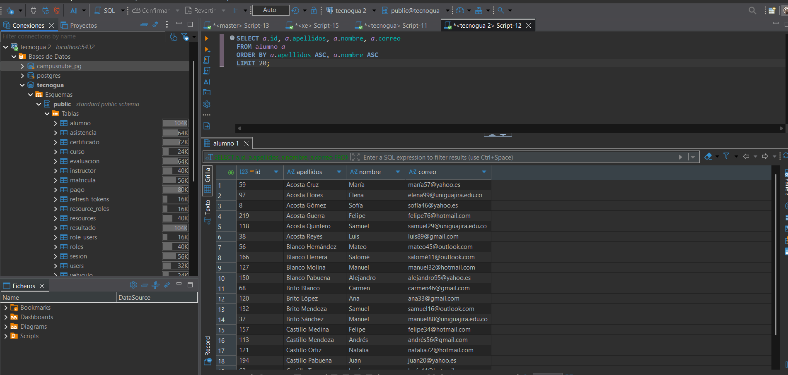

*Figura 107. Resultado de la consulta O01 en PostgreSQL.*

| Registro de ejecución | |
|---|---|
| Filas obtenidas | |
| Tiempo de ejecución (ms) | |
| Observaciones | |

*Nota de sintaxis (PostgreSQL):* Particularidades de sintaxis de este motor en esta consulta: `LIMIT n` para limitar filas.

##### O01 · SQL Server

```sql
SELECT TOP 20 a.id, a.apellidos, a.nombre, a.correo
FROM alumno a
ORDER BY a.apellidos ASC, a.nombre ASC;
```

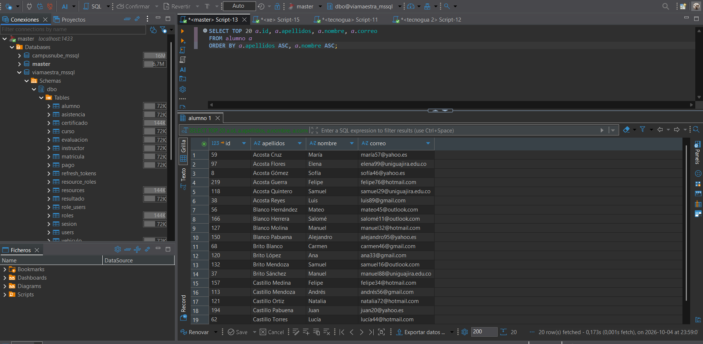

*Figura 108. Resultado de la consulta O01 en SQL Server.*

| Registro de ejecución | |
|---|---|
| Filas obtenidas | |
| Tiempo de ejecución (ms) | |
| Observaciones | |

*Nota de sintaxis (SQL Server):* Particularidades de sintaxis de este motor en esta consulta: `SELECT TOP n` para limitar filas.

##### O01 · Oracle

```sql
SELECT a.id, a.apellidos, a.nombre, a.correo
FROM alumno a
ORDER BY a.apellidos ASC, a.nombre ASC
FETCH FIRST 20 ROWS ONLY;
```

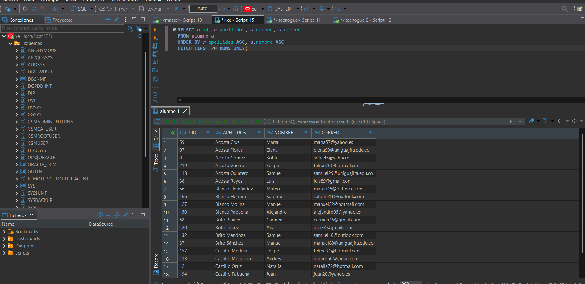

*Figura 109. Resultado de la consulta O01 en Oracle.*

| Registro de ejecución | |
|---|---|
| Filas obtenidas | |
| Tiempo de ejecución (ms) | |
| Observaciones | |

*Nota de sintaxis (Oracle):* Particularidades de sintaxis de este motor en esta consulta: `FETCH FIRST n ROWS ONLY` para limitar filas.

#### O02 — Los 10 pagos más altos (DESC con desempate)

**Situación de negocio.** Tesorería quiere conocer los diez mayores ingresos individuales y, si hay empate en el monto, mostrar primero el más reciente. Es información para el reporte de auditoría trimestral.

**Concepto de SQL.** `ORDER BY monto DESC, fecha DESC` más una cláusula para limitar filas. Limitar filas es **la** diferencia más visible entre motores: `LIMIT` (MySQL, PostgreSQL), `TOP` (SQL Server) y `FETCH FIRST` (Oracle).

**Resultado esperado.** Deben aparecer exactamente 10 filas con montos decrecientes. Con igual monto, la fecha más reciente va primero.

##### O02 · MySQL

```sql
SELECT p.id, p.matricula_id, p.metodo, p.monto, p.fecha
FROM pago p
WHERE p.estado = 'PAGADO'
ORDER BY p.monto DESC, p.fecha DESC
LIMIT 10;
```

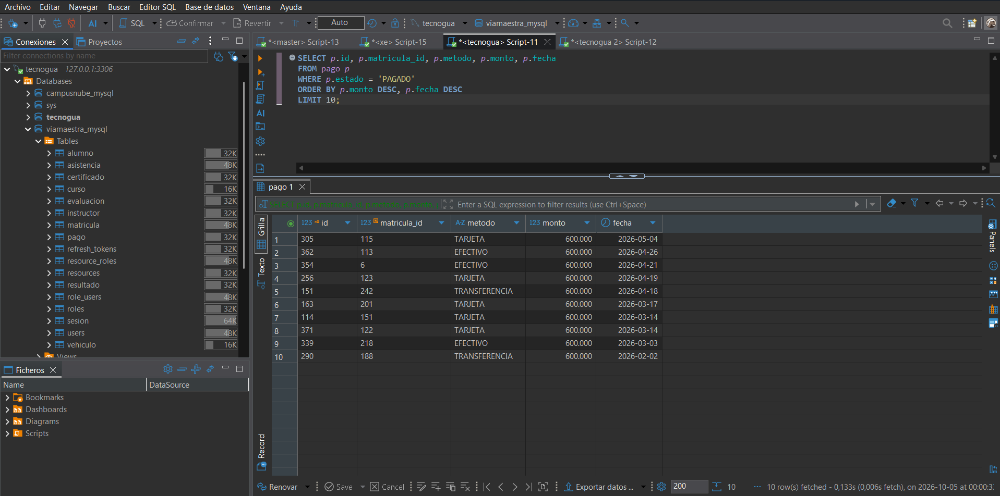

*Figura 110. Resultado de la consulta O02 en MySQL.*

| Registro de ejecución | |
|---|---|
| Filas obtenidas | |
| Tiempo de ejecución (ms) | |
| Observaciones | |

*Nota de sintaxis (MySQL):* Particularidades de sintaxis de este motor en esta consulta: `LIMIT n` para limitar filas.

##### O02 · PostgreSQL

```sql
SELECT p.id, p.matricula_id, p.metodo, p.monto, p.fecha
FROM pago p
WHERE p.estado = 'PAGADO'
ORDER BY p.monto DESC, p.fecha DESC
LIMIT 10;
```

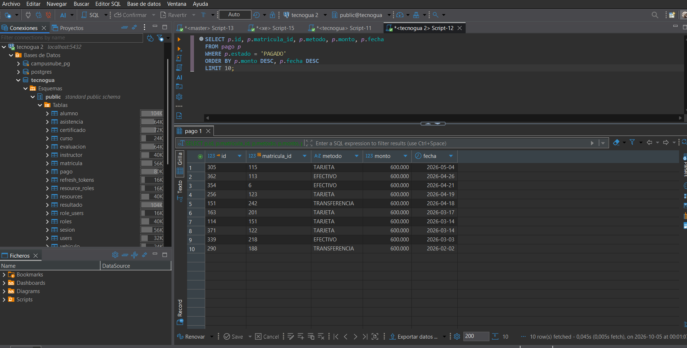

*Figura 111. Resultado de la consulta O02 en PostgreSQL.*

| Registro de ejecución | |
|---|---|
| Filas obtenidas | |
| Tiempo de ejecución (ms) | |
| Observaciones | |

*Nota de sintaxis (PostgreSQL):* Particularidades de sintaxis de este motor en esta consulta: `LIMIT n` para limitar filas.

##### O02 · SQL Server

```sql
SELECT TOP 10 p.id, p.matricula_id, p.metodo, p.monto, p.fecha
FROM pago p
WHERE p.estado = 'PAGADO'
ORDER BY p.monto DESC, p.fecha DESC;
```

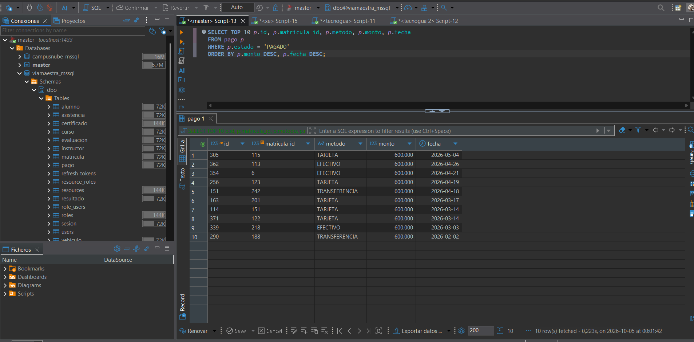

*Figura 112. Resultado de la consulta O02 en SQL Server.*

| Registro de ejecución | |
|---|---|
| Filas obtenidas | |
| Tiempo de ejecución (ms) | |
| Observaciones | |

*Nota de sintaxis (SQL Server):* Particularidades de sintaxis de este motor en esta consulta: `SELECT TOP n` para limitar filas.

##### O02 · Oracle

```sql
SELECT p.id, p.matricula_id, p.metodo, p.monto, p.fecha
FROM pago p
WHERE p.estado = 'PAGADO'
ORDER BY p.monto DESC, p.fecha DESC
FETCH FIRST 10 ROWS ONLY;
```

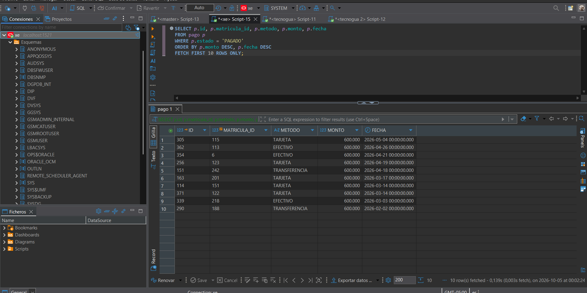

*Figura 113. Resultado de la consulta O02 en Oracle.*

| Registro de ejecución | |
|---|---|
| Filas obtenidas | |
| Tiempo de ejecución (ms) | |
| Observaciones | |

*Nota de sintaxis (Oracle):* Particularidades de sintaxis de este motor en esta consulta: `FETCH FIRST n ROWS ONLY` para limitar filas.

#### O03 — Matrículas más recientes primero

**Situación de negocio.** Admisiones quiere revisar las últimas matrículas registradas para confirmar que los datos se digitaron bien, viendo primero las más recientes.

**Concepto de SQL.** `ORDER BY fecha DESC` más un `JOIN` con `alumno` para mostrar el nombre en lugar del id. Ordenar de forma descendente y limitar filas es la manera típica de obtener «lo último».

**Resultado esperado.** La primera fila debe tener la fecha de matrícula más reciente de la tabla.

##### O03 · MySQL

```sql
SELECT m.id, CONCAT(a.nombre, ' ', a.apellidos) AS alumno, m.fecha, m.periodo, m.estado
FROM matricula m
JOIN alumno a ON a.id = m.estudiante_id
ORDER BY m.fecha DESC, m.id DESC
LIMIT 15;
```

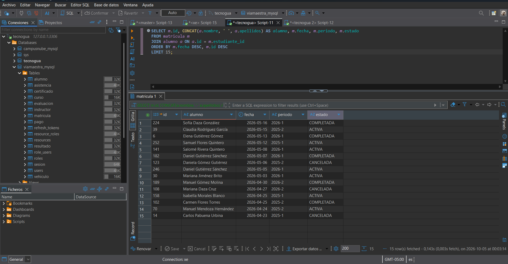

*Figura 114. Resultado de la consulta O03 en MySQL.*

| Registro de ejecución | |
|---|---|
| Filas obtenidas | |
| Tiempo de ejecución (ms) | |
| Observaciones | |

*Nota de sintaxis (MySQL):* Particularidades de sintaxis de este motor en esta consulta: `LIMIT n` para limitar filas; concatenación con `CONCAT()`.

##### O03 · PostgreSQL

```sql
SELECT m.id, a.nombre || ' ' || a.apellidos AS alumno, m.fecha, m.periodo, m.estado
FROM matricula m
JOIN alumno a ON a.id = m.estudiante_id
ORDER BY m.fecha DESC, m.id DESC
LIMIT 15;
```

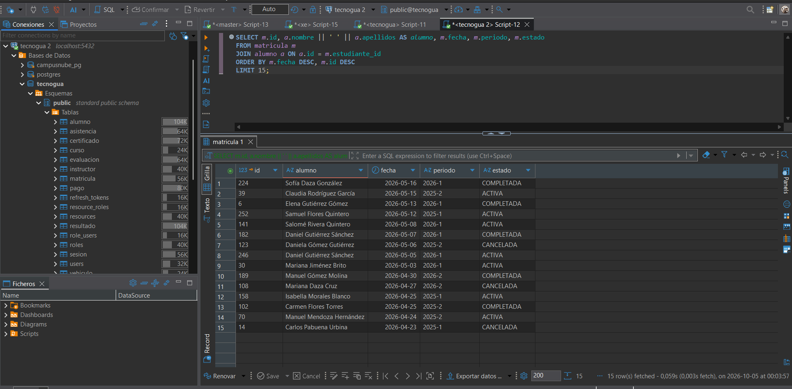

*Figura 115. Resultado de la consulta O03 en PostgreSQL.*

| Registro de ejecución | |
|---|---|
| Filas obtenidas | |
| Tiempo de ejecución (ms) | |
| Observaciones | |

*Nota de sintaxis (PostgreSQL):* Particularidades de sintaxis de este motor en esta consulta: `LIMIT n` para limitar filas; concatenación con `||`.

##### O03 · SQL Server

```sql
SELECT TOP 15 m.id, a.nombre + ' ' + a.apellidos AS alumno, m.fecha, m.periodo, m.estado
FROM matricula m
JOIN alumno a ON a.id = m.estudiante_id
ORDER BY m.fecha DESC, m.id DESC;
```

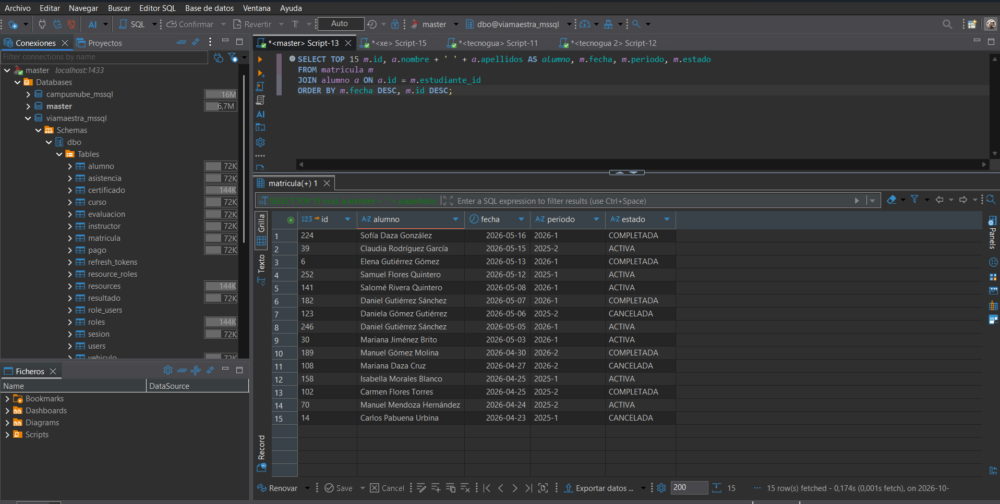

*Figura 116. Resultado de la consulta O03 en SQL Server.*

| Registro de ejecución | |
|---|---|
| Filas obtenidas | |
| Tiempo de ejecución (ms) | |
| Observaciones | |

*Nota de sintaxis (SQL Server):* Particularidades de sintaxis de este motor en esta consulta: `SELECT TOP n` para limitar filas; concatenación con `+`.

##### O03 · Oracle

```sql
SELECT m.id, a.nombre || ' ' || a.apellidos AS alumno, m.fecha, m.periodo, m.estado
FROM matricula m
JOIN alumno a ON a.id = m.estudiante_id
ORDER BY m.fecha DESC, m.id DESC
FETCH FIRST 15 ROWS ONLY;
```

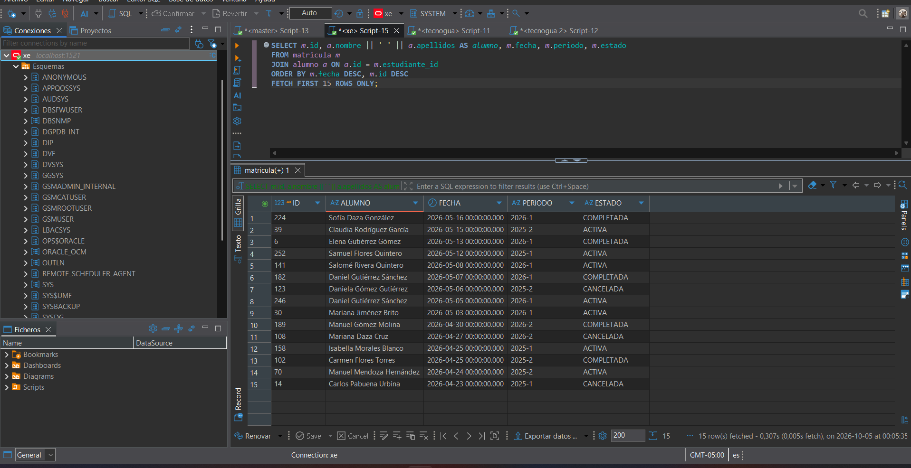

*Figura 117. Resultado de la consulta O03 en Oracle.*

| Registro de ejecución | |
|---|---|
| Filas obtenidas | |
| Tiempo de ejecución (ms) | |
| Observaciones | |

*Nota de sintaxis (Oracle):* Particularidades de sintaxis de este motor en esta consulta: `FETCH FIRST n ROWS ONLY` para limitar filas; concatenación con `||`.

#### O04 — Vehículos activos ordenados por antigüedad del modelo

**Situación de negocio.** Logística debe priorizar la revisión de la flota y desea comenzar por los vehículos de modelo más antiguo, con el fin de programar primero su mantenimiento y la verificación de su documentación.

**Concepto de SQL.** `ORDER BY` sobre una columna de texto (`descripcion`, que inicia con el año del modelo) en orden ascendente, con desempate por `nombre` y filtrando únicamente los vehículos activos.

**Resultado esperado.** Los vehículos se presentan del modelo más antiguo al más reciente; los de igual descripción se ordenan por nombre.

##### O04 · MySQL

```sql
SELECT v.id, v.nombre, v.descripcion
FROM vehiculo v
WHERE v.is_active = 'ACTIVE'
ORDER BY v.descripcion ASC, v.nombre ASC;
```

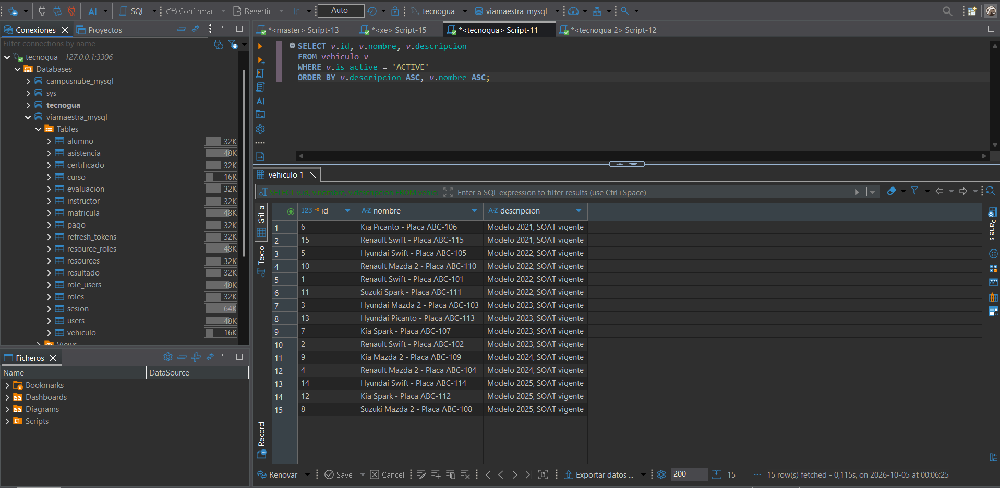

*Figura 118. Resultado de la consulta O04 en MySQL.*

| Registro de ejecución | |
|---|---|
| Filas obtenidas | |
| Tiempo de ejecución (ms) | |
| Observaciones | |

*Nota de sintaxis (MySQL):* La sentencia es idéntica en los cuatro motores y no requirió adaptaciones de sintaxis.

##### O04 · PostgreSQL

```sql
SELECT v.id, v.nombre, v.descripcion
FROM vehiculo v
WHERE v.is_active = 'ACTIVE'
ORDER BY v.descripcion ASC, v.nombre ASC;
```

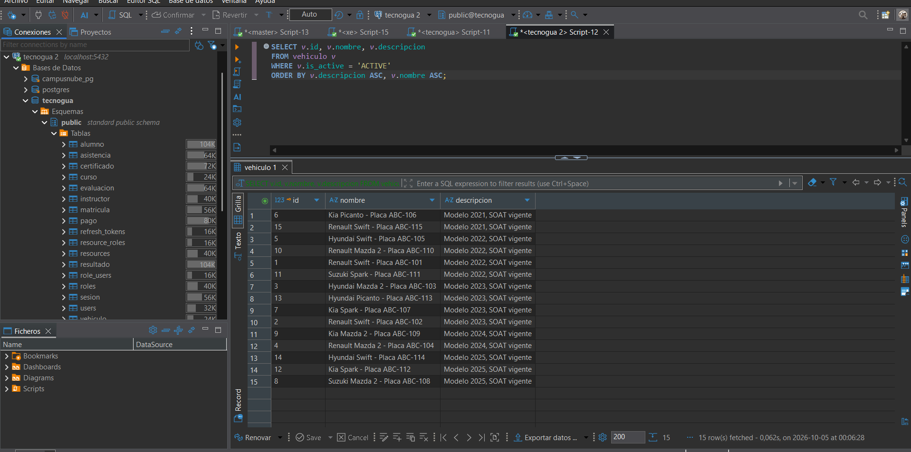

*Figura 119. Resultado de la consulta O04 en PostgreSQL.*

| Registro de ejecución | |
|---|---|
| Filas obtenidas | |
| Tiempo de ejecución (ms) | |
| Observaciones | |

*Nota de sintaxis (PostgreSQL):* La sentencia es idéntica en los cuatro motores y no requirió adaptaciones de sintaxis.

##### O04 · SQL Server

```sql
SELECT v.id, v.nombre, v.descripcion
FROM vehiculo v
WHERE v.is_active = 'ACTIVE'
ORDER BY v.descripcion ASC, v.nombre ASC;
```

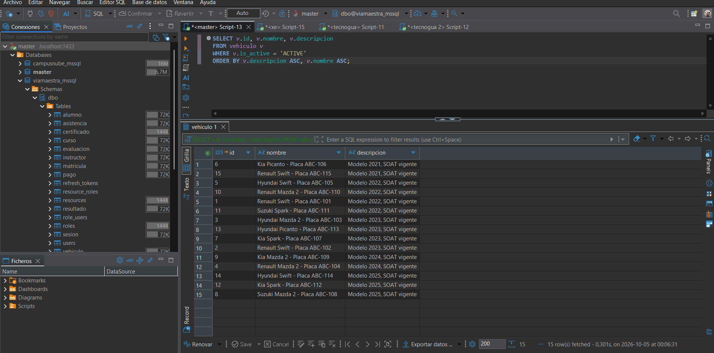

*Figura 120. Resultado de la consulta O04 en SQL Server.*

| Registro de ejecución | |
|---|---|
| Filas obtenidas | |
| Tiempo de ejecución (ms) | |
| Observaciones | |

*Nota de sintaxis (SQL Server):* La sentencia es idéntica en los cuatro motores y no requirió adaptaciones de sintaxis.

##### O04 · Oracle

```sql
SELECT v.id, v.nombre, v.descripcion
FROM vehiculo v
WHERE v.is_active = 'ACTIVE'
ORDER BY v.descripcion ASC, v.nombre ASC;
```

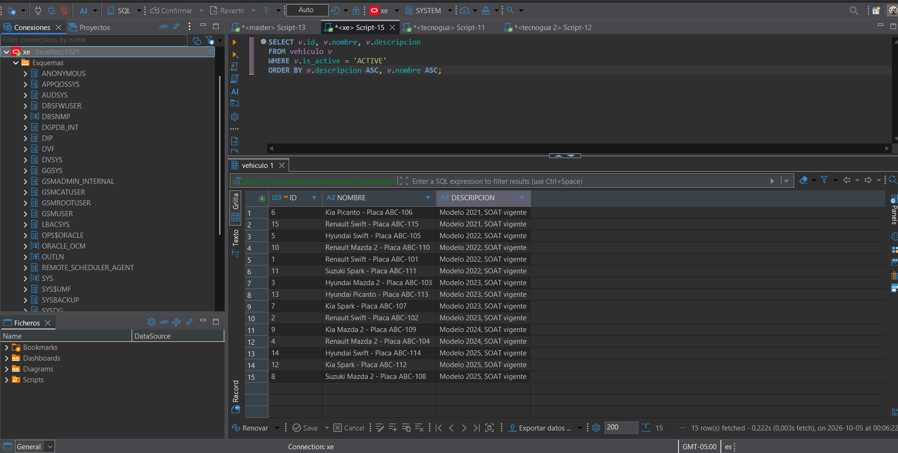

*Figura 121. Resultado de la consulta O04 en Oracle.*

| Registro de ejecución | |
|---|---|
| Filas obtenidas | |
| Tiempo de ejecución (ms) | |
| Observaciones | |

*Nota de sintaxis (Oracle):* La sentencia es idéntica en los cuatro motores y no requirió adaptaciones de sintaxis.

#### O05 — ORDER BY por posición de columna y por alias

**Situación de negocio.** Mercadeo desea conocer la demanda vigente de cada curso (número de matrículas no canceladas), de mayor a menor, para decidir dónde concentrar la inversión publicitaria.

**Concepto de SQL.** `ORDER BY 3 DESC, 1` usa la **posición** de la columna en el `SELECT` en lugar de su nombre. Es válido en los cuatro motores, aunque se recomienda usar alias por legibilidad.

**Resultado esperado.** Los cursos se presentan de mayor a menor número de matrículas; los empates se ordenan por nombre. Reemplazar la posición `2` por el alias `matricula` debe producir el mismo orden.

##### O05 · MySQL

```sql
SELECT c.nombre AS curso, COUNT(m.id) AS matriculas
FROM curso c
JOIN matricula m ON m.oferta_id = c.id
WHERE m.estado <> 'CANCELADA'
GROUP BY c.id, c.nombre
ORDER BY 2 DESC, 1;
```

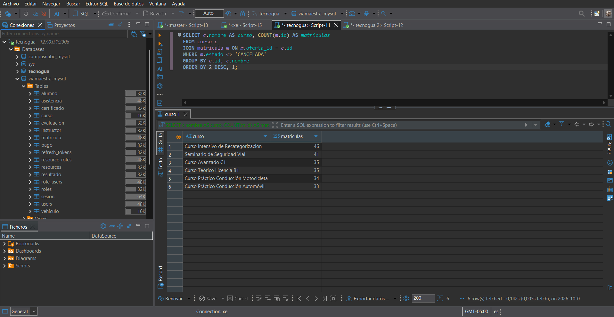

*Figura 122. Resultado de la consulta O05 en MySQL.*

| Registro de ejecución | |
|---|---|
| Filas obtenidas | |
| Tiempo de ejecución (ms) | |
| Observaciones | |

*Nota de sintaxis (MySQL):* La sentencia es idéntica en los cuatro motores y no requirió adaptaciones de sintaxis.

##### O05 · PostgreSQL

```sql
SELECT c.nombre AS curso, COUNT(m.id) AS matriculas
FROM curso c
JOIN matricula m ON m.oferta_id = c.id
WHERE m.estado <> 'CANCELADA'
GROUP BY c.id, c.nombre
ORDER BY 2 DESC, 1;
```

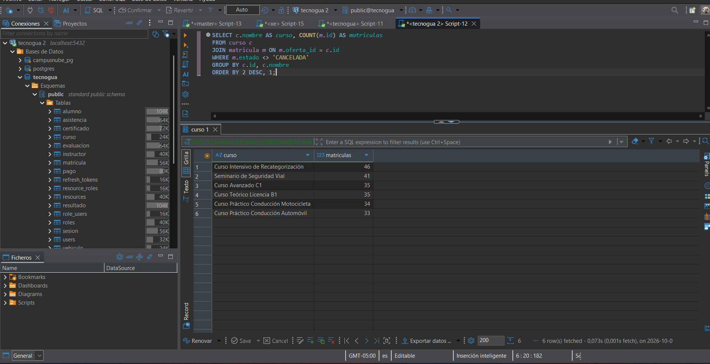

*Figura 123. Resultado de la consulta O05 en PostgreSQL.*

| Registro de ejecución | |
|---|---|
| Filas obtenidas | |
| Tiempo de ejecución (ms) | |
| Observaciones | |

*Nota de sintaxis (PostgreSQL):* La sentencia es idéntica en los cuatro motores y no requirió adaptaciones de sintaxis.

##### O05 · SQL Server

```sql
SELECT c.nombre AS curso, COUNT(m.id) AS matriculas
FROM curso c
JOIN matricula m ON m.oferta_id = c.id
WHERE m.estado <> 'CANCELADA'
GROUP BY c.id, c.nombre
ORDER BY 2 DESC, 1;
```

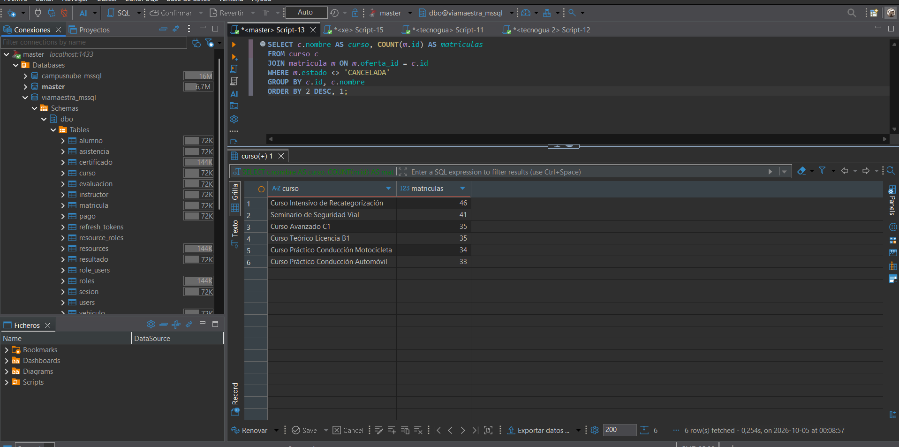

*Figura 124. Resultado de la consulta O05 en SQL Server.*

| Registro de ejecución | |
|---|---|
| Filas obtenidas | |
| Tiempo de ejecución (ms) | |
| Observaciones | |

*Nota de sintaxis (SQL Server):* La sentencia es idéntica en los cuatro motores y no requirió adaptaciones de sintaxis.

##### O05 · Oracle

```sql
SELECT c.nombre AS curso, COUNT(m.id) AS matriculas
FROM curso c
JOIN matricula m ON m.oferta_id = c.id
WHERE m.estado <> 'CANCELADA'
GROUP BY c.id, c.nombre
ORDER BY 2 DESC, 1;
```

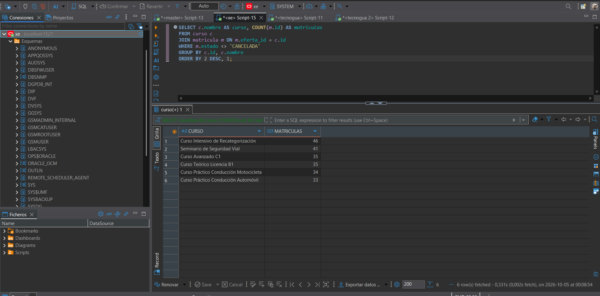

*Figura 125. Resultado de la consulta O05 en Oracle.*

| Registro de ejecución | |
|---|---|
| Filas obtenidas | |
| Tiempo de ejecución (ms) | |
| Observaciones | |

*Nota de sintaxis (Oracle):* La sentencia es idéntica en los cuatro motores y no requirió adaptaciones de sintaxis.

#### O06 — Próximas sesiones programadas (ASC por fecha)

**Situación de negocio.** Coordinación quiere la agenda inmediata de clases: las próximas sesiones programadas desde el 1 de mayo de 2026, en orden cronológico, para avisar a instructores y alumnos.

**Concepto de SQL.** Filtro por fecha con `WHERE` y `ORDER BY fecha_inicio ASC`. El literal de fecha se escribe distinto según el motor (`DATE '2026-05-01'` o `'2026-05-01'`).

**Resultado esperado.** Todas las sesiones mostradas tienen fecha igual o posterior al 1 de mayo de 2026 y estado `PROGRAMADA`, de la más cercana a la más lejana.

##### O06 · MySQL

```sql
SELECT s.id, s.fecha_inicio, c.nombre AS curso, i.nombre AS instructor
FROM sesion s
JOIN curso c ON c.id = s.curso_id
JOIN instructor i ON i.id = s.instructor_id
WHERE s.estado = 'PROGRAMADA' AND s.fecha_inicio >= DATE '2026-05-01'
ORDER BY s.fecha_inicio ASC
LIMIT 15;
```

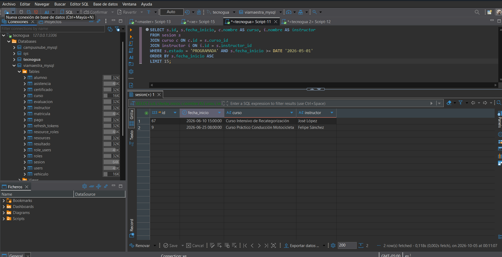

*Figura 126. Resultado de la consulta O06 en MySQL.*

| Registro de ejecución | |
|---|---|
| Filas obtenidas | |
| Tiempo de ejecución (ms) | |
| Observaciones | |

*Nota de sintaxis (MySQL):* Particularidades de sintaxis de este motor en esta consulta: `LIMIT n` para limitar filas; literal de fecha `DATE 'AAAA-MM-DD'`.

##### O06 · PostgreSQL

```sql
SELECT s.id, s.fecha_inicio, c.nombre AS curso, i.nombre AS instructor
FROM sesion s
JOIN curso c ON c.id = s.curso_id
JOIN instructor i ON i.id = s.instructor_id
WHERE s.estado = 'PROGRAMADA' AND s.fecha_inicio >= DATE '2026-05-01'
ORDER BY s.fecha_inicio ASC
LIMIT 15;
```

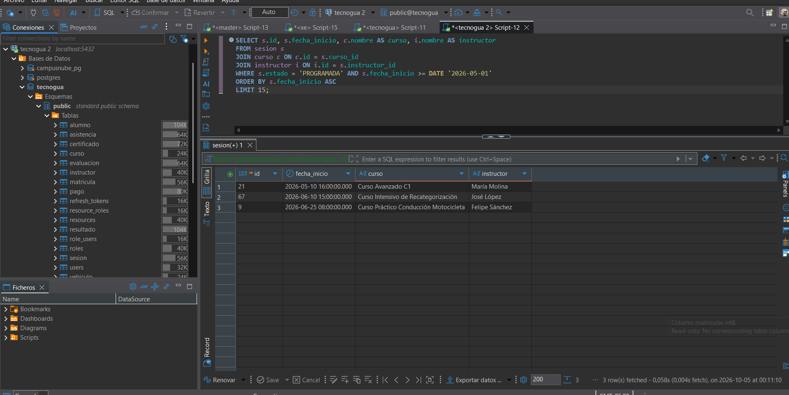

*Figura 127. Resultado de la consulta O06 en PostgreSQL.*

| Registro de ejecución | |
|---|---|
| Filas obtenidas | |
| Tiempo de ejecución (ms) | |
| Observaciones | |

*Nota de sintaxis (PostgreSQL):* Particularidades de sintaxis de este motor en esta consulta: `LIMIT n` para limitar filas; literal de fecha `DATE 'AAAA-MM-DD'`.

##### O06 · SQL Server

```sql
SELECT TOP 15 s.id, s.fecha_inicio, c.nombre AS curso, i.nombre AS instructor
FROM sesion s
JOIN curso c ON c.id = s.curso_id
JOIN instructor i ON i.id = s.instructor_id
WHERE s.estado = 'PROGRAMADA' AND s.fecha_inicio >= '2026-05-01'
ORDER BY s.fecha_inicio ASC;
```

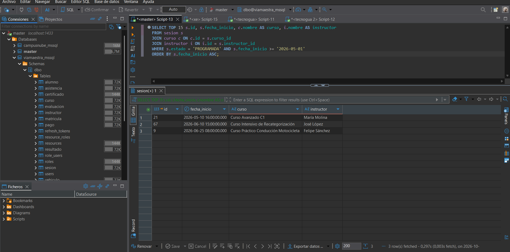

*Figura 128. Resultado de la consulta O06 en SQL Server.*

| Registro de ejecución | |
|---|---|
| Filas obtenidas | |
| Tiempo de ejecución (ms) | |
| Observaciones | |

*Nota de sintaxis (SQL Server):* Particularidades de sintaxis de este motor en esta consulta: `SELECT TOP n` para limitar filas.

##### O06 · Oracle

```sql
SELECT s.id, s.fecha_inicio, c.nombre AS curso, i.nombre AS instructor
FROM sesion s
JOIN curso c ON c.id = s.curso_id
JOIN instructor i ON i.id = s.instructor_id
WHERE s.estado = 'PROGRAMADA' AND s.fecha_inicio >= DATE '2026-05-01'
ORDER BY s.fecha_inicio ASC
FETCH FIRST 15 ROWS ONLY;
```

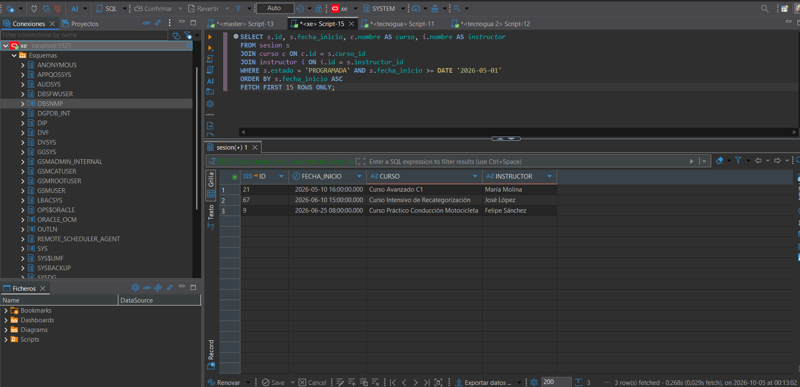

*Figura 129. Resultado de la consulta O06 en Oracle.*

| Registro de ejecución | |
|---|---|
| Filas obtenidas | |
| Tiempo de ejecución (ms) | |
| Observaciones | |

*Nota de sintaxis (Oracle):* Particularidades de sintaxis de este motor en esta consulta: `FETCH FIRST n ROWS ONLY` para limitar filas; literal de fecha `DATE 'AAAA-MM-DD'`.

---

### 6. JOIN — combinación de tablas

Los `JOIN` combinan filas de varias tablas mediante llaves foráneas. Se muestran `INNER`, `LEFT`, `RIGHT`, uniones de seis tablas y el *self join* para detectar cruces de horario.

#### J01 — INNER JOIN de 3 tablas: matrícula + alumno + curso

**Situación de negocio.** Secretaría necesita un reporte que muestre en una sola tabla qué alumno cursa qué curso y en qué período, en lugar de tener que consultar tres tablas por separado.

**Concepto de SQL.** `INNER JOIN` de tres tablas (matrículas, alumnos y cursos) enlazadas por llaves foráneas. Solo aparecen las filas que tienen correspondencia en todas las tablas.

**Resultado esperado.** No debe haber celdas vacías en nombre de alumno ni de curso: el `INNER JOIN` descarta lo que no tiene correspondencia.

##### J01 · MySQL

```sql
SELECT m.id, CONCAT(a.nombre, ' ', a.apellidos) AS alumno, c.nombre AS curso, m.periodo, m.estado
FROM matricula m
JOIN alumno a ON a.id = m.estudiante_id
JOIN curso c ON c.id = m.oferta_id
ORDER BY m.fecha DESC, m.id DESC
LIMIT 20;
```

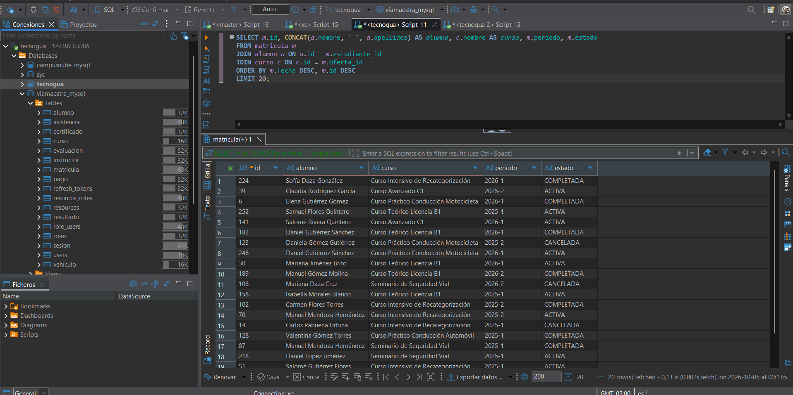

*Figura 130. Resultado de la consulta J01 en MySQL.*

| Registro de ejecución | |
|---|---|
| Filas obtenidas | |
| Tiempo de ejecución (ms) | |
| Observaciones | |

*Nota de sintaxis (MySQL):* Particularidades de sintaxis de este motor en esta consulta: `LIMIT n` para limitar filas; concatenación con `CONCAT()`.

##### J01 · PostgreSQL

```sql
SELECT m.id, a.nombre || ' ' || a.apellidos AS alumno, c.nombre AS curso, m.periodo, m.estado
FROM matricula m
JOIN alumno a ON a.id = m.estudiante_id
JOIN curso c ON c.id = m.oferta_id
ORDER BY m.fecha DESC, m.id DESC
LIMIT 20;
```

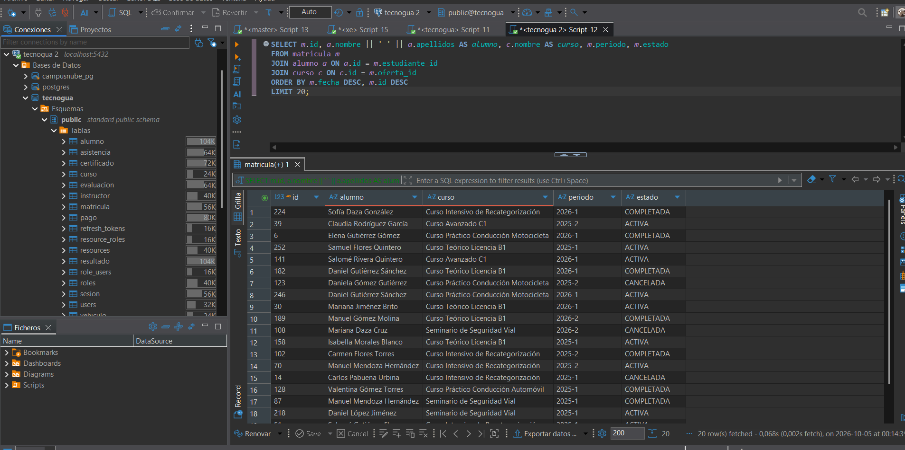

*Figura 131. Resultado de la consulta J01 en PostgreSQL.*

| Registro de ejecución | |
|---|---|
| Filas obtenidas | |
| Tiempo de ejecución (ms) | |
| Observaciones | |

*Nota de sintaxis (PostgreSQL):* Particularidades de sintaxis de este motor en esta consulta: `LIMIT n` para limitar filas; concatenación con `||`.

##### J01 · SQL Server

```sql
SELECT TOP 20 m.id, a.nombre + ' ' + a.apellidos AS alumno, c.nombre AS curso, m.periodo, m.estado
FROM matricula m
JOIN alumno a ON a.id = m.estudiante_id
JOIN curso c ON c.id = m.oferta_id
ORDER BY m.fecha DESC, m.id DESC;
```

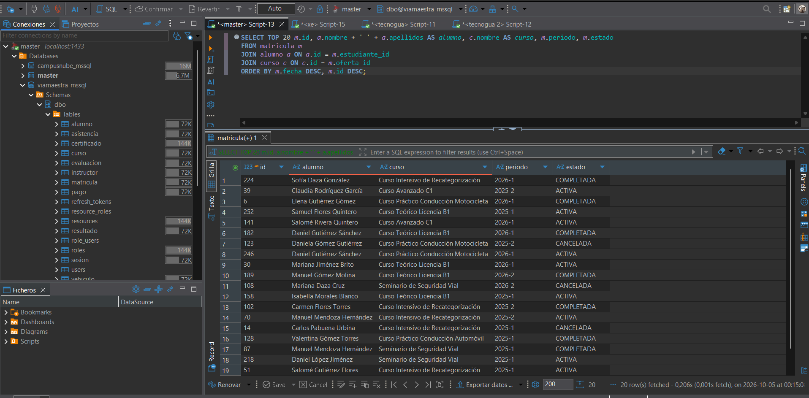

*Figura 132. Resultado de la consulta J01 en SQL Server.*

| Registro de ejecución | |
|---|---|
| Filas obtenidas | |
| Tiempo de ejecución (ms) | |
| Observaciones | |

*Nota de sintaxis (SQL Server):* Particularidades de sintaxis de este motor en esta consulta: `SELECT TOP n` para limitar filas; concatenación con `+`.

##### J01 · Oracle

```sql
SELECT m.id, a.nombre || ' ' || a.apellidos AS alumno, c.nombre AS curso, m.periodo, m.estado
FROM matricula m
JOIN alumno a ON a.id = m.estudiante_id
JOIN curso c ON c.id = m.oferta_id
ORDER BY m.fecha DESC, m.id DESC
FETCH FIRST 20 ROWS ONLY;
```

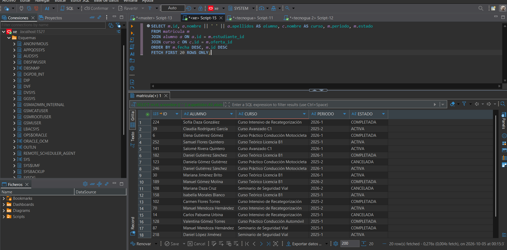

*Figura 133. Resultado de la consulta J01 en Oracle.*

| Registro de ejecución | |
|---|---|
| Filas obtenidas | |
| Tiempo de ejecución (ms) | |
| Observaciones | |

*Nota de sintaxis (Oracle):* Particularidades de sintaxis de este motor en esta consulta: `FETCH FIRST n ROWS ONLY` para limitar filas; concatenación con `||`.

#### J02 — LEFT JOIN ... IS NULL: alumnos que nunca se han matriculado

**Situación de negocio.** Admisiones quiere recuperar posibles clientes: los alumnos que se registraron en el sistema pero jamás se matricularon en ningún curso.

**Concepto de SQL.** `LEFT JOIN ... WHERE m.id IS NULL` es el patrón clásico de «anti-join»: conserva todos los alumnos de la tabla izquierda y deja solo aquellos sin pareja en matrículas.

**Resultado esperado.** Los alumnos listados no tienen ninguna matrícula.

##### J02 · MySQL

```sql
SELECT a.id, CONCAT(a.nombre, ' ', a.apellidos) AS alumno, a.correo
FROM alumno a
LEFT JOIN matricula m ON m.estudiante_id = a.id
WHERE m.id IS NULL
ORDER BY a.apellidos;
```

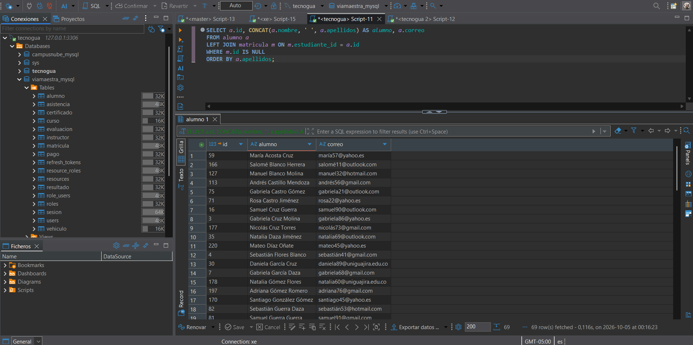

*Figura 134. Resultado de la consulta J02 en MySQL.*

| Registro de ejecución | |
|---|---|
| Filas obtenidas | |
| Tiempo de ejecución (ms) | |
| Observaciones | |

*Nota de sintaxis (MySQL):* Particularidades de sintaxis de este motor en esta consulta: concatenación con `CONCAT()`.

##### J02 · PostgreSQL

```sql
SELECT a.id, a.nombre || ' ' || a.apellidos AS alumno, a.correo
FROM alumno a
LEFT JOIN matricula m ON m.estudiante_id = a.id
WHERE m.id IS NULL
ORDER BY a.apellidos;
```

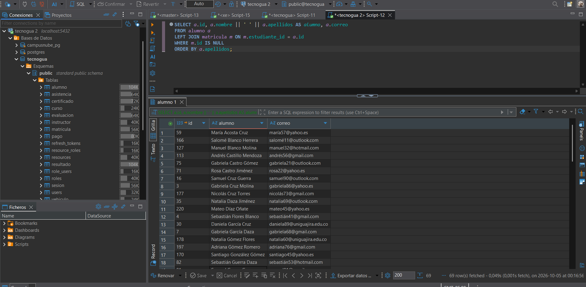

*Figura 135. Resultado de la consulta J02 en PostgreSQL.*

| Registro de ejecución | |
|---|---|
| Filas obtenidas | |
| Tiempo de ejecución (ms) | |
| Observaciones | |

*Nota de sintaxis (PostgreSQL):* Particularidades de sintaxis de este motor en esta consulta: concatenación con `||`.

##### J02 · SQL Server

```sql
SELECT a.id, a.nombre + ' ' + a.apellidos AS alumno, a.correo
FROM alumno a
LEFT JOIN matricula m ON m.estudiante_id = a.id
WHERE m.id IS NULL
ORDER BY a.apellidos;
```

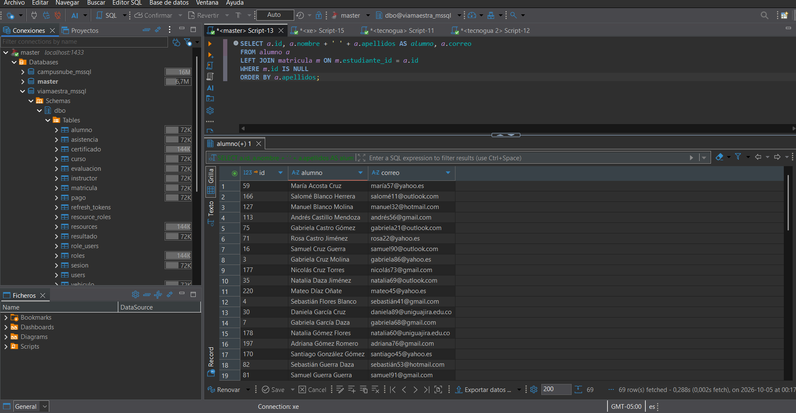

*Figura 136. Resultado de la consulta J02 en SQL Server.*

| Registro de ejecución | |
|---|---|
| Filas obtenidas | |
| Tiempo de ejecución (ms) | |
| Observaciones | |

*Nota de sintaxis (SQL Server):* Particularidades de sintaxis de este motor en esta consulta: concatenación con `+`.

##### J02 · Oracle

```sql
SELECT a.id, a.nombre || ' ' || a.apellidos AS alumno, a.correo
FROM alumno a
LEFT JOIN matricula m ON m.estudiante_id = a.id
WHERE m.id IS NULL
ORDER BY a.apellidos;
```

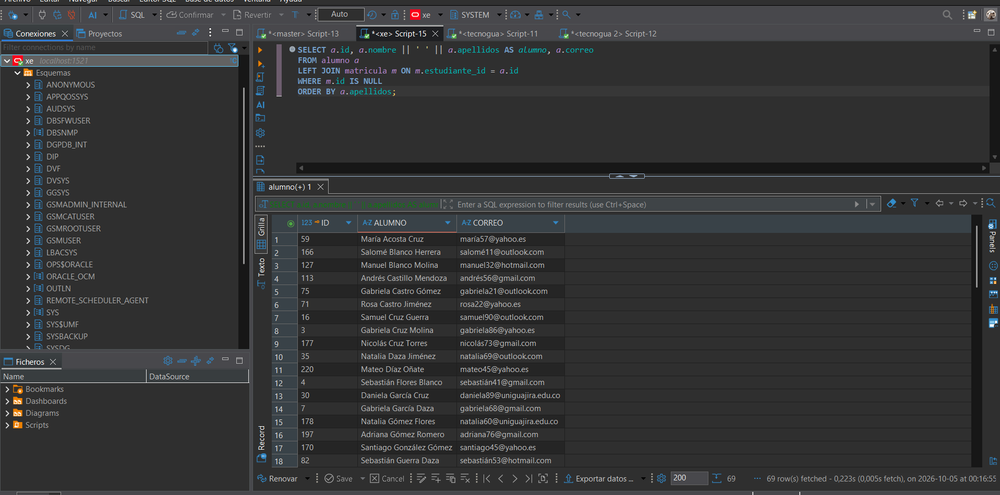

*Figura 137. Resultado de la consulta J02 en Oracle.*

| Registro de ejecución | |
|---|---|
| Filas obtenidas | |
| Tiempo de ejecución (ms) | |
| Observaciones | |

*Nota de sintaxis (Oracle):* Particularidades de sintaxis de este motor en esta consulta: concatenación con `||`.

#### J03 — RIGHT JOIN: matrículas 2026-2 por curso (incluye cursos sin matrículas)

**Situación de negocio.** Dirección quiere ver el catálogo completo de cursos con el número de matrículas del período 2026-2, **incluyendo los que no tienen ninguna**, porque un curso con cero matrículas también es información.

**Concepto de SQL.** `RIGHT JOIN` conserva todos los cursos (tabla derecha) aunque no tengan matrículas. Escribir el filtro de período en la condición del `ON` y no en el `WHERE` es lo que mantiene los cursos con cero.

**Resultado esperado.** Aparecen los 6 cursos del catálogo. Un curso sin matrículas en 2026-2 se muestra con 0, no desaparece.

##### J03 · MySQL

```sql
SELECT c.nombre AS curso, COUNT(m.id) AS matriculas_2026_2
FROM matricula m
RIGHT JOIN curso c ON c.id = m.oferta_id AND m.periodo = '2026-2'
GROUP BY c.id, c.nombre
ORDER BY matriculas_2026_2 DESC;
```

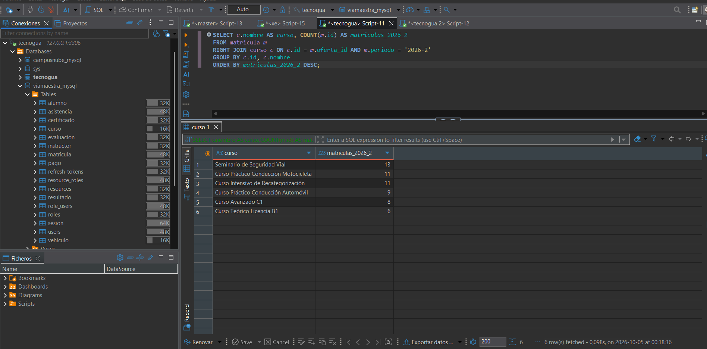

*Figura 138. Resultado de la consulta J03 en MySQL.*

| Registro de ejecución | |
|---|---|
| Filas obtenidas | |
| Tiempo de ejecución (ms) | |
| Observaciones | |

*Nota de sintaxis (MySQL):* La sentencia es idéntica en los cuatro motores y no requirió adaptaciones de sintaxis.

##### J03 · PostgreSQL

```sql
SELECT c.nombre AS curso, COUNT(m.id) AS matriculas_2026_2
FROM matricula m
RIGHT JOIN curso c ON c.id = m.oferta_id AND m.periodo = '2026-2'
GROUP BY c.id, c.nombre
ORDER BY matriculas_2026_2 DESC;
```

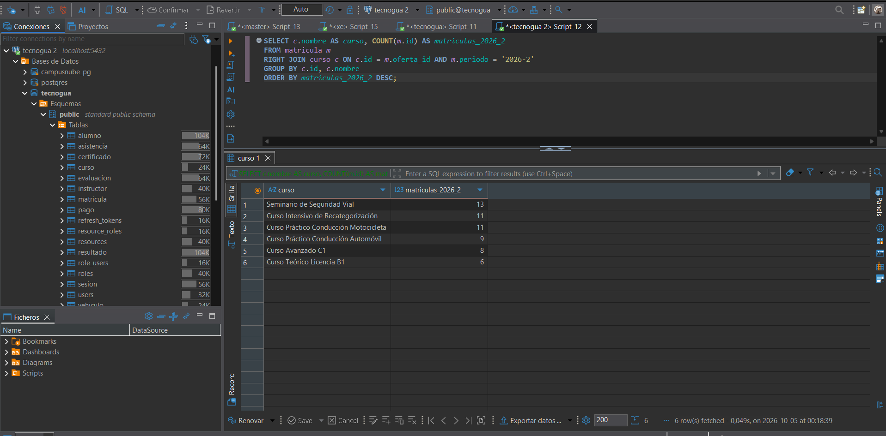

*Figura 139. Resultado de la consulta J03 en PostgreSQL.*

| Registro de ejecución | |
|---|---|
| Filas obtenidas | |
| Tiempo de ejecución (ms) | |
| Observaciones | |

*Nota de sintaxis (PostgreSQL):* La sentencia es idéntica en los cuatro motores y no requirió adaptaciones de sintaxis.

##### J03 · SQL Server

```sql
SELECT c.nombre AS curso, COUNT(m.id) AS matriculas_2026_2
FROM matricula m
RIGHT JOIN curso c ON c.id = m.oferta_id AND m.periodo = '2026-2'
GROUP BY c.id, c.nombre
ORDER BY matriculas_2026_2 DESC;
```

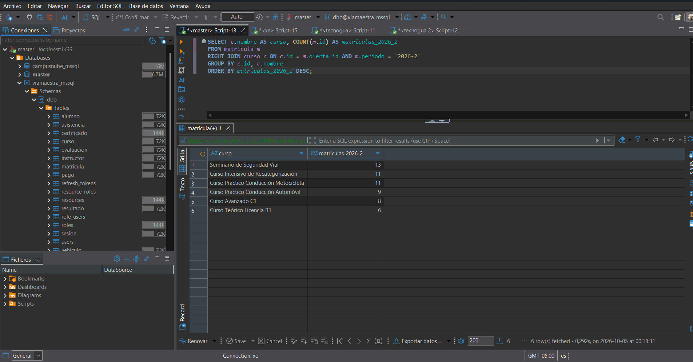

*Figura 140. Resultado de la consulta J03 en SQL Server.*

| Registro de ejecución | |
|---|---|
| Filas obtenidas | |
| Tiempo de ejecución (ms) | |
| Observaciones | |

*Nota de sintaxis (SQL Server):* La sentencia es idéntica en los cuatro motores y no requirió adaptaciones de sintaxis.

##### J03 · Oracle

```sql
SELECT c.nombre AS curso, COUNT(m.id) AS matriculas_2026_2
FROM matricula m
RIGHT JOIN curso c ON c.id = m.oferta_id AND m.periodo = '2026-2'
GROUP BY c.id, c.nombre
ORDER BY matriculas_2026_2 DESC;
```

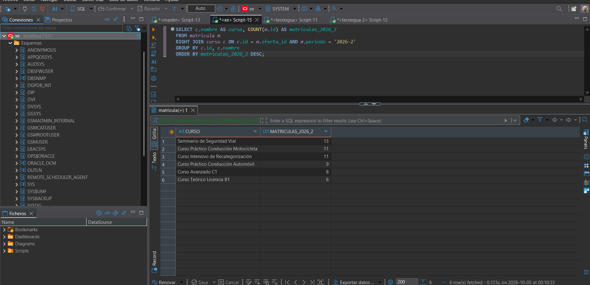

*Figura 141. Resultado de la consulta J03 en Oracle.*

| Registro de ejecución | |
|---|---|
| Filas obtenidas | |
| Tiempo de ejecución (ms) | |
| Observaciones | |

*Nota de sintaxis (Oracle):* La sentencia es idéntica en los cuatro motores y no requirió adaptaciones de sintaxis.

#### J04 — LEFT JOIN: vehículos activos sin sesiones programadas a futuro

**Situación de negocio.** Operaciones quiere saber qué vehículos están libres desde el 1 de mayo de 2026 (sin sesiones programadas a futuro) para asignarles nuevas prácticas.

**Concepto de SQL.** `LEFT JOIN` con condición de fecha y estado dentro del `ON`, y `WHERE s.id IS NULL` para quedarse con los vehículos sin sesiones futuras. Es otro uso del anti-join.

**Resultado esperado.** Los vehículos listados no tienen sesiones programadas desde esa fecha. Se puede confirmar con una consulta sobre `sesion` filtrando por el `vehiculo_id`.

##### J04 · MySQL

```sql
SELECT v.id, v.nombre, v.descripcion
FROM vehiculo v
LEFT JOIN sesion s ON s.vehiculo_id = v.id AND s.estado = 'PROGRAMADA' AND s.fecha_inicio >= DATE '2026-05-01'
WHERE v.is_active = 'ACTIVE' AND s.id IS NULL
ORDER BY v.nombre;
```

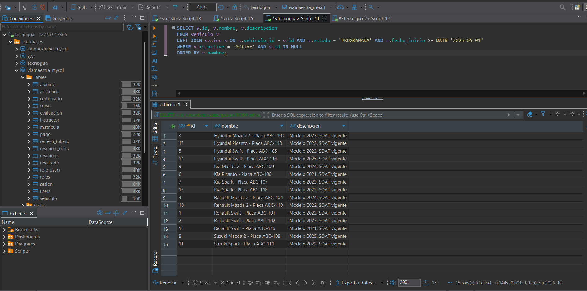

*Figura 142. Resultado de la consulta J04 en MySQL.*

| Registro de ejecución | |
|---|---|
| Filas obtenidas | |
| Tiempo de ejecución (ms) | |
| Observaciones | |

*Nota de sintaxis (MySQL):* Particularidades de sintaxis de este motor en esta consulta: literal de fecha `DATE 'AAAA-MM-DD'`.

##### J04 · PostgreSQL

```sql
SELECT v.id, v.nombre, v.descripcion
FROM vehiculo v
LEFT JOIN sesion s ON s.vehiculo_id = v.id AND s.estado = 'PROGRAMADA' AND s.fecha_inicio >= DATE '2026-05-01'
WHERE v.is_active = 'ACTIVE' AND s.id IS NULL
ORDER BY v.nombre;
```

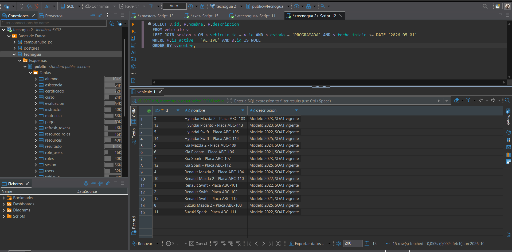

*Figura 143. Resultado de la consulta J04 en PostgreSQL.*

| Registro de ejecución | |
|---|---|
| Filas obtenidas | |
| Tiempo de ejecución (ms) | |
| Observaciones | |

*Nota de sintaxis (PostgreSQL):* Particularidades de sintaxis de este motor en esta consulta: literal de fecha `DATE 'AAAA-MM-DD'`.

##### J04 · SQL Server

```sql
SELECT v.id, v.nombre, v.descripcion
FROM vehiculo v
LEFT JOIN sesion s ON s.vehiculo_id = v.id AND s.estado = 'PROGRAMADA' AND s.fecha_inicio >= '2026-05-01'
WHERE v.is_active = 'ACTIVE' AND s.id IS NULL
ORDER BY v.nombre;
```

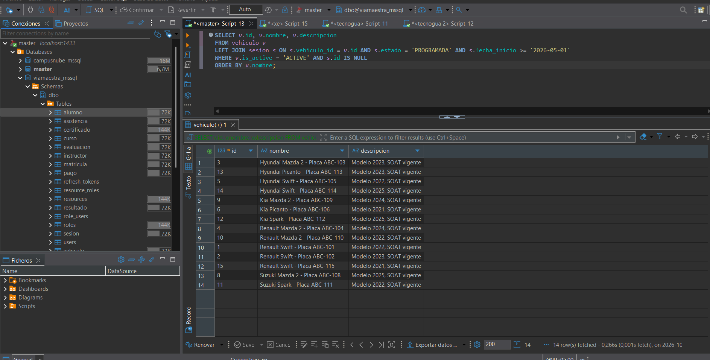

*Figura 144. Resultado de la consulta J04 en SQL Server.*

| Registro de ejecución | |
|---|---|
| Filas obtenidas | |
| Tiempo de ejecución (ms) | |
| Observaciones | |

*Nota de sintaxis (SQL Server):* La sentencia es idéntica en los cuatro motores y no requirió adaptaciones de sintaxis.

##### J04 · Oracle

```sql
SELECT v.id, v.nombre, v.descripcion
FROM vehiculo v
LEFT JOIN sesion s ON s.vehiculo_id = v.id AND s.estado = 'PROGRAMADA' AND s.fecha_inicio >= DATE '2026-05-01'
WHERE v.is_active = 'ACTIVE' AND s.id IS NULL
ORDER BY v.nombre;
```

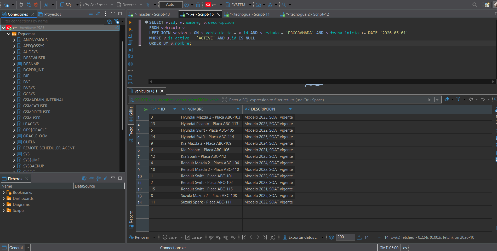

*Figura 145. Resultado de la consulta J04 en Oracle.*

| Registro de ejecución | |
|---|---|
| Filas obtenidas | |
| Tiempo de ejecución (ms) | |
| Observaciones | |

*Nota de sintaxis (Oracle):* Particularidades de sintaxis de este motor en esta consulta: literal de fecha `DATE 'AAAA-MM-DD'`.

#### J05 — JOIN de 6 tablas: detalle de asistencia

**Situación de negocio.** Auditoría académica necesita el detalle completo de quién asistió a qué sesión, con el curso y el instructor, para validar las planillas de asistencia contra el sistema.

**Concepto de SQL.** `JOIN` de seis tablas: asistencias, matrículas, alumnos, sesiones, cursos e instructores. Muestra cómo se recorren varias relaciones 1:N y N:M hasta reunir toda la información en una fila.

**Resultado esperado.** Cada fila contiene alumno, curso, instructor, fecha y nombre del registro de control, sin valores nulos en los nombres.

##### J05 · MySQL

```sql
SELECT x.id, CONCAT(a.nombre, ' ', a.apellidos) AS alumno, c.nombre AS curso, i.nombre AS instructor, s.fecha_inicio, x.nombre
FROM asistencia x
JOIN matricula m ON m.id = x.matricula_id
JOIN alumno a ON a.id = m.estudiante_id
JOIN sesion s ON s.id = x.sesion_id
JOIN curso c ON c.id = s.curso_id
JOIN instructor i ON i.id = s.instructor_id
ORDER BY s.fecha_inicio DESC, x.id
LIMIT 20;
```

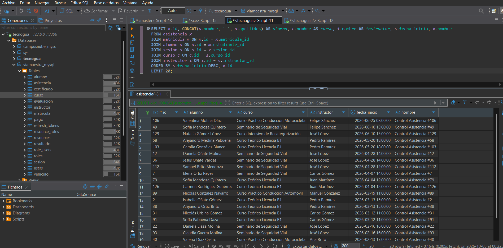

*Figura 146. Resultado de la consulta J05 en MySQL.*

| Registro de ejecución | |
|---|---|
| Filas obtenidas | |
| Tiempo de ejecución (ms) | |
| Observaciones | |

*Nota de sintaxis (MySQL):* Particularidades de sintaxis de este motor en esta consulta: `LIMIT n` para limitar filas; concatenación con `CONCAT()`.

##### J05 · PostgreSQL

```sql
SELECT x.id, a.nombre || ' ' || a.apellidos AS alumno, c.nombre AS curso, i.nombre AS instructor, s.fecha_inicio, x.nombre
FROM asistencia x
JOIN matricula m ON m.id = x.matricula_id
JOIN alumno a ON a.id = m.estudiante_id
JOIN sesion s ON s.id = x.sesion_id
JOIN curso c ON c.id = s.curso_id
JOIN instructor i ON i.id = s.instructor_id
ORDER BY s.fecha_inicio DESC, x.id
LIMIT 20;
```

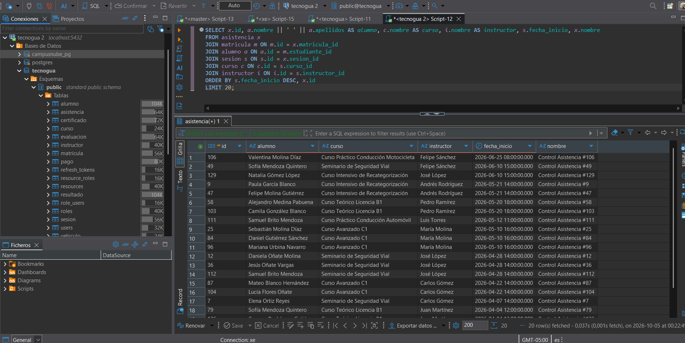

*Figura 147. Resultado de la consulta J05 en PostgreSQL.*

| Registro de ejecución | |
|---|---|
| Filas obtenidas | |
| Tiempo de ejecución (ms) | |
| Observaciones | |

*Nota de sintaxis (PostgreSQL):* Particularidades de sintaxis de este motor en esta consulta: `LIMIT n` para limitar filas; concatenación con `||`.

##### J05 · SQL Server

```sql
SELECT TOP 20 x.id, a.nombre + ' ' + a.apellidos AS alumno, c.nombre AS curso, i.nombre AS instructor, s.fecha_inicio, x.nombre
FROM asistencia x
JOIN matricula m ON m.id = x.matricula_id
JOIN alumno a ON a.id = m.estudiante_id
JOIN sesion s ON s.id = x.sesion_id
JOIN curso c ON c.id = s.curso_id
JOIN instructor i ON i.id = s.instructor_id
ORDER BY s.fecha_inicio DESC, x.id;
```

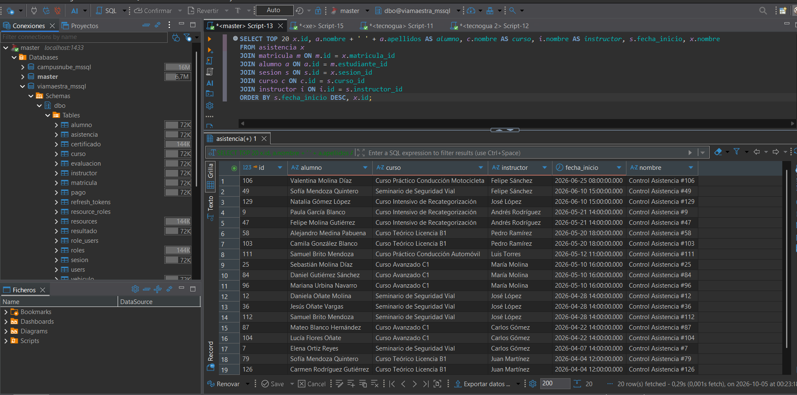

*Figura 148. Resultado de la consulta J05 en SQL Server.*

| Registro de ejecución | |
|---|---|
| Filas obtenidas | |
| Tiempo de ejecución (ms) | |
| Observaciones | |

*Nota de sintaxis (SQL Server):* Particularidades de sintaxis de este motor en esta consulta: `SELECT TOP n` para limitar filas; concatenación con `+`.

##### J05 · Oracle

```sql
SELECT x.id, a.nombre || ' ' || a.apellidos AS alumno, c.nombre AS curso, i.nombre AS instructor, s.fecha_inicio, x.nombre
FROM asistencia x
JOIN matricula m ON m.id = x.matricula_id
JOIN alumno a ON a.id = m.estudiante_id
JOIN sesion s ON s.id = x.sesion_id
JOIN curso c ON c.id = s.curso_id
JOIN instructor i ON i.id = s.instructor_id
ORDER BY s.fecha_inicio DESC, x.id
FETCH FIRST 20 ROWS ONLY;
```

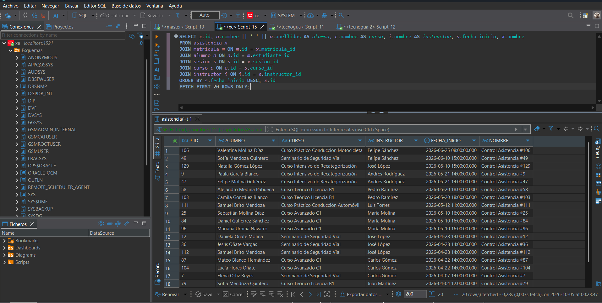

*Figura 149. Resultado de la consulta J05 en Oracle.*

| Registro de ejecución | |
|---|---|
| Filas obtenidas | |
| Tiempo de ejecución (ms) | |
| Observaciones | |

*Nota de sintaxis (Oracle):* Particularidades de sintaxis de este motor en esta consulta: `FETCH FIRST n ROWS ONLY` para limitar filas; concatenación con `||`.

#### J06 — Self JOIN: sesiones solapadas del mismo instructor

**Situación de negocio.** Una regla del negocio de VíaMaestra dice que **no puede haber sesiones solapadas**: un instructor no puede dictar dos clases al mismo tiempo. Se solicitó verificar que los datos cumplan esa regla.

**Concepto de SQL.** **Self join**: la tabla `sesion` se une consigo misma con alias `a` y `b`. La condición `a.id < b.id` evita comparar una sesión consigo misma y duplicar pares, y el cruce se detecta con `a.inicio < b.fin AND b.inicio < a.fin`.

**Resultado esperado.** Cada fila es un par de sesiones del mismo instructor cuyos horarios se cruzan. Si no devolviera filas, la agenda cumpliría la regla.

##### J06 · MySQL

```sql
SELECT a.id AS sesion_a, b.id AS sesion_b, i.nombre AS instructor,
       a.fecha_inicio AS inicio_a, a.fecha_fin AS fin_a, b.fecha_inicio AS inicio_b, b.fecha_fin AS fin_b
FROM sesion a
JOIN sesion b ON a.instructor_id = b.instructor_id AND a.id < b.id
               AND a.fecha_inicio < b.fecha_fin AND b.fecha_inicio < a.fecha_fin
JOIN instructor i ON i.id = a.instructor_id
WHERE a.estado <> 'CANCELADA' AND b.estado <> 'CANCELADA'
ORDER BY a.fecha_inicio;
```

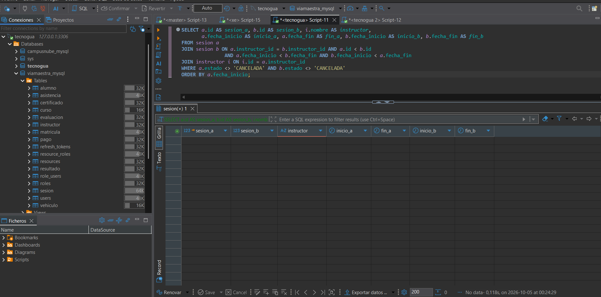

*Figura 150. Resultado de la consulta J06 en MySQL.*

| Registro de ejecución | |
|---|---|
| Filas obtenidas | |
| Tiempo de ejecución (ms) | |
| Observaciones | |

*Nota de sintaxis (MySQL):* La sentencia es idéntica en los cuatro motores y no requirió adaptaciones de sintaxis.

##### J06 · PostgreSQL

```sql
SELECT a.id AS sesion_a, b.id AS sesion_b, i.nombre AS instructor,
       a.fecha_inicio AS inicio_a, a.fecha_fin AS fin_a, b.fecha_inicio AS inicio_b, b.fecha_fin AS fin_b
FROM sesion a
JOIN sesion b ON a.instructor_id = b.instructor_id AND a.id < b.id
               AND a.fecha_inicio < b.fecha_fin AND b.fecha_inicio < a.fecha_fin
JOIN instructor i ON i.id = a.instructor_id
WHERE a.estado <> 'CANCELADA' AND b.estado <> 'CANCELADA'
ORDER BY a.fecha_inicio;
```

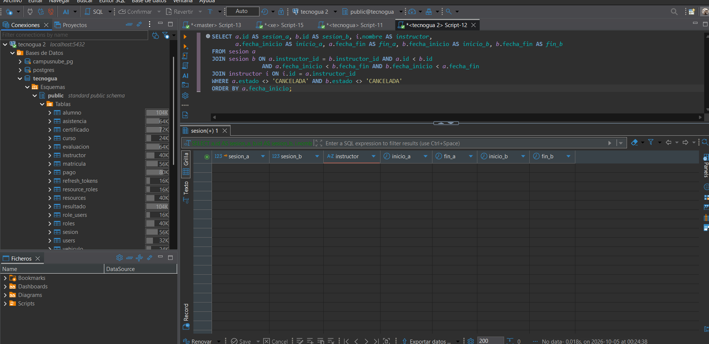

*Figura 151. Resultado de la consulta J06 en PostgreSQL.*

| Registro de ejecución | |
|---|---|
| Filas obtenidas | |
| Tiempo de ejecución (ms) | |
| Observaciones | |

*Nota de sintaxis (PostgreSQL):* La sentencia es idéntica en los cuatro motores y no requirió adaptaciones de sintaxis.

##### J06 · SQL Server

```sql
SELECT a.id AS sesion_a, b.id AS sesion_b, i.nombre AS instructor,
       a.fecha_inicio AS inicio_a, a.fecha_fin AS fin_a, b.fecha_inicio AS inicio_b, b.fecha_fin AS fin_b
FROM sesion a
JOIN sesion b ON a.instructor_id = b.instructor_id AND a.id < b.id
               AND a.fecha_inicio < b.fecha_fin AND b.fecha_inicio < a.fecha_fin
JOIN instructor i ON i.id = a.instructor_id
WHERE a.estado <> 'CANCELADA' AND b.estado <> 'CANCELADA'
ORDER BY a.fecha_inicio;
```

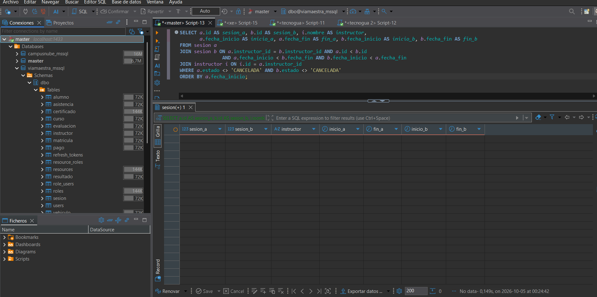

*Figura 152. Resultado de la consulta J06 en SQL Server.*

| Registro de ejecución | |
|---|---|
| Filas obtenidas | |
| Tiempo de ejecución (ms) | |
| Observaciones | |

*Nota de sintaxis (SQL Server):* La sentencia es idéntica en los cuatro motores y no requirió adaptaciones de sintaxis.

##### J06 · Oracle

```sql
SELECT a.id AS sesion_a, b.id AS sesion_b, i.nombre AS instructor,
       a.fecha_inicio AS inicio_a, a.fecha_fin AS fin_a, b.fecha_inicio AS inicio_b, b.fecha_fin AS fin_b
FROM sesion a
JOIN sesion b ON a.instructor_id = b.instructor_id AND a.id < b.id
               AND a.fecha_inicio < b.fecha_fin AND b.fecha_inicio < a.fecha_fin
JOIN instructor i ON i.id = a.instructor_id
WHERE a.estado <> 'CANCELADA' AND b.estado <> 'CANCELADA'
ORDER BY a.fecha_inicio;
```

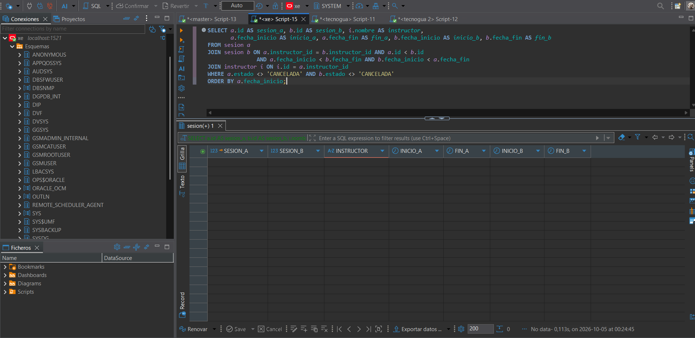

*Figura 153. Resultado de la consulta J06 en Oracle.*

| Registro de ejecución | |
|---|---|
| Filas obtenidas | |
| Tiempo de ejecución (ms) | |
| Observaciones | |

*Nota de sintaxis (Oracle):* La sentencia es idéntica en los cuatro motores y no requirió adaptaciones de sintaxis.

#### J07 — Self JOIN: sesiones solapadas del mismo vehículo

**Situación de negocio.** Igual que con los instructores, un vehículo no puede estar en dos prácticas al mismo tiempo. Después de validar instructores, se solicitó validar también el recurso vehículo.

**Concepto de SQL.** Mismo patrón de self join de la consulta anterior, cambiando la columna de enlace a `vehiculo_id` y descartando las sesiones sin vehículo.

**Resultado esperado.** Cada fila identifica un par de sesiones que reservan el mismo vehículo en horarios que se cruzan.

##### J07 · MySQL

```sql
SELECT a.id AS sesion_a, b.id AS sesion_b, v.nombre,
       a.fecha_inicio AS inicio_a, a.fecha_fin AS fin_a, b.fecha_inicio AS inicio_b, b.fecha_fin AS fin_b
FROM sesion a
JOIN sesion b ON a.vehiculo_id = b.vehiculo_id AND a.id < b.id
               AND a.fecha_inicio < b.fecha_fin AND b.fecha_inicio < a.fecha_fin
JOIN vehiculo v ON v.id = a.vehiculo_id
WHERE a.estado <> 'CANCELADA' AND b.estado <> 'CANCELADA'
ORDER BY a.fecha_inicio;
```

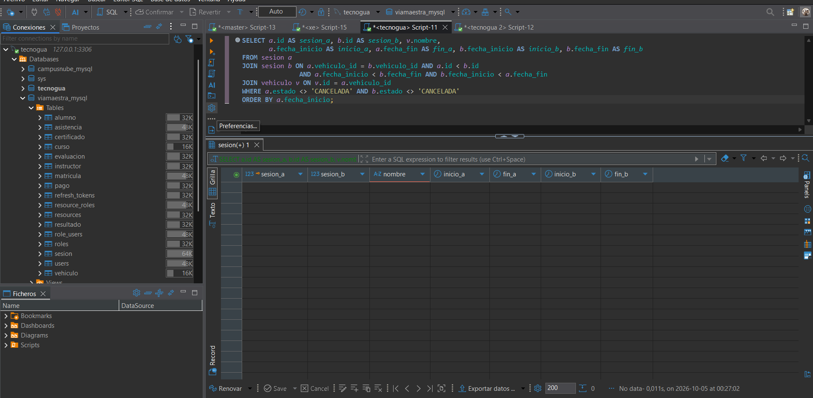

*Figura 154. Resultado de la consulta J07 en MySQL.*

| Registro de ejecución | |
|---|---|
| Filas obtenidas | |
| Tiempo de ejecución (ms) | |
| Observaciones | |

*Nota de sintaxis (MySQL):* La sentencia es idéntica en los cuatro motores y no requirió adaptaciones de sintaxis.

##### J07 · PostgreSQL

```sql
SELECT a.id AS sesion_a, b.id AS sesion_b, v.nombre,
       a.fecha_inicio AS inicio_a, a.fecha_fin AS fin_a, b.fecha_inicio AS inicio_b, b.fecha_fin AS fin_b
FROM sesion a
JOIN sesion b ON a.vehiculo_id = b.vehiculo_id AND a.id < b.id
               AND a.fecha_inicio < b.fecha_fin AND b.fecha_inicio < a.fecha_fin
JOIN vehiculo v ON v.id = a.vehiculo_id
WHERE a.estado <> 'CANCELADA' AND b.estado <> 'CANCELADA'
ORDER BY a.fecha_inicio;
```

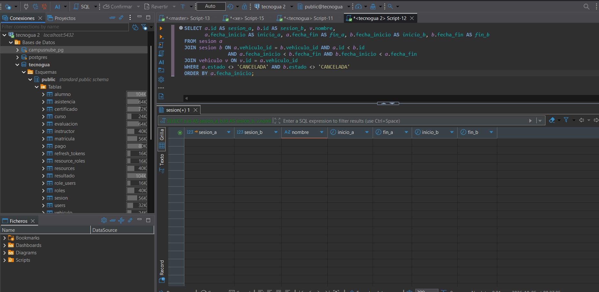

*Figura 155. Resultado de la consulta J07 en PostgreSQL.*

| Registro de ejecución | |
|---|---|
| Filas obtenidas | |
| Tiempo de ejecución (ms) | |
| Observaciones | |

*Nota de sintaxis (PostgreSQL):* La sentencia es idéntica en los cuatro motores y no requirió adaptaciones de sintaxis.

##### J07 · SQL Server

```sql
SELECT a.id AS sesion_a, b.id AS sesion_b, v.nombre,
       a.fecha_inicio AS inicio_a, a.fecha_fin AS fin_a, b.fecha_inicio AS inicio_b, b.fecha_fin AS fin_b
FROM sesion a
JOIN sesion b ON a.vehiculo_id = b.vehiculo_id AND a.id < b.id
               AND a.fecha_inicio < b.fecha_fin AND b.fecha_inicio < a.fecha_fin
JOIN vehiculo v ON v.id = a.vehiculo_id
WHERE a.estado <> 'CANCELADA' AND b.estado <> 'CANCELADA'
ORDER BY a.fecha_inicio;
```

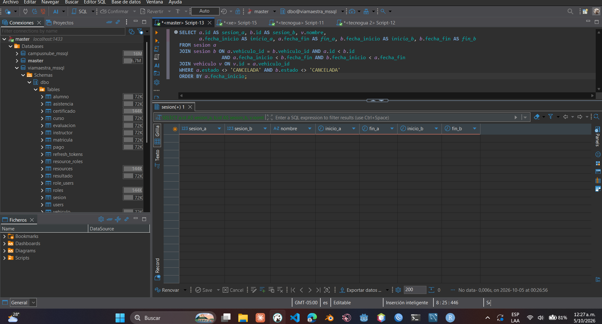

*Figura 156. Resultado de la consulta J07 en SQL Server.*

| Registro de ejecución | |
|---|---|
| Filas obtenidas | |
| Tiempo de ejecución (ms) | |
| Observaciones | |

*Nota de sintaxis (SQL Server):* La sentencia es idéntica en los cuatro motores y no requirió adaptaciones de sintaxis.

##### J07 · Oracle

```sql
SELECT a.id AS sesion_a, b.id AS sesion_b, v.nombre,
       a.fecha_inicio AS inicio_a, a.fecha_fin AS fin_a, b.fecha_inicio AS inicio_b, b.fecha_fin AS fin_b
FROM sesion a
JOIN sesion b ON a.vehiculo_id = b.vehiculo_id AND a.id < b.id
               AND a.fecha_inicio < b.fecha_fin AND b.fecha_inicio < a.fecha_fin
JOIN vehiculo v ON v.id = a.vehiculo_id
WHERE a.estado <> 'CANCELADA' AND b.estado <> 'CANCELADA'
ORDER BY a.fecha_inicio;
```

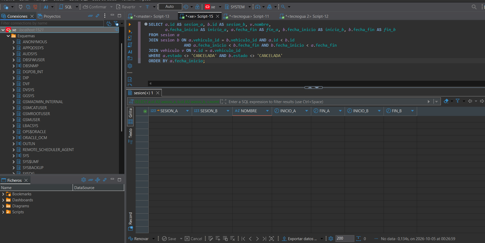

*Figura 157. Resultado de la consulta J07 en Oracle.*

| Registro de ejecución | |
|---|---|
| Filas obtenidas | |
| Tiempo de ejecución (ms) | |
| Observaciones | |

*Nota de sintaxis (Oracle):* La sentencia es idéntica en los cuatro motores y no requirió adaptaciones de sintaxis.

---

### 7. WHERE — filtros por fila

`WHERE` filtra filas individuales antes de agrupar. Se muestran comparaciones, `AND/OR/NOT`, `BETWEEN`, `IN`, `IS NULL` / `IS NOT NULL` y comparaciones de fechas.

#### W01 — Comparación + AND: matrículas activas del período vigente

**Situación de negocio.** Secretaría requiere las matrículas activas del período 2026-1 realizadas desde enero de 2026, para preparar el seguimiento de los grupos en curso.

**Concepto de SQL.** `WHERE` con varias condiciones unidas por `AND`: comparación de texto (estado y período) y comparación de fecha (`>=`).

**Resultado esperado.** Todas las filas deben cumplir las tres condiciones. Quitar una de ellas debe aumentar el número de filas.

##### W01 · MySQL

```sql
SELECT m.id, m.estudiante_id, m.oferta_id, m.fecha, m.estado
FROM matricula m
WHERE m.estado = 'ACTIVA' AND m.periodo = '2026-1' AND m.fecha >= DATE '2026-01-01'
ORDER BY m.fecha
LIMIT 20;
```

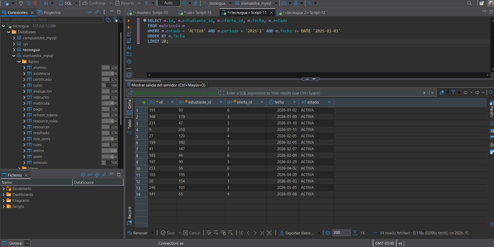

*Figura 158. Resultado de la consulta W01 en MySQL.*

| Registro de ejecución | |
|---|---|
| Filas obtenidas | |
| Tiempo de ejecución (ms) | |
| Observaciones | |

*Nota de sintaxis (MySQL):* Particularidades de sintaxis de este motor en esta consulta: `LIMIT n` para limitar filas; literal de fecha `DATE 'AAAA-MM-DD'`.

##### W01 · PostgreSQL

```sql
SELECT m.id, m.estudiante_id, m.oferta_id, m.fecha, m.estado
FROM matricula m
WHERE m.estado = 'ACTIVA' AND m.periodo = '2026-1' AND m.fecha >= DATE '2026-01-01'
ORDER BY m.fecha
LIMIT 20;
```

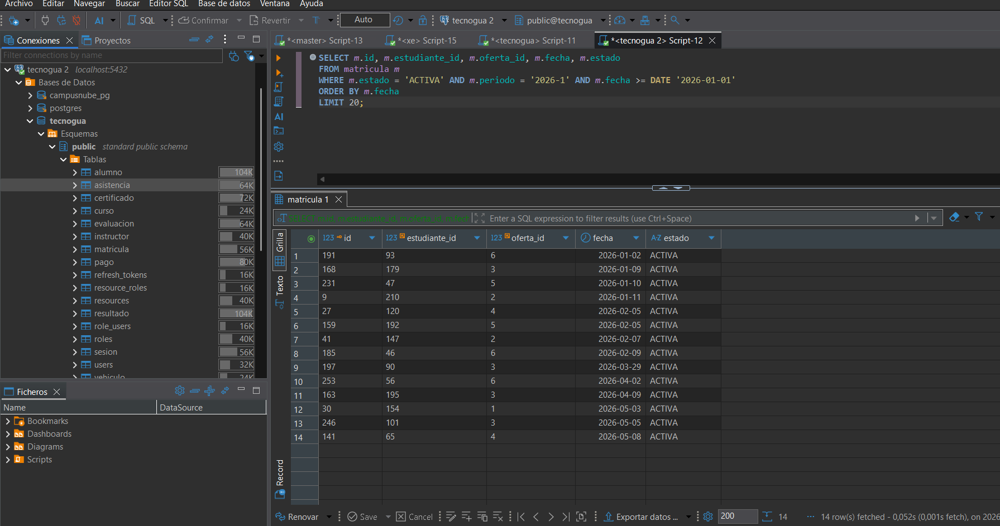

*Figura 159. Resultado de la consulta W01 en PostgreSQL.*

| Registro de ejecución | |
|---|---|
| Filas obtenidas | |
| Tiempo de ejecución (ms) | |
| Observaciones | |

*Nota de sintaxis (PostgreSQL):* Particularidades de sintaxis de este motor en esta consulta: `LIMIT n` para limitar filas; literal de fecha `DATE 'AAAA-MM-DD'`.

##### W01 · SQL Server

```sql
SELECT TOP 20 m.id, m.estudiante_id, m.oferta_id, m.fecha, m.estado
FROM matricula m
WHERE m.estado = 'ACTIVA' AND m.periodo = '2026-1' AND m.fecha >= '2026-01-01'
ORDER BY m.fecha;
```

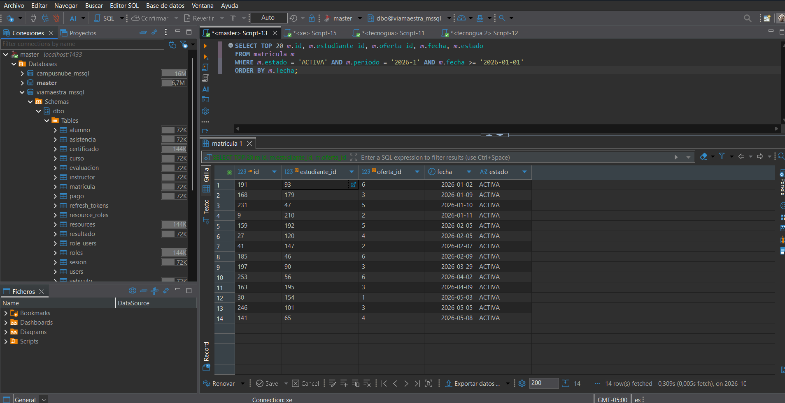

*Figura 160. Resultado de la consulta W01 en SQL Server.*

| Registro de ejecución | |
|---|---|
| Filas obtenidas | |
| Tiempo de ejecución (ms) | |
| Observaciones | |

*Nota de sintaxis (SQL Server):* Particularidades de sintaxis de este motor en esta consulta: `SELECT TOP n` para limitar filas.

##### W01 · Oracle

```sql
SELECT m.id, m.estudiante_id, m.oferta_id, m.fecha, m.estado
FROM matricula m
WHERE m.estado = 'ACTIVA' AND m.periodo = '2026-1' AND m.fecha >= DATE '2026-01-01'
ORDER BY m.fecha
FETCH FIRST 20 ROWS ONLY;
```

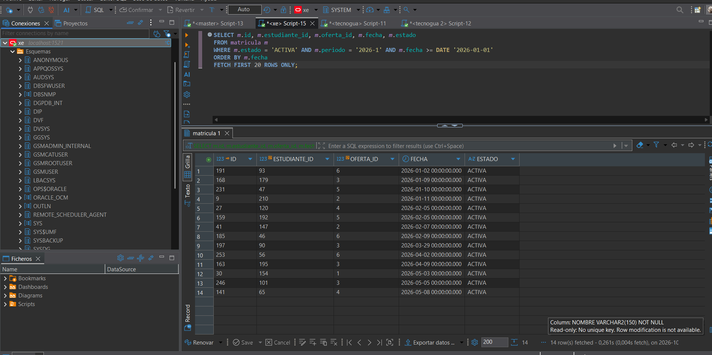

*Figura 161. Resultado de la consulta W01 en Oracle.*

| Registro de ejecución | |
|---|---|
| Filas obtenidas | |
| Tiempo de ejecución (ms) | |
| Observaciones | |

*Nota de sintaxis (Oracle):* Particularidades de sintaxis de este motor en esta consulta: `FETCH FIRST n ROWS ONLY` para limitar filas; literal de fecha `DATE 'AAAA-MM-DD'`.

#### W02 — BETWEEN: pagos de septiembre con montos entre 300.000 y 500.000

**Situación de negocio.** Cartera audita los pagos de tamaño medio realizados en septiembre, cuyo monto está entre $300.000 y $500.000, para comprobar que se hayan emitido sus recibos.

**Concepto de SQL.** `BETWEEN` es inclusivo en ambos extremos y se puede usar con números y con fechas. Aquí se aplica dos veces: sobre el monto y sobre el rango del mes.

**Resultado esperado.** Todos los montos están entre 300.000 y 500.000 (incluidos) y todas las fechas caen en septiembre de 2025.

##### W02 · MySQL

```sql
SELECT p.id, p.matricula_id, p.metodo, p.monto, p.fecha
FROM pago p
WHERE p.fecha BETWEEN DATE '2025-09-01' AND DATE '2025-09-30'
  AND p.monto BETWEEN 300000 AND 500000
ORDER BY p.fecha
LIMIT 20;
```

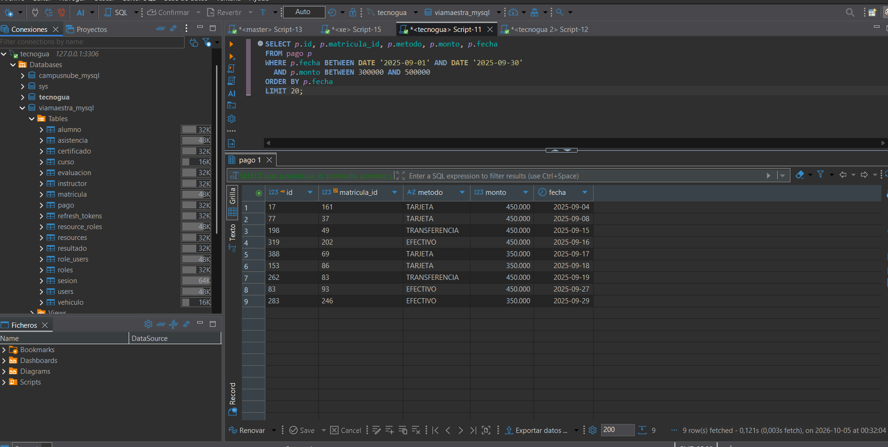

*Figura 162. Resultado de la consulta W02 en MySQL.*

| Registro de ejecución | |
|---|---|
| Filas obtenidas | |
| Tiempo de ejecución (ms) | |
| Observaciones | |

*Nota de sintaxis (MySQL):* Particularidades de sintaxis de este motor en esta consulta: `LIMIT n` para limitar filas; literal de fecha `DATE 'AAAA-MM-DD'`.

##### W02 · PostgreSQL

```sql
SELECT p.id, p.matricula_id, p.metodo, p.monto, p.fecha
FROM pago p
WHERE p.fecha BETWEEN DATE '2025-09-01' AND DATE '2025-09-30'
  AND p.monto BETWEEN 300000 AND 500000
ORDER BY p.fecha
LIMIT 20;
```

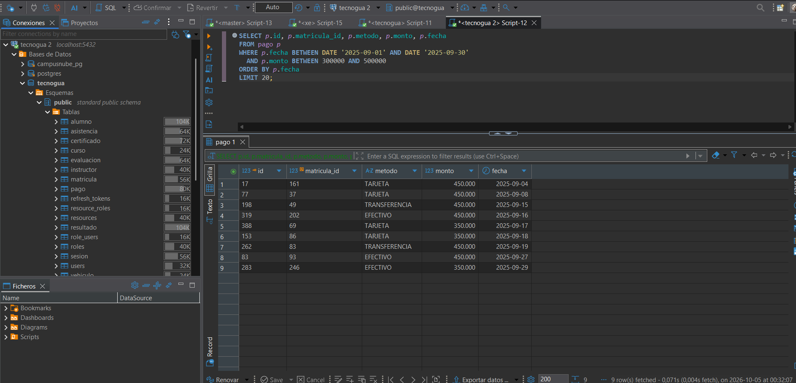

*Figura 163. Resultado de la consulta W02 en PostgreSQL.*

| Registro de ejecución | |
|---|---|
| Filas obtenidas | |
| Tiempo de ejecución (ms) | |
| Observaciones | |

*Nota de sintaxis (PostgreSQL):* Particularidades de sintaxis de este motor en esta consulta: `LIMIT n` para limitar filas; literal de fecha `DATE 'AAAA-MM-DD'`.

##### W02 · SQL Server

```sql
SELECT TOP 20 p.id, p.matricula_id, p.metodo, p.monto, p.fecha
FROM pago p
WHERE p.fecha BETWEEN '2025-09-01' AND '2025-09-30'
  AND p.monto BETWEEN 300000 AND 500000
ORDER BY p.fecha;
```

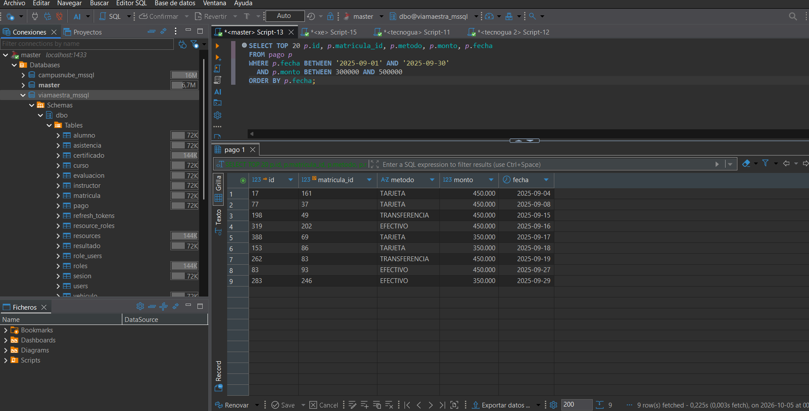

*Figura 164. Resultado de la consulta W02 en SQL Server.*

| Registro de ejecución | |
|---|---|
| Filas obtenidas | |
| Tiempo de ejecución (ms) | |
| Observaciones | |

*Nota de sintaxis (SQL Server):* Particularidades de sintaxis de este motor en esta consulta: `SELECT TOP n` para limitar filas.

##### W02 · Oracle

```sql
SELECT p.id, p.matricula_id, p.metodo, p.monto, p.fecha
FROM pago p
WHERE p.fecha BETWEEN DATE '2025-09-01' AND DATE '2025-09-30'
  AND p.monto BETWEEN 300000 AND 500000
ORDER BY p.fecha
FETCH FIRST 20 ROWS ONLY;
```

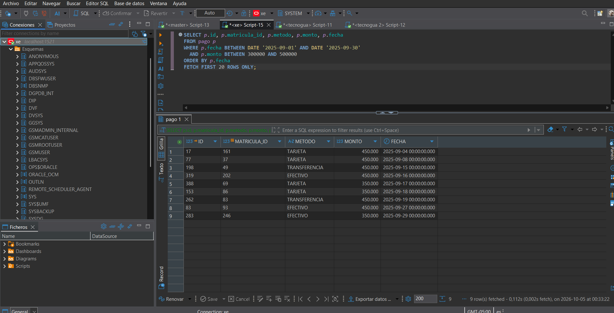

*Figura 165. Resultado de la consulta W02 en Oracle.*

| Registro de ejecución | |
|---|---|
| Filas obtenidas | |
| Tiempo de ejecución (ms) | |
| Observaciones | |

*Nota de sintaxis (Oracle):* Particularidades de sintaxis de este motor en esta consulta: `FETCH FIRST n ROWS ONLY` para limitar filas; literal de fecha `DATE 'AAAA-MM-DD'`.

#### W03 — IN: pagos por tarjeta o transferencia

**Situación de negocio.** Tesorería concilia los pagos electrónicos —tarjeta y transferencia— pendientes de verificar contra el extracto bancario, y deja por fuera los pagos en efectivo.

**Concepto de SQL.** `IN (...)` reemplaza varias comparaciones `OR` sobre la misma columna. Es más corto y más fácil de leer cuando la lista crece.

**Resultado esperado.** La columna `metodo` solo contiene `TARJETA` o `TRANSFERENCIA`; nunca `EFECTIVO`.

##### W03 · MySQL

```sql
SELECT p.id, p.matricula_id, p.metodo, p.monto, p.estado
FROM pago p
WHERE p.metodo IN ('TARJETA', 'TRANSFERENCIA') AND p.estado = 'PENDIENTE'
ORDER BY p.fecha
LIMIT 20;
```

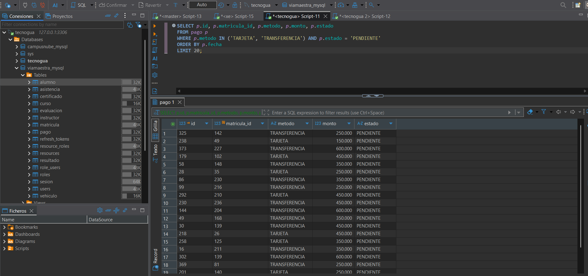

*Figura 166. Resultado de la consulta W03 en MySQL.*

| Registro de ejecución | |
|---|---|
| Filas obtenidas | |
| Tiempo de ejecución (ms) | |
| Observaciones | |

*Nota de sintaxis (MySQL):* Particularidades de sintaxis de este motor en esta consulta: `LIMIT n` para limitar filas.

##### W03 · PostgreSQL

```sql
SELECT p.id, p.matricula_id, p.metodo, p.monto, p.estado
FROM pago p
WHERE p.metodo IN ('TARJETA', 'TRANSFERENCIA') AND p.estado = 'PENDIENTE'
ORDER BY p.fecha
LIMIT 20;
```

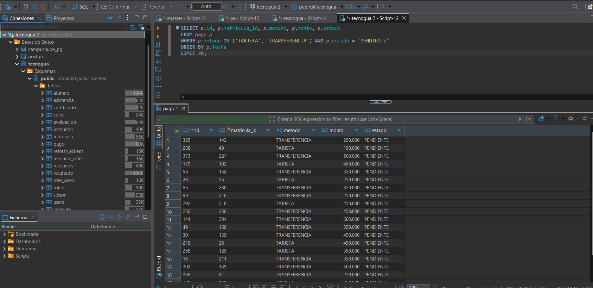

*Figura 167. Resultado de la consulta W03 en PostgreSQL.*

| Registro de ejecución | |
|---|---|
| Filas obtenidas | |
| Tiempo de ejecución (ms) | |
| Observaciones | |

*Nota de sintaxis (PostgreSQL):* Particularidades de sintaxis de este motor en esta consulta: `LIMIT n` para limitar filas.

##### W03 · SQL Server

```sql
SELECT TOP 20 p.id, p.matricula_id, p.metodo, p.monto, p.estado
FROM pago p
WHERE p.metodo IN ('TARJETA', 'TRANSFERENCIA') AND p.estado = 'PENDIENTE'
ORDER BY p.fecha;
```

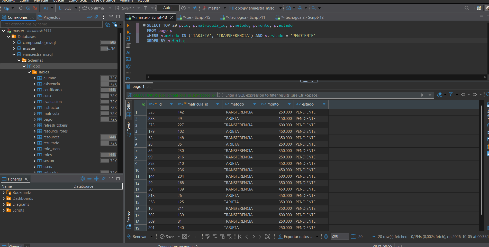

*Figura 168. Resultado de la consulta W03 en SQL Server.*

| Registro de ejecución | |
|---|---|
| Filas obtenidas | |
| Tiempo de ejecución (ms) | |
| Observaciones | |

*Nota de sintaxis (SQL Server):* Particularidades de sintaxis de este motor en esta consulta: `SELECT TOP n` para limitar filas.

##### W03 · Oracle

```sql
SELECT p.id, p.matricula_id, p.metodo, p.monto, p.estado
FROM pago p
WHERE p.metodo IN ('TARJETA', 'TRANSFERENCIA') AND p.estado = 'PENDIENTE'
ORDER BY p.fecha
FETCH FIRST 20 ROWS ONLY;
```

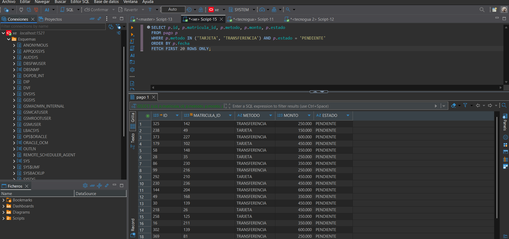

*Figura 169. Resultado de la consulta W03 en Oracle.*

| Registro de ejecución | |
|---|---|
| Filas obtenidas | |
| Tiempo de ejecución (ms) | |
| Observaciones | |

*Nota de sintaxis (Oracle):* Particularidades de sintaxis de este motor en esta consulta: `FETCH FIRST n ROWS ONLY` para limitar filas.

#### W04 — OR con paréntesis: alumnos con documentos pendientes o inactivos

**Situación de negocio.** Secretaría debe depurar la base: alumnos con documentación pendiente o que fueron inactivados, pero solo de los que tienen correo Gmail, porque son los únicos con los que se puede avisar por ese canal.

**Concepto de SQL.** Mezcla de `OR` y `AND`. Los **paréntesis** son decisivos: sin ellos, `AND` tendría prioridad sobre `OR` y la consulta devolvería resultados distintos.

**Resultado esperado.** Cada fila cumple (documentos pendientes **o** inactivo) y además tiene correo Gmail.

##### W04 · MySQL

```sql
SELECT a.id, a.nombre, a.apellidos, a.correo, a.estado_documental, a.is_active
FROM alumno a
WHERE (a.estado_documental = 'PENDIENTE' OR a.is_active = 'INACTIVE')
  AND a.correo LIKE '%gmail.com'
ORDER BY a.apellidos
LIMIT 20;
```

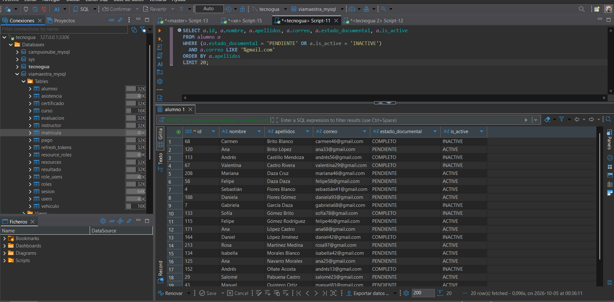

*Figura 170. Resultado de la consulta W04 en MySQL.*

| Registro de ejecución | |
|---|---|
| Filas obtenidas | |
| Tiempo de ejecución (ms) | |
| Observaciones | |

*Nota de sintaxis (MySQL):* Particularidades de sintaxis de este motor en esta consulta: `LIMIT n` para limitar filas.

##### W04 · PostgreSQL

```sql
SELECT a.id, a.nombre, a.apellidos, a.correo, a.estado_documental, a.is_active
FROM alumno a
WHERE (a.estado_documental = 'PENDIENTE' OR a.is_active = 'INACTIVE')
  AND a.correo LIKE '%gmail.com'
ORDER BY a.apellidos
LIMIT 20;
```

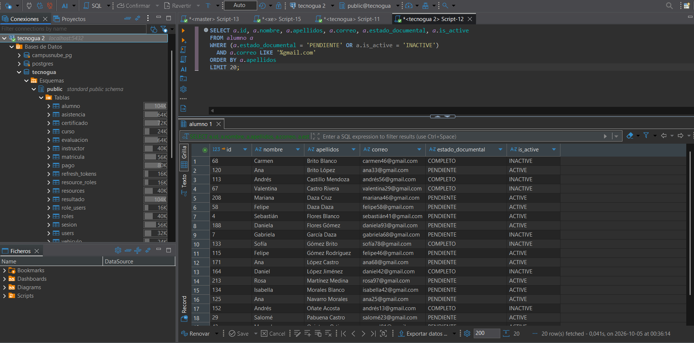

*Figura 171. Resultado de la consulta W04 en PostgreSQL.*

| Registro de ejecución | |
|---|---|
| Filas obtenidas | |
| Tiempo de ejecución (ms) | |
| Observaciones | |

*Nota de sintaxis (PostgreSQL):* Particularidades de sintaxis de este motor en esta consulta: `LIMIT n` para limitar filas.

##### W04 · SQL Server

```sql
SELECT TOP 20 a.id, a.nombre, a.apellidos, a.correo, a.estado_documental, a.is_active
FROM alumno a
WHERE (a.estado_documental = 'PENDIENTE' OR a.is_active = 'INACTIVE')
  AND a.correo LIKE '%gmail.com'
ORDER BY a.apellidos;
```

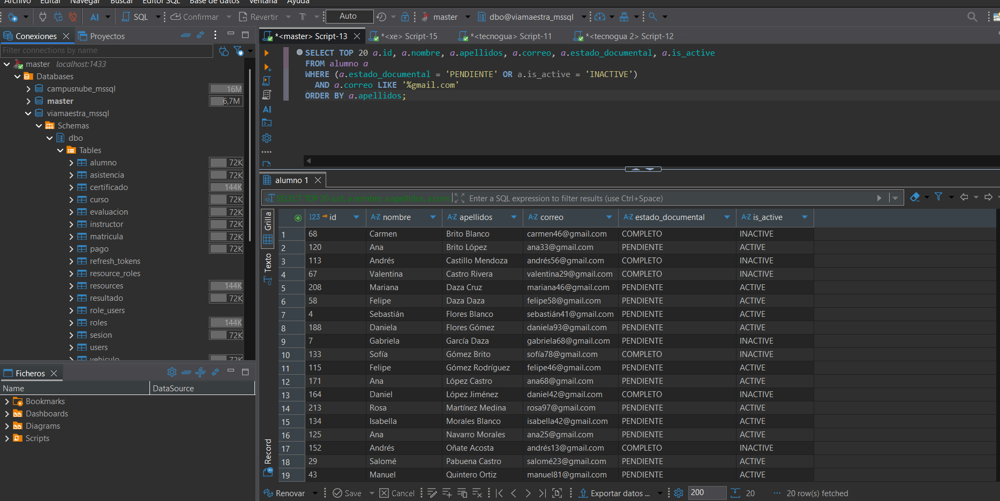

*Figura 172. Resultado de la consulta W04 en SQL Server.*

| Registro de ejecución | |
|---|---|
| Filas obtenidas | |
| Tiempo de ejecución (ms) | |
| Observaciones | |

*Nota de sintaxis (SQL Server):* Particularidades de sintaxis de este motor en esta consulta: `SELECT TOP n` para limitar filas.

##### W04 · Oracle

```sql
SELECT a.id, a.nombre, a.apellidos, a.correo, a.estado_documental, a.is_active
FROM alumno a
WHERE (a.estado_documental = 'PENDIENTE' OR a.is_active = 'INACTIVE')
  AND a.correo LIKE '%gmail.com'
ORDER BY a.apellidos
FETCH FIRST 20 ROWS ONLY;
```

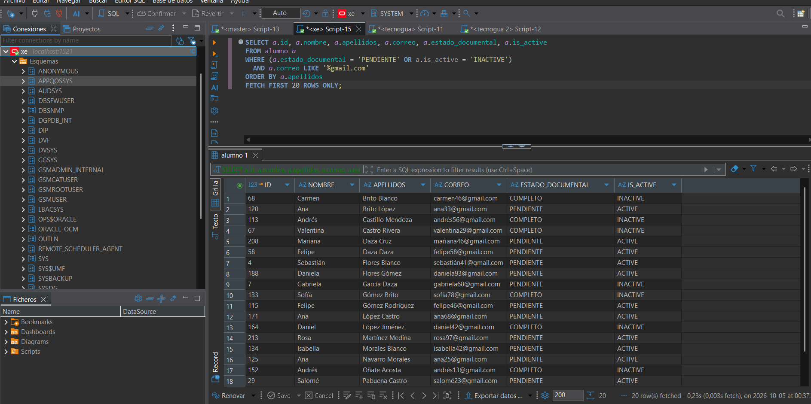

*Figura 173. Resultado de la consulta W04 en Oracle.*

| Registro de ejecución | |
|---|---|
| Filas obtenidas | |
| Tiempo de ejecución (ms) | |
| Observaciones | |

*Nota de sintaxis (Oracle):* Particularidades de sintaxis de este motor en esta consulta: `FETCH FIRST n ROWS ONLY` para limitar filas.

#### W05 — IS NULL: sesiones teóricas (sin vehículo) programadas

**Situación de negocio.** Operaciones quiere ver las clases de aula —teóricas— que siguen programadas, es decir, las sesiones que no tienen vehículo asignado.

**Concepto de SQL.** `IS NULL` es la única forma correcta de buscar valores nulos: `= NULL` nunca es verdadero porque `NULL` no es igual a nada, ni siquiera a otro `NULL`.

**Resultado esperado.** La columna `vehiculo_id` debe estar vacía en todas las filas y el estado debe ser `PROGRAMADA`.

##### W05 · MySQL

```sql
SELECT s.id, s.curso_id, s.fecha_inicio, s.total
FROM sesion s
WHERE s.vehiculo_id IS NULL AND s.estado = 'PROGRAMADA'
ORDER BY s.fecha_inicio
LIMIT 20;
```

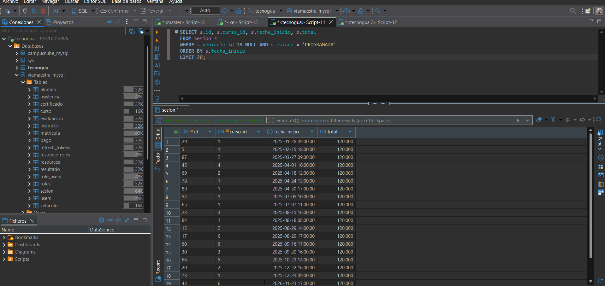

*Figura 174. Resultado de la consulta W05 en MySQL.*

| Registro de ejecución | |
|---|---|
| Filas obtenidas | |
| Tiempo de ejecución (ms) | |
| Observaciones | |

*Nota de sintaxis (MySQL):* Particularidades de sintaxis de este motor en esta consulta: `LIMIT n` para limitar filas.

##### W05 · PostgreSQL

```sql
SELECT s.id, s.curso_id, s.fecha_inicio, s.total
FROM sesion s
WHERE s.vehiculo_id IS NULL AND s.estado = 'PROGRAMADA'
ORDER BY s.fecha_inicio
LIMIT 20;
```

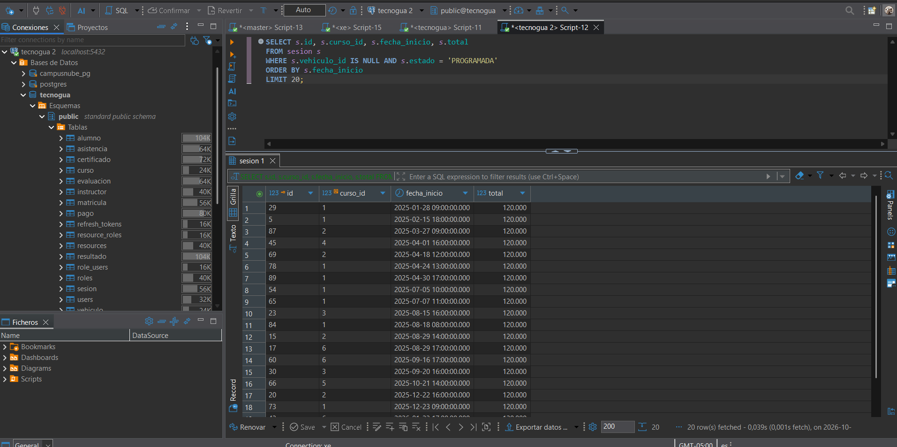

*Figura 175. Resultado de la consulta W05 en PostgreSQL.*

| Registro de ejecución | |
|---|---|
| Filas obtenidas | |
| Tiempo de ejecución (ms) | |
| Observaciones | |

*Nota de sintaxis (PostgreSQL):* Particularidades de sintaxis de este motor en esta consulta: `LIMIT n` para limitar filas.

##### W05 · SQL Server

```sql
SELECT TOP 20 s.id, s.curso_id, s.fecha_inicio, s.total
FROM sesion s
WHERE s.vehiculo_id IS NULL AND s.estado = 'PROGRAMADA'
ORDER BY s.fecha_inicio;
```

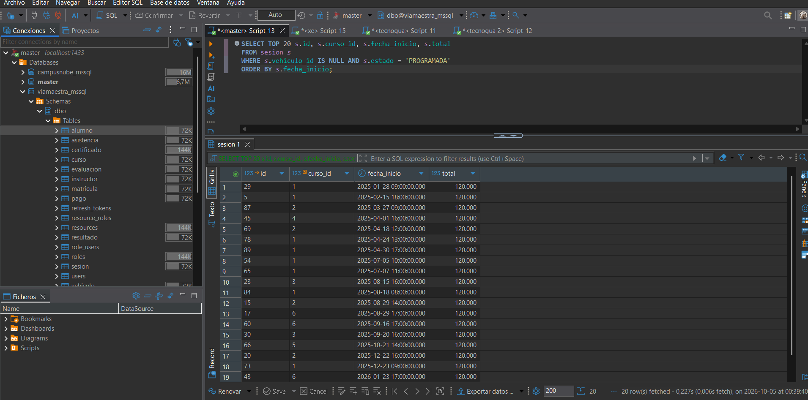

*Figura 176. Resultado de la consulta W05 en SQL Server.*

| Registro de ejecución | |
|---|---|
| Filas obtenidas | |
| Tiempo de ejecución (ms) | |
| Observaciones | |

*Nota de sintaxis (SQL Server):* Particularidades de sintaxis de este motor en esta consulta: `SELECT TOP n` para limitar filas.

##### W05 · Oracle

```sql
SELECT s.id, s.curso_id, s.fecha_inicio, s.total
FROM sesion s
WHERE s.vehiculo_id IS NULL AND s.estado = 'PROGRAMADA'
ORDER BY s.fecha_inicio
FETCH FIRST 20 ROWS ONLY;
```

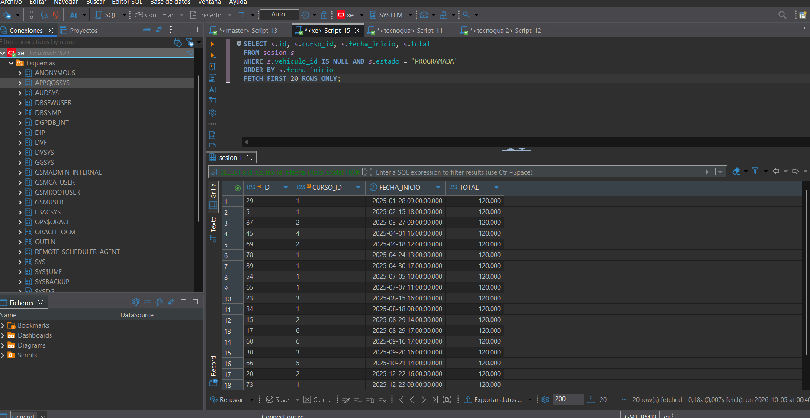

*Figura 177. Resultado de la consulta W05 en Oracle.*

| Registro de ejecución | |
|---|---|
| Filas obtenidas | |
| Tiempo de ejecución (ms) | |
| Observaciones | |

*Nota de sintaxis (Oracle):* Particularidades de sintaxis de este motor en esta consulta: `FETCH FIRST n ROWS ONLY` para limitar filas.

#### W06 — IS NOT NULL: sesiones con observaciones

**Situación de negocio.** Coordinación revisa las sesiones que tienen alguna observación registrada (cancelaciones por lluvia, falla mecánica, instructor no disponible) para llevar una estadística de incidentes.

**Concepto de SQL.** `IS NOT NULL` filtra las filas donde el campo opcional sí tiene contenido.

**Resultado esperado.** La columna de observaciones no debe tener valores vacíos en ninguna fila.

##### W06 · MySQL

```sql
SELECT s.id, s.fecha_inicio, s.estado, s.observaciones
FROM sesion s
WHERE s.observaciones IS NOT NULL
ORDER BY s.fecha_inicio
LIMIT 20;
```

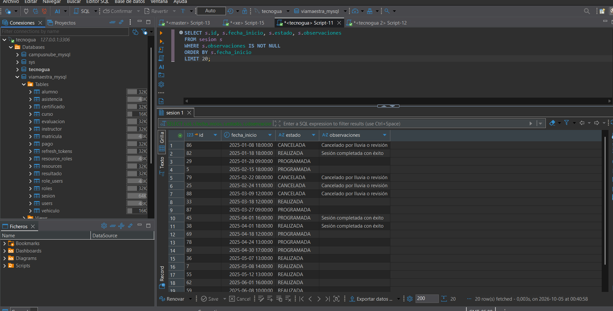

*Figura 178. Resultado de la consulta W06 en MySQL.*

| Registro de ejecución | |
|---|---|
| Filas obtenidas | |
| Tiempo de ejecución (ms) | |
| Observaciones | |

*Nota de sintaxis (MySQL):* Particularidades de sintaxis de este motor en esta consulta: `LIMIT n` para limitar filas.

##### W06 · PostgreSQL

```sql
SELECT s.id, s.fecha_inicio, s.estado, s.observaciones
FROM sesion s
WHERE s.observaciones IS NOT NULL
ORDER BY s.fecha_inicio
LIMIT 20;
```

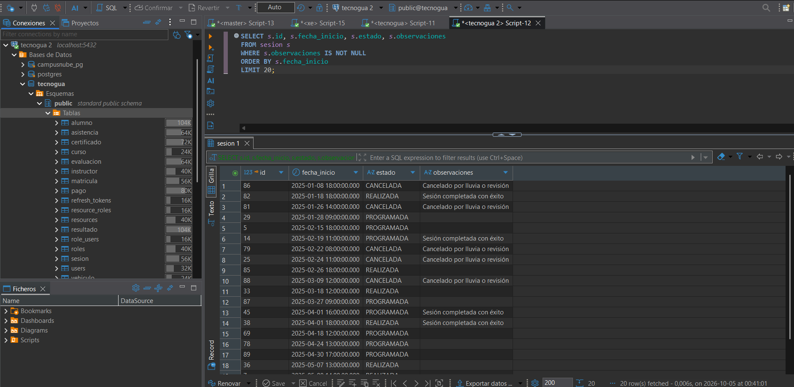

*Figura 179. Resultado de la consulta W06 en PostgreSQL.*

| Registro de ejecución | |
|---|---|
| Filas obtenidas | |
| Tiempo de ejecución (ms) | |
| Observaciones | |

*Nota de sintaxis (PostgreSQL):* Particularidades de sintaxis de este motor en esta consulta: `LIMIT n` para limitar filas.

##### W06 · SQL Server

```sql
SELECT TOP 20 s.id, s.fecha_inicio, s.estado, s.observaciones
FROM sesion s
WHERE s.observaciones IS NOT NULL
ORDER BY s.fecha_inicio;
```

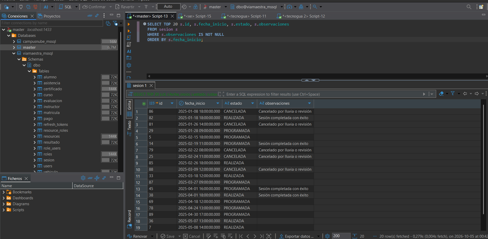

*Figura 180. Resultado de la consulta W06 en SQL Server.*

| Registro de ejecución | |
|---|---|
| Filas obtenidas | |
| Tiempo de ejecución (ms) | |
| Observaciones | |

*Nota de sintaxis (SQL Server):* Particularidades de sintaxis de este motor en esta consulta: `SELECT TOP n` para limitar filas.

##### W06 · Oracle

```sql
SELECT s.id, s.fecha_inicio, s.estado, s.observaciones
FROM sesion s
WHERE s.observaciones IS NOT NULL
ORDER BY s.fecha_inicio
FETCH FIRST 20 ROWS ONLY;
```

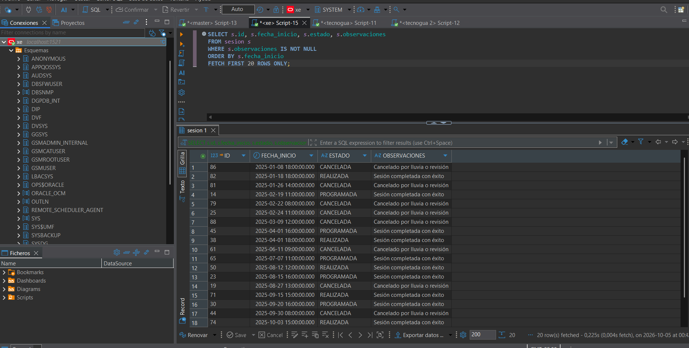

*Figura 181. Resultado de la consulta W06 en Oracle.*

| Registro de ejecución | |
|---|---|
| Filas obtenidas | |
| Tiempo de ejecución (ms) | |
| Observaciones | |

*Nota de sintaxis (Oracle):* Particularidades de sintaxis de este motor en esta consulta: `FETCH FIRST n ROWS ONLY` para limitar filas.

#### W07 — Comparación de fechas: sesiones realizadas antes de 2026

**Situación de negocio.** La coordinación académica requiere revisar las sesiones realizadas antes del 1 de enero de 2026 para consolidar el cierre del año anterior.

**Concepto de SQL.** Comparación de fechas con el operador `<` sobre una columna de fecha y hora. El literal de fecha se escribe de forma distinta según el motor.

**Resultado esperado.** Todas las sesiones listadas tienen estado `REALIZADA` y fecha de inicio anterior al 1 de enero de 2026, en orden cronológico.

##### W07 · MySQL

```sql
SELECT s.id, s.curso_id, s.fecha_inicio, s.estado
FROM sesion s
WHERE s.estado = 'REALIZADA' AND s.fecha_inicio < DATE '2026-01-01'
ORDER BY s.fecha_inicio;
```

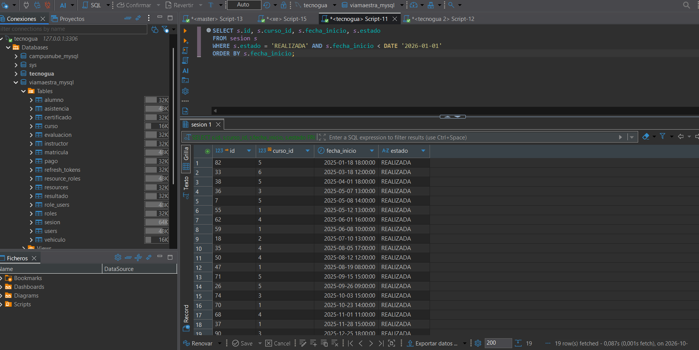

*Figura 182. Resultado de la consulta W07 en MySQL.*

| Registro de ejecución | |
|---|---|
| Filas obtenidas | |
| Tiempo de ejecución (ms) | |
| Observaciones | |

*Nota de sintaxis (MySQL):* Particularidades de sintaxis de este motor en esta consulta: literal de fecha `DATE 'AAAA-MM-DD'`.

##### W07 · PostgreSQL

```sql
SELECT s.id, s.curso_id, s.fecha_inicio, s.estado
FROM sesion s
WHERE s.estado = 'REALIZADA' AND s.fecha_inicio < DATE '2026-01-01'
ORDER BY s.fecha_inicio;
```

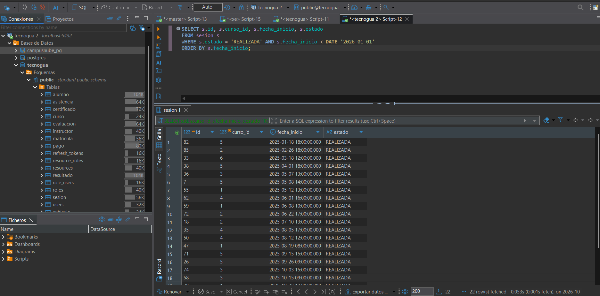

*Figura 183. Resultado de la consulta W07 en PostgreSQL.*

| Registro de ejecución | |
|---|---|
| Filas obtenidas | |
| Tiempo de ejecución (ms) | |
| Observaciones | |

*Nota de sintaxis (PostgreSQL):* Particularidades de sintaxis de este motor en esta consulta: literal de fecha `DATE 'AAAA-MM-DD'`.

##### W07 · SQL Server

```sql
SELECT s.id, s.curso_id, s.fecha_inicio, s.estado
FROM sesion s
WHERE s.estado = 'REALIZADA' AND s.fecha_inicio < '2026-01-01'
ORDER BY s.fecha_inicio;
```

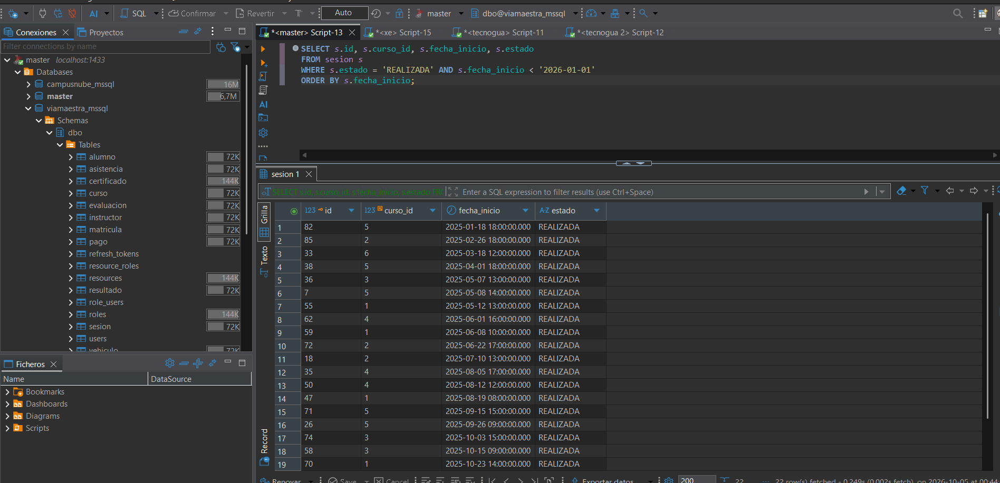

*Figura 184. Resultado de la consulta W07 en SQL Server.*

| Registro de ejecución | |
|---|---|
| Filas obtenidas | |
| Tiempo de ejecución (ms) | |
| Observaciones | |

*Nota de sintaxis (SQL Server):* La sentencia es idéntica en los cuatro motores y no requirió adaptaciones de sintaxis.

##### W07 · Oracle

```sql
SELECT s.id, s.curso_id, s.fecha_inicio, s.estado
FROM sesion s
WHERE s.estado = 'REALIZADA' AND s.fecha_inicio < DATE '2026-01-01'
ORDER BY s.fecha_inicio;
```

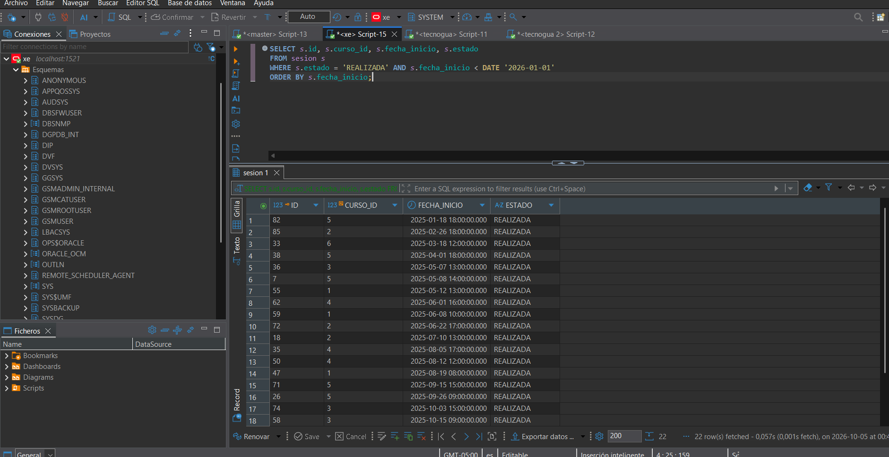

*Figura 185. Resultado de la consulta W07 en Oracle.*

| Registro de ejecución | |
|---|---|
| Filas obtenidas | |
| Tiempo de ejecución (ms) | |
| Observaciones | |

*Nota de sintaxis (Oracle):* Particularidades de sintaxis de este motor en esta consulta: literal de fecha `DATE 'AAAA-MM-DD'`.

#### W08 — NOT: matrículas que no están canceladas ni completadas

**Situación de negocio.** Cartera solo cobra a las matrículas vigentes, por lo que debe excluir las que ya están canceladas o completadas.

**Concepto de SQL.** `NOT` aplicado a una condición (`NOT IN` o `NOT (... OR ...)`) para excluir un conjunto de valores. Equivale a listar todos los demás estados.

**Resultado esperado.** Solo aparecen matrículas cuyo estado no es `CANCELADA` ni `COMPLETADA`, es decir, las activas.

##### W08 · MySQL

```sql
SELECT m.id, m.estudiante_id, m.periodo, m.estado
FROM matricula m
WHERE NOT (m.estado = 'CANCELADA' OR m.estado = 'COMPLETADA')
ORDER BY m.id
LIMIT 15;
```

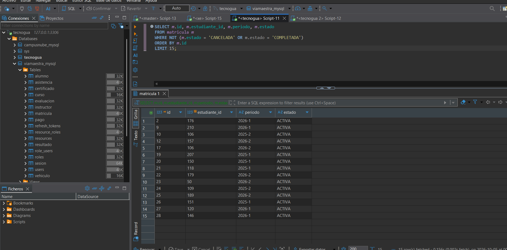

*Figura 186. Resultado de la consulta W08 en MySQL.*

| Registro de ejecución | |
|---|---|
| Filas obtenidas | |
| Tiempo de ejecución (ms) | |
| Observaciones | |

*Nota de sintaxis (MySQL):* Particularidades de sintaxis de este motor en esta consulta: `LIMIT n` para limitar filas.

##### W08 · PostgreSQL

```sql
SELECT m.id, m.estudiante_id, m.periodo, m.estado
FROM matricula m
WHERE NOT (m.estado = 'CANCELADA' OR m.estado = 'COMPLETADA')
ORDER BY m.id
LIMIT 15;
```

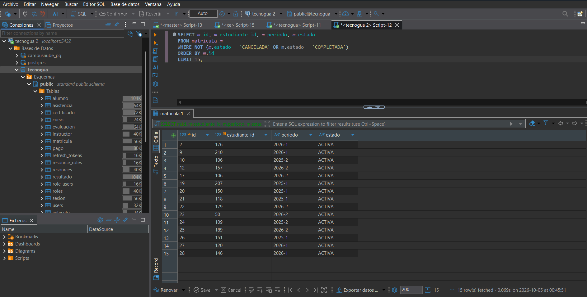

*Figura 187. Resultado de la consulta W08 en PostgreSQL.*

| Registro de ejecución | |
|---|---|
| Filas obtenidas | |
| Tiempo de ejecución (ms) | |
| Observaciones | |

*Nota de sintaxis (PostgreSQL):* Particularidades de sintaxis de este motor en esta consulta: `LIMIT n` para limitar filas.

##### W08 · SQL Server

```sql
SELECT TOP 15 m.id, m.estudiante_id, m.periodo, m.estado
FROM matricula m
WHERE NOT (m.estado = 'CANCELADA' OR m.estado = 'COMPLETADA')
ORDER BY m.id;
```

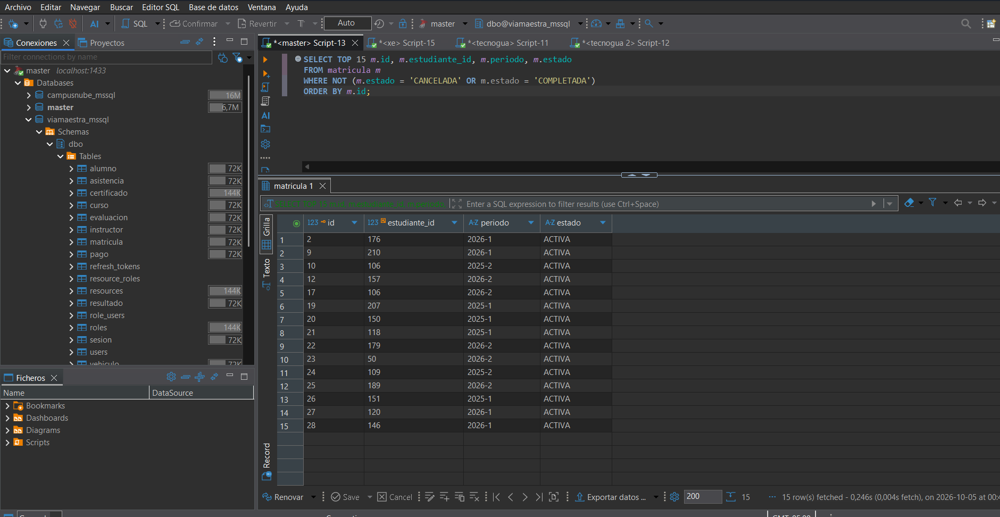

*Figura 188. Resultado de la consulta W08 en SQL Server.*

| Registro de ejecución | |
|---|---|
| Filas obtenidas | |
| Tiempo de ejecución (ms) | |
| Observaciones | |

*Nota de sintaxis (SQL Server):* Particularidades de sintaxis de este motor en esta consulta: `SELECT TOP n` para limitar filas.

##### W08 · Oracle

```sql
SELECT m.id, m.estudiante_id, m.periodo, m.estado
FROM matricula m
WHERE NOT (m.estado = 'CANCELADA' OR m.estado = 'COMPLETADA')
ORDER BY m.id
FETCH FIRST 15 ROWS ONLY;
```

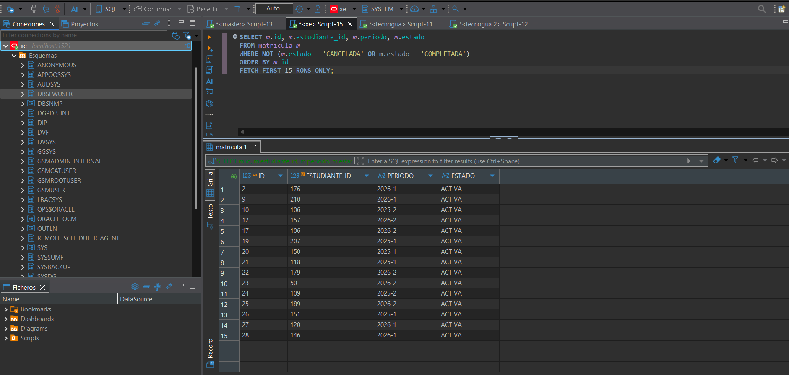

*Figura 189. Resultado de la consulta W08 en Oracle.*

| Registro de ejecución | |
|---|---|
| Filas obtenidas | |
| Tiempo de ejecución (ms) | |
| Observaciones | |

*Nota de sintaxis (Oracle):* Particularidades de sintaxis de este motor en esta consulta: `FETCH FIRST n ROWS ONLY` para limitar filas.

---

## 10. Matriz de verificación de evidencias

La siguiente matriz permite verificar el registro de la evidencia fotográfica de cada consulta. La columna *Ajuste* indica si la sentencia coincide con la del esquema original (*Sin cambios*), si fue modificada para el esquema de datos cargado (*Adaptada*) o si fue reemplazada por una consulta equivalente en concepto (*Sustituida*).

| Código | Tema | Ajuste | MySQL | PostgreSQL | SQL Server | Oracle |
|---|---|---|:---:|:---:|:---:|:---:|
| Q00 | 0. Verificación de la carga de datos | Sin cambios | ☐ | ☐ | ☐ | ☐ |
| L01 | 1. LIKE — búsqueda por patrones | Sin cambios | ☐ | ☐ | ☐ | ☐ |
| L02 | 1. LIKE — búsqueda por patrones | Sin cambios | ☐ | ☐ | ☐ | ☐ |
| L03 | 1. LIKE — búsqueda por patrones | Sin cambios | ☐ | ☐ | ☐ | ☐ |
| L04 | 1. LIKE — búsqueda por patrones | Sin cambios | ☐ | ☐ | ☐ | ☐ |
| L05 | 1. LIKE — búsqueda por patrones | Sin cambios | ☐ | ☐ | ☐ | ☐ |
| L06 | 1. LIKE — búsqueda por patrones | Sin cambios | ☐ | ☐ | ☐ | ☐ |
| L07 | 1. LIKE — búsqueda por patrones | Adaptada | ☐ | ☐ | ☐ | ☐ |
| S01 | 2. Subconsultas | Sin cambios | ☐ | ☐ | ☐ | ☐ |
| S02 | 2. Subconsultas | Adaptada | ☐ | ☐ | ☐ | ☐ |
| S03 | 2. Subconsultas | Adaptada | ☐ | ☐ | ☐ | ☐ |
| S04 | 2. Subconsultas | Adaptada | ☐ | ☐ | ☐ | ☐ |
| S05 | 2. Subconsultas | Adaptada | ☐ | ☐ | ☐ | ☐ |
| S06 | 2. Subconsultas | Sin cambios | ☐ | ☐ | ☐ | ☐ |
| G01 | 3. GROUP BY — agrupación y agregación | Adaptada | ☐ | ☐ | ☐ | ☐ |
| G02 | 3. GROUP BY — agrupación y agregación | Sin cambios | ☐ | ☐ | ☐ | ☐ |
| G03 | 3. GROUP BY — agrupación y agregación | Sin cambios | ☐ | ☐ | ☐ | ☐ |
| G04 | 3. GROUP BY — agrupación y agregación | Adaptada | ☐ | ☐ | ☐ | ☐ |
| G05 | 3. GROUP BY — agrupación y agregación | Sin cambios | ☐ | ☐ | ☐ | ☐ |
| G06 | 3. GROUP BY — agrupación y agregación | Sustituida | ☐ | ☐ | ☐ | ☐ |
| H01 | 4. HAVING — filtro sobre grupos | Adaptada | ☐ | ☐ | ☐ | ☐ |
| H02 | 4. HAVING — filtro sobre grupos | Adaptada | ☐ | ☐ | ☐ | ☐ |
| H03 | 4. HAVING — filtro sobre grupos | Adaptada | ☐ | ☐ | ☐ | ☐ |
| H04 | 4. HAVING — filtro sobre grupos | Sustituida | ☐ | ☐ | ☐ | ☐ |
| H05 | 4. HAVING — filtro sobre grupos | Sustituida | ☐ | ☐ | ☐ | ☐ |
| H06 | 4. HAVING — filtro sobre grupos | Adaptada | ☐ | ☐ | ☐ | ☐ |
| O01 | 5. ORDER BY — ordenamiento | Sin cambios | ☐ | ☐ | ☐ | ☐ |
| O02 | 5. ORDER BY — ordenamiento | Sin cambios | ☐ | ☐ | ☐ | ☐ |
| O03 | 5. ORDER BY — ordenamiento | Adaptada | ☐ | ☐ | ☐ | ☐ |
| O04 | 5. ORDER BY — ordenamiento | Sustituida | ☐ | ☐ | ☐ | ☐ |
| O05 | 5. ORDER BY — ordenamiento | Sustituida | ☐ | ☐ | ☐ | ☐ |
| O06 | 5. ORDER BY — ordenamiento | Adaptada | ☐ | ☐ | ☐ | ☐ |
| J01 | 6. JOIN — combinación de tablas | Adaptada | ☐ | ☐ | ☐ | ☐ |
| J02 | 6. JOIN — combinación de tablas | Adaptada | ☐ | ☐ | ☐ | ☐ |
| J03 | 6. JOIN — combinación de tablas | Adaptada | ☐ | ☐ | ☐ | ☐ |
| J04 | 6. JOIN — combinación de tablas | Adaptada | ☐ | ☐ | ☐ | ☐ |
| J05 | 6. JOIN — combinación de tablas | Adaptada | ☐ | ☐ | ☐ | ☐ |
| J06 | 6. JOIN — combinación de tablas | Adaptada | ☐ | ☐ | ☐ | ☐ |
| J07 | 6. JOIN — combinación de tablas | Adaptada | ☐ | ☐ | ☐ | ☐ |
| W01 | 7. WHERE — filtros por fila | Adaptada | ☐ | ☐ | ☐ | ☐ |
| W02 | 7. WHERE — filtros por fila | Adaptada | ☐ | ☐ | ☐ | ☐ |
| W03 | 7. WHERE — filtros por fila | Sin cambios | ☐ | ☐ | ☐ | ☐ |
| W04 | 7. WHERE — filtros por fila | Sin cambios | ☐ | ☐ | ☐ | ☐ |
| W05 | 7. WHERE — filtros por fila | Adaptada | ☐ | ☐ | ☐ | ☐ |
| W06 | 7. WHERE — filtros por fila | Sin cambios | ☐ | ☐ | ☐ | ☐ |
| W07 | 7. WHERE — filtros por fila | Sustituida | ☐ | ☐ | ☐ | ☐ |
| W08 | 7. WHERE — filtros por fila | Adaptada | ☐ | ☐ | ☐ | ☐ |

**Total de capturas requeridas:** 47 consultas × 4 motores = **188** imágenes, más el diagrama entidad-relación del modelo.

## 11. Análisis comparativo entre motores

### 11.1 Resultados

Las consultas basadas en el estándar SQL (`SELECT`, `JOIN`, `GROUP BY`, `HAVING`, `ORDER BY` y subconsultas) devuelven resultados equivalentes en los cuatro motores. Las únicas diferencias esperables en el número de filas provienen de la sensibilidad a mayúsculas en `LIKE` (PostgreSQL y Oracle), del orden de los empates en `ORDER BY` y del formato de las fechas.

### 11.2 Sintaxis

- **Limitación de filas:** `LIMIT n` (MySQL y PostgreSQL), `SELECT TOP n` (SQL Server) y `FETCH FIRST n ROWS ONLY` (Oracle 12c o superior).
- **Concatenación:** `CONCAT()` en MySQL, `||` en PostgreSQL y Oracle, y `+` en SQL Server.
- **Fechas:** la agrupación por año y mes emplea `DATE_FORMAT`, `TO_CHAR` o `CONVERT` según el motor.
- **Alias de tabla:** Oracle no admite la palabra `AS` en alias de tabla.
- **`GROUP BY`:** PostgreSQL, SQL Server y Oracle exigen incluir todas las columnas no agregadas; MySQL es más flexible cuando se agrupa por la clave primaria.

### 11.3 Rendimiento

Con el volumen de datos utilizado (1.761 registros en el negocio) las diferencias de tiempo son mínimas y poco significativas. A continuación se registran los tiempos de ejecución de algunas consultas con `JOIN` de varias tablas.

| Consulta | MySQL (ms) | PostgreSQL (ms) | SQL Server (ms) | Oracle (ms) |
|---|---:|---:|---:|---:|
| J05 | | | | |
| S05 | | | | |
| G06 | | | | |
| H04 | | | | |
| J06 | | | | |

### 11.4 Observaciones generales

- El **estándar SQL** se comporta de forma equivalente en los cuatro motores.
- Las diferencias se concentran en las **funciones auxiliares**: limitación de filas, concatenación, fechas y manejo de mayúsculas.
- Oracle y SQL Server resultaron los más estrictos con la sintaxis (por ejemplo, alias de tabla sin `AS` en Oracle).
- PostgreSQL y Oracle distinguen mayúsculas en `LIKE`, por lo que conviene normalizar el texto con `LOWER()`.

## 12. Conclusiones

1. Las **situaciones de negocio** permiten comprender la utilidad de cada cláusula: `LIKE` para segmentar, `GROUP BY` y `HAVING` para indicadores, `JOIN` para integrar información dispersa y las subconsultas para comparar contra valores calculados.
2. La diferencia entre `WHERE` y `HAVING` es la distinción conceptual más relevante: el primero filtra filas antes de agrupar y el segundo filtra grupos.
3. Las construcciones `LEFT JOIN ... IS NULL` y `NOT EXISTS` resuelven problemas de ausencia (alumnos sin matrícula, vehículos sin sesiones) que un `INNER JOIN` no puede resolver.
4. El *self join* permitió validar una regla de negocio (no solapar sesiones) directamente en SQL.
5. Aunque SQL es un estándar, **cada motor tiene su propio dialecto**; conocer las diferencias evita errores al migrar consultas entre sistemas.
6. Disponer de más de 200 datos ficticios hizo que los resultados fueran significativos y no triviales.

## 13. Anexos

### 13.1 Problemas frecuentes por motor

| Motor | Problema | Solución |
|---|---|---|
| MySQL | Error de conexión con Docker o WSL2 | Verifique que el contenedor está levantado y que el puerto expuesto es el configurado en DBeaver |
| MySQL | Caracteres con tilde se ven mal | Use `utf8mb4` en la base y en la conexión |
| PostgreSQL | `CREATE DATABASE` no se ejecuta con el resto del script | Ejecútelo solo, en modo auto-commit, y luego conéctese a la base creada |
| PostgreSQL | `LIKE` no encuentra resultados | Revise las mayúsculas o use `LOWER()` / `ILIKE` |
| SQL Server | `INSERT` con `id` falla | Asegúrese de que cada tabla esté entre `SET IDENTITY_INSERT ... ON/OFF` (el archivo de datos ya lo incluye) |
| SQL Server | `CREATE PROCEDURE` o `CREATE TRIGGER` marca error | Debe ser la única sentencia del lote; ejecútelo seleccionando solo ese bloque |
| Oracle | `ORA-00933` por usar `AS` en alias de tabla | Elimine el `AS` en alias de tablas |
| Oracle | No se puede crear tablas | Conéctese con el usuario/esquema propio, no con `SYS`; otorgue los permisos `CREATE TABLE` |
| Oracle | Un bloque PL/SQL no termina | El bloque debe cerrar con una línea que contenga solo `/` |
| Todos | Violación de clave única al cargar datos | Las tablas deben estar vacías; ejecute el bloque de limpieza y cree el esquema de nuevo |

---

*Fin del informe.*
