# Proyecto VíaMaestra — Base de datos multi-motor

Documentación de la creación de la base de datos del proyecto **VíaMaestra** (formación de conductores) implementada en cuatro motores distintos: **MySQL 8.0**, **PostgreSQL**, **Microsoft SQL Server** y **Oracle**, usando **DBeaver** como cliente de conexión.

Cada sección corresponde a **una tabla (o grupo de tablas relacionadas)** y dentro de esa sección se muestra la evidencia de esa misma tabla ya creada en los 4 motores, una junto a otra.

> Reemplaza cada `` por tu captura real de DBeaver (clic derecho sobre la tabla → *Ver datos* / *Ver estructura*, o el resultado del `CREATE TABLE` ejecutado sin errores).

---

## 1. Introducción

- **Nombre del proyecto:** VíaMaestra — Academia / agenda / evaluaciones / certificación de conductores.
- **Motores utilizados:** MySQL 8.0, PostgreSQL, Microsoft SQL Server, Oracle Database.
- **Herramienta cliente:** DBeaver (una conexión por motor).
- **Objetivo:** modelar el mismo esquema (módulo de autenticación RBAC + módulo de negocio) en los 4 motores, evidenciando las diferencias de sintaxis entre ellos (autoincremento, tipos ENUM, tipos de texto, etc.).

## 2. Conexiones creadas en DBeaver

Captura de las 4 conexiones activas en el panel de *Database Navigator* de DBeaver.

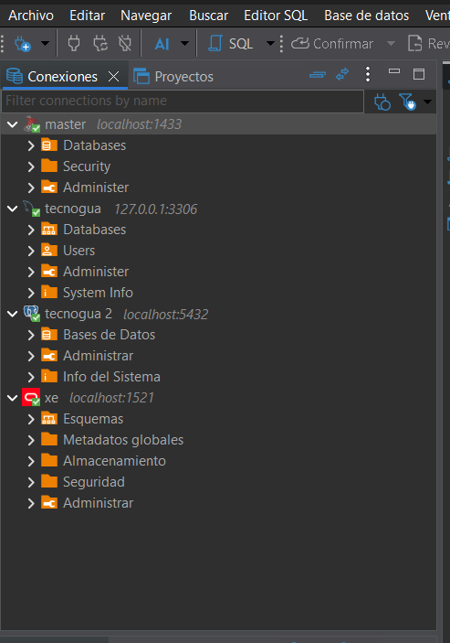

| Motor | Base de datos | Puerto por defecto |
|---|---|---|
| MySQL | `viamaestra_mysql` | 3306 |
| PostgreSQL | `viamaestra_pg` | 5432 |
| SQL Server | `viamaestra_mssql` | 1433 |
| Oracle | esquema propio (ej. XEPDB1) | 1521 |

## 3. Creación de las bases de datos

Evidencia de la ejecución del `CREATE DATABASE` (o creación del esquema, en el caso de Oracle) en cada motor.

| MySQL | PostgreSQL | SQL Server | Oracle |
|---|---|---|---|
| 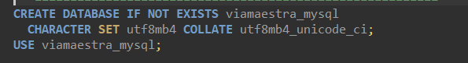 |  | 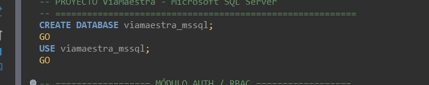 | 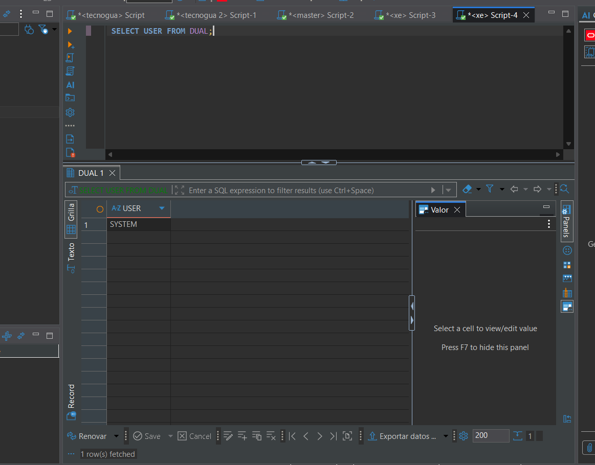 |

---

## 4. Módulo de autenticación y autorización (RBAC)

Modelo transversal obligatorio, común a los 4 motores. Está formado por seis tablas: `users`, `roles`, `role_users` (relación N:M entre usuarios y roles), `resources` (rutas HTTP protegidas, identificadas por `path` + `method`), `resource_roles` (relación N:M entre recursos y roles, es decir, qué rol puede acceder a qué ruta) y `refresh_tokens` (tokens de sesión por dispositivo). En lugar de una captura por tabla, se muestra una sola evidencia por motor con las 6 tablas ya creadas y su estructura, tomada expandiendo el esquema en el árbol de DBeaver (o del resultado de `\dt` / `SELECT * FROM information_schema.tables` según el motor).

### 4.1 MySQL

**Qué se hizo:** se ejecutó el bloque de `CREATE TABLE` del módulo RBAC del script `01_mysql.sql` sobre la base `viamaestra_mysql`, en la pestaña SQL de DBeaver conectada a esa base, usando "Execute SQL Script".
**Cómo se evidencia:** se expandió `viamaestra_mysql → Tables` en el árbol de la conexión para mostrar las 6 tablas creadas en un solo pantallazo.

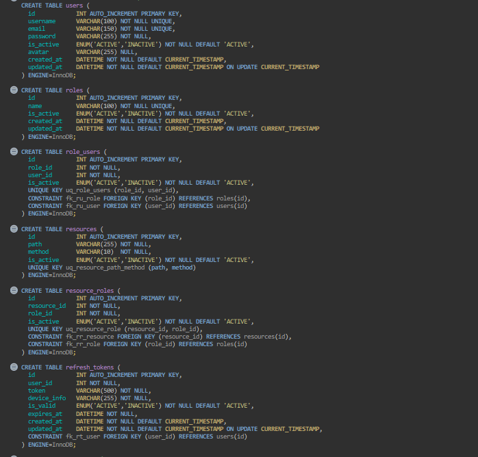

### 4.2 PostgreSQL

**Qué se hizo:** se creó primero el tipo `status_enum` y luego las 6 tablas del script `02_postgresql.sql` sobre la base `viamaestra_pg`.
**Cómo se evidencia:** se expandió `viamaestra_pg → Schemas → public → Tables` en el árbol de DBeaver, mostrando las 6 tablas en una sola captura.

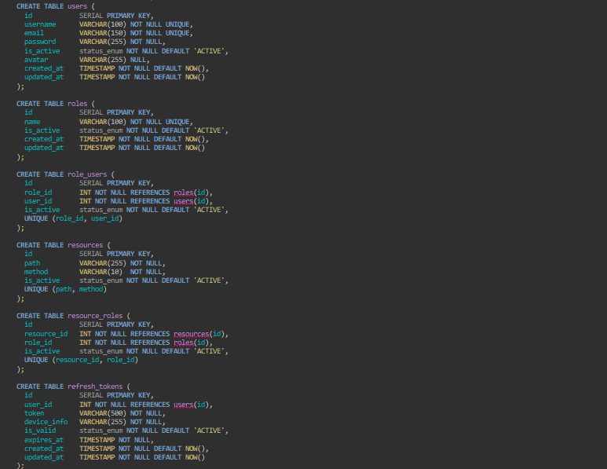

### 4.3 SQL Server

**Qué se hizo:** se ejecutó el script `03_sqlserver.sql` (separado por `GO`) sobre la base `viamaestra_mssql` recién creada.
**Cómo se evidencia:** se expandió `viamaestra_mssql → Tables` en el árbol de DBeaver, con las 6 tablas visibles en una sola captura.

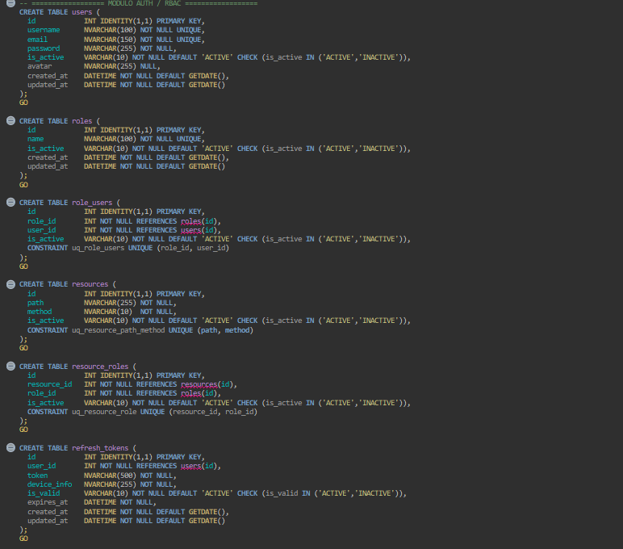

### 4.4 Oracle

**Qué se hizo:** se ejecutó el bloque RBAC del script `04_oracle.sql` conectado directamente al esquema/usuario de Oracle (sin `CREATE DATABASE`, ya que en Oracle el esquema cumple ese rol).
**Cómo se evidencia:** se expandió el esquema en el árbol de DBeaver (`Tables`), mostrando las 6 tablas creadas en una sola captura.

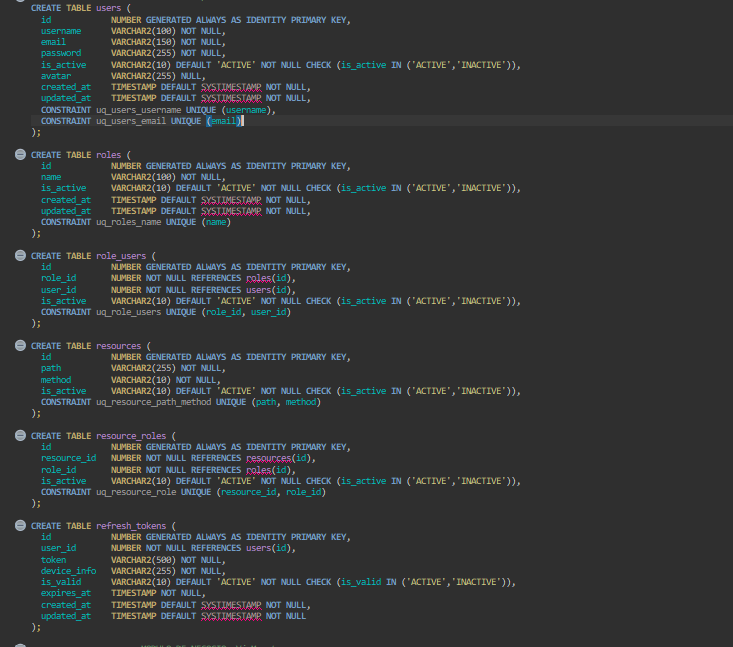

---

## 5. Módulo de negocio — VíaMaestra

### 5.1 Tabla `alumno`

| | |
|---|---|
| **Propósito** | Entidad de negocio que representa al estudiante inscrito en la academia. |
| **Campos clave** | `nombre`, `descripcion`, `is_active`, `created_at`, `updated_at`. |
| **Relaciones** | `user_id UNIQUE` (opcional) → `users.id`, para los alumnos que además cuentan con credenciales de acceso al sistema. |
| **Evidencia** | Estructura de la tabla ya creada, capturada desde el árbol de esquema de DBeaver en cada motor. |

| MySQL | PostgreSQL | SQL Server | Oracle |
|---|---|---|---|
| 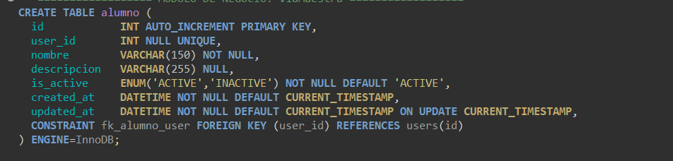 | 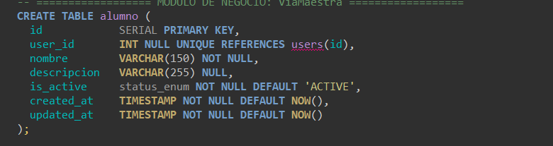 | 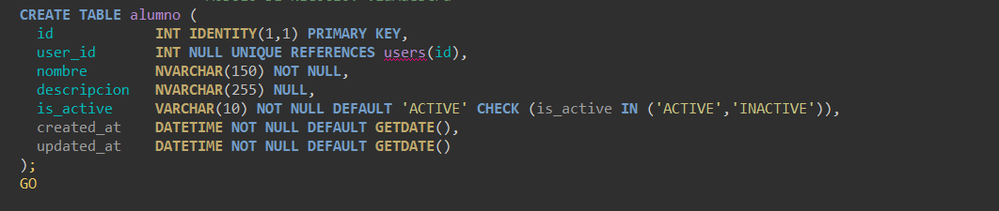 | 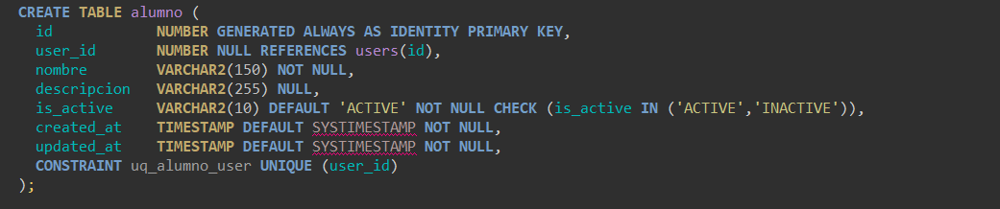 |

### 5.2 Tabla `curso`

| | |
|---|---|
| **Propósito** | Entidad base que representa la oferta académica (cursos teóricos y prácticos) de VíaMaestra. |
| **Campos clave** | `nombre`, `descripcion`, `is_active`, `created_at`, `updated_at`. |
| **Relaciones** | Ninguna dependencia hacia otras tablas de negocio; es la primera entidad creada en este bloque. |
| **Evidencia** | Estructura de la tabla ya creada, capturada desde el árbol de esquema de DBeaver en cada motor. |

| MySQL | PostgreSQL | SQL Server | Oracle |
|---|---|---|---|
| 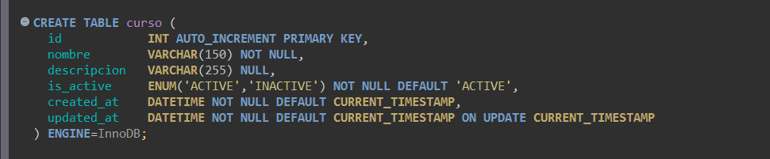 | 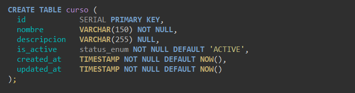 | 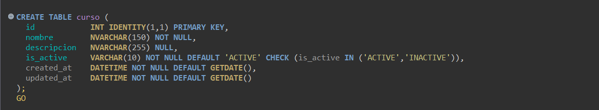 | 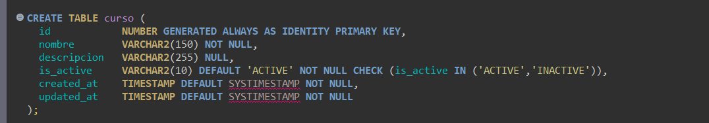 |

### 5.3 Tabla `instructor`

| | |
|---|---|
| **Propósito** | Entidad de negocio que representa al instructor a cargo de las sesiones prácticas. |
| **Campos clave** | `nombre`, `descripcion`, `is_active`, `created_at`, `updated_at`. |
| **Relaciones** | `user_id UNIQUE` (opcional) → `users.id`, para instructores que además cuentan con credenciales de acceso al sistema. |
| **Evidencia** | Estructura de la tabla ya creada, capturada desde el árbol de esquema de DBeaver en cada motor. |

| MySQL | PostgreSQL | SQL Server | Oracle |
|---|---|---|---|
| 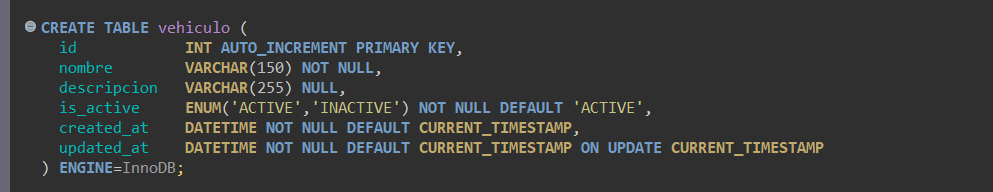 | 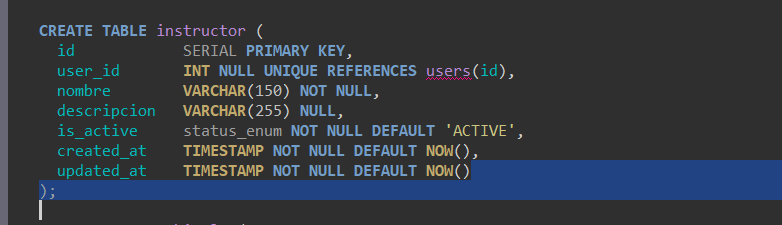 | 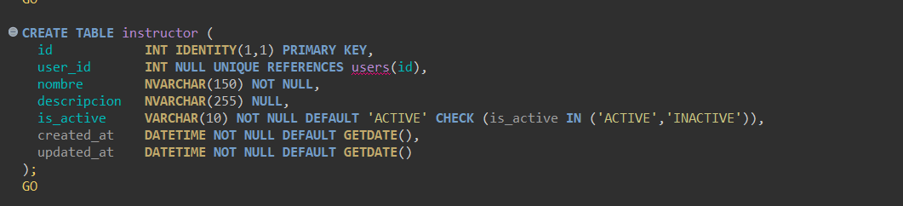 | 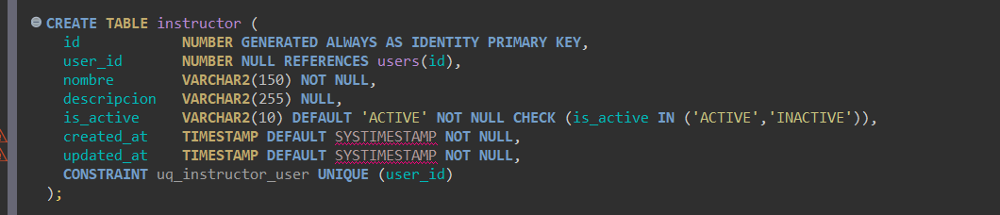 |

### 5.4 Tabla `vehiculo`

| | |
|---|---|
| **Propósito** | Entidad independiente que representa el parque automotor disponible para las sesiones de práctica. |
| **Campos clave** | `nombre`, `descripcion`, `is_active`, `created_at`, `updated_at`. |
| **Relaciones** | Ninguna dependencia directa; es referenciada de forma opcional por `sesion`. |
| **Evidencia** | Estructura de la tabla ya creada, capturada desde el árbol de esquema de DBeaver en cada motor. |

| MySQL | PostgreSQL | SQL Server | Oracle |
|---|---|---|---|
| 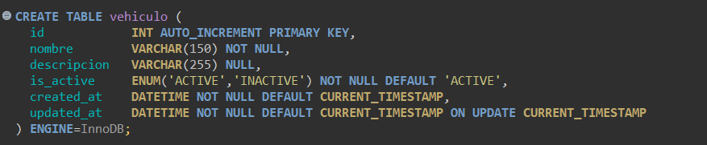 | 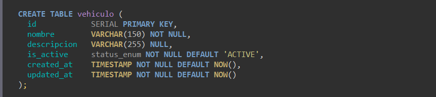 | 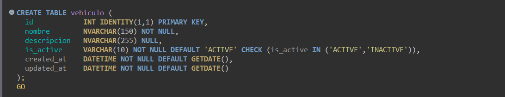 | 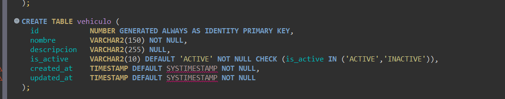 |

### 5.5 Tabla `matricula`

| | |
|---|---|
| **Propósito** | Entidad asociativa que materializa la inscripción de un alumno a un curso, con su propio ciclo de vida. |
| **Campos clave** | `fecha`, `periodo`, `estado`. |
| **Relaciones** | `estudiante_id` → `alumno.id`; `oferta_id` → `curso.id`. Resuelve la relación N:M entre `alumno` y `curso`. |
| **Evidencia** | Estructura de la tabla ya creada, capturada desde el árbol de esquema de DBeaver en cada motor. |

| MySQL | PostgreSQL | SQL Server | Oracle |
|---|---|---|---|
| 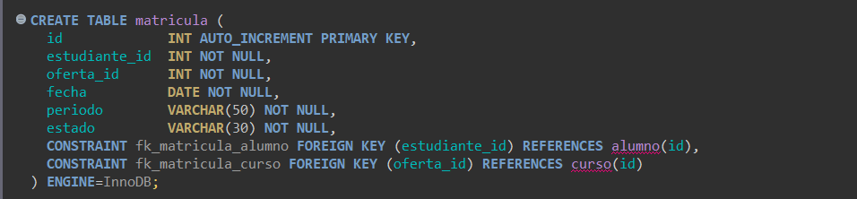 | 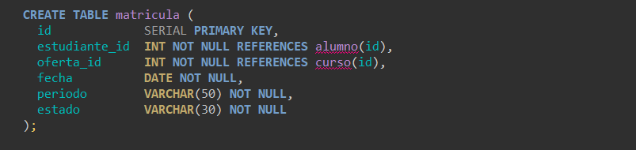 | 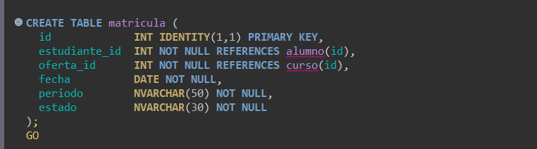 | 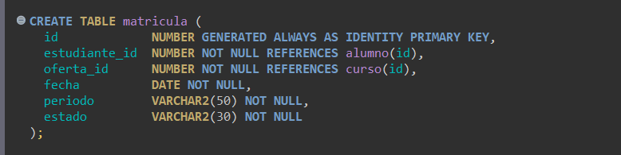 |

### 5.6 Tabla `sesion`

| | |
|---|---|
| **Propósito** | Agenda las clases teóricas y prácticas, evitando solapamientos entre instructores, vehículos y horarios. |
| **Campos clave** | `fecha_inicio`, `fecha_fin`, `total`, `estado`, `observaciones`. |
| **Relaciones** | `curso_id` → `curso.id` (1:N); `instructor_id` → `instructor.id` (1:N); `vehiculo_id` → `vehiculo.id` (0..1:N, opcional). |
| **Evidencia** | Estructura de la tabla ya creada, capturada desde el árbol de esquema de DBeaver en cada motor. |

| MySQL | PostgreSQL | SQL Server | Oracle |
|---|---|---|---|
| 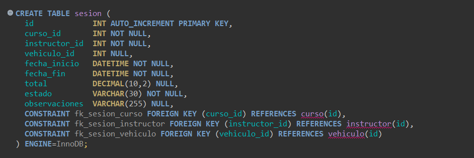 | 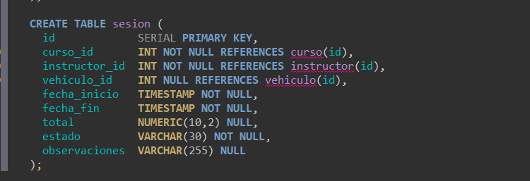 | 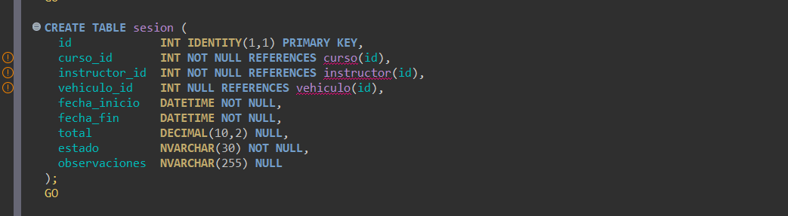 | 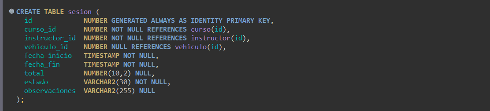 |

### 5.7 Tabla `asistencia`

| | |
|---|---|
| **Propósito** | Registra si un alumno matriculado asistió a una sesión determinada. |
| **Campos clave** | `nombre`, `descripcion`, `is_active`, `created_at`, `updated_at`. |
| **Relaciones** | `matricula_id` → `matricula.id` (1:N); `sesion_id` → `sesion.id` (1:N). |
| **Evidencia** | Estructura de la tabla ya creada, capturada desde el árbol de esquema de DBeaver en cada motor. |

| MySQL | PostgreSQL | SQL Server | Oracle |
|---|---|---|---|
| 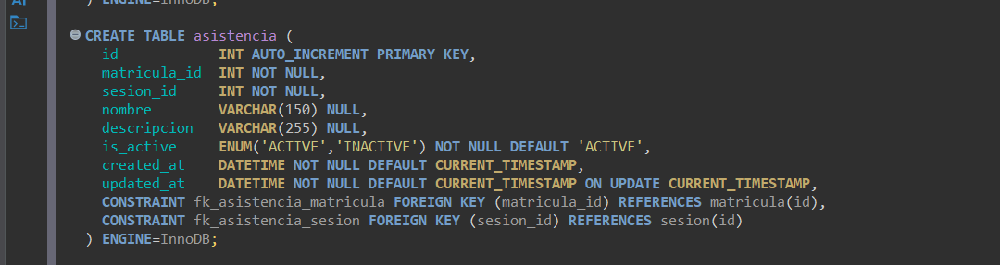 | 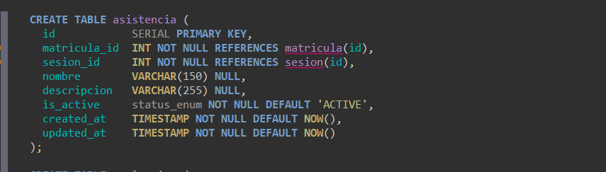 | 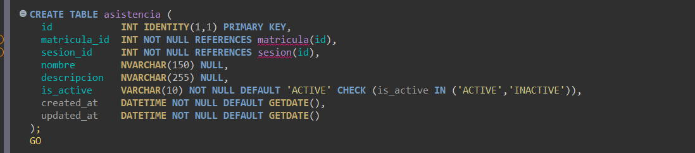 | 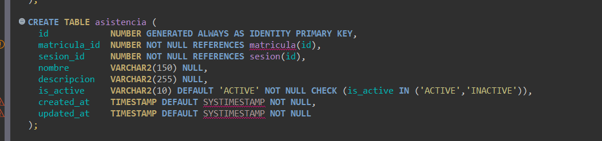 |

### 5.8 Tabla `evaluacion`

| | |
|---|---|
| **Propósito** | Registra las evaluaciones por competencia aplicadas a un alumno, previas a su certificación. |
| **Campos clave** | `nombre`, `descripcion`, `is_active`, `created_at`, `updated_at`. |
| **Relaciones** | `matricula_id` → `matricula.id` (1:N). |
| **Evidencia** | Estructura de la tabla ya creada, capturada desde el árbol de esquema de DBeaver en cada motor. |

| MySQL | PostgreSQL | SQL Server | Oracle |
|---|---|---|---|
| 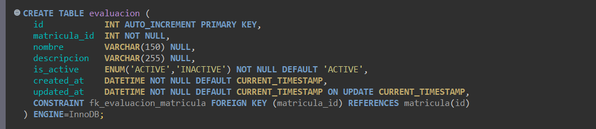 | 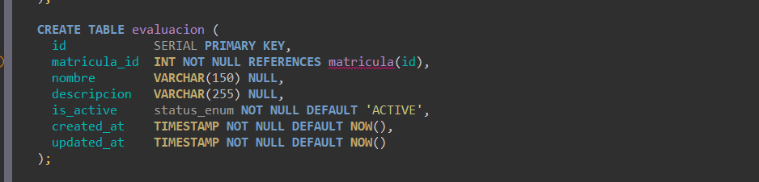 | 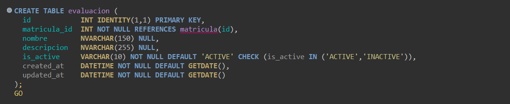 | 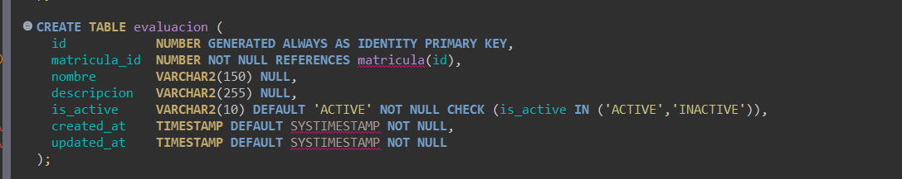 |

### 5.9 Tabla `resultado`

| | |
|---|---|
| **Propósito** | Detalla el resultado obtenido por el alumno en una evaluación específica. |
| **Campos clave** | `nombre`, `descripcion`, `is_active`, `created_at`, `updated_at`. |
| **Relaciones** | `evaluacion_id` → `evaluacion.id` (1:N). |
| **Evidencia** | Estructura de la tabla ya creada, capturada desde el árbol de esquema de DBeaver en cada motor. |

| MySQL | PostgreSQL | SQL Server | Oracle |
|---|---|---|---|
| 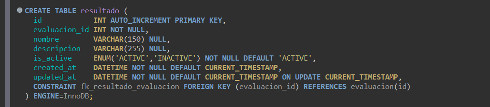 | 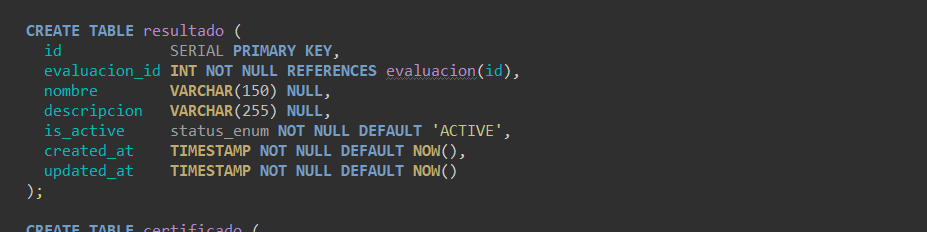 | 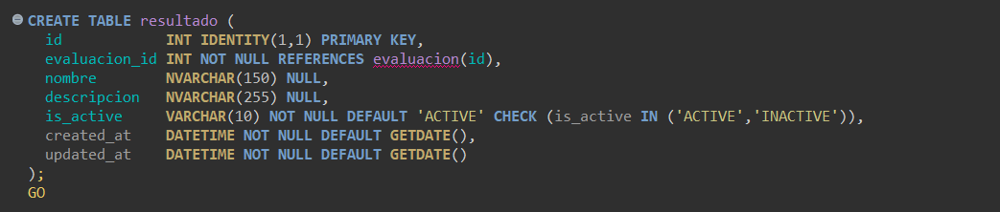 | 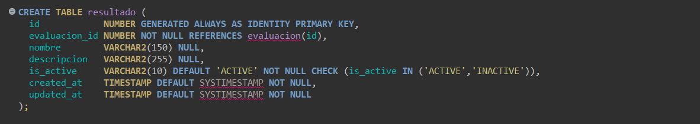 |

### 5.10 Tabla `certificado`

| | |
|---|---|
| **Propósito** | Representa la habilitación final del alumno, una vez cumplidos los requisitos académicos, de asistencia y de pago. |
| **Campos clave** | `nombre`, `descripcion`, `is_active`, `created_at`, `updated_at`. |
| **Relaciones** | `matricula_id UNIQUE` (opcional) → `matricula.id`, relación 0..1:1: una matrícula puede tener a lo sumo un certificado. |
| **Evidencia** | Estructura de la tabla ya creada, capturada desde el árbol de esquema de DBeaver en cada motor. |

| MySQL | PostgreSQL | SQL Server | Oracle |
|---|---|---|---|
| 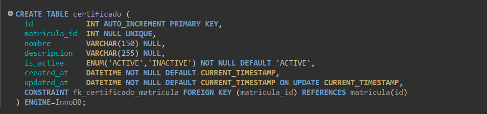 | 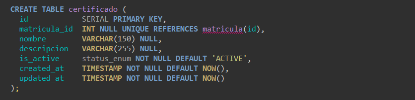 | 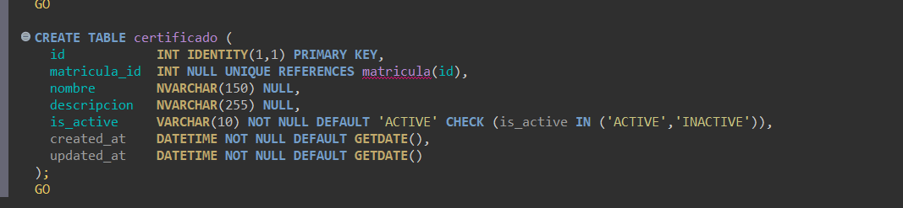 | 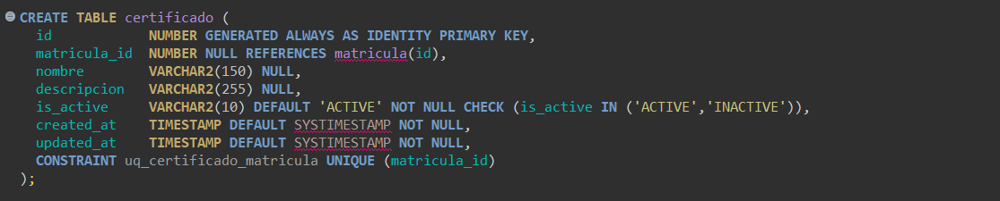 |

### 5.11 Tabla `pago`

| | |
|---|---|
| **Propósito** | Registra los pagos realizados sobre una matrícula; el estado de pago condiciona el avance del alumno a nuevas etapas. |
| **Campos clave** | `referencia_tipo`, `referencia_id`, `metodo`, `monto`, `fecha`, `estado`. |
| **Relaciones** | `matricula_id` → `matricula.id` (1:N). |
| **Evidencia** | Estructura de la tabla ya creada, capturada desde el árbol de esquema de DBeaver en cada motor. |

| MySQL | PostgreSQL | SQL Server | Oracle |
|---|---|---|---|
| 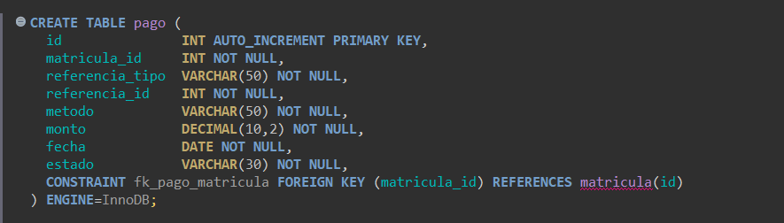 | 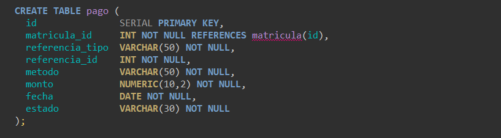 | 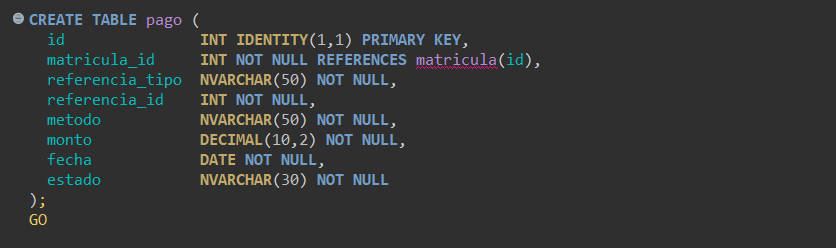 | 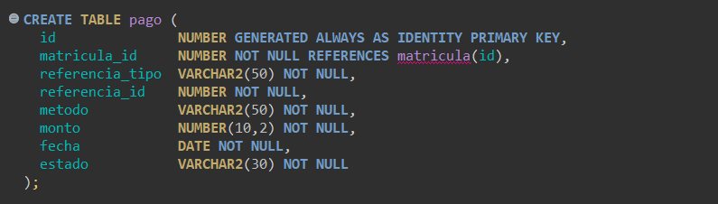 |

---

## 6. Datos iniciales (seed) del módulo RBAC

Evidencia de los `INSERT` iniciales de `roles` (`ADMIN`, `COORDINADOR`, `INSTRUCTOR`, `CARTERA`, `AUDITOR`) y `resources` (`POST /sesiones`, `POST /asistencias`, `POST /evaluaciones`, `POST /certificados`).

| MySQL | PostgreSQL | SQL Server | Oracle |
|---|---|---|---|
| 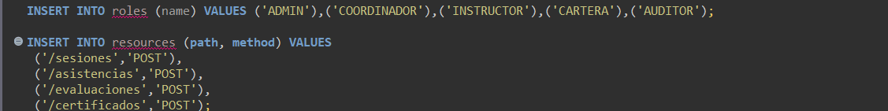 | 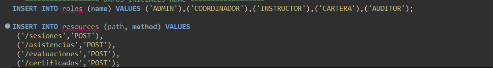 | 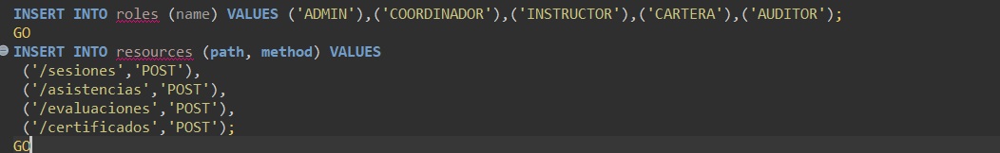 | 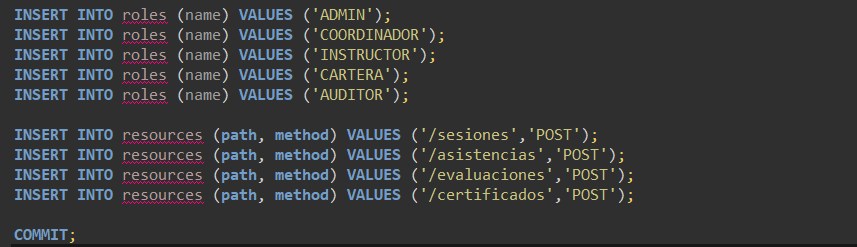 |

## 7. Diferencias de sintaxis entre motores

| Aspecto | MySQL | PostgreSQL | SQL Server | Oracle |
|---|---|---|---|---|
| Autoincremento | `AUTO_INCREMENT` | `SERIAL` | `IDENTITY(1,1)` | `GENERATED ALWAYS AS IDENTITY` |
| Tipo enumerado | `ENUM('ACTIVE','INACTIVE')` | tipo `ENUM` propio (`CREATE TYPE`) | `VARCHAR` + `CHECK` | `VARCHAR2` + `CHECK` |
| Texto | `VARCHAR` | `VARCHAR` | `NVARCHAR` | `VARCHAR2` |
| Fecha/hora actual | `CURRENT_TIMESTAMP` | `NOW()` | `GETDATE()` | `SYSTIMESTAMP` |
| Creación de BD | `CREATE DATABASE` | `CREATE DATABASE` (fuera de transacción) | `CREATE DATABASE` | no aplica (se usa un esquema/usuario) |

## 8. Conclusiones

Implementar el mismo esquema de VíaMaestra en cuatro motores distintos permitió comprobar que, aunque el modelo relacional (entidades, relaciones y restricciones) es idéntico en los cuatro casos, cada motor exige adaptar la sintaxis a sus propias reglas: MySQL y PostgreSQL resuelven el autoincremento y los estados (`ACTIVE`/`INACTIVE`) de forma nativa (`AUTO_INCREMENT` y `ENUM`, `SERIAL` y un tipo `ENUM` propio respectivamente), mientras que SQL Server y Oracle no tienen un tipo ENUM real y hubo que simularlo con `VARCHAR`/`VARCHAR2` más una restricción `CHECK`.

También quedó claro que "crear la base de datos" no significa lo mismo en todos los motores: en MySQL, PostgreSQL y SQL Server existe un `CREATE DATABASE` explícito, mientras que en Oracle ese concepto se traduce en trabajar dentro de un esquema/usuario ya existente, sin necesidad de crear una base nueva.

Separar el modelo en dos módulos (autenticación RBAC y negocio) facilitó reutilizar la misma lógica de permisos para los 40 proyectos de referencia, y mantener las reglas de negocio de VíaMaestra (cupos, solapamientos de sesión, requisitos antes de certificar) desacopladas del sistema de acceso, tal como pedía el enunciado del proyecto.

Como dificultad principal, migrar el script entre motores obligó a revisar caso por caso los tipos de fecha/hora (`CURRENT_TIMESTAMP`, `NOW()`, `GETDATE()`, `SYSTIMESTAMP`) y los tipos de texto (`VARCHAR` vs `NVARCHAR` vs `VARCHAR2`), ya que un mismo script no es portable entre motores sin estos ajustes.
