# Documentación: 4 motores de base de datos en WSL2 con Docker

## 1. Introducción

Este proyecto consistió en levantar cuatro motores de base de datos dentro de WSL2 usando Docker Compose:

- MySQL
- PostgreSQL
- SQL Server
- Oracle XE

La finalidad fue crear un entorno de práctica para aprender la instalación, configuración y uso de diferentes sistemas gestores de bases de datos, además de comprobar que todos pudieran ejecutarse de forma simultánea en el mismo entorno de laboratorio.

Las fuentes de apoyo consultadas fueron las siguientes:

- https://tecnogua.com/academic/site/bd/introduccion/
- https://tecnogua.com/academic/site/bd/instalacion/mysql/
- https://tecnogua.com/academic/site/bd/instalacion/postgresql/
- https://tecnogua.com/academic/site/bd/instalacion/mssql/
- https://tecnogua.com/academic/site/bd/instalacion/oracle/

---

## 2. Objetivo del proyecto

El objetivo principal fue:

- instalar y configurar WSL2 correctamente,
- preparar Docker en Ubuntu,
- crear una red Docker común para todos los contenedores,
- levantar cuatro motores de base de datos en contenedores,
- comprobar que cada uno quedara funcionando,
- documentar el proceso y las evidencias del trabajo realizado.

---

## 3. Requisitos previos

Para cumplir con la actividad se necesitó lo siguiente:

- WSL2 funcionando en Windows
- Ubuntu como distribución principal
- Docker y Docker Compose instalados
- acceso a terminal de Ubuntu
- permiso para ejecutar comandos con sudo
- conexión a internet para descargar imágenes de los motores

---

## 4. Proceso realizado

### 4.1 Actualización del sistema

Lo primero fue actualizar Ubuntu y preparar el entorno base del sistema. Esto fue necesario para evitar errores de dependencias y asegurar compatibilidad con Docker.

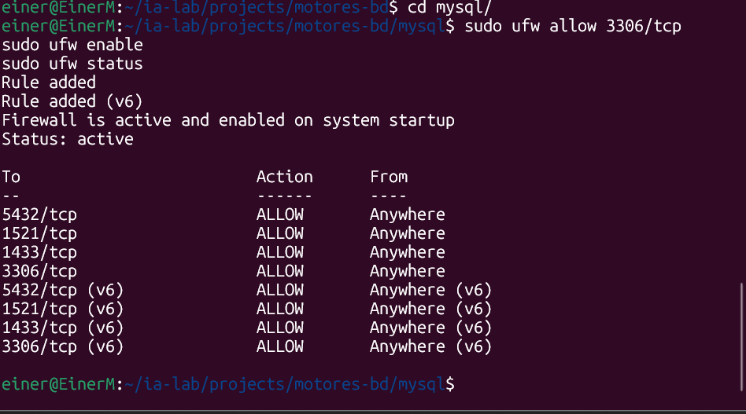

También se aplicaron las actualizaciones del sistema mediante `sudo apt upgrade`.

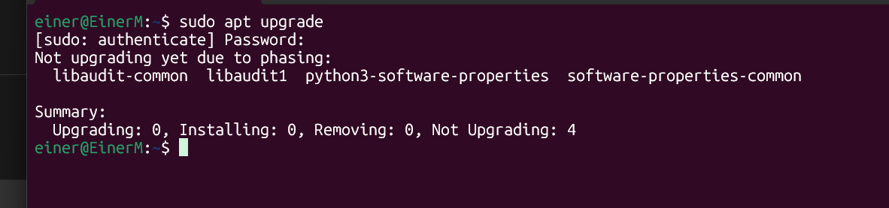

---

### 4.2 Instalación de Docker

Se procedió a instalar Docker en WSL, con los pasos habituales de actualización de paquetes y configuración del repositorio oficial.


La idea era dejar WSL listo para trabajar con contenedores, ya que cada motor se desplegaría como servicio aislado con Docker Compose.

---

### 4.3 Creación de la estructura de carpetas

Se creó la estructura de trabajo para organizar cada motor y sus datos persistentes.

La estructura general era similar a esta:

```bash
~/ia-lab/
├── services/
│   └── motores-bd/
│       ├── mysql/
│       ├── postgres/
│       ├── mssql/
│       └── oracle/
└── data/
    ├── mysql/
    ├── postgres/
    ├── mssql/
    └── oracle/
```

Esto permitió separar cada instalación y conservar los datos en persistencia para que los contenedores no perdieran su información al reiniciarse.

---

### 4.4 Red Docker compartida

Se creó una red Docker común llamada `ia-lab-network` para que todos los motores se pudieran comunicar entre sí si era necesario.

Este paso fue importante para mantener una infraestructura organizada y uniforme.

---

## 5. MySQL

### 5.1 Configuración inicial

Se creó el archivo `docker-compose.yml` para MySQL 8.0 y se configuró el archivo `.env` con la contraseña raíz y la base de datos inicial.

Se levantó el contenedor y quedó en ejecución.

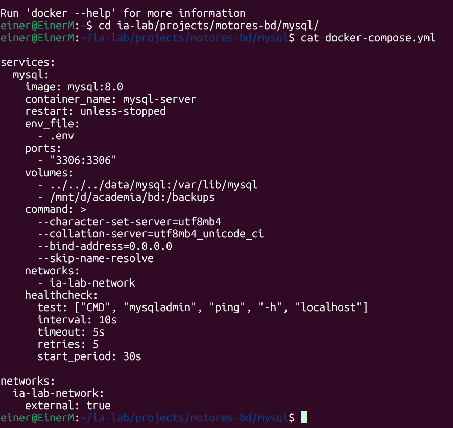

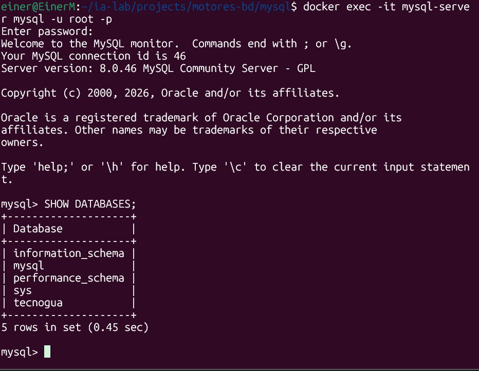

### 5.2 Evidencia de funcionamiento

Dentro del motor se pudo entrar al contenedor y verificar que MySQL quedaba operativo.


Esto evidenció que el servicio ya estaba levantado y listo para crear bases de datos y ejecutar comandos SQL.

---

## 6. PostgreSQL

### 6.1 Instalación y levantamiento

Se descargó la imagen oficial de PostgreSQL y se configuró el contenedor con el puerto `5432` y la base de datos inicial.

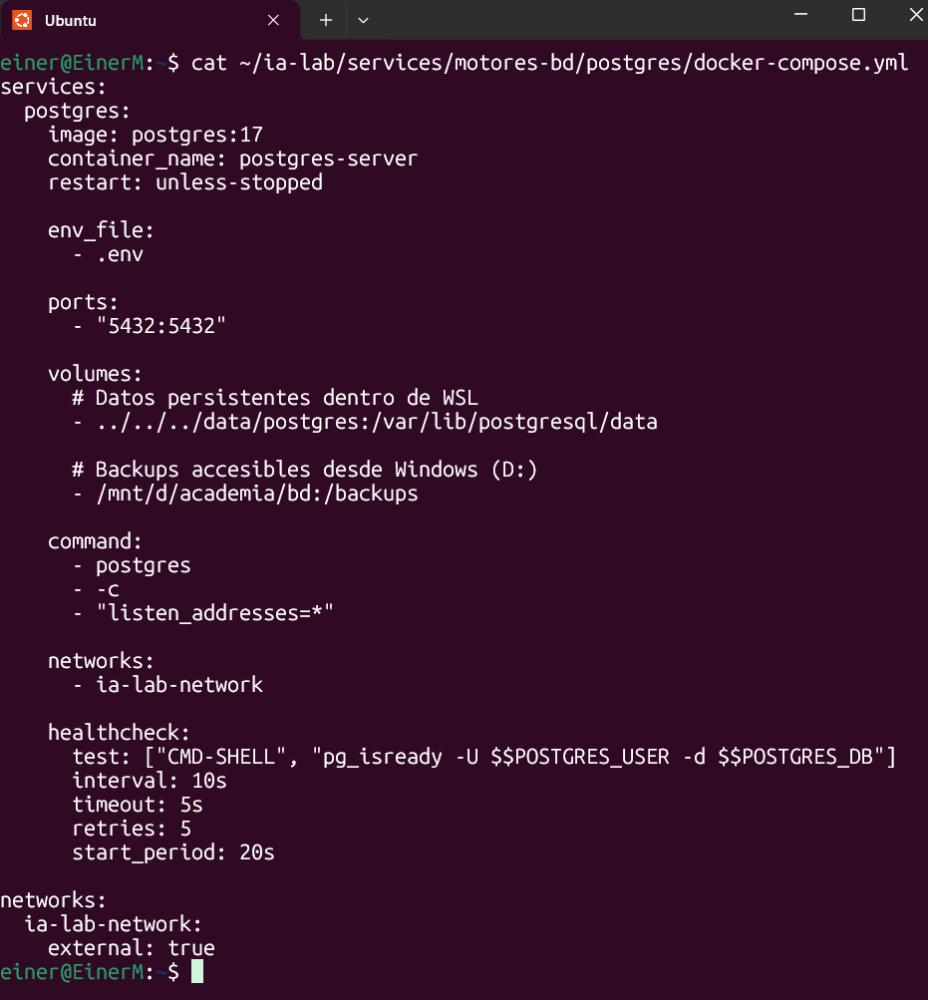

Posteriormente, el servicio quedó levantado y funcionando junto con MySQL.

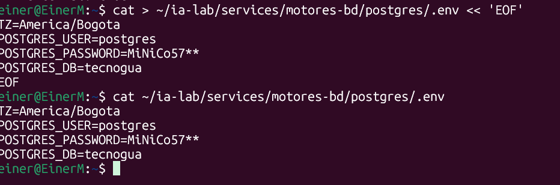

### 6.2 Archivo docker-compose.yml de PostgreSQL

Se definió el servicio `postgres` usando la imagen `postgres:17`, con puerto `5432:5432`, volumen persistente en `../../../data/postgres`, un volumen adicional para respaldos accesible desde Windows (`/mnt/d/academia/bd:/backups`), la red compartida `ia-lab-network` y un healthcheck basado en `pg_isready` para validar que el motor quedara realmente disponible antes de darlo por levantado.

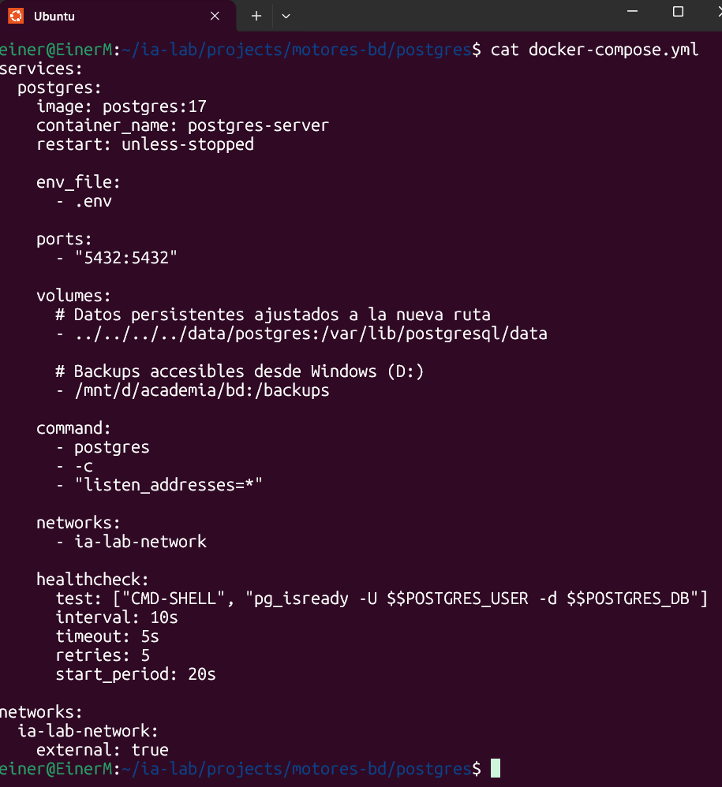

### 6.3 Archivo de variables de entorno (.env)

En el archivo `.env` se configuraron la zona horaria (`TZ=America/Bogota`), el usuario, la contraseña y el nombre de la base de datos inicial (`tecnogua`), que luego es tomada automáticamente por la imagen oficial al crear el contenedor.


### 6.4 Observación

El motor se configuró para escuchar en todas las interfaces (`listen_addresses=*`) y se habilitó el acceso por puerto para poder conectarse desde otras herramientas y clientes como DBeaver.

---

## 7. SQL Server

### 7.1 Archivo docker-compose.yml de SQL Server

Se creó el contenedor de SQL Server usando la imagen oficial de Microsoft (`mcr.microsoft.com/mssql/server:2022-latest`). La configuración incluyó:

- usuario `root` dentro del contenedor
- puerto `1433:1433`
- volumen persistente en `../../../../data/mssql`
- volumen adicional de respaldos accesible desde Windows
- red compartida `ia-lab-network`
- healthcheck con `sqlcmd` ejecutando `SELECT 1` para confirmar que el motor respondía correctamente


### 7.2 Archivo de variables de entorno (.env)

En el `.env` se definieron la zona horaria, la aceptación de la licencia (`ACCEPT_EULA=Y`), la contraseña del usuario `SA` y la edición del motor (`Developer`, que es gratuita para fines de estudio y pruebas).


### 7.3 Levantamiento del contenedor

Con `docker compose up -d` se descargó la imagen y se inició el contenedor sin inconvenientes.


### 7.4 Verificación de funcionamiento

Con `docker compose ps` se confirmó que el contenedor `mssql-server` quedó en estado *health: starting* (pasando luego a *healthy*), con el puerto `1433` correctamente publicado.


---

## 8. Oracle XE

### 8.1 Primera configuración

Se creó el contenedor de Oracle usando la imagen `gvenzl/oracle-xe` y se definieron las variables de entorno para la contraseña y la base de datos.

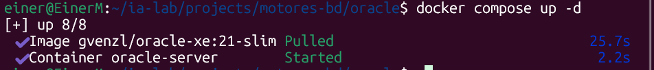

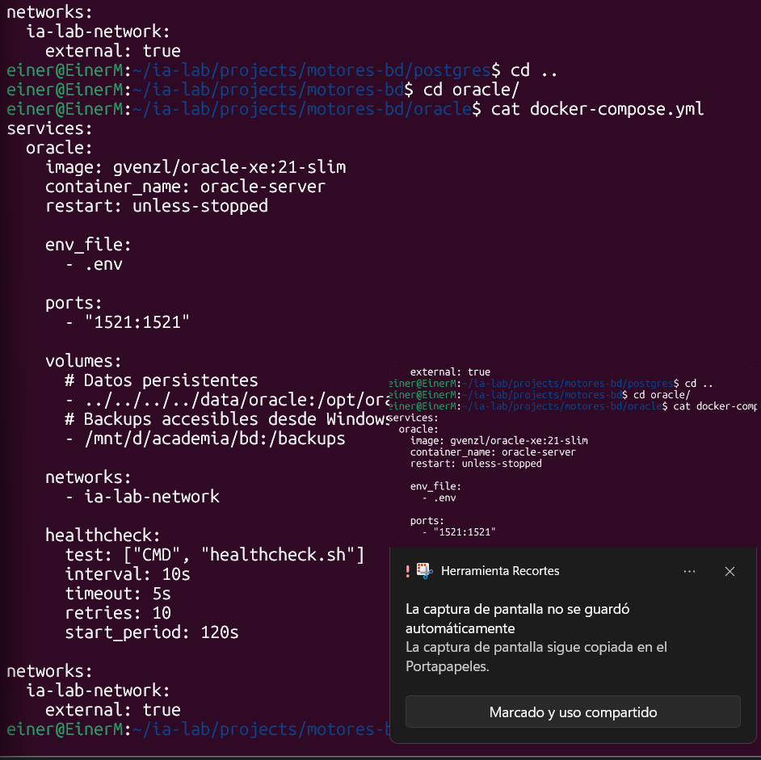

### 8.2 Inicio del contenedor

Se inició el contenedor Oracle con `docker compose up -d`, descargando la imagen `gvenzl/oracle-xe:21-slim` y arrancando el servicio `oracle-server` correctamente.

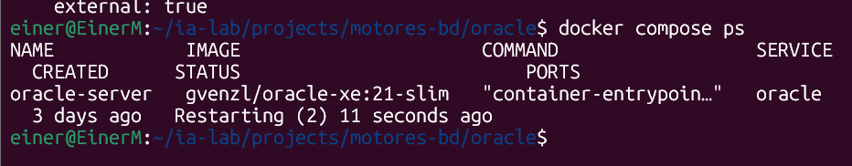


---

## 9. Configuración del firewall (puertos)

Para poder conectarse a los cuatro motores desde herramientas externas como DBeaver, fue necesario habilitar explícitamente sus puertos en el firewall de Ubuntu (`ufw`):

- `5432/tcp` → PostgreSQL
- `1521/tcp` → Oracle
- `1433/tcp` → SQL Server
- `3306/tcp` → MySQL

Se agregaron las reglas con `sudo ufw allow <puerto>/tcp`, se habilitó el firewall con `sudo ufw enable` y se verificó el estado final con `sudo ufw status`, confirmando que las cuatro reglas quedaron activas tanto en IPv4 como en IPv6.


---

## 10. Evidencia final de los cuatro motores funcionando

Una vez resueltos los detalles de configuración, se logró tener los cuatro motores funcionando simultáneamente en WSL2.

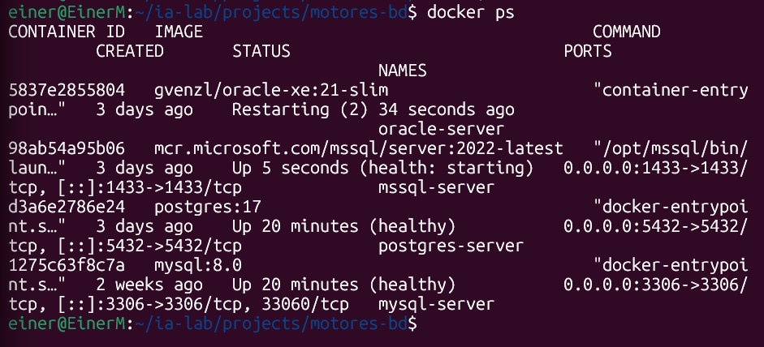


Este fue el punto culminante del trabajo: comprobar que MySQL, PostgreSQL, SQL Server y Oracle XE pudieron ejecutarse de forma correcta dentro del mismo entorno de WSL2.

---

## 11. Conclusión

El proyecto se desarrolló con éxito y permitió comprobar que:

- WSL2 es un entorno compatible para ejecutar motores de base de datos con Docker.
- Docker Compose facilita la creación, gestión y reutilización de contenedores.
- Cada motor tiene sus propias particularidades de configuración, puertos y variables de entorno.
- Oracle fue el más delicado por su tiempo de arranque y requisitos de configuración.
- Fue necesario configurar el firewall (`ufw`) para exponer correctamente los puertos de cada motor.
- Se logró obtener un entorno funcional con cuatro bases de datos diferentes en conjunto.

Este tipo de práctica es altamente útil para aprender la administración de sistemas de información, la virtualización con contenedores y la comparación entre distintos motores de datos.

---

## 12. Referencias utilizadas

- Introducción a bases de datos: https://tecnogua.com/academic/site/bd/introduccion/
- Instalación de MySQL: https://tecnogua.com/academic/site/bd/instalacion/mysql/
- Instalación de PostgreSQL: https://tecnogua.com/academic/site/bd/instalacion/postgresql/
- Instalación de SQL Server: https://tecnogua.com/academic/site/bd/instalacion/mssql/
- Instalación de Oracle: https://tecnogua.com/academic/site/bd/instalacion/oracle/

---

## 13. Archivo del proyecto

El archivo principal del proyecto en este workspace es:

- `4motreswsl2.py`

La documentación quedó registrada en este archivo:

- `documentacion_motores_wsl2.md`

Además, las evidencias fotográficas fueron copiadas a la carpeta:

- `evidencias/`
